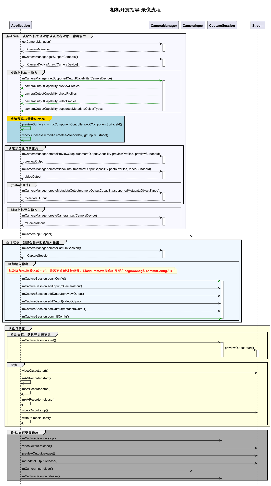

# 录像实现方案

## 开发流程

在获取到相机支持的输出流能力后，开始创建录像流，开发流程如下。




## 完整示例

```ts
import camera from '@ohos.multimedia.camera'
import media from '@ohos.multimedia.media'

// 创建CameraManager对象
context: any = getContext(this)
let cameraManager = camera.getCameraManager(this.context)
if (!cameraManager) {
    console.error("camera.getCameraManager error")
    return;
} 

// 监听相机状态变化
cameraManager.on('cameraStatus', (cameraStatusInfo) => {
    console.log(`camera : ${cameraStatusInfo.camera.cameraId}`);
    console.log(`status: ${cameraStatusInfo.status}`);
})

// 获取相机设备支持的输出流能力
let cameraOutputCap = cameraManager.getSupportedOutputCapability(cameraArray[0]);
if (!cameraOutputCap) {
    console.error("cameraManager.getSupportedOutputCapability error")
    return;
}
console.log("outputCapability: " + JSON.stringify(cameraOutputCap));

let previewProfilesArray = cameraOutputCap.previewProfiles;
if (!previewProfilesArray) {
    console.error("createOutput previewProfilesArray == null || undefined")
} 

let photoProfilesArray = cameraOutputCap.photoProfiles;
if (!photoProfilesArray) {
    console.error("createOutput photoProfilesArray == null || undefined")
} 

let videoProfilesArray = cameraOutputCap.videoProfiles;
if (!videoProfilesArray) {
    console.error("createOutput videoProfilesArray == null || undefined")
} 

let metadataObjectTypesArray = cameraOutputCap.supportedMetadataObjectTypes;
if (!metadataObjectTypesArray) {
    console.error("createOutput metadataObjectTypesArray == null || undefined")
}

// 配置参数以实际硬件设备支持的范围为准
let AVRecorderProfile = {
    audioBitrate : 48000,
    audioChannels : 2,
    audioCodec : media.CodecMimeType.AUDIO_AAC,
    audioSampleRate : 48000,
    fileFormat : media.ContainerFormatType.CFT_MPEG_4,
    videoBitrate : 2000000,
    videoCodec : media.CodecMimeType.VIDEO_MPEG4,
    videoFrameWidth : 640,
    videoFrameHeight : 480,
    videoFrameRate : 30
}
let AVRecorderConfig = {
    audioSourceType : media.AudioSourceType.AUDIO_SOURCE_TYPE_MIC,
    videoSourceType : media.VideoSourceType.VIDEO_SOURCE_TYPE_SURFACE_YUV,
    profile : AVRecorderProfile,
    url : 'fd://', // 文件需先由调用者创建，赋予读写权限，将文件fd传给此参数，eg.fd://45--file:///data/media/01.mp4
    rotation : 0, // 合理值0、90、180、270，非合理值prepare接口将报错
    location : { latitude : 30, longitude : 130 }
}

let avRecorder
media.createAVRecorder((error, recorder) => {
   if (recorder != null) {
       avRecorder = recorder;
       console.log('createAVRecorder success');
   } else {
       console.log(`createAVRecorder fail, error:${error}`);
   }
});

avRecorder.prepare(AVRecorderConfig, (err) => {
    if (err == null) {
        console.log('prepare success');
    } else {
        console.log('prepare failed and error is ' + err.message);
    }
})

let videoSurfaceId = null; // 该surfaceID用于传递给相机接口创造videoOutput
avRecorder.getInputSurface((err, surfaceId) => {
    if (err == null) {
        console.log('getInputSurface success');
        videoSurfaceId = surfaceId;
    } else {
        console.log('getInputSurface failed and error is ' + err.message);
    }
});

// 创建VideoOutput对象
let videoOutput
try {
    videoOutput = cameraManager.createVideoOutput(videoProfilesArray[0], videoSurfaceId)
} catch (error) {
    console.error('Failed to create the videoOutput instance. errorCode = ' + error.code);
}

// 监听视频输出错误信息
videoOutput.on('error', (error) => {
    console.log(`Preview output error code: ${error.code}`);
})

//创建会话
let captureSession
try {
    captureSession = cameraManager.createCaptureSession()
} catch (error) {
    console.error('Failed to create the CaptureSession instance. errorCode = ' + error.code);
}

// 监听session错误信息
captureSession.on('error', (error) => {
    console.log(`Capture session error code: ${error.code}`);
})

// 开始配置会话
try {
    captureSession.beginConfig()
} catch (error) {
    console.error('Failed to beginConfig. errorCode = ' + error.code);
}

// 获取相机列表
let cameraArray = cameraManager.getSupportedCameras();
if (cameraArray.length <= 0) {
    console.error("cameraManager.getSupportedCameras error")
    return;
}

// 创建相机输入流
let cameraInput
try {
    cameraInput = cameraManager.createCameraInput(cameraArray[0]);
} catch (error) {
   console.error('Failed to createCameraInput errorCode = ' + error.code);
}

// 监听cameraInput错误信息
let cameraDevice = cameraArray[0];
cameraInput.on('error', cameraDevice, (error) => {
    console.log(`Camera input error code: ${error.code}`);
})

// 打开相机
await cameraInput.open();

// 向会话中添加相机输入流
try {
    captureSession.addInput(cameraInput)
} catch (error) {
    console.error('Failed to addInput. errorCode = ' + error.code);
}

// 创建预览输出流,其中参数 surfaceId 参考下面 XComponent 组件，预览流为XComponent组件提供的surface
let previewOutput
try {
    previewOutput = cameraManager.createPreviewOutput(previewProfilesArray[0], surfaceId)
} catch (error) {
    console.error("Failed to create the PreviewOutput instance.")
}

// 向会话中添加预览输入流
try {
    captureSession.addOutput(previewOutput)
} catch (error) {
    console.error('Failed to addOutput(previewOutput). errorCode = ' + error.code);
}

// 向会话中添加录像输出流
try {
    captureSession.addOutput(videoOutput)
} catch (error) {
    console.error('Failed to addOutput(videoOutput). errorCode = ' + error.code);
}

// 提交会话配置
await captureSession.commitConfig()

// 启动会话
await captureSession.start().then(() => {
    console.log('Promise returned to indicate the session start success.');
})

// 启动录像输出流
videoOutput.start(async (err) => {
    if (err) {
        console.error('Failed to start the video output ${err.message}');
        return;
    }
    console.log('Callback invoked to indicate the video output start success.');
});

// 开始录像
avRecorder.start().then(() => {
    console.log('videoRecorder start success');
})

// 停止录像输出流
videoOutput.stop((err) => {
    if (err) {
        console.error('Failed to stop the video output ${err.message}');
        return;
    }
    console.log('Callback invoked to indicate the video output stop success.');
});

// 停止录像
avRecorder.stop().then(() => {
    console.log('stop success');
})

// 停止当前会话
captureSession.stop()

// 释放相机输入流
cameraInput.close()

// 释放预览输出流
previewOutput.release()

// 释放录像输出流
videoOutput.release()

// 释放会话
captureSession.release()

// 会话置空
captureSession = null
```
