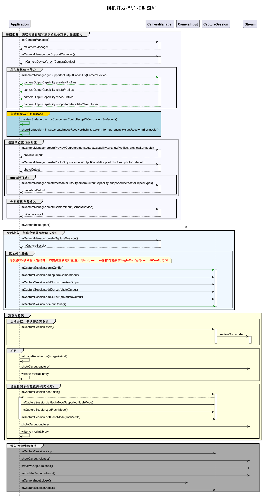

# 拍照实现方案

## 开发流程

在获取到相机支持的输出流能力后，开始创建拍照流，开发流程如下。



## 完整示例

```ts
import camera from '@ohos.multimedia.camera'
import image from '@ohos.multimedia.image'
import media from '@ohos.multimedia.media'

// 创建CameraManager对象
context: any = getContext(this)
let cameraManager = camera.getCameraManager(this.context)
if (!cameraManager) {
    console.error("camera.getCameraManager error")
    return;
} 
// 监听相机状态变化
cameraManager.on('cameraStatus', (cameraStatusInfo) => {
    console.info(`camera : ${cameraStatusInfo.camera.cameraId}`);
    console.info(`status: ${cameraStatusInfo.status}`);
})

// 获取相机列表
let cameraArray = cameraManager.getSupportedCameras();
if (cameraArray.length <= 0) {
    console.error("cameraManager.getSupportedCameras error")
    return;
} 

for (let index = 0; index < cameraArray.length; index++) {
    console.info('cameraId : ' + cameraArray[index].cameraId);                          // 获取相机ID
    console.info('cameraPosition : ' + cameraArray[index].cameraPosition);              // 获取相机位置
    console.info('cameraType : ' + cameraArray[index].cameraType);                      // 获取相机类型
    console.info('connectionType : ' + cameraArray[index].connectionType);              // 获取相机连接类型
}

// 创建相机输入流
let cameraInput
try {
    cameraInput = cameraManager.createCameraInput(cameraArray[0]);
} catch (error) {
   console.error('Failed to createCameraInput errorCode = ' + error.code);
}

// 监听cameraInput错误信息
let cameraDevice = cameraArray[0];
cameraInput.on('error', cameraDevice, (error) => {
    console.info(`Camera input error code: ${error.code}`);
})

// 打开相机
await cameraInput.open();

// 获取相机设备支持的输出流能力
let cameraOutputCap = cameraManager.getSupportedOutputCapability(cameraArray[0]);
if (!cameraOutputCap) {
    console.error("cameraManager.getSupportedOutputCapability error")
    return;
}
console.info("outputCapability: " + JSON.stringify(cameraOutputCap));

let previewProfilesArray = cameraOutputCap.previewProfiles;
if (!previewProfilesArray) {
    console.error("createOutput previewProfilesArray == null || undefined")
} 

let photoProfilesArray = cameraOutputCap.photoProfiles;
if (!photoProfilesArray) {
    console.error("createOutput photoProfilesArray == null || undefined")
} 

// 创建预览输出流,其中参数 surfaceId 参考上文 XComponent 组件，预览流为XComponent组件提供的surface
let previewOutput
try {
    previewOutput = cameraManager.createPreviewOutput(previewProfilesArray[0], surfaceId)
} catch (error) {
    console.error("Failed to create the PreviewOutput instance.")
}

// 监听预览输出错误信息
previewOutput.on('error', (error) => {
    console.info(`Preview output error code: ${error.code}`);
})

// 创建ImageReceiver对象，并设置照片参数：分辨率大小是根据前面 photoProfilesArray 获取的当前设备所支持的拍照分辨率大小去设置
let imageReceiver = await image.createImageReceiver(1920, 1080, 4, 8)
// 获取照片显示SurfaceId
let photoSurfaceId = await imageReceiver.getReceivingSurfaceId()
// 创建拍照输出流
let photoOutput
try {
    photoOutput = cameraManager.createPhotoOutput(photoProfilesArray[0], photoSurfaceId)
} catch (error) {
   console.error('Failed to createPhotoOutput errorCode = ' + error.code);
}
//创建会话
let captureSession
try {
    captureSession = cameraManager.createCaptureSession()
} catch (error) {
    console.error('Failed to create the CaptureSession instance. errorCode = ' + error.code);
}

// 监听session错误信息
captureSession.on('error', (error) => {
    console.info(`Capture session error code: ${error.code}`);
})

// 开始配置会话
try {
    captureSession.beginConfig()
} catch (error) {
    console.error('Failed to beginConfig. errorCode = ' + error.code);
}

// 向会话中添加相机输入流
try {
    captureSession.addInput(cameraInput)
} catch (error) {
    console.error('Failed to addInput. errorCode = ' + error.code);
}

// 向会话中添加预览输出流
try {
    captureSession.addOutput(previewOutput)
} catch (error) {
    console.error('Failed to addOutput(previewOutput). errorCode = ' + error.code);
}

// 向会话中添加拍照输出流
try {
    captureSession.addOutput(photoOutput)
} catch (error) {
    console.error('Failed to addOutput(photoOutput). errorCode = ' + error.code);
}

// 提交会话配置
await captureSession.commitConfig()

// 启动会话
await captureSession.start().then(() => {
    console.info('Promise returned to indicate the session start success.');
})
// 判断设备是否支持闪光灯
let flashStatus
try {
    flashStatus = captureSession.hasFlash()
} catch (error) {
    console.error('Failed to hasFlash. errorCode = ' + error.code);
}
console.info('Promise returned with the flash light support status:' + flashStatus);

if (flashStatus) {
    // 判断是否支持自动闪光灯模式
    let flashModeStatus
    try {
        let status = captureSession.isFlashModeSupported(camera.FlashMode.FLASH_MODE_AUTO)
        flashModeStatus = status
    } catch (error) {
        console.error('Failed to check whether the flash mode is supported. errorCode = ' + error.code);
    }
    if(flashModeStatus) {
        // 设置自动闪光灯模式
        try {
            captureSession.setFlashMode(camera.FlashMode.FLASH_MODE_AUTO)
        } catch (error) {
            console.error('Failed to set the flash mode. errorCode = ' + error.code);
        }
    }
}

// 判断是否支持连续自动变焦模式
let focusModeStatus
try {
    let status = captureSession.isFocusModeSupported(camera.FocusMode.FOCUS_MODE_CONTINUOUS_AUTO)
    focusModeStatus = status
} catch (error) {
    console.error('Failed to check whether the focus mode is supported. errorCode = ' + error.code);
}

if (focusModeStatus) {
    // 设置连续自动变焦模式
    try {
        captureSession.setFocusMode(camera.FocusMode.FOCUS_MODE_CONTINUOUS_AUTO)
    } catch (error) {
        console.error('Failed to set the focus mode. errorCode = ' + error.code);
    }
}

// 获取相机支持的可变焦距比范围
let zoomRatioRange
try {
    zoomRatioRange = captureSession.getZoomRatioRange()
} catch (error) {
    console.error('Failed to get the zoom ratio range. errorCode = ' + error.code);
}

// 设置可变焦距比
try {
    captureSession.setZoomRatio(zoomRatioRange[0])
} catch (error) {
    console.error('Failed to set the zoom ratio value. errorCode = ' + error.code);
}
let settings = {
    quality: camera.QualityLevel.QUALITY_LEVEL_HIGH,                                     // 设置图片质量高
    rotation: camera.ImageRotation.ROTATION_0                                            // 设置图片旋转角度0
}
// 使用当前拍照设置进行拍照
photoOutput.capture(settings, async (err) => {
    if (err) {
        console.error('Failed to capture the photo ${err.message}');
        return;
    }
    console.info('Callback invoked to indicate the photo capture request success.');
});
// 停止当前会话
captureSession.stop()

// 释放相机输入流
cameraInput.close()

// 释放预览输出流
previewOutput.release()

// 释放拍照输出流
photoOutput.release()

// 释放会话
captureSession.release()

// 会话置空
captureSession = null
```

