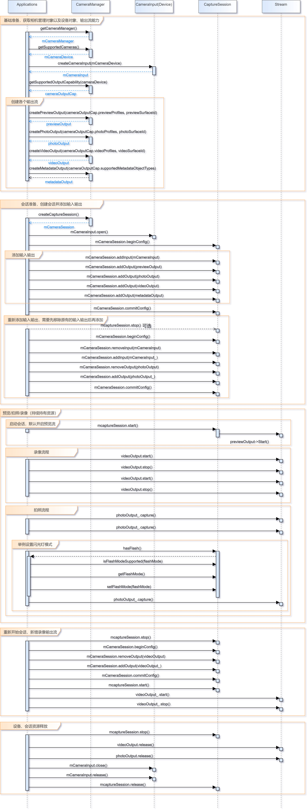

# 相机开发指导

## 场景介绍

OpenHarmony相机模块支持相机业务的开发，开发者可以通过已开放的接口实现相机硬件的访问、操作和新功能开发，最常见的操作如：预览、拍照和录像等。开发者也可以通过合适的接口或者接口组合实现闪光灯控制、曝光时间控制、手动对焦和自动对焦控制、变焦控制以及更多的功能。

开发者在调用Camera能力时，需要了解Camera的一些基本概念：

- **相机静态能力**：用于描述相机的固有能力的一系列参数，比如朝向、支持的分辨率等信息。
- **物理相机**：物理相机就是独立的实体摄像头设备。物理相机ID是用于标志每个物理摄像头的唯一字串。
- **异步操作**：为保证UI线程不被阻塞，大部分Camera调用都是异步的。对于每个API均提供了callback函数和Promise函数。

## 开发步骤

### 接口说明

详细API含义请参考：[相机管理API文档](../reference/apis/js-apis-camera.md)

### 全流程场景

包含流程：权限申请、创建实例、参数设置、会话管理、拍照、录像、释放资源等。

#### 权限申请

在使用相机之前，需要申请相机的相关权限，保证应用拥有相机硬件及其他功能权限，应用权限的介绍请参考权限章节，相机涉及权限如下表。

| 权限名称 | 权限属性值                     |
| -------- | ------------------------------ |
| 相机权限 | ohos.permission.CAMERA         |
| 录音权限 | ohos.permission.MICROPHONE     |
| 存储权限 | ohos.permission.WRITE_MEDIA    |
| 读取权限 | ohos.permission.READ_MEDIA     |
| 位置权限 | ohos.permission.MEDIA_LOCATION |

参考代码如下：

```typescript
const PERMISSIONS: Array<string> = [
    'ohos.permission.CAMERA',
    'ohos.permission.MICROPHONE',
    'ohos.permission.MEDIA_LOCATION',
    'ohos.permission.READ_MEDIA',
    'ohos.permission.WRITE_MEDIA'
]

function applyPermission() {
        console.info('[permission] get permission');
        globalThis.abilityContext.requestPermissionFromUser(PERMISSIONS)
    }
```

#### 创建实例

在实现一个相机应用之前必须先创建一个独立的相机设备，然后才能继续相机的其他操作。如果此步骤操作失败，相机可能被占用或无法使用。如果被占用，必须等到相机释放后才能重新获取CameraManager对象。通过getSupportedCameras() 方法，获取当前使用的设备支持的相机列表。相机列表中存储了当前设备拥有的所有相机ID，如果列表不为空，则列表中的每个ID都支持独立创建相机对象；否则，说明正在使用的设备无可用的相机，不能继续后续的操作。相机设备具备预览、拍照、录像、Metadata等输出流，需要通过getSupportedOutputCapability()接口获取各个输出流的具体能力，通过该接口，可以获取当前设备支持的所有输出流能力，分别在CameraOutputCapability中的各个profile字段中，相机设备创建的建议步骤如下：

```typescript
import camera from '@ohos.multimedia.camera'
import image from '@ohos.multimedia.image'
import media from '@ohos.multimedia.media'

// 创建CameraManager对象
context: any = getContext(this)
let cameraManager = await camera.getCameraManager(this.context)
if (!cameraManager) {
    console.error('Failed to get the CameraManager instance');
}

// 获取相机列表
let cameraArray = await cameraManager.getSupportedCameras()
if (!cameraArray) {
    console.error('Failed to get the cameras');
}

for (let index = 0; index < cameraArray.length; index++) {
    console.log('cameraId : ' + cameraArray[index].cameraId)                          // 获取相机ID
    console.log('cameraPosition : ' + cameraArray[index].cameraPosition)              // 获取相机位置
    console.log('cameraType : ' + cameraArray[index].cameraType)                      // 获取相机类型
    console.log('connectionType : ' + cameraArray[index].connectionType)              // 获取相机连接类型
}

// 创建相机输入流
let cameraInput = await cameraManager.createCameraInput(cameraArray[0])

// 打开相机
await cameraInput.open();

// 获取相机设备支持的输出流能力
let cameraOutputCap = await cameraManager.getSupportedOutputCapability(cameraArray[0]);
if (!cameraOutputCap) {
    console.error("outputCapability outputCapability == null || undefined")
} else {
    console.info("outputCapability: " + JSON.stringify(cameraOutputCap));
}

let previewProfilesArray = cameraOutputCap.GetPreviewProfiles();
if (!previewProfilesArray) {
    console.error("createOutput previewProfilesArray == null || undefined")
} 

let photoProfilesArray = cameraOutputCap.GetPhotoProfiles();
if (!photoProfilesArray) {
    console.error("createOutput photoProfilesArray == null || undefined")
} 

let videoProfilesArray = cameraOutputCap.GetVideoProfiles();
if (!videoProfilesArray) {
    console.error("createOutput videoProfilesArray == null || undefined")
} 

let metadataObjectTypesArray = cameraOutputCap.GetSupportedMetadataObjectType();
if (!metadataObjectTypesArray) {
    console.error("createOutput metadataObjectTypesArray == null || undefined")
}

// 创建预览输出流,其中参数 surfaceId 参考下面 XComponent 组件，预览流为XComponent组件提供的surface
let previewOutput = await cameraManager.createPreviewOutput(previewProfilesArray[0], surfaceId)
if (!previewOutput) {
    console.error("Failed to create the PreviewOutput instance.")
}

// 创建ImageReceiver对象，并设置照片参数：分辨率大小是根据前面 photoProfilesArray 获取的当前设备所支持的拍照分辨率大小去设置
let imageReceiver = await image.createImageReceiver(1920, 1080, 4, 8)
// 获取照片显示SurfaceId
let photoSurfaceId = await imageReceiver.getReceivingSurfaceId()
// 创建拍照输出流
let photoOutput = await cameraManager.createPhotoOutput(photoProfilesArray[0], photoSurfaceId)
if (!photoOutput) {
    console.error('Failed to create the PhotoOutput instance.');
    return;
}

// 创建视频录制的参数
let videoConfig = {
    audioSourceType: 1,
    videoSourceType: 1,
    profile: {
        audioBitrate: 48000,
        audioChannels: 2,
        audioCodec: 'audio/mp4v-es',
        audioSampleRate: 48000,
        durationTime: 1000,
        fileFormat: 'mp4',
        videoBitrate: 48000,
        videoCodec: 'video/mp4v-es',
        videoFrameWidth: 640,
        videoFrameHeight: 480,
        videoFrameRate: 30
    },
    url: 'file:///data/media/01.mp4',
    orientationHint: 0,
    maxSize: 100,
    maxDuration: 500,
    rotation: 0
}

// 创建录像输出流
let videoRecorder
media.createVideoRecorder().then((recorder) => {
    console.log('createVideoRecorder called')
    videoRecorder = recorder
})
// 设置视频录制的参数
videoRecorder.prepare(videoConfig)
//获取录像SurfaceId
let videoSurfaceId
videoRecorder.getInputSurface().then((id) => {
    console.log('getInputSurface called')
    videoSurfaceId = id
})

// 创建VideoOutput对象
let videoOutput = await cameraManager.createVideoOutput(videoProfilesArray[0], videoSurfaceId)
if (!videoOutput) {
    console.error('Failed to create the videoOutput instance.');
    return;
}
```
预览流、拍照流和录像流的输入均需要提前创建surface，其中预览流为XComponent组件提供的surface，拍照流为ImageReceiver提供的surface，录像流为VideoRecorder的surface。

**XComponent**

```typescript
mXComponentController: XComponentController = new XComponentController                   // 创建XComponentController

build() {
    Flex() {
        XComponent({                                                                     // 创建XComponent
            id: '',
            type: 'surface',
            libraryname: '',
            controller: this.mXComponentController
        })
        .onload(() => {                                                                  // 设置onload回调
            // 设置Surface宽高（1920*1080），预览尺寸设置参考前面 previewProfilesArray 获取的当前设备所支持的预览分辨率大小去设置
            this.mXComponentController.setXComponentSurfaceSize({surfaceWidth:1920,surfaceHeight:1080})
            // 获取Surface ID
            globalThis.surfaceId = mXComponentController.getXComponentSurfaceId()
        })
        .width('1920px')                                                                 // 设置XComponent宽度
        .height('1080px')                                                                // 设置XComponent高度
    }
}
```

**ImageReceiver**

```typescript
function getImageReceiverSurfaceId() {
    let receiver = image.createImageReceiver(640, 480, 4, 8)
    console.log(TAG + 'before ImageReceiver check')
    if (receiver !== undefined) {
      console.log('ImageReceiver is ok')
      surfaceId1 = receiver.getReceivingSurfaceId()
      console.log('ImageReceived id: ' + JSON.stringify(surfaceId1))
    } else {
      console.log('ImageReceiver is not ok')
    }
  }
```

**VideoRecorder**

```typescript
function getVideoRecorderSurface() {
        await getFd('CameraManager.mp4');
        mVideoConfig.url = mFdPath;
        media.createVideoRecorder((err, recorder) => {
            console.info('Entering create video receiver')
            mVideoRecorder = recorder
            console.info('videoRecorder is :' + JSON.stringify(mVideoRecorder))
            console.info('videoRecorder.prepare called.')
            mVideoRecorder.prepare(mVideoConfig, (err) => {
                console.info('videoRecorder.prepare success.')
                mVideoRecorder.getInputSurface((err, id) => {
                    console.info('getInputSurface called')
                    mVideoSurface = id
                    console.info('getInputSurface surfaceId: ' + JSON.stringify(mVideoSurface))
                })
            })
        })
    }
```

#### 会话管理

##### 创建会话

```typescript
//创建会话
let captureSession = await camera.createCaptureSession()
if (!captureSession) {
    console.error('Failed to create the CaptureSession instance.');
    return;
}
console.log('Callback returned with the CaptureSession instance.' + session);

// 开始配置会话
await captureSession.beginConfig()

// 向会话中添加相机输入流
await captureSession.addInput(cameraInput)

// 向会话中添加预览输入流
await captureSession.addOutput(previewOutput)

// 向会话中添加拍照输出流
await captureSession.addOutput(photoOutput)

// 提交会话配置
await captureSession.commitConfig()

// 启动会话
await captureSession.start().then(() => {
    console.log('Promise returned to indicate the session start success.');
})
```

##### 切换会话

```typescript
// 停止当前会话
await captureSession.stop()

// 开始配置会话
await captureSession.beginConfig()

// 从会话中移除拍照输出流
await captureSession.removeOutput(photoOutput)

// 向会话中添加录像输出流
await captureSession.addOutput(videoOutput)

// 提交会话配置
await captureSession.commitConfig()

// 启动会话
await captureSession.start().then(() => {
    console.log('Promise returned to indicate the session start success.');
})
```

#### 参数设置

```typescript
// 判断设备是否支持闪光灯
let flashStatus = await captureSession.hasFlash()
if (!flashStatus) {
    console.error('Failed to check whether the device has the flash mode.');
}
console.log('Promise returned with the flash light support status:' + flashStatus);

if (flashStatus) {
    // 判断是否支持自动闪光灯模式
    let flashModeStatus
    captureSession.isFlashModeSupported(camera.FlashMode.FLASH_MODE_AUTO, async (err, status) => {
        if (err) {
            console.error('Failed to check whether the flash mode is supported. ${err.message}');
            return;
        }
        console.log('Callback returned with the flash mode support status: ' + status);
        flashModeStatus = status
    })
    if(flashModeStatus) {
        // 设置自动闪光灯模式
        captureSession.setFlashMode(camera.FlashMode.FLASH_MODE_AUTO, async (err) => {
            if (err) {
                console.error('Failed to set the flash mode  ${err.message}');
                return;
            }
            console.log('Callback returned with the successful execution of setFlashMode.');
        })
    }
}

// 判断是否支持连续自动变焦模式
let focusModeStatus
captureSession.isFocusModeSupported(camera.FocusMode.FOCUS_MODE_CONTINUOUS_AUTO, async (err, status) => {
    if (err) {
        console.error('Failed to check whether the focus mode is supported. ${err.message}');
        return;
    }
    console.log('Callback returned with the focus mode support status: ' + status);
    focusModeStatus = status
})
if (focusModeStatus) {
    // 设置连续自动变焦模式
    captureSession.setFocusMode(camera.FocusMode.FOCUS_MODE_CONTINUOUS_AUTO, async (err) => {
        if (err) {
            console.error('Failed to set the focus mode  ${err.message}');
            return;
        }
        console.log('Callback returned with the successful execution of setFocusMode.');
    })
}

// 获取相机支持的可变焦距比范围
let zoomRatioRange = await captureSession.getZoomRatioRange()
if (!zoomRatioRange) {
    console.error('Failed to get the zoom ratio range.');
    return;
}

// 设置可变焦距比
captureSession.setZoomRatio(zoomRatioRange[0], async (err) => {
    if (err) {
        console.error('Failed to set the zoom ratio value ${err.message}');
        return;
    }
    console.log('Callback returned with the successful execution of setZoomRatio.');
})
```

#### 拍照

```typescript
let settings = {
    quality: camera.QualityLevel.QUALITY_LEVEL_HIGH,                                     // 设置图片质量高
    rotation: camera.ImageRotation.ROTATION_0                                            // 设置图片旋转角度0
}
// 使用当前拍照设置进行拍照
photoOutput.capture(settings, async (err) => {
    if (err) {
        console.error('Failed to capture the photo ${err.message}');
        return;
    }
    console.log('Callback invoked to indicate the photo capture request success.');
});
```

#### 录像

```typescript
// 启动录像输出流
videoOutput.start(async (err) => {
    if (err) {
        console.error('Failed to start the video output ${err.message}');
        return;
    }
    console.log('Callback invoked to indicate the video output start success.');
});

// 开始录像
videoRecorder.start().then(() => {
    console.info('videoRecorder start success');
}

// 停止录像
videoRecorder.stop().then(() => {
    console.info('stop success');
}

// 停止录像输出流
videoOutput.stop((err) => {
    if (err) {
        console.error('Failed to stop the video output ${err.message}');
        return;
    }
    console.log('Callback invoked to indicate the video output stop success.');
});
```

拍照保存接口可参考：[图片处理API文档](image.md#imagereceiver的使用)

#### 释放资源

```typescript
// 停止当前会话
captureSession.stop()

// 释放相机输入流
cameraInput.release()

// 释放预览输出流
previewOutput.release()

// 释放拍照输出流
photoOutput.release()

// 释放录像输出流
videoOutput.release()

// 释放会话
captureSession.release()

// 会话置空
captureSession = null
```

## 流程图

应用使用相机的流程示意图如下
