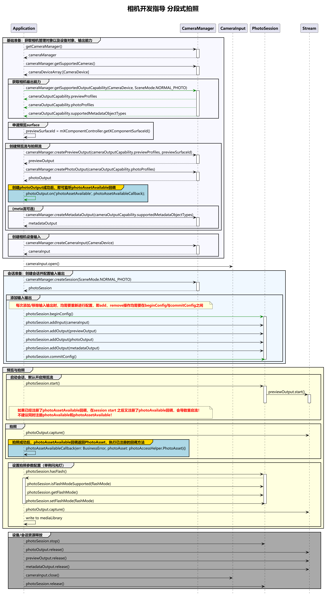

# 分段式拍照实践(ArkTS)
<!--Kit: Camera Kit-->
<!--Subsystem: Multimedia-->
<!--Owner: @qano-->
<!--SE: @leo_ysl-->
<!--TSE: @xchaosioda-->

在开发相机应用时，需要先参考开发准备[申请相关权限](camera-preparation.md)。

当前示例提供完整的分段式拍照流程介绍，方便开发者了解完整的接口调用顺序。

在参考以下示例前，建议开发者查看[分段式拍照(ArkTS)](camera-deferred-capture.md)的具体章节，了解[设备输入](camera-device-input.md)、[会话管理](camera-session-management.md)、[拍照](camera-shooting.md)等单个流程。

## 开发流程

在获取到相机支持的输出流能力后，开始创建拍照流，开发流程如下。



## 完整示例

Context获取方式请参考：[获取UIAbility的上下文信息](../../application-models/uiability-usage.md#获取uiability的上下文信息)。

```ts
import { camera } from '@kit.CameraKit';
import { BusinessError } from '@kit.BasicServicesKit';
import { abilityAccessCtrl, Permissions } from '@kit.AbilityKit';
import { photoAccessHelper } from '@kit.MediaLibraryKit';

let photoSession: camera.PhotoSession | undefined = undefined;
let cameraInput: camera.CameraInput | undefined = undefined;
let previewOutput: camera.PreviewOutput | undefined = undefined;
let photoOutput: camera.PhotoOutput | undefined = undefined;

function getPhotoAccessHelper(context: Context): photoAccessHelper.PhotoAccessHelper {
  let phAccessHelper = photoAccessHelper.getPhotoAccessHelper(context);
  return phAccessHelper;
}
   
class MediaDataHandler implements photoAccessHelper.MediaAssetDataHandler<ArrayBuffer> {
  onDataPrepared(data: ArrayBuffer) {
    if (data === undefined) {
      console.error('Error occurred when preparing data');
      return;
    }
    console.info('on image data prepared');
    // 请在获取到拍照buffer后，再释放session，提前释放session，会导致无法正常出图。
    releaseCamSession();
  }
}

async function mediaLibRequestBuffer(photoAsset: photoAccessHelper.PhotoAsset, context: Context) {
  let requestOptions: photoAccessHelper.RequestOptions = {
    deliveryMode: photoAccessHelper.DeliveryMode.FAST_MODE,
  }
  const handler = new MediaDataHandler();
  await photoAccessHelper.MediaAssetManager.requestImageData(context, photoAsset, requestOptions, handler);
  console.info('requestImageData successfully');
}

async function mediaLibSavePhoto(photoAsset: photoAccessHelper.PhotoAsset,
  phAccessHelper: photoAccessHelper.PhotoAccessHelper): Promise<void> {
  try {
    let assetChangeRequest: photoAccessHelper.MediaAssetChangeRequest =
      new photoAccessHelper.MediaAssetChangeRequest(photoAsset);
    assetChangeRequest.saveCameraPhoto();
    await phAccessHelper.applyChanges(assetChangeRequest);
    console.info('apply saveCameraPhoto successfully');
  } catch (err) {
    console.error(`apply saveCameraPhoto failed with error: ${err.code}, ${err.message}`);
  }
}

function setPhotoOutputCb(photoOutput: camera.PhotoOutput, context: Context): void {
  //监听回调之后，调用photoOutput的capture方法，低质量图上报后触发回调。
  photoOutput.on('photoAssetAvailable', (err: BusinessError, photoAsset: photoAccessHelper.PhotoAsset): void => {
    console.info('getPhotoAsset start');
    console.info(`err: ${JSON.stringify(err)}`);
    if ((err !== undefined && err.code !== 0) || photoAsset === undefined) {
      console.error('getPhotoAsset failed');
      return;
    }
    // 调用媒体库落盘接口保存一阶段低质量图，二阶段真图就绪后媒体库会主动帮应用替换落盘图片。
    mediaLibSavePhoto(photoAsset, getPhotoAccessHelper(context));
    // 调用媒体库接口注册低质量图或高质量图buffer回调，自定义处理。
    mediaLibRequestBuffer(photoAsset, context);
  });
}

async function deferredCaptureCase(context: Context, surfaceId: string): Promise<void> {
  // 创建CameraManager对象。
  let cameraManager: camera.CameraManager = camera.getCameraManager(context);
  if (!cameraManager) {
    console.error('camera.getCameraManager error');
    return;
  }
  // 监听相机状态变化。
  cameraManager.on('cameraStatus', (err: BusinessError, cameraStatusInfo: camera.CameraStatusInfo) => {
    if (err !== undefined && err.code !== 0) {
      console.error('cameraStatus with errorCode = ' + err.code);
      return;
    }
    console.info(`camera : ${cameraStatusInfo.camera.cameraId}`);
    console.info(`status: ${cameraStatusInfo.status}`);
  });

  // 获取相机列表。
  let cameraArray: Array<camera.CameraDevice> = cameraManager.getSupportedCameras();
  if (cameraArray.length <= 0) {
    console.error('cameraManager.getSupportedCameras error');
    return;
  }

  for (let index = 0; index < cameraArray.length; index++) {
    console.info('cameraId : ' + cameraArray[index].cameraId); // 获取相机ID。
    console.info('cameraPosition : ' + cameraArray[index].cameraPosition); // 获取相机位置。
    console.info('cameraType : ' + cameraArray[index].cameraType); // 获取相机类型。
    console.info('connectionType : ' + cameraArray[index].connectionType); // 获取相机连接类型。
  }

  // 创建相机输入流。
  try {
    cameraInput = cameraManager.createCameraInput(cameraArray[0]);
  } catch (error) {
    let err = error as BusinessError;
    console.error('Failed to createCameraInput errorCode = ' + err.code);
  }
  if (cameraInput === undefined) {
    return;
  }

  // 监听cameraInput错误信息。
  let cameraDevice: camera.CameraDevice = cameraArray[0];
  cameraInput.on('error', cameraDevice, (error: BusinessError) => {
    console.error(`Camera input error code: ${error.code}`);
  })

  // 打开相机。
  await cameraInput.open();

  // 获取支持的模式类型。
  let sceneModes: Array<camera.SceneMode> = cameraManager.getSupportedSceneModes(cameraArray[0]);
  let isSupportPhotoMode: boolean = sceneModes.indexOf(camera.SceneMode.NORMAL_PHOTO) >= 0;
  if (!isSupportPhotoMode) {
    console.error('photo mode not support');
    return;
  }
  // 获取相机设备支持的输出流能力。
  let cameraOutputCap: camera.CameraOutputCapability =
    cameraManager.getSupportedOutputCapability(cameraArray[0], camera.SceneMode.NORMAL_PHOTO);
  if (!cameraOutputCap) {
    console.error('cameraManager.getSupportedOutputCapability error');
    return;
  }
  console.info('outputCapability: ' + JSON.stringify(cameraOutputCap));

  let previewProfilesArray: Array<camera.Profile> = cameraOutputCap.previewProfiles;
  if (!previewProfilesArray) {
    console.error('createOutput previewProfilesArray == null || undefined');
  }

  let photoProfilesArray: Array<camera.Profile> = cameraOutputCap.photoProfiles;
  if (!photoProfilesArray) {
    console.error('createOutput photoProfilesArray == null || undefined');
  }

  // 创建预览输出流,其中参数 surfaceId 参考上文 XComponent 组件，预览流为XComponent组件提供的surface。
  try {
    previewOutput = cameraManager.createPreviewOutput(previewProfilesArray[0], surfaceId);
  } catch (error) {
    let err = error as BusinessError;
    console.error(`Failed to create the PreviewOutput instance. error code: ${err.code}`);
  }
  if (previewOutput === undefined) {
    return;
  }

  // 监听预览输出错误信息。
  previewOutput.on('error', (error: BusinessError) => {
    console.error(`Preview output error code: ${error.code}`);
  });

  // 创建拍照输出流。
  try {
    photoOutput = cameraManager.createPhotoOutput(photoProfilesArray[0]);
  } catch (error) {
    let err = error as BusinessError;
    console.error('Failed to createPhotoOutput errorCode = ' + err.code);
  }
  if (photoOutput === undefined) {
    return;
  }

  //注册监听photoAssetAvailable回调。
  setPhotoOutputCb(photoOutput, context);

  //创建会话。
  try {
    photoSession = cameraManager.createSession(camera.SceneMode.NORMAL_PHOTO) as camera.PhotoSession;
  } catch (error) {
    let err = error as BusinessError;
    console.error('Failed to create the session instance. errorCode = ' + err.code);
  }
  if (photoSession === undefined) {
    return;
  }
  // 监听session错误信息。
  photoSession.on('error', (error: BusinessError) => {
    console.error(`Capture session error code: ${error.code}`);
  });

  // 开始配置会话。
  try {
    photoSession.beginConfig();
  } catch (error) {
    let err = error as BusinessError;
    console.error('Failed to beginConfig. errorCode = ' + err.code);
  }

  // 向会话中添加相机输入流。
  try {
    photoSession.addInput(cameraInput);
  } catch (error) {
    let err = error as BusinessError;
    console.error('Failed to addInput. errorCode = ' + err.code);
  }

  // 向会话中添加预览输出流。
  try {
    photoSession.addOutput(previewOutput);
  } catch (error) {
    let err = error as BusinessError;
    console.error('Failed to addOutput(previewOutput). errorCode = ' + err.code);
  }

  // 向会话中添加拍照输出流。
  try {
    photoSession.addOutput(photoOutput);
  } catch (error) {
    let err = error as BusinessError;
    console.error('Failed to addOutput(photoOutput). errorCode = ' + err.code);
  }

  // 提交会话配置。
  await photoSession.commitConfig();

  // 启动会话。
  await photoSession.start().then(() => {
    console.info('Promise returned to indicate the session start success.');
  });
  // 判断设备是否支持闪光灯。
  let flashStatus: boolean = false;
  try {
    flashStatus = photoSession.hasFlash();
  } catch (error) {
    let err = error as BusinessError;
    console.error('Failed to hasFlash. errorCode = ' + err.code);
  }
  console.info('Returned with the flash light support status:' + flashStatus);

  if (flashStatus) {
    // 判断是否支持自动闪光灯模式。
    let flashModeStatus: boolean = false;
    try {
      let status: boolean = photoSession.isFlashModeSupported(camera.FlashMode.FLASH_MODE_AUTO);
      flashModeStatus = status;
    } catch (error) {
      let err = error as BusinessError;
      console.error('Failed to check whether the flash mode is supported. errorCode = ' + err.code);
    }
    if (flashModeStatus) {
      // 设置自动闪光灯模式。
      try {
        photoSession.setFlashMode(camera.FlashMode.FLASH_MODE_AUTO);
      } catch (error) {
        let err = error as BusinessError;
        console.error('Failed to set the flash mode. errorCode = ' + err.code);
      }
    }
  }

  // 判断是否支持连续自动变焦模式。
  let focusModeStatus: boolean = false;
  try {
    let status: boolean = photoSession.isFocusModeSupported(camera.FocusMode.FOCUS_MODE_CONTINUOUS_AUTO);
    focusModeStatus = status;
  } catch (error) {
    let err = error as BusinessError;
    console.error('Failed to check whether the focus mode is supported. errorCode = ' + err.code);
  }

  if (focusModeStatus) {
    // 设置连续自动变焦模式。
    try {
      photoSession.setFocusMode(camera.FocusMode.FOCUS_MODE_CONTINUOUS_AUTO);
    } catch (error) {
      let err = error as BusinessError;
      console.error('Failed to set the focus mode. errorCode = ' + err.code);
    }
  }

  // 获取相机支持的可变焦距比范围。
  let zoomRatioRange: Array<number> = [];
  try {
    zoomRatioRange = photoSession.getZoomRatioRange();
  } catch (error) {
    let err = error as BusinessError;
    console.error('Failed to get the zoom ratio range. errorCode = ' + err.code);
  }
  if (zoomRatioRange.length <= 0) {
    return;
  }

  // 设置可变焦距比。
  try {
    photoSession.setZoomRatio(zoomRatioRange[0]);
  } catch (error) {
    let err = error as BusinessError;
    console.error('Failed to set the zoom ratio value. errorCode = ' + err.code);
  }
  let photoCaptureSetting: camera.PhotoCaptureSetting = {
    quality: camera.QualityLevel.QUALITY_LEVEL_HIGH, // 设置图片质量高。
    rotation: camera.ImageRotation.ROTATION_0 // 设置图片旋转角度0。
  }

  // 使用当前拍照设置触发一次拍照。
  photoOutput.capture(photoCaptureSetting, (err: BusinessError) => {
    if (err) {
      console.error(`Failed to capture the photo ${err.message}`);
      return;
    }
    console.info('Callback invoked to indicate the photo capture request success.');
  });
}

async function releaseCamSession() {
  // 停止当前会话。
  await photoSession?.stop();

  // 释放相机输入流。
  await cameraInput?.close();

  // 释放预览输出流。
  await previewOutput?.release();

  // 释放拍照输出流。
  await photoOutput?.release();

  // 释放会话。
  await photoSession?.release();

  // 会话置空。
  photoSession = undefined;
}

@Entry
@Component
struct Index {
  @State message: string = 'PhotoAssetDemo';
  @State isShow: boolean = false;
  private mXComponentController: XComponentController = new XComponentController();
  private surfaceId = '';
  private uiContext: UIContext = this.getUIContext();
  private context: Context | undefined = this.uiContext.getHostContext();
  private cameraPermission: Permissions = 'ohos.permission.CAMERA'; // 申请权限相关问题可参考本篇开头的申请相关权限文档

  async requestPermissionsFn(): Promise<void> {
    let atManager = abilityAccessCtrl.createAtManager();
    if (this.context) {
      let res = await atManager.requestPermissionsFromUser(this.context, [this.cameraPermission]);
      for (let i =0; i < res.permissions.length; i++) {
        if (this.cameraPermission.toString() === res.permissions[i] && res.authResults[i] === 0) {
          this.isShow = true;
        }
      }
    }
  }

  aboutToAppear(): void {
    this.requestPermissionsFn();
  }

  build() {
    Column() {
      Column() {
        if (this.isShow) {
          XComponent({
            id: 'componentId',
            type: XComponentType.SURFACE,
            controller: this.mXComponentController
          })
          .onLoad(async () => {
            console.info('onLoad is called');
            if (this.context) {
              this.surfaceId = this.mXComponentController.getXComponentSurfaceId();
              console.info(`onLoad surfaceId: ${this.surfaceId}`);
              deferredCaptureCase(this.context, this.surfaceId);
            }
          })// The width and height of the surface are opposite to those of the XComponent.
          .renderFit(RenderFit.RESIZE_CONTAIN)
        }
      }
      .height('95%')
      .justifyContent(FlexAlign.Center)

      Text(this.message)
        .id('PhotoAssetDemo')
        .fontSize(38)
        .fontWeight(FontWeight.Bold)
        .alignRules({
          center: { anchor: '__container__', align: VerticalAlign.Center },
          middle: { anchor: '__container__', align: HorizontalAlign.Center }
        })
    }
    .height('100%')
    .width('100%')
  }
}
```