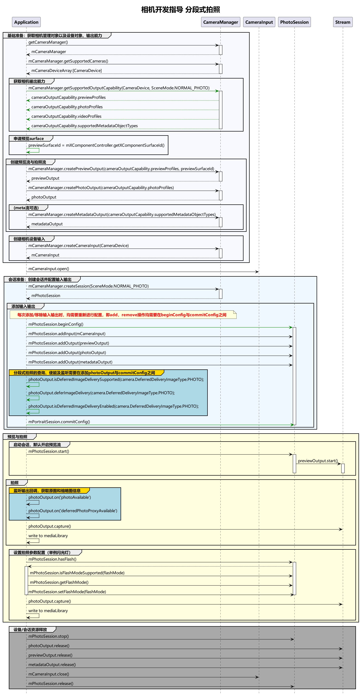

# 高性能拍照实现方案(仅对系统应用开放)(ArkTS)

当前示例提供完整的高性能拍照流程介绍，方便开发者了解完整的接口调用顺序。

在参考以下示例前，建议开发者查看[高性能拍照(仅对系统应用开放)(ArkTS)](camera-deferred-photo.md)的具体章节，了解[设备输入](camera-device-input.md)、[会话管理](camera-session-management.md)、[拍照](camera-shooting.md)等单个流程。

## 开发流程

在获取到相机支持的输出流能力后，开始创建拍照流，开发流程如下。



## 完整示例

Context获取方式请参考：[获取UIAbility的上下文信息](../../application-models/uiability-usage.md#获取uiability的上下文信息)。

```ts
import { camera } from '@kit.CameraKit';
import { image } from '@kit.ImageKit';
import { BusinessError } from '@kit.BasicServicesKit';
import { common } from '@kit.AbilityKit';
import { fileIo as fs } from '@kit.CoreFileKit';
import { photoAccessHelper } from '@kit.MediaLibraryKit';

let context = getContext(this);

// 写文件方式落盘真图
async function savePicture(photoObj: camera.Photo): Promise<void> {
  let accessHelper = photoAccessHelper.getPhotoAccessHelper(context);
  let testFileName = 'testFile' + Date.now() + '.jpg';
  //createAsset的调用需要ohos.permission.READ_IMAGEVIDEO和ohos.permission.WRITE_IMAGEVIDEO的权限
  let photoAsset = await accessHelper.createAsset(testFileName);
  const fd = await photoAsset.open('rw');
  let buffer: ArrayBuffer | undefined = undefined;
  photoObj.main.getComponent(image.ComponentType.JPEG, (errCode: BusinessError, component: image.Component): void => {
    if (errCode || component === undefined) {
      console.error('getComponent failed');
      return;
    }
    if (component.byteBuffer) {
      buffer = component.byteBuffer;
    } else {
      console.error('byteBuffer is null');
      return;
    }
  });
  if (buffer) {
    await fs.write(fd, buffer);
  }
  await photoAsset.close(fd);
  await photoObj.release(); 
}

// 调用媒体库方式落盘缩略图
async function saveDeferredPhoto(proxyObj: camera.DeferredPhotoProxy): Promise<void> {    
  try {
    // 创建 photoAsset
    let accessHelper = photoAccessHelper.getPhotoAccessHelper(context);
    let testFileName = 'testFile' + Date.now() + '.jpg';
    let photoAsset = await accessHelper.createAsset(testFileName);
    // 将缩略图代理类传递给媒体库
    let mediaRequest: photoAccessHelper.MediaAssetChangeRequest = new photoAccessHelper.MediaAssetChangeRequest(photoAsset);
    mediaRequest.addResource(photoAccessHelper.ResourceType.PHOTO_PROXY, proxyObj);
    let res = await accessHelper.applyChanges(mediaRequest);
    console.info('saveDeferredPhoto success.');
  } catch (err) {
    console.error(`Failed to saveDeferredPhoto. error: ${JSON.stringify(err)}`);
  }
}

async function deferredPhotoCase(baseContext: common.BaseContext, surfaceId: string): Promise<void> {
  // 创建CameraManager对象
  let cameraManager: camera.CameraManager = camera.getCameraManager(baseContext);
  if (!cameraManager) {
    console.error("camera.getCameraManager error");
    return;
  }
  // 监听相机状态变化
  cameraManager.on('cameraStatus', (err: BusinessError, cameraStatusInfo: camera.CameraStatusInfo) => {
    if (err !== undefined && err.code !== 0) {
      console.error(`cameraStatus with errorCode: ${err.code}`);
      return;
    }
    console.info(`camera : ${cameraStatusInfo.camera.cameraId}`);
    console.info(`status: ${cameraStatusInfo.status}`);
  });

  // 获取相机列表
  let cameraArray: Array<camera.CameraDevice> = cameraManager.getSupportedCameras();
  if (cameraArray.length <= 0) {
    console.error("cameraManager.getSupportedCameras error");
    return;
  }

  for (let index = 0; index < cameraArray.length; index++) {
    console.info('cameraId : ' + cameraArray[index].cameraId);                          // 获取相机ID
    console.info('cameraPosition : ' + cameraArray[index].cameraPosition);              // 获取相机位置
    console.info('cameraType : ' + cameraArray[index].cameraType);                      // 获取相机类型
    console.info('connectionType : ' + cameraArray[index].connectionType);              // 获取相机连接类型
  }

  // 创建相机输入流
  let cameraInput: camera.CameraInput | undefined = undefined;
  try {
    cameraInput = cameraManager.createCameraInput(cameraArray[0]);
  } catch (error) {
    let err = error as BusinessError;
    console.error('Failed to createCameraInput errorCode = ' + err.code);
  }
  if (cameraInput === undefined) {
    return;
  }

  // 监听cameraInput错误信息
  let cameraDevice: camera.CameraDevice = cameraArray[0];
  cameraInput.on('error', cameraDevice, (error: BusinessError) => {
    console.error(`Camera input error code: ${error.code}`);
  })

  // 打开相机
  await cameraInput.open();

  // 获取支持的模式类型
  let sceneModes: Array<camera.SceneMode> = cameraManager.getSupportedSceneModes(cameraArray[0]);
  let isSupportPhotoMode: boolean = sceneModes.indexOf(camera.SceneMode.NORMAL_PHOTO) >= 0;
  if (!isSupportPhotoMode) {
    console.error('photo mode not support');
    return;
  }
  // 获取相机设备支持的输出流能力
  let cameraOutputCap: camera.CameraOutputCapability = cameraManager.getSupportedOutputCapability(cameraArray[0], camera.SceneMode.NORMAL_PHOTO);
  if (!cameraOutputCap) {
    console.error("cameraManager.getSupportedOutputCapability error");
    return;
  }
  console.info("outputCapability: " + JSON.stringify(cameraOutputCap));

  let previewProfilesArray: Array<camera.Profile> = cameraOutputCap.previewProfiles;
  if (!previewProfilesArray) {
    console.error("createOutput previewProfilesArray == null || undefined");
  }

  let photoProfilesArray: Array<camera.Profile> = cameraOutputCap.photoProfiles;
  if (!photoProfilesArray) {
    console.error("createOutput photoProfilesArray == null || undefined");
  }

  // 创建预览输出流,其中参数 surfaceId 参考上文 XComponent 组件，预览流为XComponent组件提供的surface
  let previewOutput: camera.PreviewOutput | undefined = undefined;
  try {
    previewOutput = cameraManager.createPreviewOutput(previewProfilesArray[0], surfaceId);
  } catch (error) {
    let err = error as BusinessError;
    console.error(`Failed to create the PreviewOutput instance. error code: ${err.code}`);
  }
  if (previewOutput === undefined) {
    return;
  }
  // 监听预览输出错误信息
  previewOutput.on('error', (error: BusinessError) => {
    console.error(`Preview output error code: ${error.code}`);
  });
  // 创建拍照输出流
  let photoOutput: camera.PhotoOutput | undefined = undefined;
  try {
    photoOutput = cameraManager.createPhotoOutput(photoProfilesArray[0]);
  } catch (error) {
    let err = error as BusinessError;
    console.error('Failed to createPhotoOutput errorCode = ' + err.code);
  }
  if (photoOutput === undefined) {
    return;
  }
  //创建会话
  let photoSession: camera.PhotoSession | undefined = undefined;
  try {
    photoSession = cameraManager.createSession(camera.SceneMode.NORMAL_PHOTO) as camera.PhotoSession;
  } catch (error) {
    let err = error as BusinessError;
    console.error('Failed to create the photoSession instance. errorCode = ' + err.code);
  }
  if (photoSession === undefined) {
    return;
  }
  // 监听session错误信息
  photoSession.on('error', (error: BusinessError) => {
    console.error(`Capture session error code: ${error.code}`);
  });

  // 开始配置会话
  try {
    photoSession.beginConfig();
  } catch (error) {
    let err = error as BusinessError;
    console.error('Failed to beginConfig. errorCode = ' + err.code);
  }

  // 向会话中添加相机输入流
  try {
    photoSession.addInput(cameraInput);
  } catch (error) {
    let err = error as BusinessError;
    console.error('Failed to addInput. errorCode = ' + err.code);
  }

  // 向会话中添加预览输出流
  try {
    photoSession.addOutput(previewOutput);
  } catch (error) {
    let err = error as BusinessError;
    console.error('Failed to addOutput(previewOutput). errorCode = ' + err.code);
  }

  // 向会话中添加拍照输出流
  try {
    photoSession.addOutput(photoOutput);
  } catch (error) {
    let err = error as BusinessError;
    console.error('Failed to addOutput(photoOutput). errorCode = ' + err.code);
  }

  // 注册原图回调监听
  photoOutput.on('photoAvailable', (err: BusinessError, photoObj: camera.Photo): void => {
    if (err) {
      console.info(`photoAvailable error: ${JSON.stringify(err)}.`);
      return;
    }
    savePicture(photoObj).then(() => {
      // 落盘完成后，释放photo对象。
      photoObj.release();
    });
  });

  // 注册分段式缩略图代理回调监听
  photoOutput.on('deferredPhotoProxyAvailable', (err: BusinessError, proxyObj: camera.DeferredPhotoProxy): void => {
    if (err) {
      console.info(`deferredPhotoProxyAvailable error: ${JSON.stringify(err)}.`);
      return;
    }
    console.info('photoOutPutCallBack deferredPhotoProxyAvailable');
    // 获取缩略图 pixelMap
    proxyObj.getThumbnail().then((thumbnail: image.PixelMap) => {
      AppStorage.setOrCreate('proxyThumbnail', thumbnail); 
    });
    // 调用媒体库接口落盘缩略图
    saveDeferredPhoto(proxyObj).then(() => {
      // 落盘完成后，释放代理类对象。
      proxyObj.release();
    });
  });
    
  // 判断是否支持分段式拍照能力
  let isSupportDeferred: boolean = photoOutput.isDeferredImageDeliverySupported(camera.DeferredDeliveryImageType.PHOTO);
  console.info('isDeferredImageDeliverySupported res:' + isSupportDeferred);
  if (isSupportDeferred) {
    // 使能分段式拍照
	photoOutput.deferImageDelivery(camera.DeferredDeliveryImageType.PHOTO);
    // 查询使能分段式结果
    let isSupportEnabled: boolean = photoOutput.isDeferredImageDeliveryEnabled(camera.DeferredDeliveryImageType.PHOTO);
    console.info('isDeferredImageDeliveryEnabled res:' + isSupportEnabled);
  }

  // 提交会话配置
  await photoSession.commitConfig();

  // 启动会话
  await photoSession.start().then(() => {
    console.info('Promise returned to indicate the session start success.');
  });
  // 判断设备是否支持闪光灯
  let flashStatus: boolean = false;
  try {
    flashStatus = photoSession.hasFlash();
  } catch (error) {
    let err = error as BusinessError;
    console.error('Failed to hasFlash. errorCode = ' + err.code);
  }
  console.info('Returned with the flash light support status:' + flashStatus);

  if (flashStatus) {
    // 判断是否支持自动闪光灯模式
    let flashModeStatus: boolean = false;
    try {
      let status: boolean = photoSession.isFlashModeSupported(camera.FlashMode.FLASH_MODE_AUTO);
      flashModeStatus = status;
    } catch (error) {
      let err = error as BusinessError;
      console.error('Failed to check whether the flash mode is supported. errorCode = ' + err.code);
    }
    if(flashModeStatus) {
      // 设置自动闪光灯模式
      try {
        photoSession.setFlashMode(camera.FlashMode.FLASH_MODE_AUTO);
      } catch (error) {
        let err = error as BusinessError;
        console.error('Failed to set the flash mode. errorCode = ' + err.code);
      }
    }
  }

  // 判断是否支持连续自动变焦模式
  let focusModeStatus: boolean = false;
  try {
    let status: boolean = photoSession.isFocusModeSupported(camera.FocusMode.FOCUS_MODE_CONTINUOUS_AUTO);
    focusModeStatus = status;
  } catch (error) {
    let err = error as BusinessError;
    console.error('Failed to check whether the focus mode is supported. errorCode = ' + err.code);
  }

  if (focusModeStatus) {
    // 设置连续自动变焦模式
    try {
      photoSession.setFocusMode(camera.FocusMode.FOCUS_MODE_CONTINUOUS_AUTO);
    } catch (error) {
      let err = error as BusinessError;
      console.error('Failed to set the focus mode. errorCode = ' + err.code);
    }
  }

  // 获取相机支持的可变焦距比范围
  let zoomRatioRange: Array<number> = [];
  try {
    zoomRatioRange = photoSession.getZoomRatioRange();
  } catch (error) {
    let err = error as BusinessError;
    console.error('Failed to get the zoom ratio range. errorCode = ' + err.code);
  }
  if (zoomRatioRange.length <= 0) {
    return;
  }
  // 设置可变焦距比
  try {
    photoSession.setZoomRatio(zoomRatioRange[0]);
  } catch (error) {
    let err = error as BusinessError;
    console.error('Failed to set the zoom ratio value. errorCode = ' + err.code);
  }
  let photoCaptureSetting: camera.PhotoCaptureSetting = {
    quality: camera.QualityLevel.QUALITY_LEVEL_HIGH, // 设置图片质量高
    rotation: camera.ImageRotation.ROTATION_0 // 设置图片旋转角度0
  }
  // 使用当前拍照设置进行拍照
  photoOutput.capture(photoCaptureSetting, (err: BusinessError) => {
    if (err) {
      console.error(`Failed to capture the photo ${err.message}`);
      return;
    }
    console.info('Callback invoked to indicate the photo capture request success.');
  });

  // 需要在拍照结束之后调用以下关闭摄像头和释放会话流程，避免拍照未结束就将会话释放。
  // 停止当前会话
  await photoSession.stop();

  // 释放相机输入流
  await cameraInput.close();

  // 释放预览输出流
  await previewOutput.release();

  // 释放拍照输出流
  await photoOutput.release();

  // 释放会话
  await photoSession.release();

  // 会话置空
  photoSession = undefined;
}
```