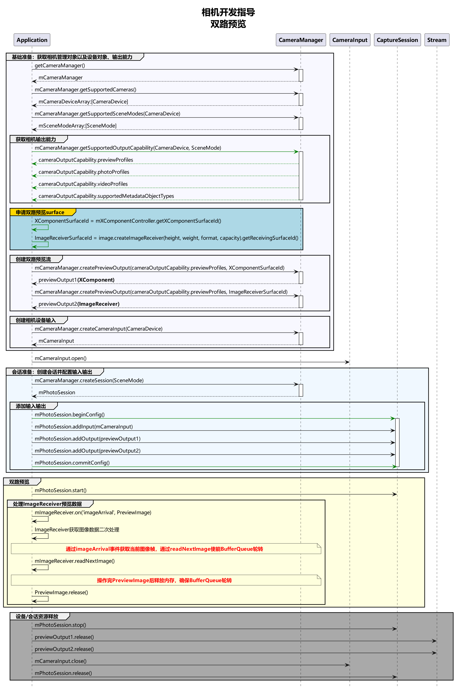

# 双路预览(ArkTS)

在开发相机应用时，需要先参考开发准备[申请相关权限](camera-preparation.md)。

双路预览，即应用可同时使用两路预览流，一路用于在屏幕上显示，一路用于图像处理等其他操作，提升处理效率。

相机应用通过控制相机，实现图像显示（预览）、照片保存（拍照）、视频录制（录像）等基础操作。相机开发模型为Surface模型，即应用通过Surface进行数据传递，通过ImageReceiver的surface获取拍照流的数据、通过XComponent的surface获取预览流的数据。

如果要实现双路预览，即将拍照流改为预览流，将拍照流中的surface改为预览流的surface，通过ImageReceiver的surface创建previewOutput，其余流程与拍照流和预览流一致。

详细的API说明请参考[Camera API参考](../../reference/apis-camera-kit/js-apis-camera.md)。

## 约束与限制

- 暂不支持动态添加流，即不能在没有调用[session.stop](../../reference/apis-camera-kit/js-apis-camera.md#stop11)的情况下，调用[addOutput](../../reference/apis-camera-kit/js-apis-camera.md#addoutput11)添加流。
- 对ImageReceiver组件获取到的图像数据处理后，需要将对应的图像Buffer释放，确保Surface的BufferQueue正常轮转。

## 调用流程

双路方案调用流程图建议如下：



## 开发步骤

- 用于处理图像的第一路预览流：创建ImageReceiver对象，获取SurfaceId创建第一路预览流，注册图像监听，按需处理预览流每帧图像。
- 用于显示画面的第二路预览流：创建XComponent组件，获取SurfaceId创建第二路预览流，预览流画面直接在组件内渲染。
- 创建预览流获取数据：创建上述两路预览流，配置进相机会话，启动会话后，两路预览流同时获取数据。

### 用于处理图像的第一路预览流
1. 导入依赖，本篇文档需要用到图片和相机框架等相关依赖包。
    ```ts
    import { image } from '@kit.ImageKit';
    import { camera } from '@kit.CameraKit';
    import { BusinessError } from '@kit.BasicServicesKit';
    ```

2. 获取第一路预览流SurfaceId：创建ImageReceiver对象，通过ImageReceiver对象可获取其SurfaceId。

    ```ts
    let imageWidth: number = 1920; // 请使用设备支持profile的size的宽。
    let imageHeight: number = 1080; // 请使用设备支持profile的size的高。

    async function initImageReceiver():Promise<void>{
      // 创建ImageReceiver对象。
      let size: image.Size = { width: imageWidth, height: imageHeight };
      let imageReceiver = image.createImageReceiver(size, image.ImageFormat.JPEG, 8);
      // 获取取第一路流SurfaceId。
      let imageReceiverSurfaceId = await imageReceiver.getReceivingSurfaceId();
      console.info(`initImageReceiver imageReceiverSurfaceId:${imageReceiverSurfaceId}`);
    }
    ```

3. 注册监听处理预览流每帧图像数据：通过ImageReceiver组件中imageArrival事件监听获取底层返回的图像数据，详细的API说明请参考[Image API参考](../../reference/apis-image-kit/js-apis-image.md)。

    ```ts
    function onImageArrival(receiver: image.ImageReceiver): void {
      // 注册imageArrival监听。
      receiver.on('imageArrival', () => {
        // 获取图像。
        receiver.readNextImage((err: BusinessError, nextImage: image.Image) => {
          if (err || nextImage === undefined) {
            console.error('readNextImage failed');
            return;
          }
          // 解析图像内容。
          nextImage.getComponent(image.ComponentType.JPEG, async (err: BusinessError, imgComponent: image.Component) => {
            if (err || imgComponent === undefined) {
              console.error('getComponent failed');
            }
            if (imgComponent.byteBuffer) {
              // 详情见下方解析图片buffer数据参考，本示例以方式一为例。
              let width = nextImage.size.width; // 获取图片的宽。
              let height = nextImage.size.height; // 获取图片的高。
              let stride = imgComponent.rowStride; // 获取图片的stride。
              console.debug(`getComponent with width:${width} height:${height} stride:${stride}`);
              // stride与width一致。
              if (stride == width) {
                let pixelMap = await image.createPixelMap(imgComponent.byteBuffer, {
                  size: { height: height, width: width },
                  srcPixelFormat: 8,
                })
              } else {
                // stride与width不一致。
                const dstBufferSize = width * height * 1.5
                const dstArr = new Uint8Array(dstBufferSize)
                for (let j = 0; j < height * 1.5; j++) {
                  const srcBuf = new Uint8Array(imgComponent.byteBuffer, j * stride, width)
                  dstArr.set(srcBuf, j * width)
                }
                let pixelMap = await image.createPixelMap(dstArr.buffer, {
                  size: { height: height, width: width },
                  srcPixelFormat: 8,
                })
              }
            } else {
              console.error('byteBuffer is null');
            }
            // 确保当前buffer没有在使用的情况下，可进行资源释放。
            // 如果对buffer进行异步操作，需要在异步操作结束后再释放该资源（nextImage.release()）。
            nextImage.release();
          })
        })
      })
    }
    ```

    通过 [image.Component](../../reference/apis-image-kit/js-apis-image.md#component9) 解析图片buffer数据参考：

    > **注意：**
    > 需要确认图像的宽width是否与行距rowStride一致，如果不一致可参考以下方式处理：

    方式一：去除imgComponent.byteBuffer中stride数据，拷贝得到新的buffer，调用不支持stride的接口处理buffer。

    ```ts
    // 以NV21为例（YUV_420_SP格式的图片）YUV_420_SP内存计算公式：长x宽+(长x宽)/2。
    const dstBufferSize = width * height * 1.5;
    const dstArr = new Uint8Array(dstBufferSize);
    // 逐行读取buffer数据。
    for (let j = 0; j < height * 1.5; j++) {
      // imgComponent.byteBuffer的每行数据拷贝前width个字节到dstArr中。
      const srcBuf = new Uint8Array(imgComponent.byteBuffer, j * stride, width);
      dstArr.set(srcBuf, j * width);
    }
    let pixelMap = await image.createPixelMap(dstArr.buffer, {
      size: { height: height, width: width }, srcPixelFormat: 8
    });
    ```

    方式二：根据stride*height创建pixelMap，然后调用pixelMap的cropSync方法裁剪掉多余的像素。

    ```ts
    // 创建pixelMap，width宽传行距stride的值。
    let pixelMap = await image.createPixelMap(imgComponent.byteBuffer, {
      size:{height: height, width: stride}, srcPixelFormat: 8});
    // 裁剪多余的像素。
    pixelMap.cropSync({size:{width:width, height:height}, x:0, y:0});
    ```

    方式三：将原始imgComponent.byteBuffer和stride信息一起传给支持stride的接口处理。


### 用于显示画面的第二路预览流

获取第二路预览流SurfaceId：创建XComponent组件用于预览流显示，获取surfaceId请参考XComponent组件提供的[getXcomponentSurfaceId](../../reference/apis-arkui/arkui-ts/ts-basic-components-xcomponent.md#getxcomponentsurfaceid9)方法，而XComponent的能力由UI提供，相关介绍可参考[XComponent组件参考](../../reference/apis-arkui/arkui-ts/ts-basic-components-xcomponent.md)。

```ts
@Component
struct example {
  xComponentCtl: XComponentController = new XComponentController();
  surfaceId:string = '';
  imageWidth: number = 1920;
  imageHeight: number = 1080;
  private uiContext: UIContext = this.getUIContext();

  build() {
    XComponent({
      id: 'componentId',
      type: XComponentType.SURFACE,
      controller: this.xComponentCtl
    })
      .onLoad(async () => {
        console.info('onLoad is called');
        this.surfaceId = this.xComponentCtl.getXComponentSurfaceId(); // 获取组件surfaceId。
        // 使用surfaceId创建预览流，开启相机，组件实时渲染每帧预览流数据。
      })
      // surface的宽、高设置与XComponent组件的宽、高设置相反，或使用.renderFit(RenderFit.RESIZE_CONTAIN)自动填充显示无需设置宽、高。
      .width(this.uiContext.px2vp(this.imageHeight))
      .height(this.uiContext.px2vp(this.imageWidth))
  }
}
```


### 创建预览流获取数据

通过两个SurfaceId分别创建两路预览流输出，加入相机会话，启动相机会话，获取预览流数据。

```ts
function createDualPreviewOutput(cameraManager: camera.CameraManager, previewProfile: camera.Profile,
  session: camera.Session, imageReceiverSurfaceId: string, xComponentSurfaceId: string): void {
  // 使用imageReceiverSurfaceId创建第一路预览。
  let previewOutput1 = cameraManager.createPreviewOutput(previewProfile, imageReceiverSurfaceId);
  if (!previewOutput1) {
  console.error('createPreviewOutput1 error');
  }
  // 使用xComponentSurfaceId创建第二路预览。
  let previewOutput2 = cameraManager.createPreviewOutput(previewProfile, xComponentSurfaceId);
  if (!previewOutput2) {
  console.error('createPreviewOutput2 error');
  }
  // 添加第一路预览流输出。
  session.addOutput(previewOutput1);
  // 添加第二路预览流输出。
  session.addOutput(previewOutput2);
}
```

 

## 完整示例

```ts
import { camera } from '@kit.CameraKit';
import { image } from '@kit.ImageKit';
import { BusinessError } from '@kit.BasicServicesKit';
import { abilityAccessCtrl, Permissions } from '@kit.AbilityKit';

@Entry
@Component
struct Index {
  private imageReceiver: image.ImageReceiver | undefined = undefined;
  private imageReceiverSurfaceId: string = '';
  private xComponentCtl: XComponentController = new XComponentController();
  private xComponentSurfaceId: string = '';
  @State imageWidth: number = 1920;
  @State imageHeight: number = 1080;
  private cameraManager: camera.CameraManager | undefined = undefined;
  private cameras: Array<camera.CameraDevice> | Array<camera.CameraDevice> = [];
  private cameraInput: camera.CameraInput | undefined = undefined;
  private previewOutput1: camera.PreviewOutput | undefined = undefined;
  private previewOutput2: camera.PreviewOutput | undefined = undefined;
  private session: camera.VideoSession | undefined = undefined;
  private uiContext: UIContext = this.getUIContext();
  private context: Context | undefined = this.uiContext.getHostContext();
  private cameraPermission: Permissions = 'ohos.permission.CAMERA'; // 申请权限相关问题可参考本篇开头的申请相关权限文档
  @State isShow: boolean = false;

  async requestPermissionsFn(): Promise<void> {
    let atManager = abilityAccessCtrl.createAtManager();
    if (this.context) {
      let res = await atManager.requestPermissionsFromUser(this.context, [this.cameraPermission]);
      for (let i =0; i < res.permissions.length; i++) {
        if (this.cameraPermission.toString() === res.permissions[i] && res.authResults[i] === 0) {
          this.isShow = true;
        }
      }
    }
  }

  aboutToAppear(): void {
    this.requestPermissionsFn();
  }

  onPageShow(): void {
    console.info('onPageShow');
    this.initImageReceiver();
    if (this.xComponentSurfaceId !== '') {
      this.initCamera();
    }
  }

  onPageHide(): void {
    console.info('onPageHide');
    this.releaseCamera();
  }

  /**
   * 获取ImageReceiver的SurfaceId
   * @param receiver
   * @returns
   */
  async initImageReceiver(): Promise<void> {
    if (!this.imageReceiver) {
      // 创建ImageReceiver。
      let size: image.Size = { width: this.imageWidth, height: this.imageHeight };
      this.imageReceiver = image.createImageReceiver(size, image.ImageFormat.JPEG, 8);
      // 获取取第一路流SurfaceId。
      this.imageReceiverSurfaceId = await this.imageReceiver.getReceivingSurfaceId();
      console.info(`initImageReceiver imageReceiverSurfaceId:${this.imageReceiverSurfaceId}`);
      // 注册监听处理预览流每帧图像数据。
      this.onImageArrival(this.imageReceiver);
    }
  }

  /**
   * 注册ImageReceiver图像监听
   * @param receiver
   */
  onImageArrival(receiver: image.ImageReceiver): void {
    // 注册imageArrival监听。
    receiver.on('imageArrival', () => {
      console.info('image arrival');
      // 获取图像。
      receiver.readNextImage((err: BusinessError, nextImage: image.Image) => {
        if (err || nextImage === undefined) {
          console.error('readNextImage failed');
          return;
        }
        // 解析图像内容。
        nextImage.getComponent(image.ComponentType.JPEG, async (err: BusinessError, imgComponent: image.Component) => {
          if (err || imgComponent === undefined) {
            console.error('getComponent failed');
          }
          if (imgComponent.byteBuffer) {
            // 请参考步骤7解析buffer数据，本示例以方式一为例。
            let width = nextImage.size.width; // 获取图片的宽。
            let height = nextImage.size.height; // 获取图片的高。
            let stride = imgComponent.rowStride; // 获取图片的stride。
            console.debug(`getComponent with width:${width} height:${height} stride:${stride}`);
            // stride与width一致。
            if (stride == width) {
              let pixelMap = await image.createPixelMap(imgComponent.byteBuffer, {
                size: { height: height, width: width },
                srcPixelFormat: 8,
              })
            } else {
              // stride与width不一致。
              const dstBufferSize = width * height * 1.5 // 以NV21为例（YUV_420_SP格式的图片）YUV_420_SP内存计算公式：长x宽+(长x宽)/2。
              const dstArr = new Uint8Array(dstBufferSize)
              for (let j = 0; j < height * 1.5; j++) {
                const srcBuf = new Uint8Array(imgComponent.byteBuffer, j * stride, width)
                dstArr.set(srcBuf, j * width)
              }
              let pixelMap = await image.createPixelMap(dstArr.buffer, {
                size: { height: height, width: width },
                srcPixelFormat: 8,
              })
            }
          } else {
            console.error('byteBuffer is null');
          }
          // 确保当前buffer没有在使用的情况下，可进行资源释放。
          // 如果对buffer进行异步操作，需要在异步操作结束后再释放该资源（nextImage.release()）。
          nextImage.release();
          console.info('image process done');
        })
      })
    })
  }

  build() {
    Column() {
      if (this.isShow) {
        XComponent({
          id: 'componentId',
          type: XComponentType.SURFACE,
          controller: this.xComponentCtl
        })
          .onLoad(async () => {
            console.info('onLoad is called');
            this.xComponentSurfaceId = this.xComponentCtl.getXComponentSurfaceId(); // 获取组件surfaceId。
            // 初始化相机，组件实时渲染每帧预览流数据。
            this.initCamera()
          })
          .width(this.uiContext.px2vp(this.imageHeight))
          .height(this.uiContext.px2vp(this.imageWidth))
      }
    }
    .justifyContent(FlexAlign.Center)
    .height('100%')
    .width('100%')
  }

  // 初始化相机。
  async initCamera(): Promise<void> {
    console.info(`initCamera imageReceiverSurfaceId:${this.imageReceiverSurfaceId} xComponentSurfaceId:${this.xComponentSurfaceId}`);
    try {
      // 获取相机管理器实例。
      this.cameraManager = camera.getCameraManager(this.context);
      if (!this.cameraManager) {
        console.error('initCamera getCameraManager');
      }
      // 获取当前设备支持的相机device列表。
      this.cameras = this.cameraManager.getSupportedCameras();
      if (!this.cameras) {
        console.error('initCamera getSupportedCameras');
      }
      // 选择一个相机device，创建cameraInput输出对象。
      this.cameraInput = this.cameraManager.createCameraInput(this.cameras[0]);
      if (!this.cameraInput) {
        console.error('initCamera createCameraInput');
      }
      // 打开相机。
      await this.cameraInput.open().catch((err: BusinessError) => {
        console.error(`initCamera open fail: ${err}`);
      })
      // 获取相机device支持的profile。
      let capability: camera.CameraOutputCapability =
        this.cameraManager.getSupportedOutputCapability(this.cameras[0], camera.SceneMode.NORMAL_VIDEO);
      if (!capability) {
        console.error('initCamera getSupportedOutputCapability');
      }
      // 根据业务需求选择一个支持的预览流profile。
      let previewProfile: camera.Profile = capability.previewProfiles[0];
      this.imageWidth = previewProfile.size.width; // 更新xComponent组件的宽。
      this.imageHeight = previewProfile.size.height; // 更新xComponent组件的高。
      console.info(`initCamera imageWidth:${this.imageWidth} imageHeight:${this.imageHeight}`);
      // 使用imageReceiverSurfaceId创建第一路预览。
      this.previewOutput1 = this.cameraManager.createPreviewOutput(previewProfile, this.imageReceiverSurfaceId);
      if (!this.previewOutput1) {
        console.error('initCamera createPreviewOutput1');
      }
      // 使用xComponentSurfaceId创建第二路预览。
      this.previewOutput2 = this.cameraManager.createPreviewOutput(previewProfile, this.xComponentSurfaceId);
      if (!this.previewOutput2) {
        console.error('initCamera createPreviewOutput2');
      }
      // 创建录像模式相机会话。
      this.session = this.cameraManager.createSession(camera.SceneMode.NORMAL_VIDEO) as camera.VideoSession;
      if (!this.session) {
        console.error('initCamera createSession');
      }
      // 开始配置会话。
      this.session.beginConfig();
      // 添加相机设备输入。
      this.session.addInput(this.cameraInput);
      // 添加第一路预览流输出。
      this.session.addOutput(this.previewOutput1);
      // 添加第二路预览流输出。
      this.session.addOutput(this.previewOutput2);
      // 提交会话配置。
      await this.session.commitConfig();
      // 开始启动已配置的输入输出流。
      await this.session.start();
    } catch (error) {
      console.error(`initCamera fail: ${error}`);
    }
  }

  // 释放相机。
  async releaseCamera(): Promise<void> {
    console.info('releaseCamera E');
    try {
      // 停止当前会话。
      await this.session?.stop();
      // 释放相机输入流。
      await this.cameraInput?.close();
      // 释放预览输出流。
      await this.previewOutput1?.release();
      // 释放拍照输出流。
      await this.previewOutput2?.release();
      // 释放会话。
      await this.session?.release();
    } catch (error) {
      console.error(`initCamera fail: ${error}`);
    }
  }
}
```