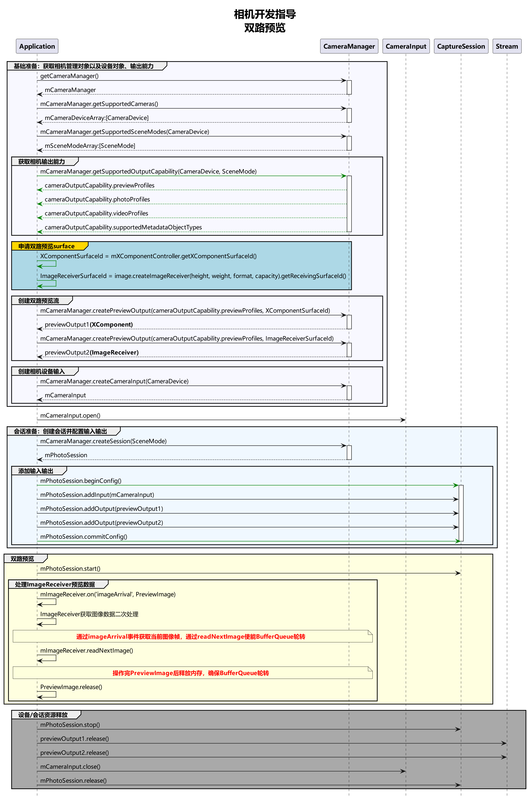

# 双路预览(ArkTS)
<!--Kit: Camera Kit-->
<!--Subsystem: Multimedia-->
<!--Owner: @qano-->
<!--Designer: @leo_ysl-->
<!--Tester: @xchaosioda-->
<!--Adviser: @w_Machine_cc-->

在开发相机应用时，需要先[申请相关权限](camera-preparation.md)。

双路预览，即应用可同时使用两路预览流，一路用于在屏幕上显示，一路用于图像处理等其他操作，提升处理效率。

相机应用通过控制相机，实现图像显示（预览）、照片保存（拍照）、视频录制（录像）等基础操作。相机开发模型为Surface模型，即应用通过Surface进行数据传递，通过[ImageReceiver](../../reference/apis-image-kit/arkts-apis-image-ImageReceiver.md)的Surface获取拍照流的数据、通过XComponent的Surface获取预览流的数据。

如果要实现双路预览，可以先参考[拍照](camera-shooting.md)，在双路预览中将拍照流改为另一路预览流，通过[ImageReceiver](../../reference/apis-image-kit/arkts-apis-image-ImageReceiver.md)的Surface创建另一个previewOutput，其余流程与拍照一致。

详细的API说明请参考[@ohos.multimedia.camera (相机管理)](../../reference/apis-camera-kit/arkts-apis-camera.md)。

## 约束与限制

- 暂不支持动态添加流，即不能在没有调用[session.stop](../../reference/apis-camera-kit/arkts-apis-camera-Session.md#stop11)的情况下，调用[addOutput](../../reference/apis-camera-kit/arkts-apis-camera-Session.md#addoutput11)添加流。
- 对ImageReceiver组件获取到的图像数据处理后，需要将对应的图像Buffer释放，确保Surface的BufferQueue正常轮转。

## 调用流程

双路方案调用流程图建议如下：



## 开发步骤

- 用于处理图像的第一路预览流：创建ImageReceiver对象，获取SurfaceId创建第一路预览流，注册图像监听，按需处理预览流每帧图像。
- 用于显示画面的第二路预览流：创建XComponent组件，获取SurfaceId创建第二路预览流，预览流画面直接在组件内渲染。
- 创建预览流获取数据：创建上述两路预览流，配置进相机会话，启动会话后，两路预览流同时获取数据。

以下各步骤示例为片段代码，可通过点击示例代码右下方的链接获取完整工程示例。

### 用于处理图像的第一路预览流

1. 导入依赖，本篇文档需要用到图片和相机框架等相关依赖包。

   <!-- @[dual_preview_imports](https://gitcode.com/openharmony/applications_app_samples/blob/master/code/DocsSample/Media/Camera/DualPreview/camera/src/main/ets/cameramanagers/ImageReceiverManager.ets) -->
   
   ``` TypeScript
   import { image } from '@kit.ImageKit';
   import { camera } from '@kit.CameraKit';
   import { display } from '@kit.ArkUI';
   import { BusinessError } from '@kit.BasicServicesKit';
   ```

2. 获取第一路预览流SurfaceId：创建ImageReceiver对象，通过ImageReceiver对象可获取其SurfaceId。

   <!-- @[init_image_receiver](https://gitcode.com/openharmony/applications_app_samples/blob/master/code/DocsSample/Media/Camera/DualPreview/camera/src/main/ets/cameramanagers/ImageReceiverManager.ets) -->
   
   ``` TypeScript
   async init(size: Size, format = image.ImageFormat.JPEG, capacity = 8) {
     const receiver = image.createImageReceiver(size, format, capacity);
     const surfaceId = await receiver.getReceivingSurfaceId();
     this.onImageArrival(receiver);
     return surfaceId;
   }
   ```

3. ImageReceiver接收预览流图像数据获取图像格式请参考[Image](../../reference/apis-image-kit/arkts-apis-image-Image.md)中的format参数，[PixelMap](../../reference/apis-image-kit/arkts-apis-image-PixelMap.md)格式请参考[PixelMapFormat](../../reference/apis-image-kit/arkts-apis-image-e.md#pixelmapformat7)。

   ```ts
   // Image格式与PixelMap格式映射关系。
   let formatToPixelMapFormatMap = new Map<number, image.PixelMapFormat>([
     [12, image.PixelMapFormat.RGBA_8888],
     [25, image.PixelMapFormat.NV21],
     [35, image.PixelMapFormat.YCBCR_P010],
     [36, image.PixelMapFormat.YCRCB_P010]
   ]);
   // PixelMapFormat格式的单个像素点大小映射关系。
   let pixelMapFormatToSizeMap = new Map<image.PixelMapFormat, number>([
     [image.PixelMapFormat.RGBA_8888, 4],
     [image.PixelMapFormat.NV21, 1.5],
     [image.PixelMapFormat.YCBCR_P010, 3],
     [image.PixelMapFormat.YCRCB_P010, 3]
   ]);
   ```

4. 注册监听处理预览流每帧图像数据：通过ImageReceiver组件中imageArrival事件监听获取底层返回的图像数据，详细的API说明请参考[ImageReceiver](../../reference/apis-image-kit/arkts-apis-image-ImageReceiver.md)。

   > **说明：**
   >
   > - 在通过[createPixelMap](../../reference/apis-image-kit/arkts-apis-image-f.md#imagecreatepixelmap8)接口创建[PixelMap](../../reference/apis-image-kit/arkts-apis-image-PixelMap.md)实例时，设置的Size、srcPixelFormat等属性必须和相机预览输出流previewProfile中配置的Size、Format属性保持一致，ImageReceiver图片像素格式请参考[PixelMapFormat](../../reference/apis-image-kit/arkts-apis-image-e.md#pixelmapformat7)，相机预览输出流previewProfile输出格式请参考[CameraFormat](../../reference/apis-camera-kit/arkts-apis-camera-e.md#cameraformat)。
   > - 由于不同设备产品差异性，应用开发者在创建相机预览输出流前，必须先通过[getSupportedOutputCapability](../../reference/apis-camera-kit/arkts-apis-camera-CameraManager.md#getsupportedoutputcapability11)方法获取当前设备支持的预览输出流previewProfile，再根据实际业务需求选择[CameraFormat](../../reference/apis-camera-kit/arkts-apis-camera-e.md#cameraformat)和[Size](../../reference/apis-camera-kit/arkts-apis-camera-i.md#size)适合的预览输出流previewProfile。
> - ImageReceiver接收预览流图像数据实际format格式由应用开发者在创建相机预览输出流时，根据实际业务需求选择的previewProfile中format格式参数影响，详细步骤请参考[创建预览流获取数据](camera-dual-channel-preview.md#创建预览流获取数据)。

   <!-- @[onImageArrival](https://gitcode.com/openharmony/applications_app_samples/blob/master/code/DocsSample/Media/Camera/DualPreview/camera/src/main/ets/cameramanagers/ImageReceiverManager.ets) -->
   
   ``` TypeScript
   onImageArrival(receiver: image.ImageReceiver): void {
     receiver.on('imageArrival', () => {
       Logger.info(TAG, 'image arrival');
       receiver.readNextImage((err: BusinessError, nextImage: image.Image) => {
         if (err || nextImage === undefined) {
           Logger.error(TAG, 'readNextImage failed');
           return;
         }
         nextImage.getComponent(image.ComponentType.JPEG, async (err: BusinessError, imgComponent: image.Component) => {
           if (err || imgComponent === undefined) {
             Logger.error(TAG, 'getComponent failed');
           }
           if (imgComponent.byteBuffer) {
             // ...
           } else {
             Logger.error(TAG, 'byteBuffer is null');
           }
           // ...
         });
       });
     });
   }
   ```

   通过 [image.Component](../../reference/apis-image-kit/arkts-apis-image-i.md#component9) 解析图片buffer数据参考：

   > **注意：**
   >
   > 需要确认图像的宽width是否与行距rowStride一致，如果不一致可参考以下方式处理：

   方式一：去除imgComponent.byteBuffer中stride数据，拷贝得到新的buffer，调用不支持stride的接口处理buffer。

   <!-- @[getPixelMap](https://gitcode.com/openharmony/applications_app_samples/blob/master/code/DocsSample/Media/Camera/DualPreview/camera/src/main/ets/cameramanagers/ImageReceiverManager.ets) -->
   
   ``` TypeScript
   async getPixelMap(imgComponent: image.Component, width: number, height: number, stride: number) {
     if (stride === width) {
       return await image.createPixelMap(imgComponent.byteBuffer, {
         size: { height: height, width: width },
         srcPixelFormat: image.PixelMapFormat.NV21,
       });
     }
     const dstBufferSize = width * height * 1.5;
     const dstArr = new Uint8Array(dstBufferSize);
     for (let j = 0; j < height * 1.5; j++) {
       const srcBuf = new Uint8Array(imgComponent.byteBuffer, j * stride, width);
       dstArr.set(srcBuf, j * width);
     }
     return await image.createPixelMap(dstArr.buffer, {
       size: { height: height, width: width },
       srcPixelFormat: image.PixelMapFormat.NV21,
     });
   }
   ```

   方式二：根据stride*height创建pixelMap，然后调用pixelMap的cropSync方法裁剪掉多余的像素。

   ```ts
   // 创建pixelMap，width宽传行距stride的值。
   let pixelMap = await image.createPixelMap(imgComponent.byteBuffer, {
     size:{height: height, width: stride}, srcPixelFormat: pixelMapFormat});
   // 裁剪多余的像素。
   pixelMap.cropSync({size:{width:width, height:height}, x:0, y:0});
   ```

   方式三：将原始imgComponent.byteBuffer和stride信息一起传给支持stride的接口处理。

### 用于显示画面的第二路预览流

获取第二路预览流SurfaceId：创建XComponent组件用于预览流显示，获取SurfaceId请参考XComponent组件提供的[getXComponentSurfaceId](../../reference/apis-arkui/arkui-ts/ts-basic-components-xcomponent.md#getxcomponentsurfaceid9)方法，而XComponent的能力由UI提供，相关介绍可参考[XComponent组件参考](../../reference/apis-arkui/arkui-ts/ts-basic-components-xcomponent.md)。

<!-- @[XComponent](https://gitcode.com/openharmony/applications_app_samples/blob/master/code/DocsSample/Media/Camera/DualPreview/entry/src/main/ets/pages/Index.ets) -->

``` TypeScript
XComponent({
  type: XComponentType.SURFACE,
  controller: this.previewVM.xComponentController
})
  .size({ height: '100%', width: '100%' })
  .onLoad(async () => {
    // ...
    this.previewVM.surfaceId = this.previewVM.xComponentController.getXComponentSurfaceId();
    this.previewVM.setPreviewSize();
    this.previewVM.xComponentController.setXComponentSurfaceRotation({ lock: true });
    // ...
  })
```

### 创建预览流获取数据

通过两个SurfaceId分别创建两路预览流输出，加入相机会话，启动相机会话，获取预览流数据。

<!-- @[createOutput](https://gitcode.com/openharmony/applications_app_samples/blob/master/code/DocsSample/Media/Camera/DualPreview/camera/src/main/ets/cameramanagers/PreviewManager.ets) -->

``` TypeScript
async createOutput(config: CreateOutputConfig) {
  const cameraOutputCap = config.cameraManager.getSupportedOutputCapability(config.device, config.sceneMode);
  const displayRatio = config.profile.size.width / config.profile.size.height;
  const profileWidth = config.profile.size.width;
  const previewProfile = cameraOutputCap.previewProfiles
    .sort((a, b) => Math.abs(a.size.width - profileWidth) - Math.abs(b.size.width - profileWidth))
    .find(pf => {
      const pfDisplayRatio = pf.size.width / pf.size.height;
      return pf.format === config.profile.format &&
        Math.abs(pfDisplayRatio - displayRatio) <= CameraConstant.PROFILE_DIFFERENCE;
    });
  if (!previewProfile) {
    Logger.error(TAG_LOG, 'Failed to get preview profile');
    return;
  }
  this.output = config.cameraManager.createPreviewOutput(previewProfile, config.surfaceId);
  this.addOutputListener(this.output);
  return this.output;
}
```

## 完整示例

<!-- @[dual_preview_case](https://gitcode.com/openharmony/applications_app_samples/blob/master/code/DocsSample/Media/Camera/DualPreview/camera/src/main/ets/cameramanagers/ImageReceiverManager.ets) -->

``` TypeScript
import { image } from '@kit.ImageKit';
import { camera } from '@kit.CameraKit';
import { display } from '@kit.ArkUI';
import { BusinessError } from '@kit.BasicServicesKit';
import { Logger } from 'commons';
import OutputManager, { CreateOutputConfig } from './OutputManager';
import CameraConstant from '../constants/CameraConstants';

const TAG = 'ImageReceiverManager';

export class ImageReceiverManager implements OutputManager {
  public output?: camera.PreviewOutput;
  public isActive: boolean = true;
  public callback: (px: PixelMap) => void;
  private position: camera.CameraPosition = camera.CameraPosition.CAMERA_POSITION_BACK;

  constructor(cb: (px: PixelMap) => void) {
    this.callback = cb;
  }

  async createOutput(config: CreateOutputConfig) {
    const cameraOutputCap = config.cameraManager.getSupportedOutputCapability(config.device, config.sceneMode);
    const displayRatio = config.profile.size.width / config.profile.size.height;
    const profileWidth = config.profile.size.width;
    const previewProfile = cameraOutputCap.previewProfiles
      .sort((a, b) => Math.abs(a.size.width - profileWidth) - Math.abs(b.size.width - profileWidth))
      .find(pf => {
        const pfDisplayRatio = pf.size.width / pf.size.height;
        return pf.format === config.profile.format &&
          Math.abs(pfDisplayRatio - displayRatio) <= CameraConstant.PROFILE_DIFFERENCE;
      });
    if (!previewProfile) {
      Logger.error(TAG, 'Failed to get preview profile');
      return;
    }
    const surfaceId = await this.init(config.profile.size);
    this.output = config.cameraManager.createPreviewOutput(previewProfile, surfaceId);
    this.position = config.device.cameraPosition;
    return this.output;
  }

  async release() {
    await this.output?.release();
    this.output = undefined;
  }

  async init(size: Size, format = image.ImageFormat.JPEG, capacity = 8) {
    const receiver = image.createImageReceiver(size, format, capacity);
    const surfaceId = await receiver.getReceivingSurfaceId();
    this.onImageArrival(receiver);
    return surfaceId;
  }

  async getPixelMap(imgComponent: image.Component, width: number, height: number, stride: number) {
    if (stride === width) {
      return await image.createPixelMap(imgComponent.byteBuffer, {
        size: { height: height, width: width },
        srcPixelFormat: image.PixelMapFormat.NV21,
      });
    }
    const dstBufferSize = width * height * 1.5;
    const dstArr = new Uint8Array(dstBufferSize);
    for (let j = 0; j < height * 1.5; j++) {
      const srcBuf = new Uint8Array(imgComponent.byteBuffer, j * stride, width);
      dstArr.set(srcBuf, j * width);
    }
    return await image.createPixelMap(dstArr.buffer, {
      size: { height: height, width: width },
      srcPixelFormat: image.PixelMapFormat.NV21,
    });
  }

  onImageArrival(receiver: image.ImageReceiver): void {
    receiver.on('imageArrival', () => {
      Logger.info(TAG, 'image arrival');
      receiver.readNextImage((err: BusinessError, nextImage: image.Image) => {
        if (err || nextImage === undefined) {
          Logger.error(TAG, 'readNextImage failed');
          return;
        }
        nextImage.getComponent(image.ComponentType.JPEG, async (err: BusinessError, imgComponent: image.Component) => {
          if (err || imgComponent === undefined) {
            Logger.error(TAG, 'getComponent failed');
          }
          if (imgComponent.byteBuffer) {
            const width = nextImage.size.width;
            const height = nextImage.size.height;
            const stride = imgComponent.rowStride;
            Logger.info(TAG, `getComponent with width:${width} height:${height} stride:${stride}`);
            const pixelMap = await this.getPixelMap(imgComponent, width, height, stride);
            const displayRotation = display.getDefaultDisplaySync().rotation * camera.ImageRotation.ROTATION_90;
            const rotation = this.output!.getPreviewRotation(displayRotation);
            if (this.position === camera.CameraPosition.CAMERA_POSITION_FRONT) {
              if (displayRotation === 90 || displayRotation === 270) {
                await pixelMap.rotate((rotation + 180) % 360);
              } else {
                await pixelMap.rotate(rotation);
              }
              await pixelMap.flip(true, false);
            } else {
              await pixelMap.rotate(rotation);
            }
            this.callback(pixelMap);
          } else {
            Logger.error(TAG, 'byteBuffer is null');
          }
          nextImage.release().then(() => {Logger.info(TAG, 'image release done');}).catch((error: BusinessError) => {
            Logger.error(TAG, `Release failed! Code ${error.code},message is ${error.message}`);
          });
          Logger.info(TAG, 'image process done');
        });
      });
    });
  }
}
```