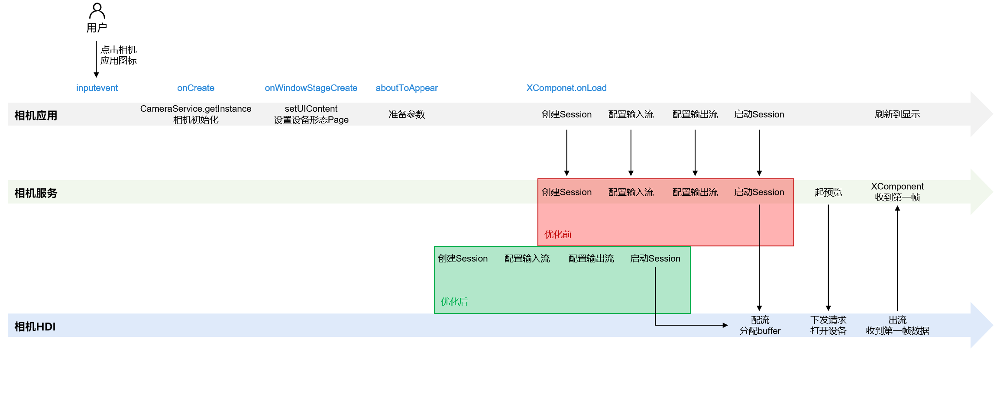
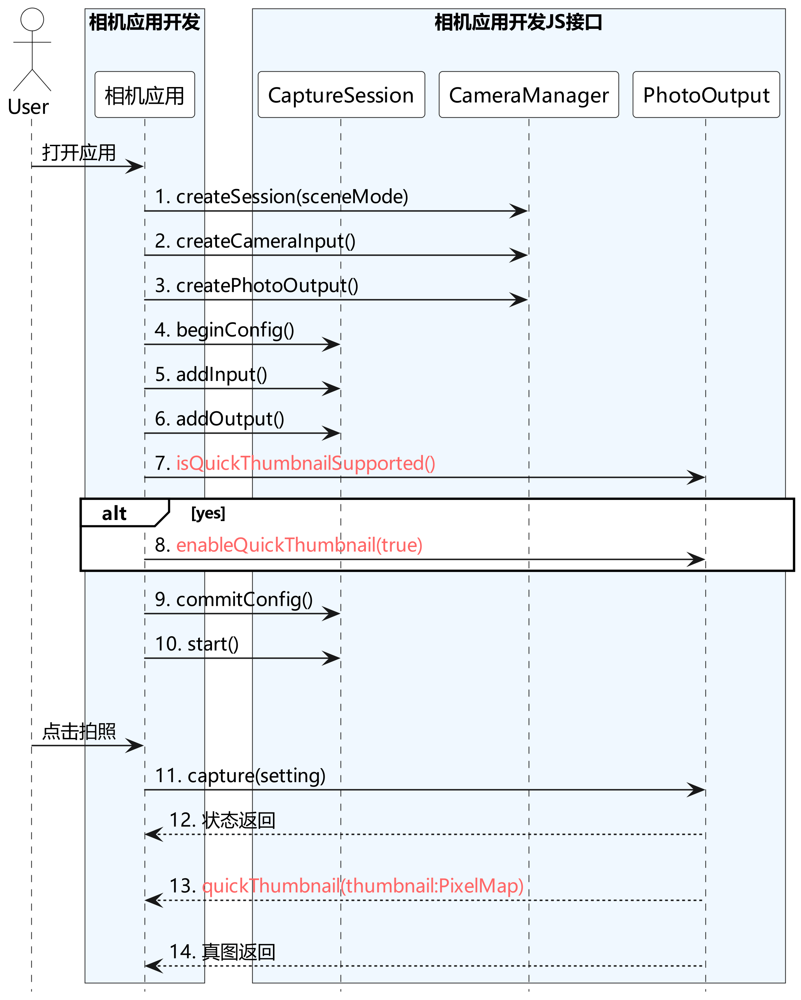

# 性能提升实践(仅对系统应用开放)(ArkTS)

在开发相机应用时，需要先参考开发准备[申请相关权限](camera-preparation.md)。

相机启动性能受限于底层器件上电、流程Pipeline初始化等耗时操作影响，本文档将为开发者提供更进一步的指导，提升相机启动速度以及拍照返回缩略图速度。相关能力与底层器件相关，请开发者在使用前需确认是否支持相关特性。

​相关特性分别在打开相机设备过程、配流过程以及拍照过程中。本文档针对三个场景分别进行介绍。

## 延时配流

经典的相机启动过程经过“相机设备打开”、“配置数据流”、“启动数据流”等流程，而配流启流之前需要得到XComponent组件的surfaceId。

延时配流方案是把配流启流与surface解耦，在组件尚未给应用surface之前，可以先进行配流启流，只需要在启流结束之前提供surface，可以提升启动速度，防止影响其他启动优化方案的落地。



优化前：配流动作依赖surface对象，surface对象依赖于UI加载完成。也就是在UI加载完成后，才可以创建Session、配置输入输出流、启动Session，由相机HDI进行配流。

优化后：配流动作不依赖surface对象，界面加载和配流并行执行。完成参数准备后，即可开始创建Session。

### 接口说明

详细的API参考说明，请参考[Camera API文档](../../reference/apis-camera-kit/arkts-apis-camera.md)。

| 接口 | 说明 |
| ---- | ---- |
| createDeferredPreviewOutput(profile: Profile): Promise\<PreviewOutput> | 创建延迟预览输出对象，在配流时替代普通的预览输出对象加入数据流。 |
| addDeferredSurface(surfaceId: string): Promise\<void> | 配置延迟预览的Surface，可以在[session.commitConfig](../../reference/apis-camera-kit/arkts-apis-camera-Session.md#commitconfig11)配流和[session.start](../../reference/apis-camera-kit/arkts-apis-camera-Session.md#start11)启流之后运行。 |

### 开发示例

接口调用流程建议如下图所示：


Context获取方式请参考：[获取UIAbility的上下文信息](../../application-models/uiability-usage.md#获取uiability的上下文信息)。

```ts
import { camera } from '@kit.CameraKit';
import { common } from '@kit.AbilityKit';

async function preview(baseContext: common.BaseContext, cameraInfo: camera.CameraDevice, previewProfile: camera.Profile, photoProfile: camera.Profile, previewSurfaceId: string): Promise<void> {
  const cameraManager: camera.CameraManager = camera.getCameraManager(baseContext);
  const cameraInput: camera.CameraInput = cameraManager.createCameraInput(cameraInfo);
  const previewOutput: camera.PreviewOutput = cameraManager.createDeferredPreviewOutput(previewProfile);
  const photoOutput: camera.PhotoOutput = cameraManager.createPhotoOutput(photoProfile);
  const session: camera.PhotoSession = cameraManager.createSession(camera.SceneMode.NORMAL_PHOTO) as camera.PhotoSession;
  session.beginConfig();
  session.addInput(cameraInput);
  session.addOutput(previewOutput);
  session.addOutput(photoOutput);
  await session.commitConfig();
  await session.start();
  previewOutput.addDeferredSurface(previewSurfaceId);
}
```

## 快速缩略图

相机拍照性能依赖算法处理的速度，算法链越复杂、效果就越好，但同时处理时间就越长。

通过相机快速缩略图，相机拍照可单独输出拇指缩略图，在真图没有上报之前，可以提前上报一张缩略图给应用去做显示，提升shot2see用户感知拍照速度。

这样从拍照流程上进行优化，既可以满足后处理算法处理的要求，又不会阻塞前台的拍照速度。

### 接口说明

详细的API参考说明，请参考[Camera API文档](../../reference/apis-camera-kit/arkts-apis-camera.md)。

| 接口 | 说明 |
| ---- | ---- |
| isQuickThumbnailSupported() : boolean | 是否支持快速缩略图，true表示支持，false表示不支持。 |
| enableQuickThumbnail(enabled:bool): void | 使能/去使能快速缩略图。 |
| on(type: 'quickThumbnail', callback: AsyncCallback\<image.PixelMap>): void | 相机缩略图监听回调。 |

> **说明：**
>
> - [isQuickThumbnailSupported](../../reference/apis-camera-kit/js-apis-camera-sys.md#isquickthumbnailsupported)及[enableQuickThumbnail](../../reference/apis-camera-kit/js-apis-camera-sys.md#enablequickthumbnail)接口的调用需要在[addOutput](../../reference/apis-camera-kit/arkts-apis-camera-Session.md#addoutput11)、[addInput](../../reference/apis-camera-kit/arkts-apis-camera-Session.md#addinput11)后，[commitConfig](../../reference/apis-camera-kit/arkts-apis-camera-Session.md#commitconfig11)之前。
> - on接口需要在[enableQuickThumbnail(true)](../../reference/apis-camera-kit/js-apis-camera-sys.md#enablequickthumbnail)之后生效。

### 开发示例

接口调用流程建议如下图所示：



Context获取方式请参考：[获取UIAbility的上下文信息](../../application-models/uiability-usage.md#获取uiability的上下文信息)。
```ts
import { camera } from '@kit.CameraKit';
import { BusinessError } from '@kit.BasicServicesKit';
import { image } from '@kit.ImageKit';
import { common } from '@kit.AbilityKit';

async function enableQuickThumbnail(baseContext: common.BaseContext, photoProfile: camera.Profile): Promise<void> {
  let cameraManager: camera.CameraManager = camera.getCameraManager(baseContext);
  let cameras: Array<camera.CameraDevice> = cameraManager.getSupportedCameras();
  // 创建PhotoSession实例。
  let photoSession: camera.PhotoSession = cameraManager.createSession(camera.SceneMode.NORMAL_PHOTO) as camera.PhotoSession;
  // 开始配置会话。
  photoSession.beginConfig();
  // 把CameraInput加入到会话。
  let cameraInput: camera.CameraInput = cameraManager.createCameraInput(cameras[0]);
  cameraInput.open();
  photoSession.addInput(cameraInput);
  // 把PhotoOutPut加入到会话。
  let photoOutPut: camera.PhotoOutput = cameraManager.createPhotoOutput(photoProfile);
  photoSession.addOutput(photoOutPut);
  let isSupported: boolean = photoOutPut.isQuickThumbnailSupported();
  if (isSupported) {
    // 使能快速缩略图。
    photoOutPut.enableQuickThumbnail(true);
    photoOutPut.on('quickThumbnail', (err: BusinessError, pixelMap: image.PixelMap) => {
      if (err || pixelMap === undefined) {
        console.error('photoOutPut on thumbnail failed');
        return;
      }
      // 显示或保存pixelmap。
      showOrSavePicture(pixelMap);
    });
  }
}

function showOrSavePicture(pixelMap: image.PixelMap): void {
  //do something。
}
```

## 预热启动

普通情况下相机应用的启动是用户通过点击桌面相机图标触发的。桌面应用感知用户点击相机图标，然后通知应用管理器启动对应的相机应用（进程），这个过程是耗时较长。进入相机应用后，开始进入相机启动流程。经典的相机启动过程会经过，“相机设备打开”，“配置数据流”，“启动数据流等”，这个过程也较为耗时。

​相机启动方案是把“相机设备打开”这个动作提前到相机应用启动之前，即在用户点击相机图标，
还没等相机应用启动的时候，触发相机设备打开的动作，从而缩短相机应用内启动相机的流程，加速相机启动。使用预热启动前后的相机应用流程对比如下：


### 接口说明

详细的API参考说明，请参考[Camera API文档](../../reference/apis-camera-kit/arkts-apis-camera.md)。

| 接口 | 说明 |
| ---- | ---- |
| isPrelaunchSupported(camera: CameraDevice) : boolean |  判断指定cameraDevice是否支持预热启动，true表示支持，false表示不支持。 |
| setPrelaunchConfig(prelaunchConfig: PrelaunchConfig) : void | 配置相机预热参数。 |
| prelaunch() : void | 用户点击系统相机图标，拉起相机应用的同时调用，下发预热请求，使能相机预热启动。 |

### 开发示例

接口调用流程建议如下图所示：


Context获取方式请参考：[获取UIAbility的上下文信息](../../application-models/uiability-usage.md#获取uiability的上下文信息)。

- **桌面应用**

  ```ts
  import { camera } from '@kit.CameraKit';
  import { BusinessError } from '@kit.BasicServicesKit';
  import { common } from '@kit.AbilityKit';

  function preLaunch(baseContext: common.BaseContext): void {
    let cameraManager: camera.CameraManager = camera.getCameraManager(baseContext);
    try {
      cameraManager.prelaunch();
    } catch (error) {
      let err = error as BusinessError;
      console.error(`catch error: Code: ${err.code}, message: ${err.message}`);
    }
  }
  ```

- **相机应用**

  使用该功能前，应用需要**申请权限**：ohos.permission.CAMERA

  具体申请方式及校验方式，请参考[向用户申请授权](../../security/AccessToken/request-user-authorization.md)。

  ```ts
  import { camera } from '@kit.CameraKit';
  import { BusinessError } from '@kit.BasicServicesKit';
  import { common } from '@kit.AbilityKit';

  function setPreLaunchConfig(baseContext: common.BaseContext): void {
    let cameraManager: camera.CameraManager = camera.getCameraManager(baseContext);
    let cameras: Array<camera.CameraDevice> = [];
    try {
      cameras = cameraManager.getSupportedCameras();
    } catch (error) {
      let err = error as BusinessError;
      console.error(`getSupportedCameras catch error: Code: ${err.code}, message: ${err.message}`);
    }
    if (cameras.length <= 0) {
      return;
    }
    if(cameraManager.isPrelaunchSupported(cameras[0])) {
      try {
        cameraManager.setPrelaunchConfig({cameraDevice: cameras[0]});
      } catch (error) {
        let err = error as BusinessError;
        console.error(`setPrelaunchConfig catch error: Code: ${err.code}, message: ${err.message}`);
      }
    }
  }
  ```
