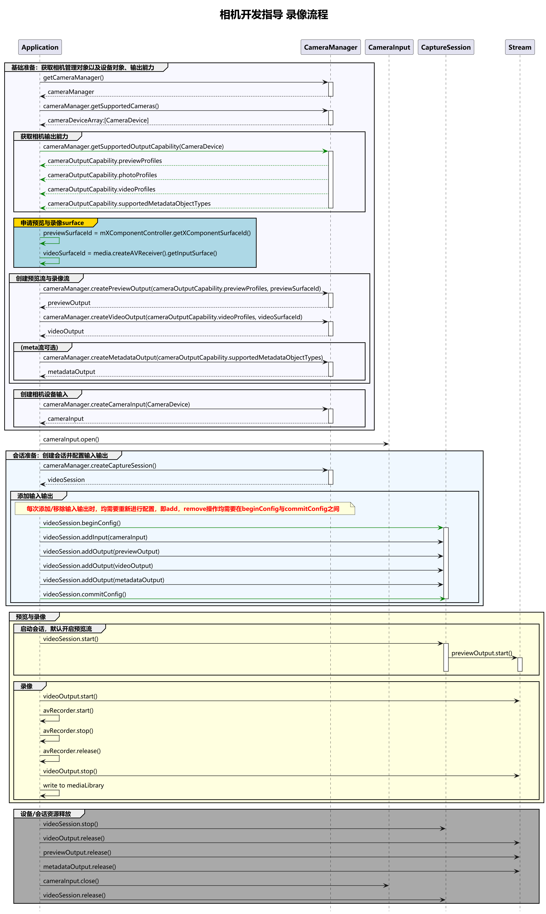

# 录像实践(ArkTS)
<!--Kit: Camera Kit-->
<!--Subsystem: Multimedia-->
<!--Owner: @qano-->
<!--Designer: @leo_ysl-->
<!--Tester: @xchaosioda-->
<!--Adviser: @zengyawen-->

在开发相机应用时，需要先[申请相关权限](camera-preparation.md)。

当前示例提供完整的录像流程介绍，方便开发者了解完整的接口调用顺序。

在参考以下示例前，建议开发者查看[相机开发指导(ArkTS)](camera-device-management.md)的具体章节，了解[设备输入](camera-device-input.md)、[会话管理](camera-session-management.md)、[录像](camera-recording.md)等单个流程。

如需要将视频保存到媒体库中可参考[保存媒体库资源](../medialibrary/photoAccessHelper-savebutton.md)。
## 开发流程

在获取到相机支持的输出流能力后，开始创建录像流，开发流程如下。




## 完整示例
Context获取方式请参考：[获取UIAbility的上下文信息](../../application-models/uiability-usage.md#获取uiability的上下文信息)。

```ts
import { camera } from '@kit.CameraKit';
import { BusinessError } from '@kit.BasicServicesKit';
import { media } from '@kit.MediaKit';
import { common } from '@kit.AbilityKit';
import { fileIo as fs } from '@kit.CoreFileKit';
import { JSON } from '@kit.ArkTS';

interface RecordingResources {
  avRecorder?: media.AVRecorder;
  videoOutput?: camera.VideoOutput;
  cameraInput?: camera.CameraInput;
  previewOutput?: camera.PreviewOutput;
  videoSession?: camera.VideoSession;
  file?: fs.File;
}

// 全局资源跟踪。
const resources: RecordingResources = {};

async function releaseResources(): Promise<void> {
  const releaseSteps = [
  // 停止录像。
    async () => await resources.avRecorder?.stop().catch((e: BusinessError) => console.error('停止录像失败:', e)),
    // 停止视频输出。
    async () => await resources.videoOutput?.stop().catch((e: BusinessError) => console.error('停止视频输出失败:', e)),
    // 停止会话。
    async () => await resources.videoSession?.stop().catch((e: BusinessError) => console.error('停止会话失败:', e)),
    // 释放录像器。
    async () => await resources.avRecorder?.release().catch((e: BusinessError) => console.error('释放录像器失败:', e)),
    // 关闭相机输入。
    async () => await resources.cameraInput?.close().catch((e: BusinessError) => console.error('关闭相机输入失败:', e)),
    // 释放视频输出。
    async () => await resources.videoOutput?.release().catch((e: BusinessError) => console.error('释放视频输出失败:', e)),
    // 释放预览输出。
    async () => await resources.previewOutput?.release().catch((e: BusinessError) => console.error('释放预览输出失败:', e)),
    // 释放会话。
    async () => await resources.videoSession?.release().catch((e: BusinessError) => console.error('释放会话失败:', e)),
    // 关闭文件。
    async () => {
      if (resources.file) {
        try {
          await fs.close(resources.file);
        } catch (e) {
          console.error('Failure to close file');
        }
      }
    },
  ];

  // 按顺序执行释放步骤。
  for (const step of releaseSteps) {
    await step();
  }
  // 清空资源引用。
  resources.avRecorder = undefined;
  resources.videoOutput = undefined;
  resources.cameraInput = undefined;
  resources.previewOutput = undefined;
  resources.videoSession = undefined;
  resources.file = undefined;
}

async function videoRecording(context: common.Context, surfaceId: string): Promise<void> {
  // 创建CameraManager对象。
  let cameraManager: camera.CameraManager | undefined = undefined;
  try {
    cameraManager = camera.getCameraManager(context);
  } catch (error) {
    console.error(`getCameraManager call failed, error: ${JSON.stringify(error)}`);
  }

  if (!cameraManager) {
    console.error("cameraManager is null");
    return;
  }

  // 获取相机列表。
  let cameraArray: Array<camera.CameraDevice> = [];
  try {
    cameraArray = cameraManager.getSupportedCameras();
  } catch (error) {
    let err = error as BusinessError;
    console.error(`getSupportedCameras call failed. error code: ${JSON.stringify(err)}`);
  }

  if (!cameraArray || cameraArray.length <= 0) {
    console.error("cameraManager.getSupportedCameras error");
    return;
  }

  // 获取支持的模式类型。
  let sceneModes: Array<camera.SceneMode> = cameraManager.getSupportedSceneModes(cameraArray[0]);
  let isSupportVideoMode: boolean = sceneModes.indexOf(camera.SceneMode.NORMAL_VIDEO) >= 0;
  if (!isSupportVideoMode) {
    console.error('video mode not support');
    return;
  }

  // 示例代码默认选择第一个镜头，实际开发需根据所需镜头。
  const cameraDevice: camera.CameraDevice = cameraArray[0];

  // 获取相机设备支持的输出流能力。
  let cameraOutputCap: camera.CameraOutputCapability = cameraManager.getSupportedOutputCapability(cameraDevice,
    camera.SceneMode.NORMAL_VIDEO);
  if (!cameraOutputCap) {
    console.error("cameraOutputCap is null");
    return;
  }
  console.info("outputCapability: " + JSON.stringify(cameraOutputCap));

  let videoProfilesArray: Array<camera.VideoProfile> = cameraOutputCap.videoProfiles;
  if (!videoProfilesArray || videoProfilesArray.length === 0) {
    console.error("videoProfilesArray is null or []");
    return;
  }

  // videoProfile的宽高需要与AVRecorderProfile的宽高保持一致，并且需要使用AVRecorderProfile所支持的宽高。
  // 示例代码默认选择第一个videoProfile，实际开发需根据所需筛选videoProfile。
  const videoProfile: camera.VideoProfile = cameraOutputCap.videoProfiles[0];
  let videoUri: string = context.filesDir + '/' + 'VIDEO_' + Date.parse(new Date().toString()) + '.mp4'; // 本地沙箱路径。
  try {
    resources.file = fs.openSync(videoUri, fs.OpenMode.READ_WRITE | fs.OpenMode.CREATE);
  } catch (error) {
    console.error(`openSync call failed, error: ${JSON.stringify(error)}`);
    return;
  }

  // 创建并配置AVRecorder。
  const isHdr: boolean = [
    camera.CameraFormat.CAMERA_FORMAT_YCBCR_P010,
    camera.CameraFormat.CAMERA_FORMAT_YCRCB_P010
  ].includes(videoProfile.format);
  // 配置参数以实际硬件设备支持的范围为准。
  let aVRecorderProfile: media.AVRecorderProfile = {
    audioBitrate: 48000,
    audioChannels: 2,
    audioCodec: media.CodecMimeType.AUDIO_AAC,
    audioSampleRate: 48000,
    fileFormat: media.ContainerFormatType.CFT_MPEG_4,
    videoBitrate: 2000000,
    videoCodec: isHdr ? media.CodecMimeType.VIDEO_HEVC : media.CodecMimeType.VIDEO_AVC,
    videoFrameWidth: videoProfile.size.width,
    videoFrameHeight: videoProfile.size.height,
    videoFrameRate: 30,
    isHdr: isHdr
  };

  let avMetadata: media.AVMetadata = {
    videoOrientation: '0', // 合理值0、90、180、270，非合理值prepare接口将报错。
    location: { latitude: 30, longitude: 130 }
  }
  let aVRecorderConfig: media.AVRecorderConfig = {
    audioSourceType: media.AudioSourceType.AUDIO_SOURCE_TYPE_MIC,
    videoSourceType: media.VideoSourceType.VIDEO_SOURCE_TYPE_SURFACE_YUV,
    profile: aVRecorderProfile,
    url: `fd://${resources.file.fd.toString()}`, // 文件需先由调用者创建，赋予读写权限，将文件fd传给此参数，eg.fd://45--file:///data/media/01.mp4
    rotation: 0, // 合理值0、90、180、270，非合理值prepare接口将报错。
    metadata: avMetadata
  };

  try {
    resources.avRecorder = await media.createAVRecorder();
  } catch (error) {
    let err = error as BusinessError;
    console.error(`createAVRecorder call failed. error code: ${JSON.stringify(err)}`);
    return;
  }

  if (!resources.avRecorder) {
    console.error(`avRecorder is null`);
    return;
  }

  try {
    await resources.avRecorder.prepare(aVRecorderConfig);
  } catch (error) {
    let err = error as BusinessError;
    console.error(`prepare call failed. error code: ${JSON.stringify(err)}`);
    await releaseResources();
    return;
  }

  // 获取视频输入surface。
  let videoSurfaceId: string | undefined = undefined; // 该surfaceID用于传递给相机接口创造videoOutput。
  try {
    videoSurfaceId = await resources.avRecorder.getInputSurface();
  } catch (error) {
    let err = error as BusinessError;
    console.error(`getInputSurface call failed. error code: ${JSON.stringify(err)}`);
    await releaseResources();
    return;
  }

  if (!videoSurfaceId) {
    await releaseResources();
    return;
  }

  // 创建VideoOutput对象。
  try {
    resources.videoOutput = cameraManager.createVideoOutput(videoProfile, videoSurfaceId);
  } catch (error) {
    let err = error as BusinessError;
    console.error(`Failed to create the videoOutput instance. error: ${JSON.stringify(err)}`);
    await releaseResources();
    return;
  }
  if (!resources.videoOutput) {
    console.error('videoOutput is null');
    await releaseResources();
    return;
  }

  let previewProfilesArray: Array<camera.Profile> = cameraOutputCap.previewProfiles;
  if (!previewProfilesArray || previewProfilesArray.length === 0) {
    console.error("previewProfilesArray is null or []");
    return;
  }

  // 创建预览输出流，其中参数surfaceId是由XComponent组件提供的。
  const previewProfile = previewProfilesArray.find((previewProfile: camera.Profile) => {
    return Math.abs((previewProfile.size.width / previewProfile.size.height) - (videoProfile.size.width / videoProfile.size.height)) < Number.EPSILON;
  }); // 筛选与录像分辨率宽高比一致的预览分辨率。
  if (!previewProfile) {
    console.error('No preview resolution found that matches the aspect ratio of the video resolution');
    await releaseResources();
    return;
  }

  try {
    resources.previewOutput = cameraManager.createPreviewOutput(previewProfile, surfaceId);
  } catch (error) {
    let err = error as BusinessError;
    console.error(`createPreviewOutput call failed. error: ${JSON.stringify(err)}`);
    await releaseResources();
    return;
  }
  if (!resources.previewOutput) {
    console.error('previewOutput is null');
    await releaseResources();
    return;
  }

  // 创建相机输入流。
  try {
    resources.cameraInput = cameraManager.createCameraInput(cameraDevice);
  } catch (error) {
    let err = error as BusinessError;
    console.error(`Failed to createCameraInput. error: ${JSON.stringify(err)}`);
    await releaseResources();
    return;
  }
  if (!resources.cameraInput) {
    console.error('cameraInput is null');
    await releaseResources();
    return;
  }

  // 监听cameraInput错误信息。
  resources.cameraInput!.on('error', cameraDevice, (error: BusinessError) => {
    console.error(`Camera input error code: ${error.code}`);
  });

  // 打开相机。
  try {
    await resources.cameraInput!.open();
  } catch (error) {
    let err = error as BusinessError;
    console.error(`Failed to open cameraInput. error: ${err}`);
  }

  // 创建会话。
  try {
    resources.videoSession = cameraManager.createSession(camera.SceneMode.NORMAL_VIDEO) as camera.VideoSession;
  } catch (error) {
    let err = error as BusinessError;
    console.error(`Failed to create the session instance. error: ${JSON.stringify(err)}`);
    await releaseResources();
    return;
  }
  if (!resources.videoSession) {
    console.error('videoSession is null');
    await releaseResources();
    return;
  }
  // 监听session错误信息。
  resources.videoSession!.on('error', (error: BusinessError) => {
    console.error(`Video session error code: ${error.code}`);
  });

  // 开始配置会话。
  try {
    resources.videoSession!.beginConfig();
    resources.videoSession!.addInput(resources.cameraInput!);
    resources.videoSession!.addOutput(resources.videoOutput!);
    resources.videoSession!.addOutput(resources.previewOutput!);
    await resources.videoSession!.commitConfig();
    await resources.videoSession!.start();
  } catch (error) {
    let err = error as BusinessError;
    console.error(`Session Configuration Failure. error: ${err}`);
    await releaseResources();
    return;
  }

  // 启动录像。
  try {
    await resources.videoOutput!.start();
    await resources.avRecorder!.start();
  } catch (error) {
    let err = error as BusinessError;
    console.error(`avRecorder stop error: ${err}`);
  }

  // 停止当前会话。
  await resources.videoSession.stop();

  // 关闭文件。
  try {
    fs.closeSync(resources.file);
  } catch (error) {
    let err = error as BusinessError;
    console.error(`closeSync failed, error: ${err}`);
  }


  // 释放相机输入流。
  await resources.cameraInput.close();

  // 释放预览输出流。
  try {
    await resources.previewOutput.release();
  } catch (error) {
    let err = error as BusinessError;
    console.error(`release previewOutput failed, error: ${err.code}`);
  }


  // 释放录像输出流。
  try {
    await resources.videoOutput.release();
  } catch (error) {
    let err = error as BusinessError;
    console.error(`release videoOutput failed, error: ${err.code}`);
  }

  // 释放会话。
  try {
    await resources.videoSession.release();
  } catch (error) {
    let err = error as BusinessError;
    console.error(`release videoSession failed, error: ${err.code}`);
  }

  // 会话置空。
  resources.videoSession = undefined;
}
```
