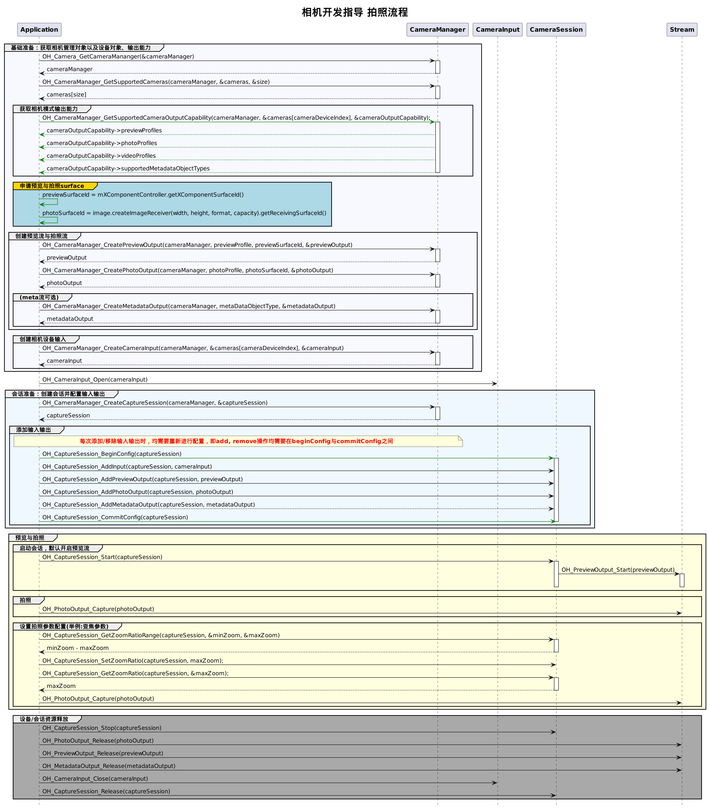

# 拍照实现方案(C/C++)

当前示例提供完整的拍照流程及其接口调用顺序的介绍。对于单个流程（如设备输入、会话管理、拍照）的介绍请参考[相机开发指导(Native)](camera-preparation.md)的具体章节。

## 开发流程

在获取到相机支持的输出流能力后，开始创建拍照流，开发流程如下。



## 完整示例

1. 在CMake脚本中链接相关动态库。
    ```txt
        target_link_libraries(entry PUBLIC libohcamera.so libhilog_ndk.z.so)
    ```

2. cpp侧导入NDK接口，并根据传入的SurfaceId进行拍照。
    ```c++
    #include "hilog/log.h"
    #include "ohcamera/camera.h"
    #include "ohcamera/camera_input.h"
    #include "ohcamera/capture_session.h"
    #include "ohcamera/photo_output.h"
    #include "ohcamera/preview_output.h"
    #include "ohcamera/video_output.h"
    #include "ohcamera/camera_manager.h"

    void CaptureSessionOnFocusStateChange(Camera_CaptureSession* session, Camera_FocusState focusState)
    {
        OH_LOG_INFO(LOG_APP, "CaptureSessionOnFocusStateChange");
    }

    void CaptureSessionOnError(Camera_CaptureSession* session, Camera_ErrorCode errorCode)
    {
        OH_LOG_INFO(LOG_APP, "CaptureSessionOnError = %{public}d", errorCode);
    }

    CaptureSession_Callbacks* GetCaptureSessionRegister(void)
    {
        static CaptureSession_Callbacks captureSessionCallbacks = {
            .onFocusStateChange = CaptureSessionOnFocusStateChange,
            .onError = CaptureSessionOnError
        };
        return &captureSessionCallbacks;
    }

    void PreviewOutputOnFrameStart(Camera_PreviewOutput* previewOutput)
    {
        OH_LOG_INFO(LOG_APP, "PreviewOutputOnFrameStart");
    }

    void PreviewOutputOnFrameEnd(Camera_PreviewOutput* previewOutput, int32_t frameCount)
    {
        OH_LOG_INFO(LOG_APP, "PreviewOutputOnFrameEnd = %{public}d", frameCount);
    }

    void PreviewOutputOnError(Camera_PreviewOutput* previewOutput, Camera_ErrorCode errorCode)
    {
        OH_LOG_INFO(LOG_APP, "PreviewOutputOnError = %{public}d", errorCode);
    }

    PreviewOutput_Callbacks* GetPreviewOutputListener(void)
    {
        static PreviewOutput_Callbacks previewOutputListener = {
            .onFrameStart = PreviewOutputOnFrameStart,
            .onFrameEnd = PreviewOutputOnFrameEnd,
            .onError = PreviewOutputOnError
        };
        return &previewOutputListener;
    }

    void OnCameraInputError(const Camera_Input* cameraInput, Camera_ErrorCode errorCode)
    {
        OH_LOG_INFO(LOG_APP, "OnCameraInput errorCode = %{public}d", errorCode);
    }

    CameraInput_Callbacks* GetCameraInputListener(void)
    {
        static CameraInput_Callbacks cameraInputCallbacks = {
            .onError = OnCameraInputError
        };
        return &cameraInputCallbacks;
    }

    void CameraManagerStatusCallback(Camera_Manager* cameraManager, Camera_StatusInfo* status)
    {
        OH_LOG_INFO(LOG_APP, "CameraManagerStatusCallback is called");
    }

    CameraManager_Callbacks* GetCameraManagerListener()
    {
        static CameraManager_Callbacks cameraManagerListener = {
            .onCameraStatus = CameraManagerStatusCallback
        };
        return &cameraManagerListener;
    }

    NDKCamera::NDKCamera(char *previewId, char *photoId)
    {
        Camera_Manager* cameraManager = nullptr;
        Camera_Device* cameras = nullptr;
        Camera_CaptureSession* captureSession = nullptr;
        Camera_OutputCapability* cameraOutputCapability = nullptr;
        const Camera_Profile* previewProfile = nullptr;
        const Camera_Profile* photoProfile = nullptr;
        Camera_PreviewOutput* previewOutput = nullptr;
        Camera_PhotoOutput* photoOutput = nullptr;
        Camera_Input* cameraInput = nullptr;
        uint32_t size = 0;
        uint32_t cameraDeviceIndex = 0;
        char* previewSurfaceId = previewId;
        char* photoSurfaceId = photoId;
        // 创建CameraManager对象
        Camera_ErrorCode ret = OH_Camera_GetCameraManager(&cameraManager);
        if (cameraManager == nullptr || ret != CAMERA_OK) {
          OH_LOG_ERROR(LOG_APP, "OH_Camera_GetCameraMananger failed.");
        }
        // 监听相机状态变化
        ret = OH_CameraManager_RegisterCallback(cameraManager, GetCameraManagerListener());
        if (ret != CAMERA_OK) {
          OH_LOG_ERROR(LOG_APP, "OH_CameraManager_RegisterCallback failed.");
        }
        
        // 获取相机列表
        ret = OH_CameraManager_GetSupportedCameras(cameraManager, &cameras, &size);
        if (cameras == nullptr || size < 0 || ret != CAMERA_OK) {
          OH_LOG_ERROR(LOG_APP, "OH_CameraManager_GetSupportedCameras failed.");
        }
        
        // 创建相机输入流
        ret = OH_CameraManager_CreateCameraInput(cameraManager, &cameras[cameraDeviceIndex], &cameraInput);
        if (cameraInput == nullptr || ret != CAMERA_OK) {
          OH_LOG_ERROR(LOG_APP, "OH_CameraManager_CreateCameraInput failed.");
        }
        
        // 监听cameraInput错误信息
        ret = OH_CameraInput_RegisterCallback(cameraInput, GetCameraInputListener());
        if (ret != CAMERA_OK) {
          OH_LOG_ERROR(LOG_APP, "OH_CameraInput_RegisterCallback failed.");
        }
        
        // 打开相机
        ret = OH_CameraInput_Open(cameraInput);
        if (ret != CAMERA_OK) {
          OH_LOG_ERROR(LOG_APP, "OH_CameraInput_Open failed.");
        }
        
        // 获取相机设备支持的输出流能力
        ret = OH_CameraManager_GetSupportedCameraOutputCapability(cameraManager, &cameras[cameraDeviceIndex],
                                                                  &cameraOutputCapability);
        if (cameraOutputCapability == nullptr || ret != CAMERA_OK) {
          OH_LOG_ERROR(LOG_APP, "OH_CameraManager_GetSupportedCameraOutputCapability failed.");
        }
        
        if (cameraOutputCapability->previewProfilesSize < 0) {
          OH_LOG_ERROR(LOG_APP, "previewProfilesSize == null");
        }
        previewProfile = cameraOutputCapability->previewProfiles[0];
        
        if (cameraOutputCapability->photoProfilesSize < 0) {
          OH_LOG_ERROR(LOG_APP, "photoProfilesSize == null");
        }
        photoProfile = cameraOutputCapability->photoProfiles[0];
        
        
        // 创建预览输出流,其中参数 previewSurfaceId 参考上文 XComponent 组件，预览流为XComponent组件提供的surface
        ret = OH_CameraManager_CreatePreviewOutput(cameraManager, previewProfile, previewSurfaceId, &previewOutput);
        if (previewProfile == nullptr || previewOutput == nullptr || ret != CAMERA_OK) {
          OH_LOG_ERROR(LOG_APP, "OH_CameraManager_CreatePreviewOutput failed.");
        }
        
        // 监听预览输出错误信息
        ret = OH_PreviewOutput_RegisterCallback(previewOutput, GetPreviewOutputListener());
        if (ret != CAMERA_OK) {
          OH_LOG_ERROR(LOG_APP, "OH_PreviewOutput_RegisterCallback failed.");
        }
        
        // 创建拍照输出流，其中参数 photoSurfaceId 参考上文 ImageReceiver获取的surface
        ret = OH_CameraManager_CreatePhotoOutput(cameraManager, photoProfile, photoSurfaceId, &photoOutput);
        if (photoProfile == nullptr || photoOutput == nullptr || ret != CAMERA_OK) {
          OH_LOG_ERROR(LOG_APP, "OH_CameraManager_CreatePhotoOutput failed.");
        }
        
        //创建会话
        ret = OH_CameraManager_CreateCaptureSession(cameraManager, &captureSession);
        if (captureSession == nullptr || ret != CAMERA_OK) {
          OH_LOG_ERROR(LOG_APP, "OH_CameraManager_CreateCaptureSession failed.");
        }
        
        // 监听session错误信息
        ret = OH_CaptureSession_RegisterCallback(captureSession, GetCaptureSessionRegister());
        if (ret != CAMERA_OK) {
          OH_LOG_ERROR(LOG_APP, "OH_CaptureSession_RegisterCallback failed.");
        }
        
        // 开始配置会话
        ret = OH_CaptureSession_BeginConfig(captureSession);
        if (ret != CAMERA_OK) {
          OH_LOG_ERROR(LOG_APP, "OH_CaptureSession_BeginConfig failed.");
        }
        
        // 向会话中添加相机输入流
        ret = OH_CaptureSession_AddInput(captureSession, cameraInput);
        if (ret != CAMERA_OK) {
          OH_LOG_ERROR(LOG_APP, "OH_CaptureSession_AddInput failed.");
        }
        
        // 向会话中添加预览输出流
        ret = OH_CaptureSession_AddPreviewOutput(captureSession, previewOutput);
        if (ret != CAMERA_OK) {
          OH_LOG_ERROR(LOG_APP, "OH_CaptureSession_AddPreviewOutput failed.");
        }
        
        // 向会话中添加拍照输出流
        ret = OH_CaptureSession_AddPhotoOutput(captureSession, photoOutput);
        if (ret != CAMERA_OK) {
          OH_LOG_ERROR(LOG_APP, "OH_CaptureSession_AddPhotoOutput failed.");
        }
        
        // 提交会话配置
        ret = OH_CaptureSession_CommitConfig(captureSession);
        if (ret != CAMERA_OK) {
          OH_LOG_ERROR(LOG_APP, "OH_CaptureSession_CommitConfig failed.");
        }
        
        // 启动会话
        ret = OH_CaptureSession_Start(captureSession);
        if (ret != CAMERA_OK) {
          OH_LOG_ERROR(LOG_APP, "OH_CaptureSession_Start failed.");
        }
        
        // 判断设备是否支持闪光灯
        Camera_FlashMode flashMode = FLASH_MODE_AUTO;
        bool hasFlash = false;
        ret = OH_CaptureSession_HasFlash(captureSession, &hasFlash);
        if (ret != CAMERA_OK) {
          OH_LOG_ERROR(LOG_APP, "OH_CaptureSession_HasFlash failed.");
        }
        if (hasFlash) {
          OH_LOG_INFO(LOG_APP, "hasFlash success");
        } else {
          OH_LOG_ERROR(LOG_APP, "hasFlash fail");
        }
        // 检测闪光灯模式是否支持
        bool isSupported = false;
        ret = OH_CaptureSession_IsFlashModeSupported(captureSession, flashMode, &isSupported);
        if (ret != CAMERA_OK) {
          OH_LOG_ERROR(LOG_APP, "OH_CaptureSession_IsFlashModeSupported failed.");
        }
        if (isSupported) {
          OH_LOG_INFO(LOG_APP, "isFlashModeSupported success");
          // 设置闪光灯模式
          ret = OH_CaptureSession_SetFlashMode(captureSession, flashMode);
          if (ret == CAMERA_OK) {
              OH_LOG_INFO(LOG_APP, "OH_CaptureSession_SetFlashMode success.");
          } else {
              OH_LOG_ERROR(LOG_APP, "OH_CaptureSession_SetFlashMode failed. %{public}d ", ret);
          }
          // 获取当前设备的闪光灯模式
          ret = OH_CaptureSession_GetFlashMode(captureSession, &flashMode);
          if (ret == CAMERA_OK) {
              OH_LOG_INFO(LOG_APP, "OH_CaptureSession_GetFlashMode success. flashMode：%{public}d ", flashMode);
          } else {
              OH_LOG_ERROR(LOG_APP, "OH_CaptureSession_GetFlashMode failed. %d ", ret);
          }
        } else {
          OH_LOG_ERROR(LOG_APP, "isFlashModeSupported fail");
        }
        
        // 判断是否支持连续自动变焦模式
        Camera_FocusMode focusMode = FOCUS_MODE_CONTINUOUS_AUTO;
        bool isFocusModeSupported = false;
        ret = OH_CaptureSession_IsFocusModeSupported(captureSession, focusMode, &isFocusModeSupported);
        if (ret != CAMERA_OK) {
          OH_LOG_ERROR(LOG_APP, "OH_CaptureSession_IsFocusModeSupported failed.");
        }
        if (isFocusModeSupported) {
          OH_LOG_INFO(LOG_APP, "isFocusModeSupported success");
          ret = OH_CaptureSession_SetFocusMode(captureSession, focusMode);
          if (ret != CAMERA_OK) {
              OH_LOG_ERROR(LOG_APP, "OH_CaptureSession_SetFocusMode failed. %{public}d ", ret);
          }
          ret = OH_CaptureSession_GetFocusMode(captureSession, &focusMode);
          if (ret == CAMERA_OK) {
              OH_LOG_INFO(LOG_APP, "OH_CaptureSession_GetFocusMode success. focusMode%{public}d ", focusMode);
          } else {
              OH_LOG_ERROR(LOG_APP, "OH_CaptureSession_GetFocusMode failed. %d ", ret);
          }
        } else {
          OH_LOG_ERROR(LOG_APP, "isFocusModeSupported fail");
        }
        
        // 获取相机支持的可变焦距比范围
        float minZoom;
        float maxZoom;
        ret = OH_CaptureSession_GetZoomRatioRange(captureSession, &minZoom, &maxZoom);
        if (ret != CAMERA_OK) {
          OH_LOG_ERROR(LOG_APP, "OH_CaptureSession_GetZoomRatioRange failed.");
        } else {
          OH_LOG_INFO(LOG_APP, "OH_CaptureSession_GetZoomRatioRange success. minZoom: %{public}f, maxZoom:%{public}f",
              minZoom, maxZoom);
        }
        // 设置变焦
        ret = OH_CaptureSession_SetZoomRatio(captureSession, maxZoom);
        if (ret == CAMERA_OK) {
          OH_LOG_INFO(LOG_APP, "OH_CaptureSession_SetZoomRatio success.");
        } else {
          OH_LOG_ERROR(LOG_APP, "OH_CaptureSession_SetZoomRatio failed. %{public}d ", ret);
        }
        // 获取当前设备的变焦值
        ret = OH_CaptureSession_GetZoomRatio(captureSession, &maxZoom);
        if (ret == CAMERA_OK) {
          OH_LOG_INFO(LOG_APP, "OH_CaptureSession_GetZoomRatio success. zoom：%{public}f ", maxZoom);
        } else {
          OH_LOG_ERROR(LOG_APP, "OH_CaptureSession_GetZoomRatio failed. %{public}d ", ret);
        }
        
        // 无拍照设置进行拍照
        ret = OH_PhotoOutput_Capture(photoOutput);
        if (ret == CAMERA_OK) {
          OH_LOG_INFO(LOG_APP, "OH_PhotoOutput_Capture success ");
        } else {
          OH_LOG_ERROR(LOG_APP, "OH_PhotoOutput_Capture failed. %d ", ret);
        }
        
        // 停止当前会话
        ret = OH_CaptureSession_Stop(captureSession);
        if (ret == CAMERA_OK) {
          OH_LOG_INFO(LOG_APP, "OH_CaptureSession_Stop success ");
        } else {
          OH_LOG_ERROR(LOG_APP, "OH_CaptureSession_Stop failed. %d ", ret);
        }
        
        // 释放相机输入流
        ret = OH_CameraInput_Close(cameraInput);
        if (ret == CAMERA_OK) {
          OH_LOG_INFO(LOG_APP, "OH_CameraInput_Close success ");
        } else {
          OH_LOG_ERROR(LOG_APP, "OH_CameraInput_Close failed. %d ", ret);
        }
        
        // 释放预览输出流
        ret = OH_PreviewOutput_Release(previewOutput);
        if (ret == CAMERA_OK) {
          OH_LOG_INFO(LOG_APP, "OH_PreviewOutput_Release success ");
        } else {
          OH_LOG_ERROR(LOG_APP, "OH_PreviewOutput_Release failed. %d ", ret);
        }
        
        // 释放拍照输出流
        ret = OH_PhotoOutput_Release(photoOutput);
        if (ret == CAMERA_OK) {
          OH_LOG_INFO(LOG_APP, "OH_PhotoOutput_Release success ");
        } else {
          OH_LOG_ERROR(LOG_APP, "OH_PhotoOutput_Release failed. %d ", ret);
        }
        
        // 释放会话
        ret = OH_CaptureSession_Release(captureSession);
        if (ret == CAMERA_OK) {
          OH_LOG_INFO(LOG_APP, "OH_CaptureSession_Release success ");
        } else {
          OH_LOG_ERROR(LOG_APP, "OH_CaptureSession_Release failed. %d ", ret);
        }
        
        // 资源释放
        ret = OH_CameraManager_DeleteSupportedCameras(cameraManager, cameras, size);
        if (ret != CAMERA_OK) {
          OH_LOG_ERROR(LOG_APP, "Delete Cameras failed.");
        } else {
          OH_LOG_ERROR(LOG_APP, "OH_CameraManager_DeleteSupportedCameras. ok");
        }
        ret = OH_CameraManager_DeleteSupportedCameraOutputCapability(cameraManager, cameraOutputCapability);
        if (ret != CAMERA_OK) {
          OH_LOG_ERROR(LOG_APP, "Delete Cameras failed.");
        } else {
          OH_LOG_ERROR(LOG_APP, "OH_CameraManager_DeleteSupportedCameraOutputCapability. ok");
        }
        ret = OH_Camera_DeleteCameraManager(cameraManager);
        if (ret != CAMERA_OK) {
          OH_LOG_ERROR(LOG_APP, "Delete Cameras failed.");
        } else {
          OH_LOG_ERROR(LOG_APP, "OH_Camera_DeleteCameraManager. ok");
        }
    }
    ```