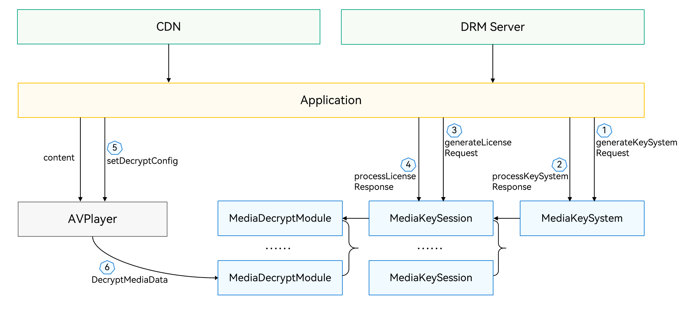

# DRM Kit 简介

开发者通过调用DRM Kit（Digital Right Managemrnt Kit，数字版权保护服务）提供的接口可以开发播放器应用，实现数字版权保护的基础操作，如设备证书管理、许可证管理、解密操作等；还可以通过接口参数配置完成更多操作，如软件安全解密、硬件安全解密等。

## 开发模型

数字版权保护（DRM）是一种保护数字内容版权的技术，该技术主要包含以下几个关键步骤：

- 内容加密：将数字内容进行加密，以防止未经授权的访问和复制。
- 密钥管理：管理和分配密钥，以确保只有授权用户能访问和解密内容。
- 身份认证：验证用户的身份，以确保有权限访问和使用内容。
- 内容验证：验证内容的完整性和来源，以确保它没有被未经授权的修改和复制。
- 策略管理：管理和实施数字版权保护策略，包括许可协议、使用条款和违约责任等。

数字版权保护技术的具体实现方式和技术细节会根据不同的内容类型、保护需求和应用场景有所不同。

数字版权保护的工作流程，可概括为设备证书管理、许可证管理和解密管理三部分。

- 客户端证书及私钥发布到Provision服务端，客户端在播放节目获取许可证前DRM插件检测到本地没有客户端证书或证书异常，抛出异常，启动在线证书下载流程。

- 客户端在处理完Provision响应后，创建许可证请求，许可证服务端将请求响应返回回来，通过客户端传到DRM插件进行解析。许可证包含在线和离线两种，支持状态检查、移除、获取许可证id等基本功能。

- DRM会话创建好后，由客户端应用将会话对象设置给解码器，通过DRM会话获取解密对象，解密对象支持内容解密等基本功能，包含解密模块的创建、销毁、查询是否需要安全加码器解码指定媒体类型数据、内容解密等。

了解数字版权保护工作流程后，建议开发者了解数字版权保护的开发模型，便于更好地开发带有数字版权保护功能的应用。

**图1** 数字版权保护开发模型  

播放器应用通过调用数字版权保护功能，实现设备证书管理、许可证管理、解密管理等基本操作。在实现基本操作过程中，先进行MediaKeySystem实例创建和设备证书申请与设置，其次进行会话实例创建和许可证申请与设置，等加密码流到达，通过底层的设备硬件接口（HDI，Hardware Device Interfaces）送到具体的DRM插件中进行解密。

## 相关实例

针对数字版权保护开发，有以下相关实例可供参考：

- [媒体管理合集（ArkTS）(Full SDK)（API11）](https://gitee.com/openharmony/applications_app_samples/tree/master/code/BasicFeature/FileManagement/MediaCollections)
