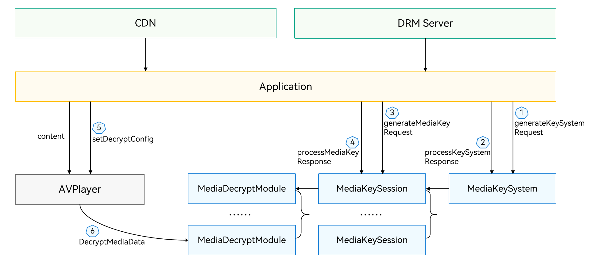

# DRM Kit 简介

DRM Kit（Digital Rights Management Kit，数字版权保护服务）提供了DRM加密节目授权解密的功能，包括DRM插件管理、DRM证书管理、DRM许可证管理、DRM节目授权、DRM节目解密等功能，可实现DRM解决方案的集成、DRM解决方案的证书下载、节目的授权及解密。

## 能力范围

通过DRM Kit，DRM解决方案集成方可以完成DRM解决方案的集成，应用开发者可以通过调用对应的DRM解决方案，实现DRM加密节目授权解密的功能，实现DRM节目的播放。

- DRM插件管理: 通过实现DRM Kit提供的DRM HDI接口，实现对不同的DRM解决方案的支持，一般由DRM解决方案集成方实现。

- DRM证书管理：支持DRM解决方案的设备证书的请求、处理，实现对应DRM解决方案的证书下载（Provision）功能。

- DRM许可证管理：支持离线许可证的请求、处理及删除等。

- DRM节目授权：支持在线许可证请求及处理、离线许可证的加载、媒体密钥状态查询，并支持按照DRM许可证的权限要求对DRM节目授权。

- DRM节目解密：支持的媒体协议：HLS、DASH；封装格式：MP4、TS；视频编码格式：H264<!--RP2--><!--RP2End-->；音频编码格式：AAC。

> **注意：**
>
> DRM证书管理、DRM许可证管理、DRM节目授权、DRM节目解密依赖对应的DRM解决方案的实现。应用开发者可以自行扩展支持的媒体协议、封装格式、视音频编码格式。

## 亮点/特征

- **支持许可证及解密会话管理**

  支持多MediaKeySession会话，并支持在会话中申请和设置许可证，将解密会话与许可证绑定。

- **支持安全视频通路**

  支持安全视频通路，实现安全解密、安全解码、安全渲染、安全输出等。DRM Kit仅提供安全解密接口的调用以实现安全解密，安全解密、安全解码、安全渲染、安全输出等依赖DRM解决方案及操作系统的实现。

## 基础概念

在开发前，需要先了解以下基础概念：

- DRM插件（DRM Plugin）

  集成于系统中，实现DRM HDI层接口的DRM解决方案驱动，实现DRM相关功能。
  
<!--RP1--><!--RP1End-->

- MediaKeySystem

  MediaKeySystem用于DRM证书管理及MediaKeySession管理。

- MediaKeySession

  MediaKeySession用于许可证管理及媒体节目解密，生命周期由MediaKeySystem管理。

- DRM信息（MediaKeySystemInfo）
  
  DRM节目加密的描述信息，包括DRM解决方案UUID及pssh数据等。

- pssh （Protection System Specific Header Box，内容保护系统专有头）

  DRM解决方案用于描述DRM节目如何加密的数据。

- DRM证书（DRM Certificate）

  DRM解决方案需要DRM证书才能正常工作，不同的DRM解决方案有不同的DRM证书。

- DRM证书下载（Provision）
  
  DRM解决方案采用DRM证书下载流程下载证书，不同DRM解决方案的证书下载流程不一样。如需要下载DRM证书，请参考DRM解决方案的实现要求。

- 许可证（License）
  
  DRM解决方案使用许可证实现对设备的DRM授权，一般许可证支持的权限控制策略有安全级别、输出控制、起始播放时间、结束播放时间等，不同的DRM解决方案采用的DRM许可证的格式不一样，支持的权限控制策略也不同。

- 视音频数据帧加密信息（cencinfo）
  
  视音频数据帧加密的描述信息，包括加密算法及模式、KeyId、IV、subsample信息等。

## 工作流程

DRM插件管理功能一般由DRM解决方案集成方实现<!--Del-->，具体可参考[DRM解决方案开发指导](drm-solution-dev-guide.md)<!--DelEnd-->。

应用集成DRM Kit工作流程如图所示。

工作流程主要包括：

1. 创建MediaKeySystem及MediaKeySession实例：应用获取节目的DRM信息，根据DRM信息中的解决方案UUID类型创建MediaKeySystem及MediaKeySession。应用可以通过业务提供的DRM描述得到节目的DRM信息，也可以根据Media Kit或AVCodec Kit抛出的mediaKeySystemInfoUpdate事件或MediaKeySystemInfo回调得到节目的DRM信息。

2. 证书下载：在创建MediaKeySession时，如无DRM证书或DRM证书异常，DRM Kit将抛出需下载DRM证书的事件（keySystemRequired），此时可以调用MediaKeySystem的证书下载相关接口完成证书下载。也可以根据DRM解决方案实现的要求，检查DRM证书状态，如无DRM证书或DRM证书异常，也可主动调用MediaKeySystem的证书下载相关接口完成证书下载。如DRM解决方案的证书正常或DRM解决方案无需应用下载证书，则跳过此步骤。

3. 许可证获取：应用根据DRM事件中的pssh数据调用MediaKeySession的许可证相关接口完成DRM许可证的请求、处理。

4. DRM节目解密：应用将MediaKeySession设置到Media Kit或AVCodec Kit，用于支持DRM节目解密。采用AVCodec Kit时，可以设置视音频数据帧的cencinfo，并设置到AVBuffer中，在调用PushInputBuffer的时候实现视音频数据帧的解密、解码。

5. 许可证更新或过期：在节目播放过程中，在许可证需要更新的情况下，MediaKeySession将抛出许可证更新事件（keyRequired），此时需要重新请求DRM许可证。MediaKeySession如抛出许可证过期事件（keyExpired），则需要停止DRM节目播放。