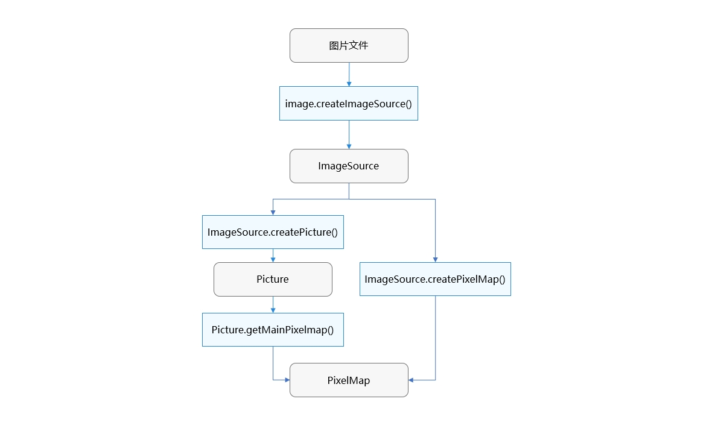
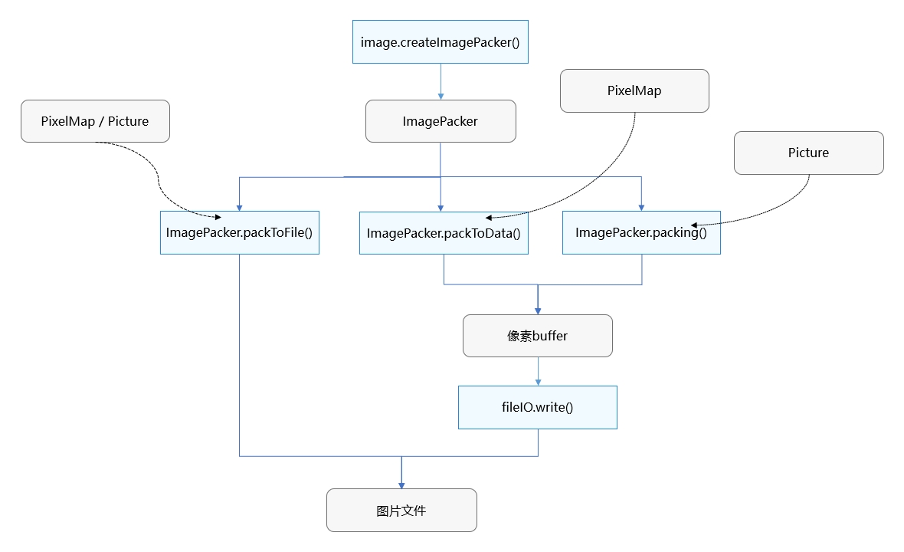

# Image Kit简介

开发者通过调用Image Kit（图片处理服务）提供的接口，可以对图片文件进行解析、处理、重新构造，主要涉及图片解码、图片编码、图片编辑和处理、图片接收。

## 亮点/特征

- 编解码支持HEIF、JPEG、PNG、WebP等主流图片格式。
- 支持HDR图片编解码，给用户带来更高质量的色彩体验，还可以使用AI能力将SDR图片展示出HDR效果。
- 提供丰富的图片编辑和处理的能力，包括：图像变换、位图操作、滤镜效果等。
- 采用了高效的算法和优化策略，提高了图片处理的速度和效率。

## 基础概念
在开发前，需要了解以下基础概念：

- 图片解码
  
  指将所支持格式的图片文件解码成统一的PixelMap，以便在应用或系统中进行图片显示或图片处理。

- PixelMap

  指图片解码后无压缩的位图对象，用于图片显示或图片处理。

- Picture
  
  多图对象，包含主图、辅助图和元数据。其中主图是一个PixelMap对象，包含了图像的大部分信息，用于图片显示或图片处理；辅助图用于存储与主图相关但不同的数据，展示图像更丰富的信息；元数据一般用来存储关于图像文件的信息。

- 图片编辑和处理

  对PixelMap进行相关的操作，如旋转、缩放、设置透明度、获取图片信息、读写像素数据等，操作时坐标系原点为左上角。

- 图片编码

  将PixelMap（或Picture）编码成不同格式的图片文件，用于后续处理，如保存、传输等。

## 使用方式

Image Kit提供了丰富的图片处理能力，开发者可按需灵活使用。既可以完整调用图片解码、编辑处理、重新编码的全流程；也可以图片解码后不做处理，直接将解码得到的PixelMap传给[Image组件](../../ui/arkts-graphics-display.md)显示。解码、编码过程中均提供了丰富的选项参数，可以满足各种实际开发场景的需求。

Image Kit支持对解码得到的PixelMap进行[位图操作](../image/image-pixelmap-operation.md)，对目标图片中的部分区域进行处理；实现[图像变换](../image/image-transformation.md)，可以对图片做裁剪、缩放、偏移、旋转、翻转、设置透明度等变换。

还可以通过[ImageEffect](../image/image-effect-guidelines.md)为图片添加滤镜效果；使用ImageProcessing进行图片细节增强，色彩空间转换以及处理HDR图片。

Image Kit还提供了读取和编辑图片EXIF信息的能力，可以获取和配置图片文件中的附加属性，如：宽、高、旋转方向等图片基本信息，光圈、焦距等图片拍照参数，经度、纬度等图片GPS信息等。

图片解码和图片编码的流程如图1和图2所示。图片解码得到的PixelMap可以直接用于图片显示、图片编辑和处理。

**图1** 图片解码流程示意图

**图2** 图片编码流程示意图

## 约束与限制

- **读写权限限制：**

  在图片处理中，可能需要使用用户图片，应用需要向用户申请对应的读写操作权限才能保证功能的正常运行，申请方式请参考[向用户申请授权](../../security/AccessToken/request-user-authorization.md)。

- **选择合适的C API接口：**
  
  Image Kit当前提供了两套C API接口，分别为[依赖于JS对象的C API](../../reference/apis-image-kit/image.md)和[不依赖于JS对象的C API](../../reference/apis-image-kit/_image___native_module.md)。
  - 依赖于JS对象的C接口
  
    这类接口可以完成图片编解码，图片接收器，处理图像数据等功能，相关示例代码可以参考[图片开发指导(依赖JS对象)(C/C++)](image-decoding-native.md)节点下的内容。开发者可查看[Image](../../reference/apis-image-kit/image.md)模块下的C API，确认API范围。这部分API在API 11之前发布，在后续的版本不再增加新功能，**不再推荐使用**。

  - 不依赖于JS对象的C接口
  
    这类接口除了提供上述图片框架基础功能，还可以完成多图编解码等新特性，相关开发指导请参考[图片开发指导(C/C++)](image-source-c.md)节点下的内容。开发者可查看[Image_NativeModule](../../reference/apis-image-kit/_image___native_module.md)模块下的C API，确认API范围。这部分API从API 12开始支持，并将持续演进，**推荐开发者使用**。

  > **注意：**
  > 两套C API不建议同时使用，在部分场景下存在不兼容的问题。

## 与相关Kit的关系

Image Kit提供图片编解码、图片接收、图片编辑和处理等能力，为Image组件、图库以及其他有图片相关需求的应用提供支撑。图片解码得到的PixelMap可以传给[Image组件](../../ui/arkts-graphics-display.md)显示。通过ImageReceiver（图片接收）可以实现[相机预览流二次处理](../camera/native-camera-preview-imageReceiver.md)。

## 相关实例

针对图片开发，有以下相关实例可供参考：

- [图片显示及处理（ArkTS）（API12）](https://gitee.com/openharmony/applications_app_samples/tree/master/code/BasicFeature/Media/Image)

- [图片显示（ArkTS）（API10）](https://gitee.com/openharmony/applications_app_samples/tree/master/code/BasicFeature/Media/ImageShow)

- [图片裁剪与分割（ArkTS）（API10）](https://gitee.com/openharmony/applications_app_samples/tree/master/code/SystemFeature/Media/GamePuzzle)
