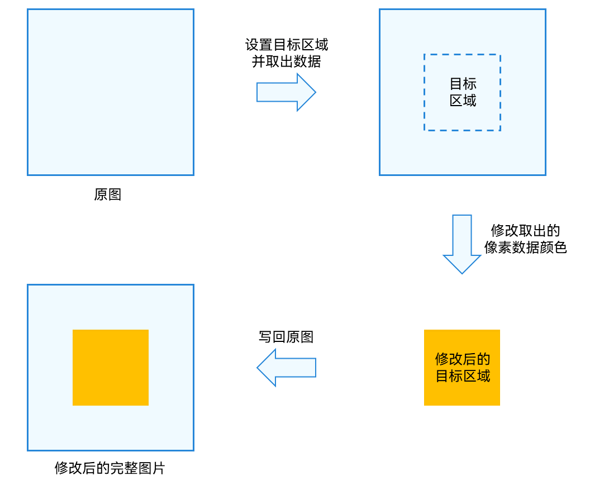

# 使用PixelMap完成位图操作
<!--Kit: Image Kit-->
<!--Subsystem: Multimedia-->
<!--Owner: @yaozhupeng-->
<!--Designer: @yaozhupeng-->
<!--Tester: @zhaoxiaoguang2-->
<!--Adviser: @w_Machine_cc-->

当需要对目标图片中的部分区域进行处理时，可以使用位图操作功能。此功能常用于图片美化等操作。

如下图所示，一张图片中，将指定的矩形区域像素数据读取出来，进行修改后，再写回原图片对应区域。

**图1** 位图操作示意图



## 开发步骤

位图操作相关API的详细介绍请参见[API参考](../../reference/apis-image-kit/arkts-apis-image-PixelMap.md)。

1. 完成[图片解码](image-decoding.md)，获取PixelMap位图对象。

2. 从PixelMap位图对象中获取信息。

   ```ts
   import { image } from '@kit.ImageKit';
   import { BusinessError } from '@kit.BasicServicesKit';
   // 获取图像像素的总字节数。
   let pixelBytesNumber : number = pixelMap.getPixelBytesNumber();
   // 获取图像像素每行字节数。
   let rowBytes : number = pixelMap.getBytesNumberPerRow();
   // 获取当前图像像素密度。像素密度是指每英寸图片所拥有的像素数量。像素密度越大，图片越精细。
   let density : number = pixelMap.getDensity();
   ```

3. 读取并修改目标区域像素数据，写回原图。
   > **说明：**
   > 建议readPixelsToBuffer和writeBufferToPixels成对使用，readPixels和writePixels成对使用，避免因图像像素格式不一致，造成PixelMap图像出现异常。

   ```ts
   import { image } from '@kit.ImageKit';
   import { BusinessError } from '@kit.BasicServicesKit';
   // 场景一：读取并修改整张图片数据。
   // 按照PixelMap的像素格式，读取PixelMap的图像像素数据，并写入缓冲区中。
   const buffer = new ArrayBuffer(pixelBytesNumber);
   pixelMap.readPixelsToBuffer(buffer).then(() => {
     console.info('Succeeded in reading image pixel data.');
   }).catch((error : BusinessError) => {
     console.error('Failed to read image pixel data. The error is: ' + error);
   })
   // 按照PixelMap的像素格式，读取缓冲区中的图像像素数据，并写入PixelMap。
   pixelMap.writeBufferToPixels(buffer).then(() => {
     console.info('Succeeded in writing image pixel data.');
   }).catch((error : BusinessError) => {
     console.error('Failed to write image pixel data. The error is: ' + error);
   })

   // 场景二：读取并修改指定区域内的图片数据。
   // 固定按照BGRA_8888格式，读取PixelMap指定区域内的图像像素数据，并写入PositionArea.pixels缓冲区中，该区域由PositionArea.region指定。
   const area : image.PositionArea = {
     pixels: new ArrayBuffer(8),
     offset: 0,
     stride: 8,
     region: { size: { height: 1, width: 2 }, x: 0, y: 0 }
   }
   pixelMap.readPixels(area).then(() => {
     console.info('Succeeded in reading the image data in the area.');
   }).catch((error : BusinessError) => {
     console.error('Failed to read the image data in the area. The error is: ' + error);
   })
   // 固定按照BGRA_8888格式，读取PositionArea.pixels缓冲区中的图像像素数据，并写入PixelMap指定区域内，该区域由PositionArea.region指定。
   pixelMap.writePixels(area).then(() => {
     console.info('Succeeded in writing the image data in the area.');
   }).catch((error : BusinessError) => {
     console.error('Failed to write the image data in the area. The error is: ' + error);
   })
   ```

## 开发示例-复制（深拷贝）新的PixelMap

1. 完成[图片解码](image-decoding.md)，获取PixelMap位图对象。

2. 复制（深拷贝）一个新的PixelMap。
   > **说明：**
   > 创建新PixelMap时，必须将`srcPixelFormat`指定为原PixelMap的像素格式，否则新PixelMap的图像会出现异常。

      ```ts
      /**
       *  复制（深拷贝）一个新的PixelMap
       *
       * @param pixelMap - 被复制的PixelMap。
       * @param desiredPixelFormat - 新PixelMap的像素格式。如果不指定，则仍使用原PixelMap的像素格式。
       * @returns 新PixelMap。
       **/
      clonePixelMap(pixelMap: PixelMap, desiredPixelFormat?: image.PixelMapFormat): PixelMap {
        // 获取当前PixelMap的图片信息。
        const imageInfo = pixelMap.getImageInfoSync();
        // 读取当前PixelMap的图像像素数据，并按照当前PixelMap的像素格式写入缓冲区数组。
        const buffer = new ArrayBuffer(pixelMap.getPixelBytesNumber());
        pixelMap.readPixelsToBufferSync(buffer);
        // 根据当前PixelMap的图片信息，生成初始化选项。
        const options: image.InitializationOptions = {
          // 当前PixelMap的像素格式。
          srcPixelFormat: imageInfo.pixelFormat,
          // 新PixelMap的像素格式。
          pixelFormat: desiredPixelFormat ?? imageInfo.pixelFormat,
          // 当前PixelMap的尺寸大小。
          size: imageInfo.size
        };
        // 根据初始化选项和缓冲区数组，生成新PixelMap。
        return image.createPixelMapSync(buffer, options);
      }
      ```

<!--RP1-->
<!--RP1End-->