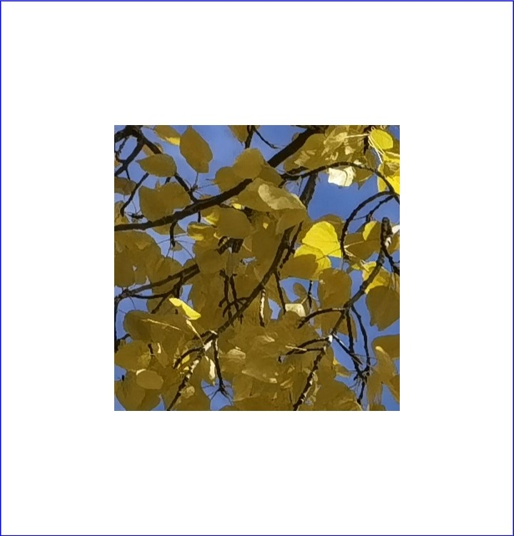
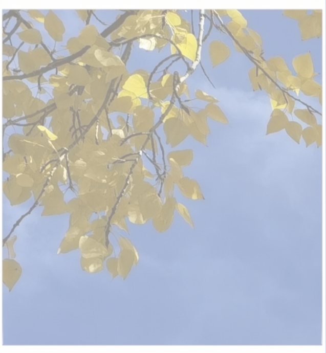

# 使用PixelMap完成图像变换

图片处理指对PixelMap进行相关的操作，如获取图片信息、裁剪、缩放、偏移、旋转、翻转、设置透明度、读写像素数据等。图片处理主要包括图像变换、[位图操作](image-pixelmap-operation.md)，本文介绍图像变换。

## 开发步骤

图像变换相关API的详细介绍请参见[API参考](../../reference/apis-image-kit/arkts-apis-image-PixelMap.md)。

1. 完成[图片解码](image-decoding.md)，获取PixelMap对象。

2. 获取图片信息。

   ```ts
   import { BusinessError } from '@kit.BasicServicesKit';
   // 获取图片大小。
   pixelMap.getImageInfo().then( (info : image.ImageInfo) => {
     console.info('info.width = ' + info.size.width);
     console.info('info.height = ' + info.size.height);
   }).catch((err : BusinessError) => {
     console.error("Failed to obtain the image pixel map information.And the error is: " + err);
   });
   ```

3. 进行图像变换操作。

   原图：

     

   - 裁剪

     ```ts
     // x：裁剪起始点横坐标0。
     // y：裁剪起始点纵坐标0。
     // height：裁剪高度400，方向为从上往下（裁剪后的图片高度为400）。
     // width：裁剪宽度400，方向为从左到右（裁剪后的图片宽度为400）。
     pixelMap.crop({x: 0, y: 0, size: { height: 400, width: 400 } });
     ```

     

   - 缩放

     ```ts
     // 宽为原来的0.5。
     // 高为原来的0.5。
     pixelMap.scale(0.5, 0.5);
     ```

     

   - 偏移

     ```ts
     // 向下偏移100。
     // 向右偏移100。
     pixelMap.translate(100, 100);
     ```

     

   - 旋转

     ```ts
     // 顺时针旋转90°。
     pixelMap.rotate(90);
     ```

     

   - 翻转

     ```ts
     // 垂直翻转。
     pixelMap.flip(false, true);
     ```

     

     ```ts
     // 水平翻转。
     pixelMap.flip(true, false);
     ```

     

   - 透明度

     ```ts
     // 透明度0.5。
     pixelMap.opacity(0.5);
     ```

     

<!--RP1-->
<!--RP1End-->