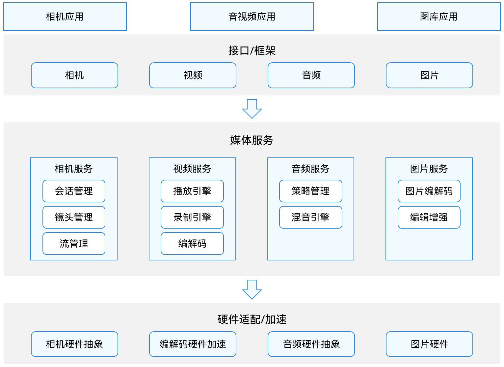

# 媒体应用开发概述

## 媒体系统架构

媒体系统提供用户视觉、听觉信息的处理能力，如音视频信息的采集、压缩存储、解压播放等。 在操作系统实现中，通常基于不同的媒体信息处理内容，将媒体划分为不同的模块，包括：音频、视频（也称播放录制）、相机、图片等。

如下图所示，媒体系统面向应用开发提供音视频应用、相机应用、图库应用的编程框架接口；面向设备开发提供对接不同硬件芯片适配加速功能；中间以服务形态提供媒体核心功能和管理机制。

**图1** 媒体系统整体框架  

- 音频（audio）：提供音量管理、音频路由管理、混音管理接口与服务。

- 视频（media）：提供音视频解压播放、压缩录制接口与服务。

- 相机（camera）：提供精确控制相机镜头，采集视觉信息的接口与服务。

- 图片（image）：提供图片编解码、图片处理接口与服务。

## 相关实例

针对媒体应用开发，有以下相关实例可供参考：

- [媒体管理合集（ArkTS）（Full SDK）(API9)](https://gitee.com/openharmony/applications_app_samples/tree/OpenHarmony-3.2-Release/code/BasicFeature/FileManagement/MediaCollections)

- [二维码扫描（ArkTS）（Full SDK）(API9)](https://gitee.com/openharmony/applications_app_samples/tree/OpenHarmony-3.2-Release/code/BasicFeature/Media/QRCodeScan)