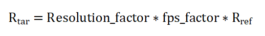

# 创建异步线程执行AVTranscoder视频转码(ArkTS)

在开发过程中，应用经常会创建异步线程执行视频压缩任务以满足不同诉求，主要包括：

- 节省存储空间。

  高清视频文件通常存储空间占用大，几分钟的视频就可能占用数GB的存储空间。视频压缩可以显著减小文件大小，节省存储空间。

- 提高设备兼容性。

  不同设备所支持播放的视频格式各不相同。视频转码可以将源视频格式转换成设备支持的常用格式，以满足不同设备的播放需求，从而提高视频文件的设备兼容性。

## 基础概念

视频的码率（Bitrate）和分辨率（宽×高）是影响视频画质和文件大小的两个关键因素。它们之间的关系并非简单的线性对应，而是受到编码效率、内容复杂度等多种因素的共同影响。

- **码率（Bitrate）和分辨率（宽×高）的基本概念**
  - 码率：指的是单位时间内视频流的数据量（单位：Kbps 或 Mbps）。1 Mbps =  1,000,000 bit/s（1,000,000比特每秒）。
  
    码率越高，单位时间内传输的数据越多，潜在画质更高，但文件体积也更大。

  - 分辨率：指视频画面的像素数量（例如 1920×1080）。

    分辨率越高，像素数量越多，画面细节更加清晰，但需要处理的数据量也更大。

- **码率和分辨率的关系**
  - 直观关系

    在相同编码效率和内容复杂度的情况下，分辨率越大，则需要分配越高的码率以保持画质。如果所分配的码率不足，编码器会通过压缩（如丢弃细节、增加块效应）来降低数据量。

  - 公式参考（经验法则）
    - 码率正比于 分辨率宽×分辨率高×帧率×复杂度系数
    - 复杂度系数与视频内容的动态程度相关，例如静态画面（例如讲座视频）低复杂度系数，可以较低码率保持清晰，动态画面（例如体育比赛）高复杂度系数，需要更高的码率。

- **编码效率的影响**

  不同的编码标准（如 H.264、H.265、AV1）具有不同的压缩效率：
  - 高效编码器（如 H.265）在相同分辨率和画质下，码率可比 H.264 降低约50%。
  - 低效编码器（如 MJPEG）需要更高的码率以避免画质损失。

## 选择合适的码率和分辨率

- **码率转换**
  
  输入：源视频的宽w<sub>ref</sub>、高h<sub>ref</sub>、帧率fps<sub>ref</sub>、码率R<sub>ref</sub>；目标视频的宽w<sub>tar</sub>、高h<sub>tar</sub>、帧率fps<sub>tar</sub>。
  
  输出：目标视频的码率R<sub>tar</sub>。

  计算过程：

  

  分辨率和帧率的系数由以下经验公式计算可得。

  

  
  
  上述计算帧率的公式y=clip(0.5, 2, x)表示：如果x∈[0.5, 2.0]，取y=x；如果x＜0.5，取y=0.5；如果x＞2.0，取y=2.0。

- **码率计算**

  选定一个baseline的码率，例如720P/30fps的视频，码率默认3Mbps，记为V0。
  如果要对视频V1做转码，输出视频为V2，可以按如下过程计算：
  1. 带入(V0,V2)，得到估计码率为R2。
  2. 带入(V1,V2)，得到估计码率为R2'。
  取二者最小值，以确保目标码率比源视频有所降低。

- **分辨率设置参考（以H.264为例）**

  |  分辨率 | 动态内容（如游戏） |  中等动态（如电影） | 静态内容（如幻灯片）  |
  | :------------ | :------------ | :------------ | :------------ |
  | 720p(1280 × 720)  | 3.5–5 Mbps  | 2.5–4 Mbps  |  1–2 Mbps |
  | 1080p(1920 × 1080)  |  6–8 Mbps | 4–6 Mbps  | 2–3 Mbps  |
  | 4K(3840 × 2160)  | 25–35 Mbps  |  15–25 Mbps |  10–15 Mbps |

- **转换样例**

    场景一：假设要转码一个分辨率1280×720，30fps的视频，码率为1Mbps，这是画质相对比较良好的视频。需要将视频转码为分辨率640×480，30fps的视频，码率应该设置为463,463bps。计算如下：

    Resolution_factor = 0.463463

    fps_factor = 1

    R<sub>tar</sub> = 463,463bps

    场景二：假设要转码一个分辨率1280×720，30fps的视频，码率为1Mbps的视频。需要将视频转码为码率为600,000bps，30fps的视频，分辨率应该设置为888×500。计算如下：

    fps_factor = 1

    R<sub>tar</sub> = 600,000bps

    Resolution_factor = 0.482029

## 视频转码压缩开发样例

```ts
import { media } from '@kit.MediaKit';
import { BusinessError } from '@kit.BasicServicesKit';
import { common } from '@kit.AbilityKit';
export class AVTranscoderDemo {
    private avTranscoder: media.AVTranscoder | undefined = undefined;
    private avConfig: media.AVTranscoderConfig = {
        // audioBitrate: 100000, // 音频比特率。
        // audioCodec: media.CodecMimeType.AUDIO_AAC, // 音频编码格式。
        fileFormat: media.ContainerFormatType.CFT_MPEG_4, // 封装格式。
        videoBitrate: 1000000, // 视频比特率。
        videoCodec: media.CodecMimeType.VIDEO_AVC, // 视频编码格式。
        videoFrameWidth: 1280, // 视频分辨率的宽。
        videoFrameHeight: 720  // 视频分辨率的高。
    };
    // 注册avTranscoder回调函数。
    setAVTranscoderCallback() {
        if (canIUse("SystemCapability.Multimedia.Media.AVTranscoder")) {
            if (this.avTranscoder != undefined) {
                // 转码完成回调函数。
                this.avTranscoder.on('complete', async () => {
                    console.log(`AVTranscoder is completed`);
                    await this.releaseTranscoderingProcess();
                });
                // 错误上报回调函数。
                this.avTranscoder.on('error', (err: BusinessError) => {
                    console.error(`AVTranscoder failed, code is ${err.code}, message is ${err.message}`);
                });
            }
        }
    }
    // 开始转码对应的流程。
    async startTranscoderingProcess() {
        if (canIUse("SystemCapability.Multimedia.Media.AVTranscoder")) {
            if (this.avTranscoder != undefined) {
                await this.avTranscoder.release();
                this.avTranscoder = undefined;
            }
            // 1.创建转码实例。
            this.avTranscoder = await media.createAVTranscoder();
            this.setAVTranscoderCallback();
            // 2.获取转码源文件fd和目标文件fd赋予avTranscoder；参考FilePicker文档。
            let context = getContext(this) as common.UIAbilityContext;
            let fileDescriptor = await context.resourceManager.getRawFd('H264_AAC.mp4');
            this.avTranscoder.fdSrc = fileDescriptor;
            this.avTranscoder.fdDst = 55;
            // 3.配置转码参数完成准备工作。
            await this.avTranscoder.prepare(this.avConfig);
            // 4.开始转码。
            await this.avTranscoder.start();
        }
    }
    // 暂停转码对应的流程。
    async pauseTranscoderingProcess() {
        if (canIUse("SystemCapability.Multimedia.Media.AVTranscoder")) {
            if (this.avTranscoder != undefined) { // 仅在调用start返回后调用pause为合理调用。
                await this.avTranscoder.pause();
            }
        }
    }
    // 恢复对应的转码流程。
    async resumeTranscoderingProcess() {
        if (canIUse("SystemCapability.Multimedia.Media.AVTranscoder")) {
            if (this.avTranscoder != undefined) { // 仅在调用pause返回后调用resume为合理调用。
                await this.avTranscoder.resume();
            }
        }
    }
    // 释放转码流程。
    async releaseTranscoderingProcess() {
        if (canIUse("SystemCapability.Multimedia.Media.AVTranscoder")) {
            if (this.avTranscoder != undefined) {
                // 1.释放转码实例。
                await this.avTranscoder.release();
                this.avTranscoder = undefined;
                // 2.关闭转码目标文件fd。
            }
        }
    }
    // 一个完整的【开始转码-暂停转码-恢复转码-转码完成】示例。
    async avTranscoderDemo() {
        await this.startTranscoderingProcess(); // 开始转码。
        await this.pauseTranscoderingProcess(); //暂停转码。
        await this.resumeTranscoderingProcess(); // 恢复转码。
        await this.releaseTranscoderingProcess(); // 释放转码。
    }
}
```

具体如何使用转码能力，对视频进行转码以及压缩，可以参见文档：[用AVTranscoder实现视频转码](using-avtranscoder-for-transcodering.md)。

## 使用异步线程的方式进行转码

本示例使用的是worker线程的方式来实现异步线程进行转码，worker线程的详细使用方式，可以参见文档:

- [Worker线程使用说明](../../reference/apis-arkts/js-apis-worker.md)
- [Worker简介](../../arkts-utils/worker-introduction.md)

### 开发步骤

1. 引入头文件，创建worker线程，并注册回调。

   ```ts
   import { ErrorEvent, MessageEvents, worker } from '@kit.ArkTS'
   import { SendableObject } from '../util/SendableObject';
   import { common, sendableContextManager } from '@kit.AbilityKit';
   ```

   ```ts
   // 创建Worker对象
   this.workerInstance = new worker.ThreadWorker('entry/ets/workers/task.ets');

   // 注册onmessage回调，当宿主线程接收到来自其创建的Worker通过workerPort.postMessage接口发送的消息时被调用，
   // 在宿主线程执行
   this.workerInstance.onmessage = (e: MessageEvents) => {
       let data: string = e.data;
       console.info("workerInstance onmessage is: ", data);
       if (data == 'complete') {
           console.info("complete: ", data);
           this.workerInstance?.terminate();
       }
   }

   // 注册onErrors回调，可以捕获Worker线程的onmessage回调、timer回调以及文件执行等流程产生的全局异常，在宿主线程执行
   this.workerInstance.onerror = (err: ErrorEvent) => {
       console.info("workerInstance onerror message is: " + err.message);
   }

   // 注册onmessageerror回调，当Worker对象接收到一条无法被序列化的消息时被调用，在宿主线程执行
   this.workerInstance.onmessageerror = () => {
       console.info('workerInstance onmessageerror');
   }

   // 注册onexit回调，当Worker销毁时被调用，在宿主线程执行
   this.workerInstance.onexit = (e: number) => {
       // 当Worker正常退出时code为0，异常退出时code为1
       console.info("workerInstance onexit code is: ", e);
   }
   ```

2. 创建参数对象，向worker线程发送参数对象。

   如下是参数对象模型：

    ```ts
    import { sendableContextManager } from '@kit.AbilityKit';

    @Sendable
    export class SendableObject {
        constructor(sendableContext: sendableContextManager.SendableContext, data: string = '') {
            this.sendableContext = sendableContext;
            this.data = data;
        }

        private sendableContext: sendableContextManager.SendableContext;
        private data: string;

        public getSendableContext() {
            return this.sendableContext;
        }

        public getData() {
            return this.data;
        }
    }
    ```

    如下是发送参数的逻辑：

    ```ts
    // 向Worker线程发送消息
    const context:common.Context = await getContext();
    const sendableContext: sendableContextManager.SendableContext = sendableContextManager.convertFromContext(context);
    const sendableObject: SendableObject = new SendableObject(sendableContext, "some information");
    this.workerInstance.postMessageWithSharedSendable(sendableObject);
    ```

3. worker线程接收参数，并且执行转码的逻辑。

   worker线程接收参数：

    ```ts
    //worker线程接收参数
    const sendableObject: SendableObject = event.data;
    const sendableContext: sendableContextManager.SendableContext =
    sendableObject.getSendableContext() as sendableContextManager.SendableContext;
    const context: common.Context =
    sendableContextManager.convertToContext(sendableContext) as common.Context;
    //执行转码逻辑
    await doSome(context);
    // 向主线程发送消息
    workerPort.postMessage('start end');
    ```

    执行转码逻辑：

    ```ts
    async function doSome(context: common.Context) {
        console.info(`doSome in`);
        try {
            let transcoder = await media.createAVTranscoder();
            // 转码完成回调函数
            transcoder.on('complete', async () => {
                console.info(`transcode complete`);
                await transcoder?.release()
                workerPort.postMessage('complete');
            })
            // 转码错误回调函数
            transcoder.on('error', async (err: BusinessError) => {
                await transcoder?.release();
            })
            // 转码进度更新
            transcoder.on('progressUpdate', (progress: number) => {
            })

            let fileDescriptor = await context.resourceManager.getRawFd('3.mkv');
            transcoder.fdSrc = fileDescriptor;
            let fdPath = context.filesDir + "/" + "VID_" + Date.parse(new Date().toString()) + ".mp4";
            let file = fs.openSync(fdPath, fs.OpenMode.READ_WRITE | fs.OpenMode.CREATE);
            let fd = file.fd;
            console.info(`file fd ${fd}`);
            transcoder.fdDst = file.fd;

            let config: media.AVTranscoderConfig = {
                // audioBitrate: 200000,
                // audioCodec: media.CodecMimeType.AUDIO_AAC,
                fileFormat: media.ContainerFormatType.CFT_MPEG_4,
                videoBitrate: 200000,
                videoCodec: media.CodecMimeType.VIDEO_AVC,
                videoFrameWidth: 640,
                videoFrameHeight: 480,
            }
            await transcoder?.prepare(config);
            await transcoder?.start();
        } catch (e) {
            console.info(`error :  ${e}`);
        }
    }
    ```

4. 监听转码的Complete回调，在转码结束的时候向主线程发送消息。

    ```ts
    transcoder.on('complete', async () => {
        console.info(`transcode complete`);
        await transcoder?.release()
        //向主线程发送转码结束的消息
        workerPort.postMessage('complete');
    })
    ```

5. 主线程接收到worker线程转码结束的信息，销毁worker线程。

   ```ts
   // 注册onmessage回调，当宿主线程接收到来自其创建的Worker通过workerPort.postMessage接口发送的消息时被调用，在宿主线程执行
       this.workerInstance.onmessage = (e: MessageEvents) => {
           let data: string = e.data;
           console.info("workerInstance onmessage is: ", data);
           if (data == 'complete') {
               console.info("complete: ", data);
               this.workerInstance?.terminate();
           }
       }
   ```

### 整体核心代码

**Index.ets(src/main/ets/pages/Index.ets)**

```ts
import { ErrorEvent, MessageEvents, worker } from '@kit.ArkTS'
import { SendableObject } from '../util/SendableObject';
import { common, sendableContextManager } from '@kit.AbilityKit';

@Entry
@Component
struct Index {
    private workerInstance?: worker.ThreadWorker;

    build() {
        RelativeContainer() {
        Button('启动转码')
            .onClick(async () => {
                console.info(`Button put`);
                await this.startWorker();
            })
            .alignRules({
                center: { anchor: '__container__', align: VerticalAlign.Center },
                middle: { anchor: '__container__', align: HorizontalAlign.Center }
            })
        }
        .height('100%')
        .width('100%')
    }

    async startWorker() {
        // 创建Worker对象
        this.workerInstance = new worker.ThreadWorker('entry/ets/workers/task.ets');

        // 注册onmessage回调，当宿主线程接收到来自其创建的Worker通过workerPort.postMessage接口发送的消息时被调用，
        // 在宿主线程执行
        this.workerInstance.onmessage = (e: MessageEvents) => {
            let data: string = e.data;
            console.info("workerInstance onmessage is: ", data);
            if (data == 'complete') {
                console.info("complete: ", data);
                this.workerInstance?.terminate();
            }
        }

        // 注册onErrors回调，可以捕获Worker线程的onmessage回调、timer回调以及文件执行等流程产生的全局异常，
        // 在宿主线程执行
        this.workerInstance.onerror = (err: ErrorEvent) => {
            console.info("workerInstance onerror message is: " + err.message);
        }

        // 注册onmessageerror回调，当Worker对象接收到一条无法被序列化的消息时被调用，在宿主线程执行
        this.workerInstance.onmessageerror = () => {
            console.info('workerInstance onmessageerror');
        }

        // 注册onexit回调，当Worker销毁时被调用，在宿主线程执行
        this.workerInstance.onexit = (e: number) => {
            // 当Worker正常退出时code为0，异常退出时code为1
            console.info("workerInstance onexit code is: ", e);
        }

        // 向Worker线程发送消息
        const context:common.Context = await getContext();
        const sendableContext: sendableContextManager.SendableContext = sendableContextManager.convertFromContext(context);
        const sendableObject: SendableObject = new SendableObject(sendableContext, "some information");
        this.workerInstance.postMessageWithSharedSendable(sendableObject);
    }
}
```

**SendableObject.ets(src/main/ets/util/SendableObject.ets)**

```ts
import { sendableContextManager } from '@kit.AbilityKit';

//发送的参数必须加上@Sendable标注
@Sendable
export class SendableObject {
    constructor(sendableContext: sendableContextManager.SendableContext, data: string = '') {
        this.sendableContext = sendableContext;
        this.data = data;
    }

    private sendableContext: sendableContextManager.SendableContext;
    private data: string;

    public getSendableContext() {
        return this.sendableContext;
    }

    public getData() {
        return this.data;
    }
}
```

**task.ets(src/main/ets/workers/task.ets)**

```ts
import { ErrorEvent, MessageEvents, ThreadWorkerGlobalScope, worker } from '@kit.ArkTS';
import { media } from '@kit.MediaKit';
import { BusinessError } from '@kit.BasicServicesKit';
import fs from '@ohos.file.fs';
import { SendableObject } from '../util/SendableObject';
import { common, sendableContextManager } from '@kit.AbilityKit';

const workerPort: ThreadWorkerGlobalScope = worker.workerPort;

workerPort.onmessage = async (event: MessageEvents) => {
    console.info(`onmessage in`);
    //worker线程接收参数
    const sendableObject: SendableObject = event.data;
    const sendableContext: sendableContextManager.SendableContext =
        sendableObject.getSendableContext() as sendableContextManager.SendableContext;
    const context: common.Context =
        sendableContextManager.convertToContext(sendableContext) as common.Context;
    //执行转码逻辑
    await doSome(context);
    // 向主线程发送消息
    workerPort.postMessage('start end');
};

workerPort.onmessageerror = (event: MessageEvents) => {
    console.info('workerPort onmessageerror');
};

workerPort.onerror = (event: ErrorEvent) => {
    console.info('workerPort onerror err is: ', event.message);
};

async function doSome(context: common.Context) {
    console.info(`doSome in`);
    try {
        let transcoder = await media.createAVTranscoder();
        // 转码完成回调函数
        transcoder.on('complete', async () => {
            console.info(`transcode complete`);
            await transcoder?.release()
            //向主线程发送转码结束的消息
            workerPort.postMessage('complete');
        })
        // 转码错误回调函数
        transcoder.on('error', async (err: BusinessError) => {
            await transcoder?.release();
        })
        // 转码进度更新
        transcoder.on('progressUpdate', (progress: number) => {
        })
        // 读取rawfile目录下的原始文件
        let fileDescriptor = await context.resourceManager.getRawFd('3.mkv');
        transcoder.fdSrc = fileDescriptor;
        let fdPath = context.filesDir + "/" + "VID_" + Date.parse(new Date().toString()) + ".mp4";
        let file = fs.openSync(fdPath, fs.OpenMode.READ_WRITE | fs.OpenMode.CREATE);
        let fd = file.fd;
        console.info(`file fd ${fd}`);
        transcoder.fdDst = file.fd;

        let config: media.AVTranscoderConfig = {
            fileFormat: media.ContainerFormatType.CFT_MPEG_4,
            audioCodec: media.CodecMimeType.AUDIO_AAC,
            videoCodec: media.CodecMimeType.VIDEO_AVC,
            videoBitrate: 200000,
            videoFrameWidth: 640,
            videoFrameHeight: 480,
        }
        await transcoder?.prepare(config);
        await transcoder?.start();
    } catch (e) {
        console.info(`error :  ${e}`);
    }
}
```

**build-profile.json5(build-profile.json5)**

```json
{
    "apiType": "stageMode",
    "buildOption": {
        "sourceOption": {
            "workers": [
                "./src/main/ets/workers/task.ets",
            ]
        }
    },
    "buildOptionSet": [
        {
            "name": "release",
            "arkOptions": {
                "obfuscation": {
                    "ruleOptions": {
                        "enable": false,
                        "files": [
                        "./obfuscation-rules.txt"
                        ]
                    }
                }
            }
        },
    ],
    "targets": [
        {
            "name": "default"
        },
        {
            "name": "ohosTest",
        }
    ]
}
```
