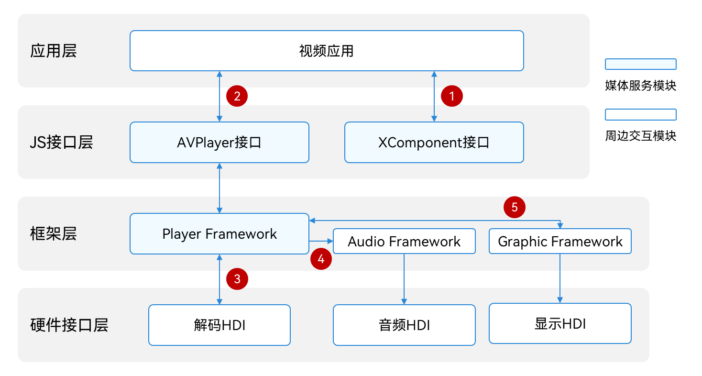
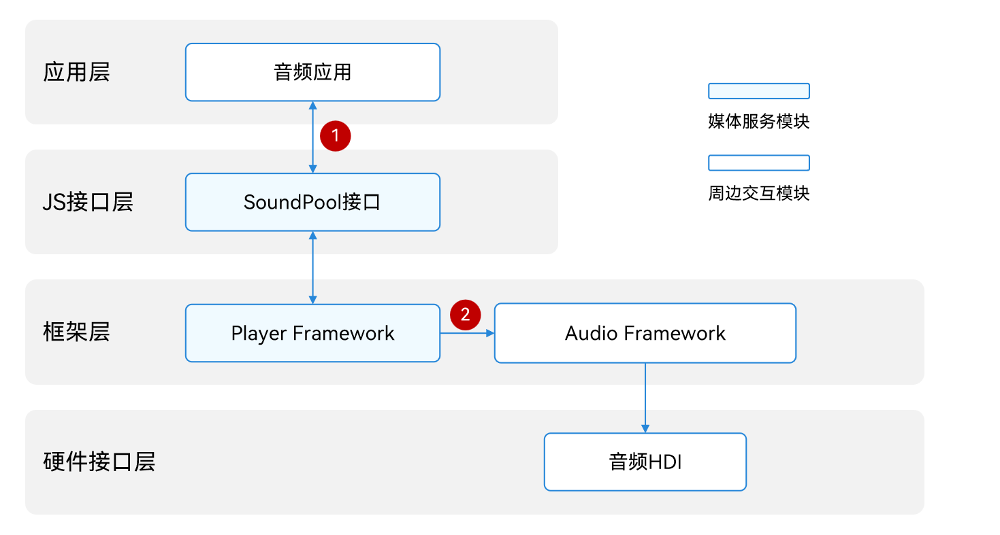
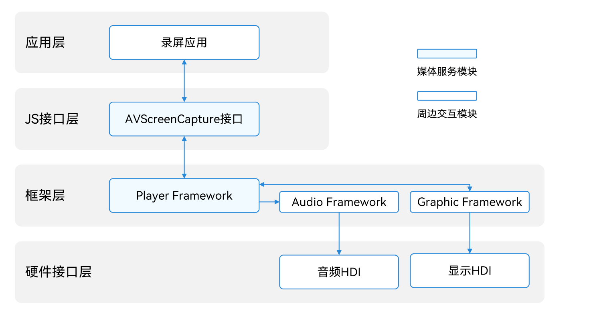

# Media Kit简介

Media Kit（媒体服务）用于开发音视频播放或录制的各类功能。在Media Kit的开发指导中，将详细介绍音视频多个模块的开发方式，指导开发者如何使用系统提供的音视频API实现对应功能。比如使用SoundPool实现简单的提示音，当设备接收到新消息时，会发出短促的“滴滴”声；使用AVPlayer实现音乐播放器，循环播放一首音乐。

Media Kit提供的模块有：

- [AVPlayer](#avplayer)：播放音视频
- [SoundPool](#soundpool)：播放短音频
- [AVRecorder](#avrecorder)：录制音视频
- [AVScreenCapture](#avscreencapture)：录制屏幕
- [AVMetadataExtractor](#avmetadataextractor)：获取音视频元数据
- [AVImageGenerator](#avimagegenerator)：获取视频缩略图
- [AVTranscoder](#avtranscoder)：视频转码

## 亮点/特征

- 使用轻量媒体引擎
  
   使用较少的系统资源（线程、内存），可支持音视频播放/录制，支持pipeline灵活拼装，支持插件化扩展source/demuxer/codec。

- 支持HDR视频

   系统原生数据结构与接口支持hdr vivid的采集与播放，方便三方应用在业务中使用系统的HDR能力，为用户带来更炫彩的体验。

- 支持音频池

   针对开发中常用的短促音效播放场景，如相机快门音效、系统通知音效等，应用可调用SoundPool，实现一次加载，多次低时延播放。

## 开发说明

本开发指导仅针对音视频播放或录制本身，由media模块提供相关能力，不涉及UI界面、图形处理、媒体存储或其他相关领域功能。

在开发音乐、视频播放功能之前，建议了解流媒体播放的相关概念包括但不限于：

- 播放过程：网络协议 &gt; 容器格式 &gt; 音视频编解码 &gt; 图形/音频渲染

- 网络协议：比如HLS、HTTP-FLV、HTTP/HTTPS

- 容器格式：比如mp4、mkv、mpeg-ts

- 编码格式：比如h264/h265

详细流媒体开发流程请参考[流媒体播放开发指导](streaming-media-playback-development-guide.md)。

## AVPlayer

AVPlayer主要工作是将Audio/Video媒体资源（比如mp4/mp3/mkv/mpeg-ts等）转码为可供渲染的图像和可听见的音频模拟信号，并通过输出设备进行播放。

AVPlayer提供功能完善一体化播放能力，应用只需要提供流媒体来源，不负责数据解析和解码就可达成播放效果。

### 音频播放

当使用AVPlayer开发音乐应用播放音频时，AVPlayer与外部模块的交互关系如图所示。

音乐类应用通过调用JS接口层提供的AVPlayer接口实现相应功能时，框架层会通过播放服务（Player Framework）将资源解析成音频数据流（PCM），音频数据流经过软件解码后输出至音频服务（Audio Framework），由音频服务输出至音频驱动渲染，实现音频播放功能。完整的音频播放需要应用、Player Framework、Audio Framework、音频HDI共同实现。

上图中，数字标注表示需要数据与外部模块的传递。

1. 音乐应用将媒体资源传递给AVPlayer接口。

2. Player Framework将音频PCM数据流输出给Audio Framework，再由Audio Framework输出给音频HDI。

### 视频播放

当使用AVPlayer开发视频应用播放视频时，AVPlayer与外部模块的交互关系如图所示。

应用通过调用JS接口层提供的AVPlayer接口实现相应功能时，框架层会通过播放服务（Player Framework）解析成单独的音频数据流和视频数据流，音频数据流经过软件解码后输出至音频服务（Audio Framework），再至硬件接口层的音频HDI，实现音频播放功能。视频数据流经过硬件（推荐）/软件解码后输出至图形渲染服务（Graphic Framework），再输出至硬件接口层的显示HDI，完成图形渲染。

完整的视频播放需要：应用、XComponent、Player Framework、Graphic Framework、Audio Framework、显示HDI和音频HDI共同实现。

图中的数字标注表示需要数据与外部模块的传递。

1. 应用从XComponent组件获取窗口SurfaceID，获取方式参考[XComponent](../../reference/apis-arkui/arkui-ts/ts-basic-components-xcomponent.md)。

2. 应用把媒体资源、SurfaceID传递给AVPlayer接口。

3. Player Framework把视频ES数据流输出给解码HDI，解码获得视频帧（NV12/NV21/RGBA）。

4. Player Framework把音频PCM数据流输出给Audio Framework，Audio Framework输出给音频HDI。

5. Player Framework把视频帧（NV12/NV21/RGBA）输出给Graphic Framework，Graphic Framework输出给显示HDI。

### 支持的格式与协议

推荐使用以下主流的播放格式，音视频容器、音视频编码属于内容创作者所掌握的专业领域，不建议应用开发者自制码流进行测试，以免产生无法播放、卡顿、花屏等兼容性问题。若发生此类问题不会影响系统，退出播放即可。

支持的协议如下：

| 协议类型 | 协议描述 | 
| -------- | -------- |
| 本地点播 | 协议格式：支持file&nbsp;descriptor，禁止file&nbsp;path |
| 网络点播 | 协议格式：支持http/https/hls/dash |
| 网络直播 | 协议格式：支持hls/http-flv |

支持的音频播放格式如下：

| 音频容器规格 | 规格描述 | 
| -------- | -------- |
| m4a | 音频格式：AAC | 
| aac | 音频格式：AAC | 
| mp3 | 音频格式：MP3 | 
| ogg | 音频格式：VORBIS | 
| wav | 音频格式：PCM | 
| amr | 音频格式：AMR | 

<!--Del-->
> **说明：**
> 
> 视频播放支持的视频格式分为必选规格和可选规格。必选规格为所有厂商均支持的视频格式。对于可选规格，厂商将基于实际情况决定是否实现。建议开发者做对应的兼容处理，保证应用功能全平台兼容。

| 视频格式 | 是否必选规格 |
| -------- | -------- |
| H26510+      | 是 |
| H264      | 是 |
<!--DelEnd-->

支持的视频播放格式和主流分辨率如下：

| 视频容器规格 | 规格描述 | 分辨率 | 
| -------- | -------- | -------- |
| mp4 | 视频格式：H26510+/H264 音频格式：AAC/MP3 | 主流分辨率，如4K/1080P/720P/480P/270P |
| mkv | 视频格式：H26510+/H264 音频格式：AAC/MP3 | 主流分辨率，如4K/1080P/720P/480P/270P |
| ts | 视频格式：H26510+/H264 音频格式：AAC/MP3 | 主流分辨率，如4K/1080P/720P/480P/270P |

支持的字幕格式如下：

| 字幕容器规格 | 支持的协议 | 支持的加载方式 |
| -------- | -------- | -------- |
| srt | 本地点播(fd)/网络点播(http/https/hls/dash) | 外挂字幕 |
| vtt | 本地点播(fd)/网络点播(http/https/hls/dash) | 外挂字幕 |
| webvtt | 网络点播(dash协议) | 内置字幕 |

> **说明：**
> 
> 当dash协议存在内置字幕时，不支持添加外挂字幕。

## SoundPool

SoundPool主要工作是将音频媒体资源（比如mp3/m4a/wav等）转码为音频模拟信号，并通过输出设备进行播放。

SoundPool提供短音频的播放能力，应用只需要提供音频资源来源，不负责数据解析和解码就可达成播放效果。

当使用SoundPool开发应用播放音频时，SoundPool与外部模块的交互关系如图所示。

音乐类应用通过调用JS接口层提供的SoundPool接口实现相应功能时，框架层会通过播放服务（Player Framework）将资源解析成音频数据流（PCM），音频数据流经过软件解码后输出至音频服务（Audio Framework），由音频服务输出至音频驱动渲染，实现音频播放功能。完整的音频播放需要应用、Player Framework、Audio Framework、音频HDI共同实现。

图中的数字标注表示需要数据与外部模块的传递。

1. 音乐应用将媒体资源传递给SoundPool接口。

2. Player Framework将音频PCM数据流输出给Audio Framework，再由Audio Framework输出给音频HDI。

### 支持的格式与协议

推荐使用以下主流的播放格式，音视容器、音频编码属于内容创作者所掌握的专业领域，不建议应用开发者自制码流进行测试，以免产生无法播放、卡顿等兼容性问题。若发生此类问题不会影响系统，退出播放即可。

支持的协议如下：

| 协议类型 | 协议描述 | 
| -------- | -------- |
| 本地点播 | 协议格式：支持file&nbsp;descriptor，禁止file&nbsp;path |

支持的音频播放格式如下：

| 音频容器规格 | 规格描述 | 
| -------- | -------- |
| m4a | 音频格式：AAC | 
| aac | 音频格式：AAC | 
| mp3 | 音频格式：MP3 | 
| ogg | 音频格式：VORBIS | 
| wav | 音频格式：PCM | 

## AVRecorder

AVRecorder主要工作是捕获音频信号，接收视频信号，完成音视频编码并保存到文件中，帮助开发者轻松实现音视频录制功能，包括开始录制、暂停录制、恢复录制、停止录制、释放资源等功能控制。它允许调用者指定录制的编码格式、封装格式、文件路径等参数。

当使用AVRecorder开发应用录制视频时，AVRecorder与外部模块的交互关系如图所示。

- 音频录制：应用通过调用JS接口层提供的AVRecorder接口实现音频录制时，框架层会通过录制服务（Player Framework），调用音频服务（Audio Framework）通过音频HDI捕获音频数据，通过软件编码封装后保存至文件中，实现音频录制功能。

- 视频录制：应用通过调用JS接口层提供的AVRecorder接口实现视频录制时，先通过Camera接口调用相机服务（Camera Framework）通过视频HDI捕获图像数据送至框架层的录制服务，录制服务将图像数据通过视频编码HDI编码，再将编码后的图像数据封装至文件中，实现视频录制功能。

通过音视频录制组合，可分别实现纯音频录制、纯视频录制、音视频录制。

图中的数字标注表示需要数据与外部模块的传递。

1. 应用通过AVRecorder接口从录制服务获取SurfaceID。

2. 应用将SurfaceID设置给相机服务，相机服务可以通过SurfaceID获取到Surface。相机服务通过视频HDI捕获图像数据送至框架层的录制服务。

3. 相机服务通过Surface将视频数据传递给录制服务。

4. 录制服务通过视频编码HDI模块将视频数据编码。

5. 录制服务将音频参数设置给音频服务，并从音频服务获取到音频数据。

### 支持的格式

支持的音频源如下：

| 音频源类型 | 说明 | 
| -------- | -------- |
| mic | 系统麦克风作为音频源输入。 | 

支持的视频源如下：

| 视频源类型 | 说明 | 
| -------- | -------- |
| surface_yuv | 输入surface中携带的是raw&nbsp;data。 | 
| surface_es | 输入surface中携带的是ES&nbsp;data。 | 

支持的音视频编码格式如下：

| 音视频编码格式 | 说明 | 
| -------- | -------- |
| audio/mp4a-latm | 音频/mp4a-latm类型 |
| video/hevc | 视频/hevc类型 | 
| video/avc | 视频/avc类型 | 
| audio/mpeg | 音频/mpeg类型 | 
| audio/g711mu | 音频/g711-mulaw类型 | 
| audio/3gpp | 音频/amr-nb类型 | 
| audio/amr-wb | 音频/amr-wb类型 | 

支持的输出文件格式如下：

| 输出文件格式 | 说明 | 
| -------- | -------- |
| mp4 | 视频的容器格式，MP4。 | 
| m4a | 音频的容器格式，M4A。 | 
| mp3 | 音频的容器格式，MP3。 | 
| wav | 音频的容器格式，WAV。 | 
| amr | 音频的容器格式，AMR。 | 

## AVScreenCapture

AVScreenCapture主要工作是捕获音频信号、视频信号，并通过音视频编码将屏幕信息保存到文件中，帮助开发者轻松实现屏幕录制功能，主要包括录屏存文件和录屏取码流两套接口，它允许调用者指定屏幕录制的编码格式、封装格式和文件路径等参数。

当使用AVScreenCapture开发应用录制屏幕时，AVScreenCapture与外部模块的交互关系如图所示。

- 音频录制：应用通过调用JS/Native接口层提供的AVScreenCapture接口实现音频录制时，框架层会通过录屏框架，调用音频服务（Audio Framework）通过音频捕获音频数据，通过软件编码封装后保存至文件中，实现音频录制功能。
- 屏幕录制：应用通过调用JS/Native接口层提供的AVScreenCapture接口实现屏幕录制时，框架层会通过录屏框架，调用图形图像服务通过视频捕获屏幕数据，通过软件编码封装后保存至文件中，实现屏幕录制功能。

### 支持的格式

支持的音频源如下：

| 音频源类型 | 说明 | 
| -------- | -------- |
| MIC | 系统麦克风作为音频源输入。 | 
| ALL_PLAYBACK | 系统内录使用作为音频源输入。 | 

支持的视频源如下：

| 视频源类型 | 说明 | 
| -------- | -------- |
| SURFACE_RGBA | 输出Buffer是rgba&nbsp;data | 

支持的音频编码格式如下：

| 音频编码格式 | 说明 | 
| -------- | -------- |
| AAC_LC | AAC_LC类型 |

支持的视频编码格式如下：

| 视频编码格式 | 说明 | 
| -------- | -------- |
| H264 | H264类型 |

支持的输出文件格式如下：

| 输出文件格式 | 说明 | 
| -------- | -------- |
| mp4 | 视频的容器格式，MP4。 | 
| m4a | 纯音频的容器格式，M4A。 | 

## AVMetadataExtractor

AVMetadataExtractor 主要用于获取音视频元数据。通过使用 AVMetadataExtractor，开发者可以从原始媒体资源中提取出丰富的元数据信息。以音频资源为例，我们可以获取到关于该音频的标题、艺术家、专辑名称、时长等详细信息。视频资源的元数据获取流程与音频类似，由于视频没有专辑封面，所以无法获取视频资源的专辑封面。

获取音频资源的元数据的全流程包含：创建AVMetadataExtractor，设置资源，获取元数据，获取专辑封面（可选），销毁资源。

### 支持的格式

支持的音视频源参考[媒体数据解析](../avcodec/audio-video-demuxer.md)。

## AVImageGenerator

AVImageGenerator 主要用于获取视频缩略图。通过使用 AVImageGenerator，开发者可以实现从原始媒体资源中获取视频指定时间的视频帧。

### 支持的格式

支持的视频源参考[视频解码](../avcodec/video-decoding.md)。

## AVTranscoder

AVTranscoder主要用于将已压缩编码的视频文件按照指定参数转换为另一种格式的视频。

### 支持的格式

当前版本AVTranscoder提供以下转码服务：

支持修改源视频文件的编码参数（格式、码率）和封装格式。源视频的音视频编码和封装格式为系统AVCodec支持的解码和解封装格式，目标视频的音视频编码和封装格式为系统AVCodec支持的编码和封装格式。

- 支持的源视频格式：
  - [解封装格式](../avcodec/audio-video-demuxer.md)
  - [音频解码格式](../avcodec/audio-decoding.md)
  - [视频解码格式](../avcodec/video-decoding.md)
    <!--Del-->
    > **说明：**
    > 当前不支持H.265。

    <!--DelEnd-->
- 支持的目标视频格式：
  - [封装格式](../avcodec/audio-video-muxer.md)
  - [音频编码格式](../avcodec/audio-encoding.md)
  - [视频编码格式](../avcodec/video-encoding.md)
    <!--Del-->
    > **说明：**
    > 当前不支持H.265。
   
    <!--DelEnd-->

<!--RP1--><!--RP1End-->