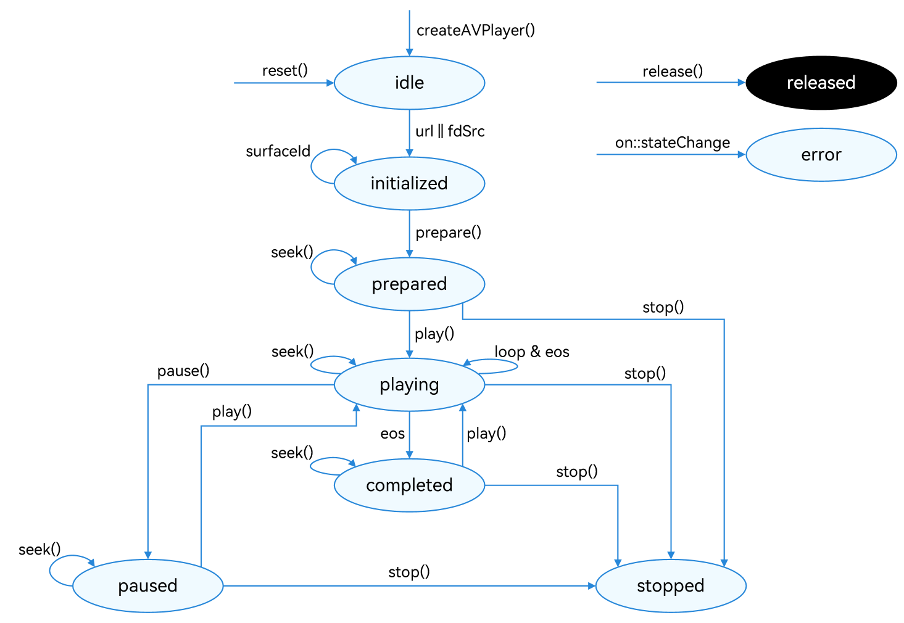

# 使用AVPlayer接口播放音频(ArkTS)

使用AVPlayer可以实现端到端播放原始媒体资源，本开发指导将以完整地播放一首音乐作为示例，向开发者讲解AVPlayer音频播放相关功能。如需播放PCM音频数据，请使用[AudioRenderer](../audio/using-audiorenderer-for-playback.md)。

播放的全流程包含：创建AVPlayer，设置播放资源，设置播放参数（音量/倍速/焦点模式），播放控制（播放/暂停/跳转/停止），重置，销毁资源。


在进行应用开发的过程中，开发者可以通过AVPlayer的state属性主动获取当前状态或使用on('stateChange')方法监听状态变化。如果应用在音频播放器处于错误状态时执行操作，系统可能会抛出异常或生成其他未定义的行为。


**图1** 播放状态变化示意图  


状态的详细说明请参考[AVPlayerState](../../reference/apis-media-kit/js-apis-media.md#avplayerstate9)。当播放处于prepared / playing / paused / completed状态时，播放引擎处于工作状态，这需要占用系统较多的运行内存。当客户端暂时不使用播放器时，调用reset()或release()回收内存资源，做好资源利用。.

## 开发建议

当前指导仅介绍如何实现媒体资源播放，在应用开发过程中可能会涉及后台播放、播放冲突等情况，请根据实际需要参考以下说明。

- 如果要实现后台播放或熄屏播放，需要接入[AVSession（媒体会话）](../avsession/avsession-access-scene.md)和[申请长时任务](../../task-management/continuous-task.md)，避免播放被系统强制中断。
- 应用在播放过程中，若播放的媒体数据涉及音频，根据系统音频管理策略（参考[处理音频焦点事件](../audio/audio-playback-concurrency.md)），可能会被其他应用打断，建议应用主动监听音频打断事件，根据其内容提示，做出相应的处理，避免出现应用状态与预期效果不一致的问题。
- 面对设备同时连接多个音频输出设备的情况，应用可以通过[on('audioOutputDeviceChangeWithInfo')](../../reference/apis-media-kit/js-apis-media.md#onaudiooutputdevicechangewithinfo11)监听音频输出设备的变化，从而做出相应处理。

## 开发步骤及注意事项

详细的API说明请参考[AVPlayer API参考](../../reference/apis-media-kit/js-apis-media.md#avplayer9)。

1. 创建实例createAVPlayer()，AVPlayer初始化idle状态。

2. 设置业务需要的监听事件，搭配全流程场景使用。支持的监听事件包括：
   | 事件类型 | 说明 |
   | -------- | -------- |
   | stateChange | 必要事件，监听播放器的state属性改变。 |
   | error | 必要事件，监听播放器的错误信息。 |
   | durationUpdate | 用于进度条，监听进度条长度，刷新资源时长。 |
   | timeUpdate | 用于进度条，监听进度条当前位置，刷新当前时间。 |
   | seekDone | 响应API调用，监听seek()请求完成情况。<br/>当使用seek()跳转到指定播放位置后，如果seek操作成功，将上报该事件。 |
   | speedDone | 响应API调用，监听setSpeed()请求完成情况。<br/>当使用setSpeed()设置播放倍速后，如果setSpeed操作成功，将上报该事件。 |
   | volumeChange | 响应API调用，监听setVolume()请求完成情况。<br/>当使用setVolume()调节播放音量后，如果setVolume操作成功，将上报该事件。 |
   | bufferingUpdate | 用于网络播放，监听网络播放缓冲信息，用于上报缓冲百分比以及缓存播放进度。 |
   | audioInterrupt | 监听音频焦点切换信息，搭配属性audioInterruptMode使用。<br/>如果当前设备存在多个音频正在播放，音频焦点被切换（即播放其他媒体如通话等）时将上报该事件，应用可以及时处理。 |

3. 设置资源：设置属性url，AVPlayer进入initialized状态。
   > **说明：**
   >
   > 下面代码示例中的url仅作示意使用，开发者需根据实际情况，确认资源有效性并设置：
   > 
   > - 如果使用本地资源播放，必须确认资源文件可用，并使用应用沙箱路径访问对应资源，参考[获取应用文件路径](../../application-models/application-context-stage.md#获取应用文件路径)。应用沙箱的介绍及如何向应用沙箱推送文件，请参考[文件管理](../../file-management/app-sandbox-directory.md)。
   > 
   > - 如果使用网络播放路径，需[声明权限](../../security/AccessToken/declare-permissions.md)：ohos.permission.INTERNET。
   > 
   > - 如果使用ResourceManager.getRawFd打开HAP资源文件描述符，使用方法可参考[ResourceManager API参考](../../reference/apis-localization-kit/js-apis-resource-manager.md#getrawfd9)。
   > 
   > - 需要使用[支持的播放格式与协议](media-kit-intro.md#支持的格式与协议)。
   > 
   > 此外，如果需要设置音频渲染信息，则只允许在initialized状态下，第一次调用prepare()之前设置，以便音频渲染器信息在之后生效。若媒体源包含视频，则usage默认值为STREAM_USAGE_MOVIE，否则usage默认值为STREAM_USAGE_MUSIC。rendererFlags默认值为0。若默认usage不满足需求，则须主动配置[audio.AudioRendererInfo](../../reference/apis-audio-kit/js-apis-audio.md#audiorendererinfo8)。

4. 准备播放：调用prepare()，AVPlayer进入prepared状态，此时可以获取duration，设置音量。

5. 音频播控：播放play()，暂停pause()，跳转seek()，停止stop() 等操作。

6. （可选）更换资源：调用reset()重置资源，AVPlayer重新进入idle状态，允许更换资源url。

7. 退出播放：调用release()销毁实例，AVPlayer进入released状态，退出播放。

## 完整示例

参考以下示例，完整地播放一首音乐，实现起播后3s暂停，暂停3s重新播放的效果。

```ts
import { media } from '@kit.MediaKit';
import { fileIo as fs } from '@kit.CoreFileKit';
import { common } from '@kit.AbilityKit';
import { BusinessError } from '@kit.BasicServicesKit';

export class AVPlayerDemo {
  private count: number = 0;
  private isSeek: boolean = true; // 用于区分模式是否支持seek操作
  private fileSize: number = -1;
  private fd: number = 0;
  // 注册avplayer回调函数
  setAVPlayerCallback(avPlayer: media.AVPlayer) {
    // seek操作结果回调函数
    avPlayer.on('seekDone', (seekDoneTime: number) => {
      console.info(`AVPlayer seek succeeded, seek time is ${seekDoneTime}`);
    })
    // error回调监听函数,当avPlayer在操作过程中出现错误时调用 reset接口触发重置流程
    avPlayer.on('error', (err: BusinessError) => {
      console.error(`Invoke avPlayer failed, code is ${err.code}, message is ${err.message}`);
      avPlayer.reset(); // 调用reset重置资源，触发idle状态
    })
    // 状态机变化回调函数
    avPlayer.on('stateChange', async (state: string, reason: media.StateChangeReason) => {
      switch (state) {
        case 'idle': // 成功调用reset接口后触发该状态机上报
          console.info('AVPlayer state idle called.');
          avPlayer.release(); // 调用release接口销毁实例对象
          break;
        case 'initialized': // avplayer 设置播放源后触发该状态上报
          console.info('AVPlayer state initialized called.');
          this.avPlayer.audioRendererInfo = {
            usage: audio.StreamUsage.STREAM_USAGE_MUSIC,
            rendererFlags: 0
          }
          avPlayer.prepare();
          break;
        case 'prepared': // prepare调用成功后上报该状态机
          console.info('AVPlayer state prepared called.');
          avPlayer.play(); // 调用播放接口开始播放
          break;
        case 'playing': // play成功调用后触发该状态机上报
          console.info('AVPlayer state playing called.');
          if (this.count !== 0) {
            if (this.isSeek) {
              console.info('AVPlayer start to seek.');
              avPlayer.seek(avPlayer.duration); //seek到音频末尾
            } else {
              // 当播放模式不支持seek操作时继续播放到结尾
              console.info('AVPlayer wait to play end.');
            }
          } else {
            setTimeout(() => {
              console.info('AVPlayer is playing wait to pause');
              avPlayer.pause(); // 播放3s后调用暂停接口暂停播放
            }, 3000)
          }
          this.count++;
          break;
        case 'paused': // pause成功调用后触发该状态机上报
          console.info('AVPlayer state paused called.');
          setTimeout(() => {
              console.info('AVPlayer paused wait to play again');
              avPlayer.play(); // 暂停3s后再次调用播放接口开始播放
            }, 3000)
          break;
        case 'completed': // 播放结束后触发该状态机上报
          console.info('AVPlayer state completed called.');
          avPlayer.stop(); //调用播放结束接口
          break;
        case 'stopped': // stop接口成功调用后触发该状态机上报
          console.info('AVPlayer state stopped called.');
          avPlayer.reset(); // 调用reset接口初始化avplayer状态
          break;
        case 'released':
          console.info('AVPlayer state released called.');
          break;
        default:
          console.info('AVPlayer state unknown called.');
          break;
      }
    })
  }

  // 以下demo为使用fs文件系统打开沙箱地址获取媒体文件地址并通过url属性进行播放示例
  async avPlayerUrlDemo() {
    // 创建avPlayer实例对象
    let avPlayer: media.AVPlayer = await media.createAVPlayer();
    // 创建状态机变化回调函数
    this.setAVPlayerCallback(avPlayer);
    let fdPath = 'fd://';
    // 通过UIAbilityContext获取沙箱地址filesDir，以Stage模型为例
    let context = getContext(this) as common.UIAbilityContext;
    let pathDir = context.filesDir;
    let path = pathDir + '/01.mp3';
    // 打开相应的资源文件地址获取fd，并为url赋值触发initialized状态机上报
    let file = await fs.open(path);
    fdPath = fdPath + '' + file.fd;
    this.isSeek = true; // 支持seek操作
    avPlayer.url = fdPath;
  }

  // 以下demo为使用资源管理接口获取打包在HAP内的媒体资源文件并通过fdSrc属性进行播放示例
  async avPlayerFdSrcDemo() {
    // 创建avPlayer实例对象
    let avPlayer: media.AVPlayer = await media.createAVPlayer();
    // 创建状态机变化回调函数
    this.setAVPlayerCallback(avPlayer);
    // 通过UIAbilityContext的resourceManager成员的getRawFd接口获取媒体资源播放地址
    // 返回类型为{fd,offset,length},fd为HAP包fd地址，offset为媒体资源偏移量，length为播放长度
    let context = getContext(this) as common.UIAbilityContext;
    let fileDescriptor = await context.resourceManager.getRawFd('01.mp3');
    let avFileDescriptor: media.AVFileDescriptor =
      { fd: fileDescriptor.fd, offset: fileDescriptor.offset, length: fileDescriptor.length };
    this.isSeek = true; // 支持seek操作
    // 为fdSrc赋值触发initialized状态机上报
    avPlayer.fdSrc = avFileDescriptor;
  }

  // 以下demo为使用fs文件系统打开沙箱地址获取媒体文件地址并通过dataSrc属性进行播放(seek模式)示例
  async avPlayerDataSrcSeekDemo() {
    // 创建avPlayer实例对象
    let avPlayer: media.AVPlayer = await media.createAVPlayer();
    // 创建状态机变化回调函数
    this.setAVPlayerCallback(avPlayer);
    // dataSrc播放模式的的播放源地址，当播放为Seek模式时fileSize为播放文件的具体大小，下面会对fileSize赋值
    let src: media.AVDataSrcDescriptor = {
      fileSize: -1,
      callback: (buf: ArrayBuffer, length: number, pos: number | undefined) => {
        let num = 0;
        if (buf == undefined || length == undefined || pos == undefined) {
          return -1;
        }
        num = fs.readSync(this.fd, buf, { offset: pos, length: length });
        if (num > 0 && (this.fileSize >= pos)) {
          return num;
        }
        return -1;
      }
    }
    let context = getContext(this) as common.UIAbilityContext;
    // 通过UIAbilityContext获取沙箱地址filesDir，以Stage模型为例
    let pathDir = context.filesDir;
    let path = pathDir  + '/01.mp3';
    await fs.open(path).then((file: fs.File) => {
      this.fd = file.fd;
    })
    // 获取播放文件的大小
    this.fileSize = fs.statSync(path).size;
    src.fileSize = this.fileSize;
    this.isSeek = true; // 支持seek操作
    avPlayer.dataSrc = src;
  }

  // 以下demo为使用fs文件系统打开沙箱地址获取媒体文件地址并通过dataSrc属性进行播放(No seek模式)示例
  async avPlayerDataSrcNoSeekDemo() {
    // 创建avPlayer实例对象
    let avPlayer: media.AVPlayer = await media.createAVPlayer();
    // 创建状态机变化回调函数
    this.setAVPlayerCallback(avPlayer);
    let context = getContext(this) as common.UIAbilityContext;
    let src: media.AVDataSrcDescriptor = {
      fileSize: -1,
      callback: (buf: ArrayBuffer, length: number) => {
        let num = 0;
        if (buf == undefined || length == undefined) {
          return -1;
        }
        num = fs.readSync(this.fd, buf);
        if (num > 0) {
          return num;
        }
        return -1;
      }
    }
    // 通过UIAbilityContext获取沙箱地址filesDir，以Stage模型为例
    let pathDir = context.filesDir;
    let path = pathDir  + '/01.mp3';
    await fs.open(path).then((file: fs.File) => {
      this.fd = file.fd;
    })
    this.isSeek = false; // 不支持seek操作
    avPlayer.dataSrc = src;
  }

  // 以下demo为通过url设置网络地址来实现播放直播码流的demo
  async avPlayerLiveDemo() {
    // 创建avPlayer实例对象
    let avPlayer: media.AVPlayer = await media.createAVPlayer();
    // 创建状态机变化回调函数
    this.setAVPlayerCallback(avPlayer);
    this.isSeek = false; // 不支持seek操作
    avPlayer.url = 'http://xxx.xxx.xxx.xxx:xx/xx/index.m3u8';
  }
}
```

<!--RP1-->
<!--RP1End-->