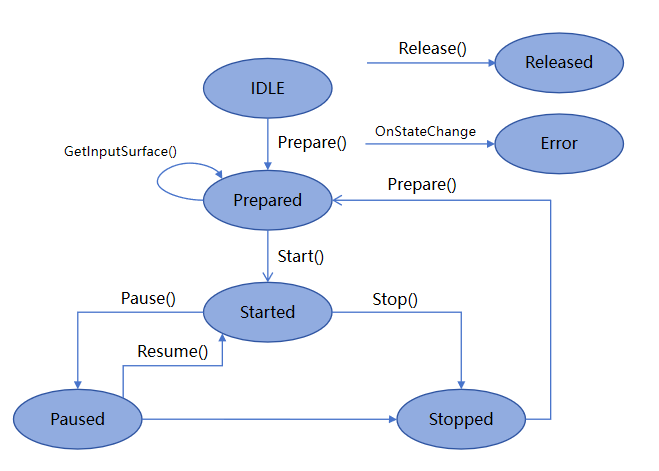

# 使用AVRecorder录制视频(C/C++)
<!--Kit: Media Kit-->
<!--Subsystem: Multimedia-->
<!--Owner: @gcw_dyOv3Sds-->
<!--Designer: @chris2981-->
<!--Tester: @xdlinc-->
<!--Adviser: @w_Machine_cc-->

AVRecorder支持开发音视频录制，集成了音频捕获、音频编码、视频编码、音视频封装功能，适用于实现简单视频录制并直接得到本地媒体文件的场景。

本开发指导将以“开始录制-暂停录制-恢复录制-停止录制”的一次流程为示例，向开发者讲解如何使用AVRecorder进行视频录制。

在进行应用开发的过程中，开发者可以通过AVRecorder的state属性主动获取当前状态，或使用OH_AVRecorder_SetStateCallback方法注册回调监听状态变化。开发过程中应严格遵循状态机要求，例如只能在started状态下调用OH_AVRecorder_Pause()接口，只能在paused状态下调用OH_AVRecorder_Resume()接口。

**图1** 录制状态变化示意图



状态的详细说明请参考[OH_AVRecorder_State](../../reference/apis-media-kit/capi-avrecorder-base-h.md#oh_avrecorder_state)。


## 申请权限

在开发此功能前，开发者应根据实际需求申请相关权限：
- 当需要使用麦克风时，需要申请**ohos.permission.MICROPHONE**麦克风权限。申请方式请参考：[向用户申请授权](../../security/AccessToken/request-user-authorization.md)。
- 当需要使用相机拍摄时，需要申请**ohos.permission.CAMERA**相机权限。申请方式请参考：[向用户申请授权](../../security/AccessToken/request-user-authorization.md)。
- 当需要从图库读取图片或视频文件时，请优先使用媒体库[Picker选择媒体资源](../medialibrary/photoAccessHelper-photoviewpicker.md)。
- 当需要保存图片或视频文件至图库时，请优先使用[安全控件保存媒体资源](../medialibrary/photoAccessHelper-savebutton.md)。

> **说明：**
>
> 仅应用需要克隆、备份或同步用户公共目录的图片、视频类文件时，可申请ohos.permission.READ_IMAGEVIDEO、ohos.permission.WRITE_IMAGEVIDEO权限来读写图片、视频文件，申请方式请参考<!--RP1-->[申请受控权限](../../security/AccessToken/declare-permissions-in-acl.md)<!--RP1End-->。


## 开发步骤及注意事项

> **说明：**
>
> AVRecorder只负责视频数据的处理，需要与视频数据采集模块配合才能完成视频录制。视频数据采集模块需要通过Surface将视频数据传递给AVRecorder进行数据处理。当前常用的视频数据采集模块为相机模块，具体请参考[相机-录像](../camera/native-camera-recording.md)。
>
> 文件的创建与存储，请参考[应用文件访问与管理](../../file-management/app-file-access.md)，默认存储在应用的沙箱路径之下，如需存储至图库，请使用[安全控件保存媒体资源](../medialibrary/photoAccessHelper-savebutton.md)对沙箱内文件进行存储。


开发者通过引入[avrecorder.h](../../reference/apis-media-kit/capi-avrecorder-h.md)、[avrecorder_base.h](../../reference/apis-media-kit/capi-avrecorder-base-h.md)和[native_averrors.h](../../reference/apis-avcodec-kit/capi-native-averrors-h.md)头文件，使用视频录制相关API。

AVRecorder详细的API说明请参考[AVRecorder API参考](../../reference/apis-media-kit/capi-avrecorder.md)。

在CMake脚本中链接动态库。
```C++
target_link_libraries(entry PUBLIC libavrecorder.so)
```

使用[native_avformat.h](../../reference/apis-avcodec-kit/capi-native-avformat-h.md)相关接口时，需引入如下头文件。
```C++
#include <multimedia/player_framework/native_avformat.h>
```

并在CMake脚本中链接如下动态库。
```C++
target_link_libraries(entry PUBLIC libnative_media_core.so)
```

开发者通过引入[application_context.h](../../reference/apis-ability-kit/capi-application-context-h.md)头文件，使用程序框架服务相关API。
```c++
#include <AbilityKit/ability_runtime/application_context.h>
```

并在CMake脚本中链接如下动态库。
```c++
target_link_libraries(entry PUBLIC libability_runtime.so)
```

开发者使用系统日志能力时，需引入如下头文件。
```C++
#include <hilog/log.h>
```

并需要在CMake脚本中链接如下动态库。
```C++
target_link_libraries(entry PUBLIC libhilog_ndk.z.so)
```

1. 创建AVRecorder实例，实例创建完成进入idle状态。

   <!-- @[include_avrecorder_h](https://gitcode.com/openharmony/applications_app_samples/blob/master/code/DocsSample/Media/AVRecorder/AVRecorder/entry/src/main/cpp/avrecorder_ndk.cpp) -->
   
   ``` C++
   #include "multimedia/player_framework/avrecorder.h"
   #include "multimedia/player_framework/avrecorder_base.h"
   ```

   <!-- @[declare_avrecorder](https://gitcode.com/openharmony/applications_app_samples/blob/master/code/DocsSample/Media/AVRecorder/AVRecorder/entry/src/main/cpp/avrecorder_ndk.cpp) -->
   
   ``` C++
   static OH_AVRecorder *g_recorder = nullptr;
   ```

   <!-- @[create_avrecorder](https://gitcode.com/openharmony/applications_app_samples/blob/master/code/DocsSample/Media/AVRecorder/AVRecorder/entry/src/main/cpp/avrecorder_ndk.cpp) -->
   
   ``` C++
   g_recorder = OH_AVRecorder_Create();
   ```

2. 设置业务需要的监听事件，监听状态变化及错误上报。
   | 事件类型 | 说明 |
   | -------- | -------- |
   | OnStateChange | 监听AVRecorder的状态改变。 |
   | OnError | 监听AVRecorder的错误信息。 |
   | OnUri | 监听AVRecorder生成媒体文件。 |

   <!-- @[set_onstatechange_callback](https://gitcode.com/openharmony/applications_app_samples/blob/master/code/DocsSample/Media/AVRecorder/AVRecorder/entry/src/main/cpp/avrecorder_ndk.cpp) -->
   
   ``` C++
   OH_AVRecorder_SetStateCallback(g_recorder, OnStateChange, nullptr);
   ```

   <!-- @[set_onerror_callback](https://gitcode.com/openharmony/applications_app_samples/blob/master/code/DocsSample/Media/AVRecorder/AVRecorder/entry/src/main/cpp/avrecorder_ndk.cpp) -->
   
   ``` C++
   OH_AVRecorder_SetErrorCallback(g_recorder, OnError, nullptr);
   ```

   <!-- @[set_onuri_callback](https://gitcode.com/openharmony/applications_app_samples/blob/master/code/DocsSample/Media/AVRecorder/AVRecorder/entry/src/main/cpp/avrecorder_ndk.cpp) -->
   
   ``` C++
   OH_AVRecorder_SetUriCallback(g_recorder, OnUri, nullptr);
   ```

   <!-- @[define_onstatechange_callback](https://gitcode.com/openharmony/applications_app_samples/blob/master/code/DocsSample/Media/AVRecorder/AVRecorder/entry/src/main/cpp/avrecorder_ndk.cpp) -->
   
   ``` C++
   static void OnStateChange(OH_AVRecorder *recorder, OH_AVRecorder_State state,
       OH_AVRecorder_StateChangeReason reason, void *userData)
   {
       // ...
       
       (void)recorder;
       (void)userData;
   
       const char *reasonStr =
           (reason == OH_AVRecorder_StateChangeReason::AVRECORDER_USER) ? "USER" :
           (reason == OH_AVRecorder_StateChangeReason::AVRECORDER_BACKGROUND) ? "BACKGROUND" : "UNKNOWN";
   
       if (state == OH_AVRecorder_State::AVRECORDER_IDLE) {
           OH_LOG_INFO(LOG_APP, "==NDKDemo== Recorder OnStateChange IDLE, reason: %{public}s", reasonStr);
       }
   }
   ```

   <!-- @[define_onerror_callback](https://gitcode.com/openharmony/applications_app_samples/blob/master/code/DocsSample/Media/AVRecorder/AVRecorder/entry/src/main/cpp/avrecorder_ndk.cpp) -->
   
   ``` C++
   static void OnError(OH_AVRecorder *recorder, int32_t errorCode, const char *errorMsg, void *userData)
   {
       // ...
       
       (void)recorder;
       (void)userData;
       OH_LOG_ERROR(LOG_APP, "==NDKDemo== Recorder OnError errorCode: %{public}d, error message: %{public}s",
                    errorCode, errorMsg);
   }
   ```

   <!-- @[define_onuri_callback](https://gitcode.com/openharmony/applications_app_samples/blob/master/code/DocsSample/Media/AVRecorder/AVRecorder/entry/src/main/cpp/avrecorder_ndk.cpp) -->
   
   ``` C++
   void OnUri(OH_AVRecorder *recorder, OH_MediaAsset *asset, void *userData)
   {
       (void)recorder;
       (void)userData;
       OH_LOG_INFO(LOG_APP, "==NDKDemo== OnUri in!");
       if (asset != nullptr) {
           auto changeRequest = OH_MediaAssetChangeRequest_Create(asset);
           if (changeRequest == nullptr) {
               OH_LOG_ERROR(LOG_APP, "==NDKDemo== changeRequest is null!");
               OH_MediaAsset_Release(asset);
               return;
           }
           MediaLibrary_ImageFileType imageFileType = MEDIA_LIBRARY_FILE_VIDEO;
           int32_t result = OH_MediaAssetChangeRequest_SaveCameraPhoto(changeRequest, imageFileType);
           OH_LOG_INFO(LOG_APP, "result of OH_MediaAssetChangeRequest_SaveCameraPhoto: %d", result);
   
           int32_t resultChange = OH_MediaAccessHelper_ApplyChanges(changeRequest);
           OH_LOG_INFO(LOG_APP, "result of OH_MediaAccessHelper_ApplyChanges: %d", resultChange);
   
           OH_MediaAsset_Release(asset);
           OH_MediaAssetChangeRequest_Release(changeRequest);
       } else {
           OH_LOG_ERROR(LOG_APP, "Received null media asset!");
       }
       OH_LOG_INFO(LOG_APP, "==NDKDemo== OnUri out!");
   }
   ```

3. 配置视频录制参数，调用OH_AVRecorder_Prepare()接口，此时进入prepared状态。

   > **说明：**
   >
   > 配置参数需要注意：
   >
   > - 配置参数之前需要确保完成对应权限的申请，请参考[申请权限](#申请权限)。
   >
   > - prepare接口的入参OH_AVRecorder_Config中设置的音视频相关的配置参数，如示例代码所示。
   >
   > - 需要使用支持的[录制规格](media-kit-intro.md#支持的格式)，视频比特率、分辨率、帧率以实际硬件设备支持的范围为准。
   >
   > - 录制输出的url地址（即示例里config中的url），形式为fd://xx (fd number)。需要调用基础文件操作接口实现应用文件访问能力，获取方式参考[应用文件访问与管理](../../file-management/native-fileio-guidelines.md)。

   <!-- @[prepare_video_recorder](https://gitcode.com/openharmony/applications_app_samples/blob/master/code/DocsSample/Media/AVRecorder/AVRecorder/entry/src/main/cpp/avrecorder_ndk.cpp) -->
   
   ``` C++
   static napi_value PrepareVideoRecorder(napi_env env, napi_callback_info info)
   {
       OH_LOG_INFO(LOG_APP, "PrepareVideoRecorder called");
   
       OH_AVRecorder_Config config;
       memset(&config, 0, sizeof(config));
   
       config.videoSourceType = AVRECORDER_SURFACE_YUV;
       config.profile.videoBitrate = VIDEO_BITRATE; // 3000000
       config.profile.videoCodec = AVRECORDER_VIDEO_AVC;
       config.profile.videoFrameWidth = VIDEO_FRAME_WIDTH; // 1920
       config.profile.videoFrameHeight = VIDEO_FRAME_HEIGHT; // 1080
       config.profile.videoFrameRate = VIDEO_FRAME_RATE; // 30
       config.profile.isHdr = false;
       config.profile.enableTemporalScale = false;
       config.profile.fileFormat = AVRECORDER_CFT_MPEG_4;
       config.fileGenerationMode = AVRECORDER_APP_CREATE;
       config.metadata.videoOrientation = strdup("90");
   
       char fileDirPath[1000] = {0};
       int32_t bufferSize = 1000;
       int32_t writeLength = 0;
       AbilityRuntime_ErrorCode errCode =
           OH_AbilityRuntime_ApplicationContextGetFilesDir(fileDirPath, bufferSize, &writeLength);
       if (errCode != AbilityRuntime_ErrorCode::ABILITY_RUNTIME_ERROR_CODE_NO_ERROR || writeLength <= 0) {
           OH_LOG_ERROR(LOG_APP, "==NDKDemo== GetFilesDir failed, errCode: %{public}d", errCode);
           napi_value res;
           napi_create_int32(env, -1, &res);
           return res;
       }
       const std::string avrecorderRoot = fileDirPath;
       g_outputFd = open((avrecorderRoot + "/video_example.mp4").c_str(), O_RDWR | O_CREAT, FILE_PERMISSIONS);
       std::string fileUrl = "fd://" + std::to_string(g_outputFd);
       config.url = strdup(fileUrl.c_str());
       OH_LOG_INFO(LOG_APP, "config.url is: %s", config.url);
   
       OH_AVErrCode err = OH_AVRecorder_Prepare(g_recorder, &config);
       free(config.url);
       free(config.metadata.videoOrientation);
       if (err != AV_ERR_OK) {
           OH_LOG_ERROR(LOG_APP, "Failed to prepare video recorder, error: %{public}d", err);
       }
       napi_value result;
       napi_create_int32(env, static_cast<int32_t>(err), &result);
       return result;
   }
   ```

4. 获取视频录制需要的SurfaceID。

   调用OH_AVRecorder_GetInputSurface()接口获取OHNativeWindow，再通过OH_NativeWindow_GetSurfaceId()接口获取SurfaceID，SurfaceID用于传递给视频数据输入源模块。常用的视频数据输入源模块为相机，以下示例代码中，仅展示获取SurfaceID的步骤。

   输入源模块通过SurfaceID可以获取到Surface，通过Surface可以将视频数据流传递给AVRecorder，由AVRecorder再进行视频数据的处理。

   <!-- @[get_input_surface_id](https://gitcode.com/openharmony/applications_app_samples/blob/master/code/DocsSample/Media/AVRecorder/AVRecorder/entry/src/main/cpp/avrecorder_ndk.cpp) -->
   
   ``` C++
   static std::string GetSurfaceIdString()
   {
       OHNativeWindow *window = nullptr;
       OH_AVErrCode err = OH_AVRecorder_GetInputSurface(g_recorder, &window);
       if (err != AV_ERR_OK || window == nullptr) {
           OH_LOG_ERROR(LOG_APP, "Failed to get input surface, error: %{public}d", err);
           return "";
       }
       uint64_t surfaceId = 0;
       int32_t nErr = OH_NativeWindow_GetSurfaceId(window, &surfaceId);
       if (nErr != 0) {
           OH_LOG_ERROR(LOG_APP, "Failed to get surface ID from native window, error: %{public}d", nErr);
           return "";
       }
       std::string surfaceIdStr = std::to_string(surfaceId);
       OH_LOG_INFO(LOG_APP, "Input surface ID: %{public}s", surfaceIdStr.c_str());
       return surfaceIdStr;
   }
   ```

5. 初始化视频数据输入源。该步骤需要在输入源模块完成，以相机为例，需要创建录像输出流，包括创建Camera对象、获取相机列表、创建相机输入流等，相机详细步骤请参考[相机-录像方案](../camera/native-camera-recording.md)。

6. 开始录制，启动输入源输入视频数据，例如相机模块调用OH_VideoOutput_Start()接口启动相机录制。然后调用OH_AVRecorder_Start()接口，此时AVRecorder进入started状态。

   <!-- @[start_recorder](https://gitcode.com/openharmony/applications_app_samples/blob/master/code/DocsSample/Media/AVRecorder/AVRecorder/entry/src/main/cpp/avrecorder_ndk.cpp) -->
   
   ``` C++
   OH_AVErrCode err = OH_AVRecorder_Start(g_recorder);
   ```

7. 暂停录制，调用OH_AVRecorder_Pause()接口，此时AVRecorder进入paused状态，同时暂停输入源输入数据。例如相机模块调用OH_VideoOutput_Stop()停止相机视频数据输入。

   <!-- @[pause_recorder](https://gitcode.com/openharmony/applications_app_samples/blob/master/code/DocsSample/Media/AVRecorder/AVRecorder/entry/src/main/cpp/avrecorder_ndk.cpp) -->
   
   ``` C++
   OH_AVErrCode err = OH_AVRecorder_Pause(g_recorder);
   ```

8. 恢复录制，调用OH_AVRecorder_Resume()接口，此时再次进入started状态。

   <!-- @[resume_recorder](https://gitcode.com/openharmony/applications_app_samples/blob/master/code/DocsSample/Media/AVRecorder/AVRecorder/entry/src/main/cpp/avrecorder_ndk.cpp) -->
   
   ``` C++
   OH_AVErrCode err = OH_AVRecorder_Resume(g_recorder);
   ```

9. 停止录制，调用OH_AVRecorder_Stop()接口，此时进入stopped状态，同时停止相机录制。

   <!-- @[stop_recorder](https://gitcode.com/openharmony/applications_app_samples/blob/master/code/DocsSample/Media/AVRecorder/AVRecorder/entry/src/main/cpp/avrecorder_ndk.cpp) -->
   
   ``` C++
   OH_AVErrCode err = OH_AVRecorder_Stop(g_recorder);
   ```

10. 重置资源，调用OH_AVRecorder_Reset()重新进入idle状态，允许重新配置录制参数。

    <!-- @[reset_recorder](https://gitcode.com/openharmony/applications_app_samples/blob/master/code/DocsSample/Media/AVRecorder/AVRecorder/entry/src/main/cpp/avrecorder_ndk.cpp) -->
    
    ``` C++
    OH_AVErrCode err = OH_AVRecorder_Reset(g_recorder);
    ```

11. 销毁实例，调用OH_AVRecorder_Release()进入released状态，退出录制，释放视频数据输入源相关资源，例如相机资源。

    <!-- @[release_recorder](https://gitcode.com/openharmony/applications_app_samples/blob/master/code/DocsSample/Media/AVRecorder/AVRecorder/entry/src/main/cpp/avrecorder_ndk.cpp) -->
    
    ``` C++
    OH_AVRecorder_Release(g_recorder);
    ```

## 完整示例

参考以下示例，包括“创建录制实例-准备录制-开始录制-暂停录制-恢复录制-停止录制-重置录制状态-释放录制资源”的完整流程。

   <!-- @[full_video_recorder](https://gitcode.com/openharmony/applications_app_samples/blob/master/code/DocsSample/Media/AVRecorder/AVRecorder/entry/src/main/cpp/avrecorder_ndk.cpp) -->
   
   ``` C++
   #include <cstdio>
   #include <cstring>
   #include <string>
   #include <cinttypes>
   #include <fcntl.h>
   #include <unistd.h>
   
   #include "napi/native_api.h"
   #include "multimedia/player_framework/avrecorder.h"
   #include "multimedia/player_framework/avrecorder_base.h"
   #include "multimedia/player_framework/native_avformat.h"
   #include "multimedia/media_library/media_asset_change_request_capi.h"
   #include "multimedia/media_library/media_access_helper_capi.h"
   #include "multimedia/media_library/media_asset_capi.h"
   #include "native_window/external_window.h"
   #include "hilog/log.h"
   #include <AbilityKit/ability_runtime/application_context.h>
   
   // ...
   static constexpr int32_t VIDEO_BITRATE = 3000000;
   static constexpr int32_t VIDEO_FRAME_WIDTH = 1920;
   static constexpr int32_t VIDEO_FRAME_HEIGHT = 1080;
   static constexpr int32_t VIDEO_FRAME_RATE = 30;
   static constexpr int32_t CALLBACK_ARG_COUNT = 2;
   static constexpr int32_t FILE_PERMISSIONS = 0644;
   
   static OH_AVRecorder *g_recorder = nullptr;
   static int32_t g_outputFd = -1;
   
   // ...
   
   static void OnStateChange(OH_AVRecorder *recorder, OH_AVRecorder_State state,
       OH_AVRecorder_StateChangeReason reason, void *userData)
   {
       // ...
       
       (void)recorder;
       (void)userData;
   
       const char *reasonStr =
           (reason == OH_AVRecorder_StateChangeReason::AVRECORDER_USER) ? "USER" :
           (reason == OH_AVRecorder_StateChangeReason::AVRECORDER_BACKGROUND) ? "BACKGROUND" : "UNKNOWN";
   
       if (state == OH_AVRecorder_State::AVRECORDER_IDLE) {
           OH_LOG_INFO(LOG_APP, "==NDKDemo== Recorder OnStateChange IDLE, reason: %{public}s", reasonStr);
       }
   }
   
   static void OnError(OH_AVRecorder *recorder, int32_t errorCode, const char *errorMsg, void *userData)
   {
       // ...
       
       (void)recorder;
       (void)userData;
       OH_LOG_ERROR(LOG_APP, "==NDKDemo== Recorder OnError errorCode: %{public}d, error message: %{public}s",
                    errorCode, errorMsg);
   }
   
   void OnUri(OH_AVRecorder *recorder, OH_MediaAsset *asset, void *userData)
   {
       (void)recorder;
       (void)userData;
       OH_LOG_INFO(LOG_APP, "==NDKDemo== OnUri in!");
       if (asset != nullptr) {
           auto changeRequest = OH_MediaAssetChangeRequest_Create(asset);
           if (changeRequest == nullptr) {
               OH_LOG_ERROR(LOG_APP, "==NDKDemo== changeRequest is null!");
               OH_MediaAsset_Release(asset);
               return;
           }
           MediaLibrary_ImageFileType imageFileType = MEDIA_LIBRARY_FILE_VIDEO;
           int32_t result = OH_MediaAssetChangeRequest_SaveCameraPhoto(changeRequest, imageFileType);
           OH_LOG_INFO(LOG_APP, "result of OH_MediaAssetChangeRequest_SaveCameraPhoto: %d", result);
   
           int32_t resultChange = OH_MediaAccessHelper_ApplyChanges(changeRequest);
           OH_LOG_INFO(LOG_APP, "result of OH_MediaAccessHelper_ApplyChanges: %d", resultChange);
   
           OH_MediaAsset_Release(asset);
           OH_MediaAssetChangeRequest_Release(changeRequest);
       } else {
           OH_LOG_ERROR(LOG_APP, "Received null media asset!");
       }
       OH_LOG_INFO(LOG_APP, "==NDKDemo== OnUri out!");
   }
   
   static napi_value CreateRecorder(napi_env env, napi_callback_info info)
   {
       OH_LOG_INFO(LOG_APP, "CreateRecorder called");
       if (g_recorder != nullptr) {
           OH_AVRecorder_Release(g_recorder);
           g_recorder = nullptr;
       }
       g_recorder = OH_AVRecorder_Create();
       if (g_recorder == nullptr) {
           OH_LOG_ERROR(LOG_APP, "Failed to create recorder");
           napi_value result;
           napi_create_int32(env, -1, &result);
           return result;
       }
       OH_LOG_INFO(LOG_APP, "CreateRecorder succeeded");
       napi_value result;
       napi_create_int32(env, 0, &result);
       return result;
   }
   
   static napi_value SetRecorderStateCallback(napi_env env, napi_callback_info info)
   {
       OH_LOG_INFO(LOG_APP, "SetRecorderStateCallback called");
       // ...
   
       OH_AVRecorder_SetStateCallback(g_recorder, OnStateChange, nullptr);
   
       napi_value result;
       napi_create_int32(env, 0, &result);
       return result;
   }
   
   static napi_value SetRecorderErrorCallback(napi_env env, napi_callback_info info)
   {
       OH_LOG_INFO(LOG_APP, "SetRecorderErrorCallback called");
       // ...
   
       OH_AVRecorder_SetErrorCallback(g_recorder, OnError, nullptr);
   
       napi_value result;
       napi_create_int32(env, 0, &result);
       return result;
   }
   
   static napi_value SetRecorderUriCallback(napi_env env, napi_callback_info info)
   {
       OH_LOG_INFO(LOG_APP, "SetRecorderUriCallback called");
       OH_AVRecorder_SetUriCallback(g_recorder, OnUri, nullptr);
       napi_value result;
       napi_create_int32(env, 0, &result);
       return result;
   }
   
   // ...
   
   static napi_value PrepareVideoRecorder(napi_env env, napi_callback_info info)
   {
       OH_LOG_INFO(LOG_APP, "PrepareVideoRecorder called");
   
       OH_AVRecorder_Config config;
       memset(&config, 0, sizeof(config));
   
       config.videoSourceType = AVRECORDER_SURFACE_YUV;
       config.profile.videoBitrate = VIDEO_BITRATE; // 3000000
       config.profile.videoCodec = AVRECORDER_VIDEO_AVC;
       config.profile.videoFrameWidth = VIDEO_FRAME_WIDTH; // 1920
       config.profile.videoFrameHeight = VIDEO_FRAME_HEIGHT; // 1080
       config.profile.videoFrameRate = VIDEO_FRAME_RATE; // 30
       config.profile.isHdr = false;
       config.profile.enableTemporalScale = false;
       config.profile.fileFormat = AVRECORDER_CFT_MPEG_4;
       config.fileGenerationMode = AVRECORDER_APP_CREATE;
       config.metadata.videoOrientation = strdup("90");
   
       char fileDirPath[1000] = {0};
       int32_t bufferSize = 1000;
       int32_t writeLength = 0;
       AbilityRuntime_ErrorCode errCode =
           OH_AbilityRuntime_ApplicationContextGetFilesDir(fileDirPath, bufferSize, &writeLength);
       if (errCode != AbilityRuntime_ErrorCode::ABILITY_RUNTIME_ERROR_CODE_NO_ERROR || writeLength <= 0) {
           OH_LOG_ERROR(LOG_APP, "==NDKDemo== GetFilesDir failed, errCode: %{public}d", errCode);
           napi_value res;
           napi_create_int32(env, -1, &res);
           return res;
       }
       const std::string avrecorderRoot = fileDirPath;
       g_outputFd = open((avrecorderRoot + "/video_example.mp4").c_str(), O_RDWR | O_CREAT, FILE_PERMISSIONS);
       std::string fileUrl = "fd://" + std::to_string(g_outputFd);
       config.url = strdup(fileUrl.c_str());
       OH_LOG_INFO(LOG_APP, "config.url is: %s", config.url);
   
       OH_AVErrCode err = OH_AVRecorder_Prepare(g_recorder, &config);
       free(config.url);
       free(config.metadata.videoOrientation);
       if (err != AV_ERR_OK) {
           OH_LOG_ERROR(LOG_APP, "Failed to prepare video recorder, error: %{public}d", err);
       }
       napi_value result;
       napi_create_int32(env, static_cast<int32_t>(err), &result);
       return result;
   }
   
   static std::string GetSurfaceIdString()
   {
       OHNativeWindow *window = nullptr;
       OH_AVErrCode err = OH_AVRecorder_GetInputSurface(g_recorder, &window);
       if (err != AV_ERR_OK || window == nullptr) {
           OH_LOG_ERROR(LOG_APP, "Failed to get input surface, error: %{public}d", err);
           return "";
       }
       uint64_t surfaceId = 0;
       int32_t nErr = OH_NativeWindow_GetSurfaceId(window, &surfaceId);
       if (nErr != 0) {
           OH_LOG_ERROR(LOG_APP, "Failed to get surface ID from native window, error: %{public}d", nErr);
           return "";
       }
       std::string surfaceIdStr = std::to_string(surfaceId);
       OH_LOG_INFO(LOG_APP, "Input surface ID: %{public}s", surfaceIdStr.c_str());
       return surfaceIdStr;
   }
   
   static napi_value GetInputSurfaceId(napi_env env, napi_callback_info info)
   {
       OH_LOG_INFO(LOG_APP, "GetInputSurfaceId called");
       std::string surfaceId = GetSurfaceIdString();
       napi_value result;
       napi_create_string_utf8(env, surfaceId.c_str(), NAPI_AUTO_LENGTH, &result);
       return result;
   }
   
   static napi_value StartRecorder(napi_env env, napi_callback_info info)
   {
       OH_AVErrCode err = OH_AVRecorder_Start(g_recorder);
       napi_value result;
       napi_create_int32(env, static_cast<int32_t>(err), &result);
       return result;
   }
   
   static napi_value PauseRecorder(napi_env env, napi_callback_info info)
   {
       OH_AVErrCode err = OH_AVRecorder_Pause(g_recorder);
       napi_value result;
       napi_create_int32(env, static_cast<int32_t>(err), &result);
       return result;
   }
   
   static napi_value ResumeRecorder(napi_env env, napi_callback_info info)
   {
       OH_AVErrCode err = OH_AVRecorder_Resume(g_recorder);
       napi_value result;
       napi_create_int32(env, static_cast<int32_t>(err), &result);
       return result;
   }
   
   static napi_value StopRecorder(napi_env env, napi_callback_info info)
   {
       OH_AVErrCode err = OH_AVRecorder_Stop(g_recorder);
       if (g_outputFd > 0) {
           close(g_outputFd);
           g_outputFd = -1;
       }
       napi_value result;
       napi_create_int32(env, static_cast<int32_t>(err), &result);
       return result;
   }
   
   static napi_value ResetRecorder(napi_env env, napi_callback_info info)
   {
       OH_AVErrCode err = OH_AVRecorder_Reset(g_recorder);
       napi_value result;
       napi_create_int32(env, static_cast<int32_t>(err), &result);
       return result;
   }
   
   static napi_value ReleaseRecorder(napi_env env, napi_callback_info info)
   {
       OH_LOG_INFO(LOG_APP, "ReleaseRecorder called");
       // ...
       if (g_recorder != nullptr) {
           OH_AVRecorder_Release(g_recorder);
           g_recorder = nullptr;
       }
       if (g_outputFd > 0) {
           close(g_outputFd);
           g_outputFd = -1;
       }
       OH_LOG_INFO(LOG_APP, "ReleaseRecorder succeeded");
       napi_value result;
       napi_create_int32(env, 0, &result);
       return result;
   }
   ```
