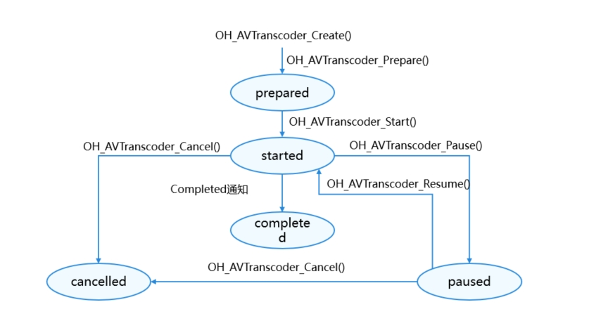

# 使用AVTranscoder实现视频转码(C/C++)
<!--Kit: Media Kit-->
<!--Subsystem: Multimedia-->
<!--Owner: @wang-haizhou6-->
<!--Designer: @HmQQQ-->
<!--Tester: @xchaosioda-->
<!--Adviser: @zengyawen-->

从API 20开始支持使用NDK接口（C/C++）实现视频转码。

使用[AVTranscoder](media-kit-intro.md#avtranscoder)可以实现视频转码功能<!--RP1--><!--RP1End-->。可以通过调用[canIUse](../../reference/common/init.md#caniuse)接口来判断当前设备是否支持AVTranscoder。当canIUse("SystemCapability.Multimedia.Media.AVTranscoder")返回值为true时，表示可以使用转码能力。

本开发指导将以“开始转码-暂停转码-恢复转码-完成转码”的一次完整流程为示例，向开发者讲解AVTranscoder视频转码相关功能。

**图1** 转码状态变化示意图



状态的详细说明请参考[OH_AVTranscoder_State](../../reference/apis-media-kit/capi-avtranscoder-base-h.md#oh_avtranscoder_state)。

## 开发步骤及注意事项

在CMake脚本中链接动态库。

```
target_link_libraries(entry PUBLIC libavtranscoder.so libace_napi.z.so)
```

开发者使用系统日志能力时，需引入如下头文件：

```c++
#include <hilog/log.h>
```

并需要在CMake脚本中链接如下动态库:

```
target_link_libraries(sample PUBLIC libhilog_ndk.z.so)
```

开发者通过引入avtranscoder.h和avtranscoder_base.h头文件，使用转码相关API。
详细的API说明请参考[AVTranscoder](../../reference/apis-media-kit/capi-avtranscoder.md)。

1. 创建转码实例：调用OH_AVTranscoder_Create()。

    ```c++
    OH_AVTranscoder *transcoder = OH_AVTranscoder_Create();
    ```

2. 设置回调事件函数：使用OH_AVTranscoder_SetStateCallback()、OH_AVTranscoder_SetErrorCallback()和OH_AVTranscoder_SetProgressUpdateCallback()接口设置回调转码状态、转码错误事件和转码进度更新回调函数，搭配全流程场景使用。支持的回调事件包括：

   | 事件类型 | 说明 |
   | -------- | -------- |
   | OH_AVTranscoder_OnStateChange | 可选事件，回调转码过程中状态。 |
   | OH_AVTranscoder_OnError | 可选事件，回调转码错误事件。 |
   | OH_AVTranscoder_OnProgressUpdate | 可选事件，回调转码进度更新事件。 |

   应用使用OH_AVTranscoder_SetStateCallback()、OH_AVTranscoder_SetErrorCallback()和OH_AVTranscoder_SetProgressUpdateCallback()接口设置回调转码状态、转码错误事件和转码进度更新回调函数，可以获取更多信息，还可以通过设置userData自定义数据。

    ```c++
    typedef struct NdkAVTransCoderUser {
       using StateChangeFunc = std::function<void()>;
       NdkAVTransCoderUser();
       NdkAVTransCoderUser(const NdkAVTransCoderUser &other) = delete;
       NdkAVTransCoderUser &operator=(const NdkAVTransCoderUser &other) = delete;
       ~NdkAVTransCoderUser();
 
       void OnStateChangeCb(OH_AVTranscoder *transcoder, OH_AVTranscoder_State state);
       void OnErrorCb(OH_AVTranscoder *transcoder, int32_t errorCode, const char  *errorMsg);
       void OnProgressUpdateCb(OH_AVTranscoder *transcoder, int progress);
       std::map<uint32_t, StateChangeFunc> stateChangeFuncs_;
 
       OH_AVTranscoder *transcoder = nullptr;
       int32_t errorCode = AV_ERR_OK;
       OH_AVTranscoder_State transCoderState = AVTRANSCODER_PREPARED;
       int avTranscoderProgress = 0;
       int inStartStateCount = 0;
    } NdkAVTransCoderUser;
 
    void NdkAVTransCoderUser::OnProgressUpdateCb(OH_AVTranscoder *transcoder, int  progress)
    {
       LOG("NdkAVTransCoderUser OnProgressUpdateCb progress: %{public}d", progress);
       this->avTranscoderProgress = progress;
    }
 
    void NdkAVTransCoderUser::OnErrorCb(OH_AVTranscoder *transcoder, int32_t  errorCode, const char *errorMsg)
    {
       LOG("NdkAVTransCoderUser OnErrorCb errorCode: %{public}d ,errorMsg: %{public} s", errorCode,
          errorMsg == nullptr ? "unknown" : errorMsg);
       this->errorCode = errorCode;
    }
 
    void NdkAVTransCoderUser::OnStateChangeCb(OH_AVTranscoder *transcoder,  OH_AVTranscoder_State state)
    {
       this->transCoderState = state;
       if (transcoder == nullptr) {
          return;
       }
       int32_t ret = -1;
       switch (state) {
          case AVTRANSCODER_PREPARED: {
                this->transCoderState = AVTRANSCODER_PREPARED;
                if (this->stateChangeFuncs_.count(AVTRANSCODER_PREPARED) > 0) {
                   this->stateChangeFuncs_[AVTRANSCODER_PREPARED]();
                }
                break;
          }
          case AVTRANSCODER_STARTED: {
                this->transCoderState = AVTRANSCODER_STARTED;
                if (this->stateChangeFuncs_.count(AVTRANSCODER_STARTED) > 0) {
                   this->stateChangeFuncs_[AVTRANSCODER_STARTED]();
                }
                break;
          }
          case AVTRANSCODER_PAUSED: {
                this->transCoderState = AVTRANSCODER_PAUSED;
                if (this->stateChangeFuncs_.count(AVTRANSCODER_PAUSED) > 0) {
                   this->stateChangeFuncs_[AVTRANSCODER_PAUSED]();
                }
                break;
          }
          case AVTRANSCODER_CANCELLED: {
                this->transCoderState = AVTRANSCODER_CANCELLED;
                if (this->stateChangeFuncs_.count(AVTRANSCODER_CANCELLED) > 0) {
                   this->stateChangeFuncs_[AVTRANSCODER_CANCELLED]();
                }
                break;
          }
          case AVTRANSCODER_COMPLETED: {
                this->transCoderState = AVTRANSCODER_COMPLETED;
                if (this->stateChangeFuncs_.count(AVTRANSCODER_COMPLETED) > 0) {
                   this->stateChangeFuncs_[AVTRANSCODER_COMPLETED]();
                }
                break;
          }
          default:
                break;
       }
    }
 
    static void AvTranscoderStateChangeCbImpl(OH_AVTranscoder *transcoder,  OH_AVTranscoder_State state, void *userData)
    {
       LOG("AvTranscoderStateChangeCbImpl state: %{public}d", state);
       NdkAVTransCoderUser *ndkAVTransCoderUser =  reinterpret_cast<NdkAVTransCoderUser *>(userData);
       if (ndkAVTransCoderUser == nullptr || transcoder == nullptr) {
          LOGE("AvTranscoderStateChangeCbImpl ndkAVTransCoderUser or transcoder is  nullptr");
          return;
       }
       ndkAVTransCoderUser->OnStateChangeCb(transcoder, state);
    }
 
    static void AvTranscoderErrorCbImpl(OH_AVTranscoder *transcoder, int32_t  errorCode, const char *errorMsg,
                                        void *userData)
    {
       LOG("AvTranscoderErrorCbImpl errorCode: %{public}d, errorMsg: %{public}s",  errorCode,
          errorMsg == nullptr ? "unknown" : errorMsg);
       NdkAVTransCoderUser *ndkAVTransCoderUser =  reinterpret_cast<NdkAVTransCoderUser *>(userData);
       if (ndkAVTransCoderUser == nullptr || transcoder == nullptr) {
          LOGE("AvTranscoderErrorCbImpl ndkAVTransCoderUser or transcoder is  nullptr");
          return;
       }
       ndkAVTransCoderUser->OnErrorCb(transcoder, errorCode, errorMsg);
    }
 
    static void AvTranscoderProgressUpdateCbImpl(OH_AVTranscoder *transcoder, int  progress, void *userData)
    {
       LOG("AvTranscoderProgressUpdateCbImpl progress: %{public}d", progress);
       NdkAVTransCoderUser *ndkAVTransCoderUser =  reinterpret_cast<NdkAVTransCoderUser *>(userData);
       if (ndkAVTransCoderUser == nullptr || transcoder == nullptr) {
          LOGE("AvTranscoderProgressUpdateCbImpl ndkAVTransCoderUser or transcoder is  nullptr");
          return;
       }
       ndkAVTransCoderUser->OnProgressUpdateCb(transcoder, progress);
    }
    static napi_value OHAvTranscoderNdkPlay(napi_env env, napi_callback_info info)
    {
       OH_AVTranscoder_SetStateCallback(transcoder, AvTranscoderStateChangeCbImpl,  transcoderUser); // 设置状态回调
       OH_AVTranscoder_SetErrorCallback(transcoder, AvTranscoderErrorCbImpl,  transcoderUser); // 设置错误码回调
       OH_AVTranscoder_SetProgressUpdateCallback(transcoder,  AvTranscoderProgressUpdateCbImpl, transcoderUser); // 设置进度值回调
    }
    ```

3. 使用OH_AVTranscoderConfig_Create()创建转码配置实例。

    ```c++
    OH_AVTranscoder_Config *config = OH_AVTranscoderConfig_Create();
    ```

4. 设置转码源视频的文件描述符：调用OH_AVTranscoderConfig_SetSrcFD()设置源视频文件信息。

    ```c++
    OH_AVTranscoderConfig_SetSrcFD(config, srcFd, srcOffset, length); // 设置转码源视频FD
    ```

5. 设置转码输出视频的文件描述符：调用OH_AVTranscoderConfig_SetDstFD()设置目标视频文件描述符。

    ```c++
    OH_AVTranscoderConfig_SetDstFD(config, dstFd); // 设置转码的目标文件属dstFd。
    ```

6. （可选）设置转码输出视频的编码格式：调用OH_AVTranscoderConfig_SetDstVideoType()设置输出视频的编码格式。

    ```c++
    OH_AVTranscoderConfig_SetDstVideoType(config, "video/avc"); // 视频编码格式，可选。
    ```

7. （可选）设置转码输出音频的编码格式：调用OH_AVTranscoderConfig_SetDstAudioType()设置输出音频的编码格式。

    ```c++
    OH_AVTranscoderConfig_SetDstAudioType(config, "audio/mp4a-latm"); // 音频编码格式，可选。
    ```

8. 设置转码输出视频文件的封装格式：调用OH_AVTranscoderConfig_SetDstFileType()设置输出视频文件的封装格式。

    ```c++
    OH_AVTranscoderConfig_SetDstFileType(config, AV_OUTPUT_FORMAT_MPEG_4); // 封装格式。
    ```

9. （可选）设置转码输出音频的码率：调用OH_AVTranscoderConfig_SetDstAudioBitrate()设置输出音频的码率。

    ```c++
    const std::int32_t AUDIO_BITRATE = 200000;
    OH_AVTranscoderConfig_SetDstAudioBitrate(config, AUDIO_BITRATE); // 音频比特率，可选。
    ```

10. （可选）设置转码输出视频的码率：调用OH_AVTranscoderConfig_SetDstVideoBitrate()设置输出视频的码率。

    ```c++
    const std::int32_t VIDEO_BITRATE = 3000000;
    OH_AVTranscoderConfig_SetDstVideoBitrate(config, VIDEO_BITRATE); // 视频比特率，可选。
    ```
<!--RP2--><!--RP2End-->
11. 准备转码：调用OH_AVTranscoder_Prepare()成功之后进入AVTRANSCODER_PREPARED状态。

    ```c++
    OH_AVErrCode errCode = AV_ERR_OK;
    errCode = OH_AVTranscoder_Prepare(transcoder, config); // 准备转码
    ```

12. 开始转码：调用OH_AVTranscoder_Start()成功之后进入AVTRANSCODER_STARTED状态。

    ```c++
    OH_AVErrCode errCode = AV_ERR_OK;
    errCode = OH_AVTranscoder_Start(transcoder); // 开始转码
    ```

13. （可选）暂停转码：调用OH_AVTranscoder_Pause()成功之后进入AVTRANSCODER_PAUSED状态。

    ```c++
    OH_AVErrCode errCode = AV_ERR_OK;
    errCode = OH_AVTranscoder_Pause(transcoder); // 暂停转码
    ```

14. （可选）恢复转码：调用OH_AVTranscoder_Resume()成功之后重新进入AVTRANSCODER_STARTED状态。

    ```c++
    OH_AVErrCode errCode = AV_ERR_OK;
    errCode = OH_AVTranscoder_Resume(transcoder); // 恢复转码
    ```

15. （可选）取消转码：调用OH_AVTranscoder_Cancel()成功之后进入AVTRANSCODER_CANCELLED状态。

    ```c++
    OH_AVErrCode errCode = AV_ERR_OK;
    errCode = OH_AVTranscoder_Cancel(transcoder); // 取消转码
    ```

16. 释放转码配置参数：调用OH_AVTranscoderConfig_Release()销毁实例，释放资源。

    ```c++
    OH_AVErrCode errCode = AV_ERR_OK;
    errCode = OH_AVTranscoderConfig_Release(config); // 释放转码配置实例
    ```

17. 释放转码资源：调用OH_AVTranscoder_Release()销毁实例，释放资源。

    ```c++
    OH_AVErrCode errCode = AV_ERR_OK;
    errCode = OH_AVTranscoder_Release(transcoder); // 释放转码实例
    ```

## 运行完整示例

1. 新建工程，下载[示例工程](https://gitcode.com/openharmony/applications_app_samples/tree/master/code/DocsSample/Media/AVTranscoder/AVTranscoderNDK)，并将示例工程的以下资源复制到对应目录。

    ```
    AVTranscoderNDK
    entry/src/main/ets/
    └── pages
        └── Index.ets（转码界面）
    entry/src/main/
    ├── cpp
    │   ├── types
    │   │   └── libentry
    │   │       └── Index.d.ts（NDK函数对应的js映射）
    │   ├── CMakeLists.txt（CMake脚本）
    │   └── napi_init.cpp（NDK函数）
    └── resources
        ├── base
        │   └── element
        │       ├── color.json
        │       ├── float.json
        │       └── string.json
        └── rawfile
            └── src.mp4（视频资源）
    ```

2. 编译新建工程并运行。
