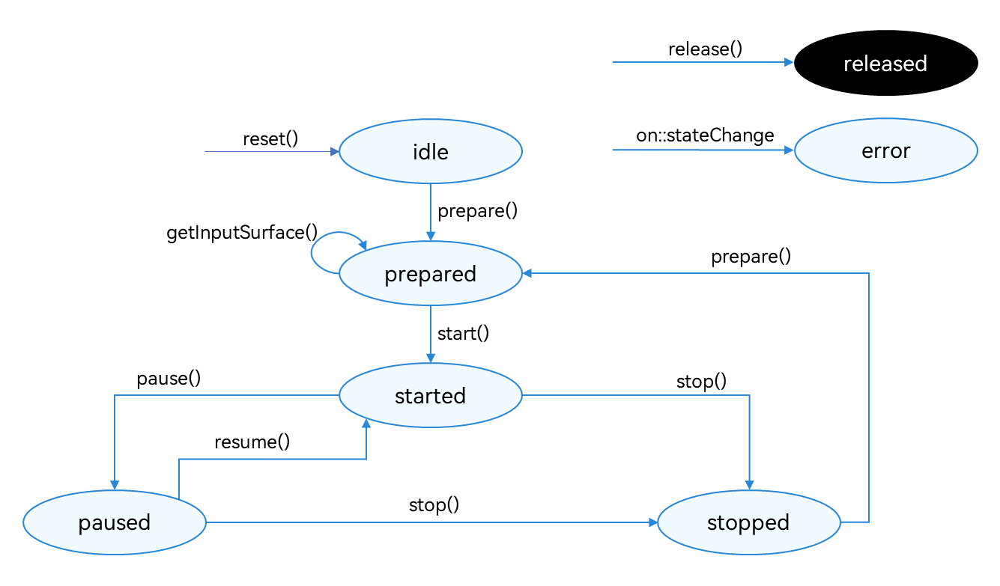

# 使用AVRecorder录制视频(ArkTS)
<!--Kit: Media Kit-->
<!--Subsystem: Multimedia-->
<!--Owner: @gcw_dyOv3Sds-->
<!--Designer: @chris2981-->
<!--Tester: @xdlinc-->
<!--Adviser: @w_Machine_cc-->

当前仅支持[AVRecorder](media-kit-intro.md#avrecorder)开发视频录制，集成了音频捕获，音频编码，视频编码，音视频封装功能，适用于实现简单视频录制并直接得到视频本地文件的场景。

本开发指导将以“开始录制-暂停录制-恢复录制-停止录制”的一次流程为示例，向开发者讲解如何使用AVRecorder进行视频录制。

在进行应用开发的过程中，开发者可以通过AVRecorder的state属性主动获取当前状态，或使用[on('stateChange')](../../reference/apis-media-kit/arkts-apis-media-AVRecorder.md#onstatechange9)方法监听状态变化。开发过程中应该严格遵循状态机要求，例如只能在started状态下调用[pause](../../reference/apis-media-kit/arkts-apis-media-AVRecorder.md#pause9-1)接口，只能在paused状态下调用[resume](../../reference/apis-media-kit/arkts-apis-media-AVRecorder.md#resume9-1)接口。

**图1** 录制状态变化示意图



状态的详细说明请参考[AVRecorderState](../../reference/apis-media-kit/arkts-apis-media-t.md#avrecorderstate9)。


## 申请权限

在开发此功能前，开发者应根据实际需求申请相关权限：
- 当需要使用麦克风时，需要申请**ohos.permission.MICROPHONE**麦克风权限。申请方式请参考：[向用户申请授权](../../security/AccessToken/request-user-authorization.md)。
- 当需要使用相机拍摄时，需要申请**ohos.permission.CAMERA**相机权限。申请方式请参考：[向用户申请授权](../../security/AccessToken/request-user-authorization.md)。
- 当需要从图库读取图片或视频文件时，请优先使用媒体库[Picker选择媒体资源](../medialibrary/photoAccessHelper-photoviewpicker.md)。
- 当需要保存图片或视频文件至图库时，请优先使用[安全控件保存媒体资源](../medialibrary/photoAccessHelper-savebutton.md)。

> **说明：**
>
> 仅应用需要克隆、备份或同步用户公共目录的图片、视频类文件时，可申请ohos.permission.READ_IMAGEVIDEO、ohos.permission.WRITE_IMAGEVIDEO权限来读写图片、视频文件，申请方式请参考<!--RP1-->[申请受控权限](../../security/AccessToken/declare-permissions-in-acl.md)<!--RP1End-->。


## 开发步骤及注意事项

> **说明：**
>
> AVRecorder只负责视频数据的处理，需要与视频数据采集模块配合才能完成视频录制。视频数据采集模块需要通过Surface将视频数据传递给AVRecorder进行数据处理。当前主流的数据采集模块为相机模块，详细实现请参考[相机-录像](../camera/camera-recording.md)。
> 关于文件的创建与存储操作，请参考[应用文件访问与管理](../../file-management/app-file-access.md)，默认存储在应用的沙箱路径之下，如需存储至图库，请使用[安全控件保存媒体资源](../medialibrary/photoAccessHelper-savebutton.md)对沙箱内文件进行存储。


详细API说明请参考[AVRecorder](../../reference/apis-media-kit/arkts-apis-media-AVRecorder.md)。

1. 创建AVRecorder实例，实例创建完成进入idle状态。

   <!-- @[create_recorder](https://gitcode.com/openharmony/applications_app_samples/blob/master/code/DocsSample/Media/AVRecorder/AVRecorder/entry/src/main/ets/services/AVRecorderService.ets) -->
   
   ``` TypeScript
   this.avRecorder = await media.createAVRecorder();
   ```

2. 设置业务需要的监听事件，监听状态变化及错误上报。
   | 事件类型 | 说明 |
   | -------- | -------- |
   | stateChange | 必要事件，监听录制器的state属性改变。 |
   | error | 必要事件，监听录制器的错误信息。 |

   <!-- @[set_callback](https://gitcode.com/openharmony/applications_app_samples/blob/master/code/DocsSample/Media/AVRecorder/AVRecorder/entry/src/main/ets/services/AVRecorderService.ets) -->
   
   ``` TypeScript
   this.avRecorder?.on('stateChange', (state: media.AVRecorderState, reason: media.StateChangeReason) => {
     console.info(`AVRecorder state is changed to ${state}, reason: ${reason}`);
     // 用户可以在此补充状态发生切换后想要进行的动作。
     onStateChanged(state, reason);
   });
   this.avRecorder?.on('error', (error: BusinessError) => {
     console.error(`Error occurred in avRecorder, error code: ${error.code}, message: ${error.message}`);
   });
   ```

3. 配置视频录制参数，调用[prepare](../../reference/apis-media-kit/arkts-apis-media-AVRecorder.md#prepare9-1)接口，此时进入prepared状态。

   > **说明：**
   >
   > 配置参数需要注意：
   >
   > - 配置参数之前需要确保完成对应权限的申请，请参考[申请权限](#申请权限)。
   >
   > - prepare接口的入参avConfig中仅设置视频相关的配置参数，如示例代码所示。
   >   如果添加了音频参数，系统将认为是“音频+视频录制”。
   >
   > - 需要使用支持的[录制规格](media-kit-intro.md#支持的格式)，视频比特率、分辨率、帧率以实际硬件设备支持的范围为准。
   >
   > - 录制输出的url地址（即示例里avConfig中的url），形式为fd://xx (fd number)。需要调用基础文件操作接口（[Core File Kit的ohos.file.fs](../../reference/apis-core-file-kit/js-apis-file-fs.md)）实现应用文件访问能力，获取方式参考[应用文件访问与管理](../../file-management/app-file-access.md)。
   > - 示例中配置的fileFormat视频文件封装格式、videoCodec视频编码格式请参考[AVRecorderProfile](../../reference/apis-media-kit/arkts-apis-media-i.md#avrecorderprofile9)。

   <!-- @[prepare_video_recorder](https://gitcode.com/openharmony/applications_app_samples/blob/master/code/DocsSample/Media/AVRecorder/AVRecorder/entry/src/main/ets/services/AVRecorderService.ets) -->
   
   ``` TypeScript
   public async prepareVideoRecorder(context: common.Context): Promise<void> {
     let path: string = context.filesDir + '/video_example.mp4';
     let file: fileIo.File = await fileIo.open(path, fileIo.OpenMode.READ_WRITE | fileIo.OpenMode.CREATE);
     this.fileFd = file.fd;
   
     let avRecorderConfig: media.AVRecorderConfig = {
       videoSourceType: this.videoSourceType, // 视频源类型。
       profile: {
         videoBitrate: 3000000, // 视频比特率。
         videoCodec: media.CodecMimeType.VIDEO_AVC, // 视频编码格式。
         videoFrameWidth: this.videoResolution.frameWidth, // 视频分辨率的宽。
         videoFrameHeight: this.videoResolution.frameHeight, // 视频分辨率的高。
         videoFrameRate: 30, // 视频帧率。
         fileFormat: media.ContainerFormatType.CFT_MPEG_4 // 封装格式。
       } as media.AVRecorderProfile,
       metadata: {
         videoOrientation: '90' // 视频旋转角度，默认为0不旋转，支持的值为0、90、180、270。
       } as media.AVMetadata,
       url: 'fd://' + file.fd.toString()
     };
   
     try {
       if (this.avRecorder?.state === 'idle' || this.avRecorder?.state === 'stopped') {
         await this.avRecorder?.prepare(avRecorderConfig);
       }
     } catch (error) {
       let err = error as BusinessError;
       console.error(`Failed to prepare avRecorder, error code: ${err.code}, message: ${err.message}`);
       await this.closeFd();
     }
   }
   ```

4. 获取视频录制需要的SurfaceID。

   调用[getInputSurface](../../reference/apis-media-kit/arkts-apis-media-AVRecorder.md#getinputsurface9-1)接口，接口的返回值SurfaceID用于传递给视频数据输入源模块。常用的输入源模块为相机，以下示例代码中，采用相机作为视频输入源为例。

     输入源模块通过SurfaceID可以获取到Surface，通过Surface可以将视频数据流传递给AVRecorder，由AVRecorder再进行视频数据的处理。

   <!-- @[get_input_surface](https://gitcode.com/openharmony/applications_app_samples/blob/master/code/DocsSample/Media/AVRecorder/AVRecorder/entry/src/main/ets/services/AVRecorderService.ets) -->
   
   ``` TypeScript
   let surfaceId: string | undefined = undefined;
   try {
     surfaceId = await this.avRecorder?.getInputSurface();
   } catch (error) {
     let err = error as BusinessError;
     console.error(`Failed to get input surface, error code: ${err.code}, message: ${err.message}`);
   }
   ```

5. 初始化视频数据输入源。该步骤需要在输入源模块完成，以相机为例，需要创建录像输出流，包括创建Camera对象、获取相机列表、创建相机输入流等，相机详细步骤请参考[相机-录像方案](../camera/camera-recording.md)。

6. 开始录制，启动输入源输入视频数据，例如相机模块调用camera.VideoOutput.start接口启动相机录制。然后调用[start](../../reference/apis-media-kit/arkts-apis-media-AVRecorder.md#start9-1)接口，此时AVRecorder进入started状态。

   <!-- @[start_recorder](https://gitcode.com/openharmony/applications_app_samples/blob/master/code/DocsSample/Media/AVRecorder/AVRecorder/entry/src/main/ets/services/AVRecorderService.ets) -->
   
   ``` TypeScript
   await this.avRecorder?.start();
   ```

7. 暂停录制，调用[pause](../../reference/apis-media-kit/arkts-apis-media-AVRecorder.md#pause9-1)接口，此时AVRecorder进入paused状态，同时暂停输入源输入数据。例如相机模块调用camera.VideoOutput.stop停止相机视频数据输入。

   <!-- @[pause_recorder](https://gitcode.com/openharmony/applications_app_samples/blob/master/code/DocsSample/Media/AVRecorder/AVRecorder/entry/src/main/ets/services/AVRecorderService.ets) -->
   
   ``` TypeScript
   await this.avRecorder?.pause();
   ```

8. 恢复录制，调用[resume](../../reference/apis-media-kit/arkts-apis-media-AVRecorder.md#resume9-1)接口，此时再次进入started状态。

   <!-- @[resume_recorder](https://gitcode.com/openharmony/applications_app_samples/blob/master/code/DocsSample/Media/AVRecorder/AVRecorder/entry/src/main/ets/services/AVRecorderService.ets) -->
   
   ``` TypeScript
   await this.avRecorder?.resume();
   ```

9. 停止录制，调用[stop](../../reference/apis-media-kit/arkts-apis-media-AVRecorder.md#stop9-1)接口，此时进入stopped状态，同时停止相机录制。

   <!-- @[stop_recorder](https://gitcode.com/openharmony/applications_app_samples/blob/master/code/DocsSample/Media/AVRecorder/AVRecorder/entry/src/main/ets/services/AVRecorderService.ets) -->
   
   ``` TypeScript
   await this.avRecorder?.stop();
   await this.closeFd();
   ```

10. 重置资源，调用[reset](../../reference/apis-media-kit/arkts-apis-media-AVRecorder.md#reset9-1)接口，重新进入idle状态，允许重新配置录制参数。

    <!-- @[reset_recorder](https://gitcode.com/openharmony/applications_app_samples/blob/master/code/DocsSample/Media/AVRecorder/AVRecorder/entry/src/main/ets/services/AVRecorderService.ets) -->
    
    ``` TypeScript
    await this.avRecorder?.reset();
    ```

11. 销毁实例，调用[release](../../reference/apis-media-kit/arkts-apis-media-AVRecorder.md#release9-1)接口，进入released状态，退出录制，释放视频数据输入源相关资源，例如相机资源。

    <!-- @[release_recorder](https://gitcode.com/openharmony/applications_app_samples/blob/master/code/DocsSample/Media/AVRecorder/AVRecorder/entry/src/main/ets/services/AVRecorderService.ets) -->
    
    ``` TypeScript
    await this.avRecorder?.release();
    ```

## 完整示例

参考以下示例，完成“开始录制-暂停录制-恢复录制-停止录制”的完整流程。

<!-- @[full_video_recorder](https://gitcode.com/openharmony/applications_app_samples/blob/master/code/DocsSample/Media/AVRecorder/AVRecorder/entry/src/main/ets/services/AVRecorderService.ets) -->

``` TypeScript
import { BusinessError } from '@kit.BasicServicesKit';
import { media } from '@kit.MediaKit';
import { fileIo } from '@kit.CoreFileKit';
import { common } from '@kit.AbilityKit';
import { Resolution } from './CommonTypes';

export default class AVRecorderService {
  private avRecorder: media.AVRecorder | undefined = undefined;
  private fileFd: number | undefined = undefined;

  private audioSampleRate: number = 48000;
  private videoSourceType: media.VideoSourceType = media.VideoSourceType.VIDEO_SOURCE_TYPE_SURFACE_YUV;
  private videoResolution: Resolution = { frameWidth: 1920, frameHeight: 1080 } as Resolution;

  public async createRecorder(): Promise<void> {
    await this.releaseRecorder();
    try {
      this.avRecorder = await media.createAVRecorder();
    } catch (err) {
      let error: BusinessError = err as BusinessError;
      console.error(`Failed to create avRecorder, error code: ${error.code}, message: ${error.message}`);
    }
  }

  public setCallback(onStateChanged: media.OnAVRecorderStateChangeHandler): void {
    if (this.avRecorder) {
      console.info('setCallback');
    }
    this.avRecorder?.on('stateChange', (state: media.AVRecorderState, reason: media.StateChangeReason) => {
      console.info(`AVRecorder state is changed to ${state}, reason: ${reason}`);
      // 用户可以在此补充状态发生切换后想要进行的动作。
      onStateChanged(state, reason);
    });
    this.avRecorder?.on('error', (error: BusinessError) => {
      console.error(`Error occurred in avRecorder, error code: ${error.code}, message: ${error.message}`);
    });
  }

  // ...

  public async prepareVideoRecorder(context: common.Context): Promise<void> {
    let path: string = context.filesDir + '/video_example.mp4';
    let file: fileIo.File = await fileIo.open(path, fileIo.OpenMode.READ_WRITE | fileIo.OpenMode.CREATE);
    this.fileFd = file.fd;

    let avRecorderConfig: media.AVRecorderConfig = {
      videoSourceType: this.videoSourceType, // 视频源类型。
      profile: {
        videoBitrate: 3000000, // 视频比特率。
        videoCodec: media.CodecMimeType.VIDEO_AVC, // 视频编码格式。
        videoFrameWidth: this.videoResolution.frameWidth, // 视频分辨率的宽。
        videoFrameHeight: this.videoResolution.frameHeight, // 视频分辨率的高。
        videoFrameRate: 30, // 视频帧率。
        fileFormat: media.ContainerFormatType.CFT_MPEG_4 // 封装格式。
      } as media.AVRecorderProfile,
      metadata: {
        videoOrientation: '90' // 视频旋转角度，默认为0不旋转，支持的值为0、90、180、270。
      } as media.AVMetadata,
      url: 'fd://' + file.fd.toString()
    };

    try {
      if (this.avRecorder?.state === 'idle' || this.avRecorder?.state === 'stopped') {
        await this.avRecorder?.prepare(avRecorderConfig);
      }
    } catch (error) {
      let err = error as BusinessError;
      console.error(`Failed to prepare avRecorder, error code: ${err.code}, message: ${err.message}`);
      await this.closeFd();
    }
  }

  async getInputSurface(): Promise<string | undefined> {
    let surfaceId: string | undefined = undefined;
    try {
      surfaceId = await this.avRecorder?.getInputSurface();
    } catch (error) {
      let err = error as BusinessError;
      console.error(`Failed to get input surface, error code: ${err.code}, message: ${err.message}`);
    }
    return surfaceId;
  }

  public async startRecorder(): Promise<void> {
    try {
      if (this.avRecorder?.state === 'prepared') {
        await this.avRecorder?.start();
      }
    } catch (error) {
      let err = error as BusinessError;
      console.error(`Failed to start avRecorder, error code: ${err.code}, message: ${err.message}`);
    }
  }

  public async pauseRecorder(): Promise<void> {
    try {
      if (this.avRecorder?.state === 'started') {
        await this.avRecorder?.pause();
      }
    } catch (error) {
      let err = error as BusinessError;
      console.error(`Failed to pause avRecorder, error code: ${err.code}, message: ${err.message}`);
    }
  }

  public async resumeRecorder(): Promise<void> {
    try {
      if (this.avRecorder?.state === 'paused') {
        await this.avRecorder?.resume();
      }
    } catch (error) {
      let err = error as BusinessError;
      console.error(`Failed to resume avRecorder, error code: ${err.code}, message: ${err.message}`);
    }
  }

  public async stopRecorder(): Promise<void> {
    try {
      if (this.avRecorder?.state === 'started' || this.avRecorder?.state === 'paused') {
        await this.avRecorder?.stop();
        await this.closeFd();
      }
    } catch (error) {
      let err = error as BusinessError;
      console.error(`Failed to stop avRecorder, error code: ${err.code}, message: ${err.message}`);
      await this.closeFd();
    }
  }

  public async resetRecorder(): Promise<void> {
    try {
      await this.avRecorder?.reset();
    } catch (error) {
      let err = error as BusinessError;
      console.error(`Failed to reset avRecorder, error code: ${err.code}, message: ${err.message}`);
    }
  }

  public async releaseRecorder(): Promise<void> {
    try {
      this.avRecorder?.off('stateChange');
      this.avRecorder?.off('error');
      await this.avRecorder?.release();
      this.avRecorder = undefined;
    } catch (error) {
      let err = error as BusinessError;
      console.error(`Failed to release avRecorder, error code: ${err.code}, message: ${err.message}`);
    }
  }

  public async closeFd(): Promise<void> {
    try {
      if (this.fileFd) {
        await fileIo.close(this.fileFd!);
        this.fileFd = undefined;
      }
    } catch (error) {
      let err = error as BusinessError;
      console.error(`Failed to close fd, error code: ${err.code}, message: ${err.message}`);
    }
  }
}
```
