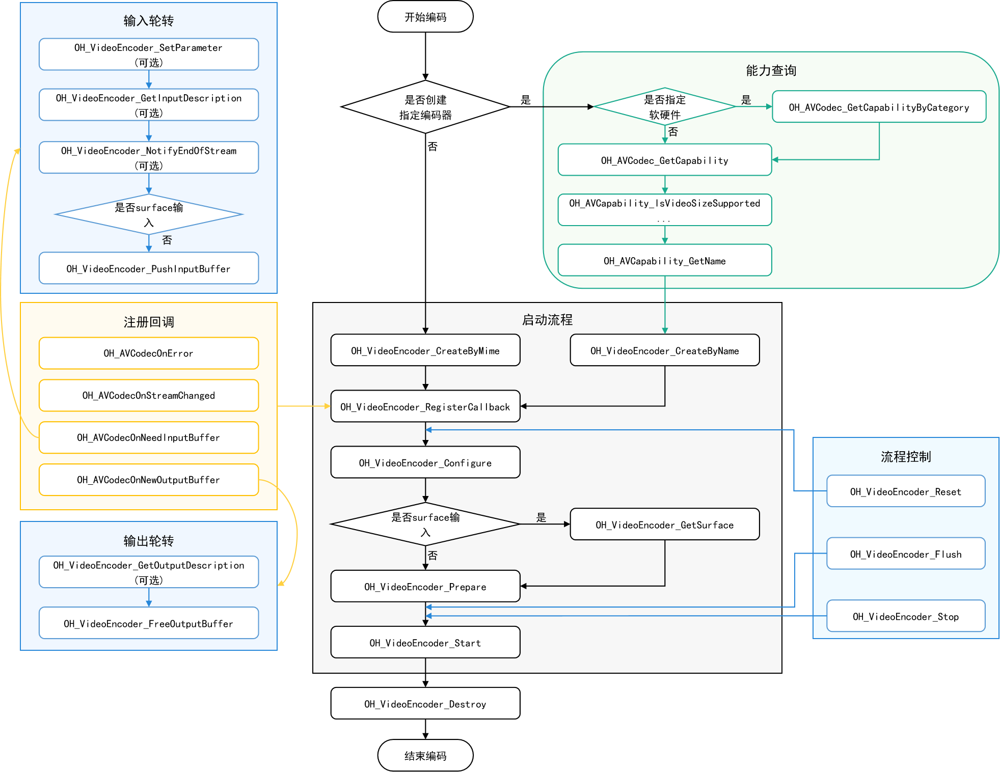

# 视频编码

开发者可以调用本模块的Native API接口，完成视频编码，即将未压缩的音视频数据压缩成音视频码流。

当前支持的编码能力如下：

| 容器规格 | 视频编码类型        | 音频编码类型   |
| -------- | --------------------- | ---------------- |
| mp4      | HEVC（H.265）、 AVC（H.264） | AAC、MPEG（MP3） |
| m4a      | HEVC（H.265）、 AVC（H.264） | AAC |

## Surface输入与Buffer输入

两者的数据来源不同。

Surface输入包含了像素数据、像素格式等信息，如相机模块直接传入的录制视频流等。更适用于实时采集等场景。

Buffer输入是指一块内存区域，一般为字节数组或指向内存的指针。更适用于从文件中读取音视频数据，或是实时流式传输等场景。

在接口调用的过程中，两种方式的接口调用方式基本一致，但存在以下差异点：

1. Buffer模式下，应用调用OH_VideoEncoder_PushInputData()输入数据；Surface模式下，应用应在编码器启动前调用OH_VideoEncoder_GetSurface()，获取Surface用于传递视频数据。

2. Buffer模式下，应用调用OH_VideoEncoder_PushInputData()传入结束flag，编码器读取到尾帧后，停止编码；Surface模式下，需要调用OH_VideoEncoder_NotifyEndOfStream()通知编码器输入流结束。

两种模式的开发步骤详细说明请参考：[Buffer模式](#buffer模式)和[Surface模式](#surface模式)。

## 开发指导

详细的API说明请参考[API文档](../reference/native-apis/_video_encoder.md)。
如下为视频编码调用关系图：


### 在 CMake 脚本中链接动态库

``` cmake
target_link_libraries(sample PUBLIC libnative_media_codecbase.so)
target_link_libraries(sample PUBLIC libnative_media_core.so)
target_link_libraries(sample PUBLIC libnative_media_venc.so)
```

### Buffer模式

参考以下示例代码，开发者可以完成Buffer输入模式下，视频编码的全流程。此处以YUV文件输入，编码成H.264格式为例。
本模块目前仅支持异步模式的数据轮转。

1. 添加头文件。

   ```cpp
   #include <multimedia/player_framework/native_avcodec_videodecoder.h>
   #include <multimedia/player_framework/native_avcapability.h>
   #include <multimedia/player_framework/native_avcodec_base.h>
   #include <multimedia/player_framework/native_avformat.h>
   ```

2. 创建编码器实例对象。

   应用可以通过名称或媒体类型创建编码器。

    ``` c++
    // 通过 MIME TYPE 创建编码器，系统会根据MIME创建最合适的编码器。
    OH_AVCodec *videoEnc = OH_VideoEncoder_CreateByMime(OH_AVCODEC_MIMETYPE_VIDEO_AVC);
    ```

    ```c++
    // 通过codec name创建编码器，应用有特殊需求，比如选择支持某种分辨率规格的编码器，可先查询capability，再根据codec name创建编码器。
    OH_AVCapability *capability = OH_AVCodec_GetCapability(OH_AVCODEC_MIMETYPE_VIDEO_AVC, true);
    const char *codecName = OH_AVCapability_GetName(capability);
    OH_AVCodec *videoEnc = OH_VideoEncoder_CreateByName(codecName);
    ```

3. 调用OH_VideoEncoder_SetCallback()设置回调函数。

   > **注意：**
   >
   > 在回调函数中，对数据队列进行操作时，需要注意多线程冲突的问题。

   注册回调函数指针集合OH_AVCodecAsyncCallback，包括：

   - 编码器运行错误
   - 码流信息变化，如声道变化等。
   - 运行过程中需要新的输入数据，即编码器已准备好，可以输入PCM数据。
   - 运行过程中产生了新的输出数据，即编码完成。

   开发者可以通过处理该回调报告的信息，确保编码器正常运转。

    ``` c++
    // 编码异常回调OH_AVCodecOnError实现
    static void OnError(OH_AVCodec *codec, int32_t errorCode, void *userData)
    {
        (void)codec;
        (void)errorCode;
        (void)userData;
    }

    // 编码数据流变化回调OH_AVCodecOnStreamChanged实现
    static void OnStreamChanged(OH_AVCodec *codec, OH_AVFormat *format, void *userData)
    {
        (void)codec;
        (void)format;
        (void)userData;
    }

    // 编码输入回调OH_AVCodecOnNeedInputData实现
    static void OnNeedInputData(OH_AVCodec *codec, uint32_t index, OH_AVMemory *mem, void *userData)
    {
        (void)userData;
        // 输入帧buffer对应的index，送入InIndexQueue队列
        // 输入帧的数据mem送入InBufferQueue队列
        // 数据处理，请参考:
        // 7. 写入编码码流
        // 8. 通知编码器码流结束
    }

    // 编码输出回调OH_AVCodecOnNewOutputData实现
    static void OnNeedOutputData(OH_AVCodec *codec, uint32_t index, OH_AVMemory *mem, 
                                 OH_AVCodecBufferAttr *attr, void *userData)
    {
        (void)userData;
        // 完成帧buffer对应的index，送入outIndexQueue队列
        // 完成帧的数据mem送入outBufferQueue队列
        // 完成帧的数据格式送入outAttrQueue队列
        // 数据处理，请参考:
        // 9. 输出编码帧
    }

    // 配置异步回调，调用 OH_VideoEncoder_SetCallback 接口
    OH_AVCodecAsyncCallback cb = {&OnError, &OnStreamChanged, &OnNeedInputData, &OnNeedOutputData};
    int32_t ret = OH_VideoEncoder_SetCallback(videoEnc, cb, userData);
    if (ret != AV_ERR_OK) {
        // 异常处理
    }
    ```

4. 调用OH_VideoEncoder_Configure()配置编码器。

   目前支持的所有格式都必须配置以下选项：视频帧宽度、视频帧高度、视频像素格式。  
   示例中的变量如下：
    - DEFAULT_WIDTH：320像素宽度；  
    - DEFAULT_HEIGHT：240像素高度；  
    - DEFAULT_PIXELFORMAT： 像素格式，因为示例使用YUV的文件保存的像素格式是YUV420P，所以设置为 AV_PIXEL_FORMAT_YUVI420。  

    ``` c++
    // 配置视频帧宽度（必须）
    constexpr uint32_t DEFAULT_WIDTH = 320; 
    // 配置视频帧高度（必须）
    constexpr uint32_t DEFAULT_HEIGHT = 240;
    // 配置视频像素格式（必须）
    constexpr OH_AVPixelFormat DEFAULT_PIXELFORMAT = AV_PIXEL_FORMAT_YUVI420;
    OH_AVFormat *format = OH_AVFormat_Create();
    // 写入format
    OH_AVFormat_SetIntValue(format, OH_MD_KEY_WIDTH, DEFAULT_WIDTH);
    OH_AVFormat_SetIntValue(format, OH_MD_KEY_HEIGHT, DEFAULT_HEIGHT);
    OH_AVFormat_SetIntValue(format, OH_MD_KEY_PIXEL_FORMAT, DEFAULT_PIXELFORMAT);
    // 配置编码器
    int32_t ret = OH_VideoEncoder_Configure(videoEnc, format);
    if (ret != AV_ERR_OK) {
        // 异常处理
    }
    ```

5. 调用OH_VideoEncoder_Prepare()，编码器就绪。

   该接口将在编码器运行前进行一些数据的准备工作。

    ``` c++
    ret = OH_VideoEncoder_Prepare(videoEnc);
    if (ret != AV_ERR_OK) {
        // 异常处理
    }
    ```

6. 调用OH_VideoEncoder_Start()启动编码器，进入运行态。

   启动编码器后，回调函数将开始响应事件。所以，需要先配置输入文件、输出文件。

    ``` c++
    // 配置待编码文件路径
    string_view inputFilePath = "/*yourpath*.yuv";
    string_view outputFilePath = "/*yourpath*.h264";
    std::unique_ptr<std::ifstream> inputFile = std::make_unique<std::ifstream>();
    std::unique_ptr<std::ofstream> outputFile = std::make_unique<std::ofstream>();
    inputFile->open(inputFilePath.data(), std::ios::in | std::ios::binary);
    outputFile->open(outputFilePath.data(), std::ios::out | std::ios::binary | std::ios::ate);
    // 启动编码器，开始编码
    int32_t ret = OH_VideoEncoder_Start(videoEnc);
    if (ret != AV_ERR_OK) {
        // 异常处理
    }
    ```

7. （可选）动态配置编码器实例。

    ``` c++
    OH_AVFormat *format = OH_AVFormat_Create();
    // 配置视频帧速率
    double frameRate = 30.0;
    // 配置视频YUV值范围标志
    bool rangeFlag = false;
    // 配置视频原色
    int32_t primary = static_cast<int32_t>(OH_ColorPrimary::COLOR_PRIMARY_BT709);
    // 配置传输特性
    int32_t transfer = static_cast<int32_t>(OH_TransferCharacteristic::TRANSFER_CHARACTERISTIC_BT709);
    // 配置最大矩阵系数
    int32_t matrix = static_cast<int32_t>(OH_MaxtrixCoefficient::MATRIX_COEFFICIENT_IDENTITY);
    // 配置编码Profile
    int32_t profile = static_cast<int32_t>(OH_AVCProfile::AVC_PROFILE_BASELINE);
    // 配置编码比特率模式
    int32_t rateMode = static_cast<int32_t>(OH_VideoEncodeBitrateMode::CBR);
    // 配置关键帧的间隔，单位为毫秒
    int32_t iFrameInterval = 23000;
    // 配置所需的编码质量。只有在恒定质量模式下配置的编码器才支持此配置
    int32_t quality = 0;
    // 配置比特率
    int64_t bitRate = 3000000;
    // 写入format
    OH_AVFormat_SetDoubleValue(format, OH_MD_KEY_FRAME_RATE, frameRate);
    OH_AVFormat_SetIntValue(format, OH_MD_KEY_RANGE_FLAG, rangeFlag);
    OH_AVFormat_SetIntValue(format, OH_MD_KEY_COLOR_PRIMARIES, primary);
    OH_AVFormat_SetIntValue(format, OH_MD_KEY_TRANSFER_CHARACTERISTICS, transfer);
    OH_AVFormat_SetIntValue(format, OH_MD_KEY_MATRIX_COEFFICIENTS, matrix);
    
    OH_AVFormat_SetIntValue(format, OH_MD_KEY_I_FRAME_INTERVAL, iFrameInterval);
    OH_AVFormat_SetIntValue(format, OH_MD_KEY_PROFILE, profile);
    OH_AVFormat_SetIntValue(format, OH_MD_KEY_VIDEO_ENCODE_BITRATE_MODE, rateMode);
    OH_AVFormat_SetLongValue(format, OH_MD_KEY_BITRATE, bitRate);
    OH_AVFormat_SetIntValue(format, OH_MD_KEY_QUALITY, quality);

    int32_t ret = OH_VideoEncoder_SetParameter(videoEnc, format);
    if (ret != AV_ERR_OK) {
        // 异常处理
    }
    ```

8. 调用OH_VideoEncoder_PushInputData()，写入编码码流。

    送入输入队列进行编码，以下示例中：  
    - GetOneFrameSize()：计算yuv文件帧长度的函数，具体的计算过程请参阅YUV相关资料。
    - mem：回调函数OnNeedInputData传入的参数，可以通过OH_AVMemory_GetAddr接口得到共享内存地址的指针。
    - index：回调函数OnNeedInputData传入的参数，数据队列的索引。  

    ``` c++
    // 处理文件流得到帧的长度，再将需要编码的数据写入到对应index的mem中
    int32_t frameSize = GetOneFrameSize();
    inputFile->read(reinterpret_cast<char *>(OH_AVMemory_GetAddr(mem)), frameSize);
    // 配置buffer info信息
    OH_AVCodecBufferAttr info;
    info.size = frameSize;
    info.offset = 0;
    info.pts = 0;
    info.flags = AVCODEC_BUFFER_FLAGS_CODEC_DATA;
    // 送入编码输入队列进行编码，index为对应输入队列的下标
    int32_t ret = OH_VideoEncoder_PushInputData(videoEnc, index, info);
    if (ret != AV_ERR_OK) {
        // 异常处理
    }
    ```

9.  通知编码器码流结束。

    以下示例中：  
    index：回调函数OnNeedInputData传入的参数，数据队列的索引。  
    与“步骤7.写入编码码流一样”，使用同一个接口OH_VideoEncoder_PushInputData，通知编码器输入结束，需要对flag标识成AVCODEC_BUFFER_FLAGS_EOS

    ``` c++
    int32_t ret;
    OH_AVCodecBufferAttr info;
    info.size = 0;
    info.offset = 0;
    info.pts = 0;
    info.flags = AVCODEC_BUFFER_FLAG_EOS;
    ret = OH_VideoEncoder_PushInputData(videoEnc, index, info);
    if (ret != AV_ERR_OK) {
        // 异常处理
    }
    ```

10. 调用OH_VideoEncoder_FreeOutputData()，输出编码帧。

    以下示例中：  
    - index：回调函数OnNeedOutputData传入的参数，数据队列的索引。
    - attr：回调函数OnNeedOutputData传入的参数，输出数据的Buffer信息。
    - mem： 回调函数OnNeedOutputData传入的参数，可以通过OH_AVMemory_GetAddr接口得到共享内存地址的指针。

    ``` c++
    // 将编码完成帧数据mem写入到对应输出文件中
    outputFile->write(reinterpret_cast<char *>(OH_AVMemory_GetAddr(mem)), attr->size);
    // 释放已完成写入的数据，index为对应输出队列的下标
    int32_t ret = OH_VideoEncoder_FreeOutputData(videoEnc, index);
    if (ret != AV_ERR_OK) {
        // 异常处理
    }
    ```

11. （可选）调用OH_VideoEncoder_Flush()刷新编码器。

    调用OH_VideoEncoder_Flush()后，编码器仍处于运行态，但会将当前队列清空，将已编码的数据释放。

    此时需要调用OH_VideoEncoder_Start()重新开始编码。

    ``` c++
    int32_t ret;
    // 刷新编码器videoEnc
    ret = OH_VideoEncoder_Flush(videoEnc);
    if (ret != AV_ERR_OK) {
        // 异常处理
    }
    // 重新开始编码
    ret = OH_VideoEncoder_Start(videoEnc);
    if (ret != AV_ERR_OK) {
        // 异常处理
    }
    ```

12. （可选）调用OH_VideoEncoder_Reset()重置编码器。

    调用OH_VideoEncoder_Reset()后，编码器回到初始化的状态，需要调用OH_VideoEncoder_Configure()重新配置。

    ``` c++
    int32_t ret;
    // 重置编码器videoEnc
    ret = OH_VideoEncoder_Reset(videoEnc);
    if (ret != AV_ERR_OK) {
        // 异常处理
    }
    // 重新配置编码器参数
    ret = OH_VideoEncoder_Configure(videoEnc, format);
    if (ret != AV_ERR_OK) {
        // 异常处理
    }
    ```

13. 调用OH_VideoEncoder_Stop()停止编码器。

    ``` c++
    int32_t ret;
    // 终止编码器videoEnc
    ret = OH_VideoEncoder_Stop(videoEnc);
    if (ret != AV_ERR_OK) {
        // 异常处理
    }
    ```

14. 调用OH_VideoEncoder_Destroy()销毁编码器实例，释放资源。

    > **注意：**
    >
    > 执行该步骤之后，需要开发者将videoEnc指向nullptr，防止野指针导致程序错误。

    ``` c++
    int32_t ret;
    // 调用OH_VideoEncoder_Destroy，注销编码器
    ret = OH_VideoEncoder_Destroy(videoEnc);
    videoEnc = nullptr;
    if (ret != AV_ERR_OK) {
        // 异常处理
    }
    ```

### Surface模式

参考以下示例代码，开发者可以完成Surface输入模式下，视频编码的全流程。此处以视频数据输入，编码成H.264格式为例。
本模块目前仅支持异步模式的数据轮转。

1. 添加头文件。

   ```cpp
   #include <multimedia/player_framework/native_avcodec_videodecoder.h>
   #include <multimedia/player_framework/native_avcapability.h>
   #include <multimedia/player_framework/native_avformat.h>
   #include <multimedia/player_framework/native_avcodec_base.h> 
   ```

2. 创建编码器实例对象。

   应用可以通过名称或媒体类型创建编码器。

    ``` c++
    // 通过 MIME TYPE 创建编码器，系统会根据MIME创建最合适的编码器。
    OH_AVCodec *videoEnc = OH_VideoEncoder_CreateByMime(OH_AVCODEC_MIMETYPE_VIDEO_AVC);
    ```

    ```c++
    // 通过codec name创建编码器，应用有特殊需求，比如选择支持某种分辨率规格的编码器，可先查询capability，再根据codec name创建编码器。
    OH_AVCapability *capability = OH_AVCodec_GetCapability(OH_AVCODEC_MIMETYPE_VIDEO_AVC, true);
    const char *codecName = OH_AVCapability_GetName(capability);
    OH_AVCodec *videoEnc = OH_VideoEncoder_CreateByName(codecName);
    ```

3. 调用OH_VideoEncoder_SetCallback()设置回调函数。

   > **注意：**
   >
   > 在回调函数中，对数据队列进行操作时，需要注意多线程冲突的问题。

   注册回调函数指针集合OH_AVCodecAsyncCallback，包括：

   - 编码器运行错误
   - 码流信息变化，如声道变化等。
   - 运行过程中需要新的输入数据，即编码器已准备好，可以输入PCM数据。
   - 运行过程中产生了新的输出数据，即编码完成。

    ``` c++
    // 设置 OnError 回调函数
    static void OnError(OH_AVCodec *codec, int32_t errorCode, void *userData)
    {
        (void)codec;
        (void)errorCode;
        (void)userData;
    }

    // 设置 OnStreamChanged 回调函数
    static void OnStreamChanged(OH_AVCodec *codec, OH_AVFormat *format, void *userData)
    {
        (void)codec;
        (void)format;
        (void)userData;
    }

    // 设置 OnNeedInputData 回调函数，编码输入帧送入数据队列
    static void OnNeedInputData(OH_AVCodec *codec, uint32_t index, OH_AVMemory *mem, void *userData)
    {
        (void)userData;
        (void)index;
        (void)mem;
        // surface模式下，该回调函数无作用，用户通过配置的surface输入数据
    }
    
    // 设置 OnNeedOutputData 回调函数，编码完成帧送入输出队列
    static void OnNeedOutputData(OH_AVCodec *codec, uint32_t index, OH_AVMemory *mem, 
                                 OH_AVCodecBufferAttr *attr, void *userData)
    {
        (void)userData;
        // 完成帧buffer对应的index，送入outIndexQueue队列
        // 完成帧的数据mem送入outBufferQueue队列
        // 完成帧的数据格式送入outAttrQueue队列
        // 数据处理，请参考:
        // 10. 输出编码帧
    }

    // 配置异步回调，调用 OH_VideoEncoder_SetCallback 接口
    OH_AVCodecAsyncCallback cb = {&OnError, &OnStreamChanged, &OnNeedInputData, &OnNeedOutputData};
    int32_t ret = OH_VideoEncoder_SetCallback(videoEnc, cb, userData);
    if (ret != AV_ERR_OK) {
        // 异常处理
    }
    ```

4. 调用OH_VideoEncoder_Configure()配置编码器。

   目前支持的所有格式都必须配置以下选项：视频帧宽度、视频帧高度、视频像素格式。  
   示例中的变量如下：
    - DEFAULT_WIDTH：320像素宽度；  
    - DEFAULT_HEIGHT：240像素高度；  
    - DEFAULT_PIXELFORMAT： 像素格式，因为示例使用YUV的文件保存的像素格式是YUV420P，所以设置为 AV_PIXEL_FORMAT_YUVI420。  

    ``` c++
    // 配置视频帧宽度（必须）
    constexpr uint32_t DEFAULT_WIDTH = 320; 
    // 配置视频帧高度（必须）
    constexpr uint32_t DEFAULT_HEIGHT = 240;
    // 配置视频像素格式（必须）
    constexpr OH_AVPixelFormat DEFAULT_PIXELFORMAT = AV_PIXEL_FORMAT_YUVI420;
    OH_AVFormat *format = OH_AVFormat_Create();
    // 写入format
    OH_AVFormat_SetIntValue(format, OH_MD_KEY_WIDTH, DEFAULT_WIDTH);
    OH_AVFormat_SetIntValue(format, OH_MD_KEY_HEIGHT, DEFAULT_HEIGHT);
    OH_AVFormat_SetIntValue(format, OH_MD_KEY_PIXEL_FORMAT, DEFAULT_PIXELFORMAT);
    // 配置编码器
    int32_t ret = OH_VideoEncoder_Configure(videoEnc, format);
    if (ret != AV_ERR_OK) {
        // 异常处理
    }
    ```

5. 调用OH_VideoEncoder_Prepare()，编码器就绪。

   该接口将在编码器运行前进行一些数据的准备工作。

    ``` c++
    ret = OH_VideoEncoder_Prepare(videoEnc);
    if (ret != AV_ERR_OK) {
        // 异常处理
    }
    ```

6. 获取Surface。

    获取编码器Surface模式的OHNativeWindow输入，获取Surface需要在启动编码器之前完成。

    ``` c++
    int32_t ret;
    // 获取需要输入的Surface，以进行编码
    OHNativeWindow *nativeWindow;
    ret =  OH_VideoEncoder_GetSurface(videoEnc, &nativeWindow);
    if (ret != AV_ERR_OK) {
        // 异常处理
    }
    // 通过OHNativeWindow*变量类型，配置输入数据的Surface
    ```

    OHNativeWindow*变量类型的使用方法请参考图形子系统 [NativeWindow](../reference/native-apis/_native_window.md)

7. 调用OH_VideoEncoder_Start()启动编码器。

    ``` c++
    int32_t ret;
    // 启动编码器，开始编码
    ret = OH_VideoEncoder_Start(videoEnc);
    if (ret != AV_ERR_OK) {
        // 异常处理
    }
    ```

8. （可选）动态配置编码器实例。

    ``` c++
    OH_AVFormat *format = OH_AVFormat_Create();
    // 配置视频帧速率
    double frameRate = 30.0;
    // 配置视频YUV值范围标志
    bool rangeFlag = false;
    // 配置视频原色
    int32_t primary = static_cast<int32_t>(OH_ColorPrimary::COLOR_PRIMARY_BT709);
    // 配置传输特性
    int32_t transfer = static_cast<int32_t>(OH_TransferCharacteristic::TRANSFER_CHARACTERISTIC_BT709);
    // 配置最大矩阵系数
    int32_t matrix = static_cast<int32_t>(OH_MaxtrixCoefficient::MATRIX_COEFFICIENT_IDENTITY);
    // 配置编码Profile
    int32_t profile = static_cast<int32_t>(OH_AVCProfile::AVC_PROFILE_BASELINE);
    // 配置编码比特率模式
    int32_t rateMode = static_cast<int32_t>(OH_VideoEncodeBitrateMode::CBR);
    // 配置关键帧的间隔，单位为毫秒
    int32_t iFrameInterval = 23000;
    // 配置所需的编码质量。只有在恒定质量模式下配置的编码器才支持此配置
    int32_t quality = 0;
    // 配置比特率
    int64_t bitRate = 3000000;
    // 写入format
    OH_AVFormat_SetDoubleValue(format, OH_MD_KEY_FRAME_RATE, frameRate);
    OH_AVFormat_SetIntValue(format, OH_MD_KEY_RANGE_FLAG, rangeFlag);
    OH_AVFormat_SetIntValue(format, OH_MD_KEY_COLOR_PRIMARIES, primary);
    OH_AVFormat_SetIntValue(format, OH_MD_KEY_TRANSFER_CHARACTERISTICS, transfer);
    OH_AVFormat_SetIntValue(format, OH_MD_KEY_MATRIX_COEFFICIENTS, matrix);
    
    OH_AVFormat_SetIntValue(format, OH_MD_KEY_I_FRAME_INTERVAL, iFrameInterval);
    OH_AVFormat_SetIntValue(format, OH_MD_KEY_PROFILE, profile);
    OH_AVFormat_SetIntValue(format, OH_MD_KEY_VIDEO_ENCODE_BITRATE_MODE, rateMode);
    OH_AVFormat_SetLongValue(format, OH_MD_KEY_BITRATE, bitRate);
    OH_AVFormat_SetIntValue(format, OH_MD_KEY_QUALITY, quality);

    int32_t ret = OH_VideoEncoder_SetParameter(videoEnc, format);
    if (ret != AV_ERR_OK) {
        // 异常处理
    }
    ```

9. 写入编码码流。

    在之前的第5步中，开发者已经对OH_VideoEncoder_GetSurface接口返回的OHNativeWindow*类型变量进行配置。  
    因为编码所需的数据，由配置的Surface进行持续地输入，所以开发者无需对OnNeedInputData回调函数进行处理，也无需使用OH_VideoEncoder_PushInputData接口输入数据。  

10. 调用OH_VideoEncoder_NotifyEndOfStream()通知编码器码流结束。

    ``` c++
    int32_t ret;
    // surface模式：通知视频编码器输入流已结束，只能使用此接口进行通知
    // 不能像buffer模式中将flag设为AVCODEC_BUFFER_FLAGS_EOS，再调用OH_VideoEncoder_PushInputData接口通知编码器输入结束
    ret = OH_VideoEncoder_NotifyEndOfStream(videoEnc);
    if (ret != AV_ERR_OK) {
        // 异常处理
    }
    ```

11. 调用OH_VideoEncoder_FreeOutputData()，输出编码帧。

    以下示例中：  
    - index：回调函数OnNeedOutputData传入的参数，数据队列的索引。
    - attr：回调函数OnNeedOutputData传入的参数，输出数据的Buffer信息。
    - mem： 回调函数OnNeedOutputData传入的参数，可以通过OH_AVMemory_GetAddr接口得到共享内存地址的指针。

    ``` c++
    // 将编码完成帧数据mem写入到对应输出文件中
    outputFile->write(reinterpret_cast<char *>(OH_AVMemory_GetAddr(mem)), attr->size);
    // 释放已完成写入的数据，index为对应输出队列下标
    int32_t ret = OH_VideoEncoder_FreeOutputData(videoEnc, index);
    if (ret != AV_ERR_OK) {
        // 异常处理
    }
    ```

后续流程（包括刷新编码器、重置编码器、停止编码器、销毁编码器）与Buffer模式一致，请参考[Buffer模式](#buffer模式)的步骤9-12。
