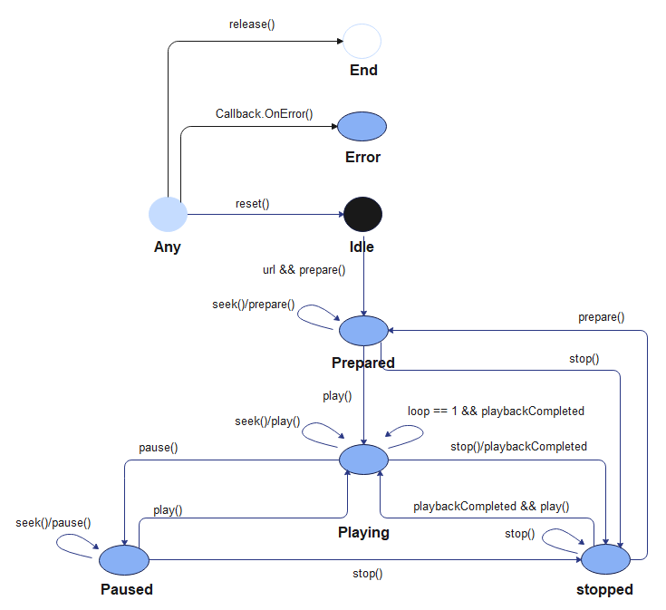
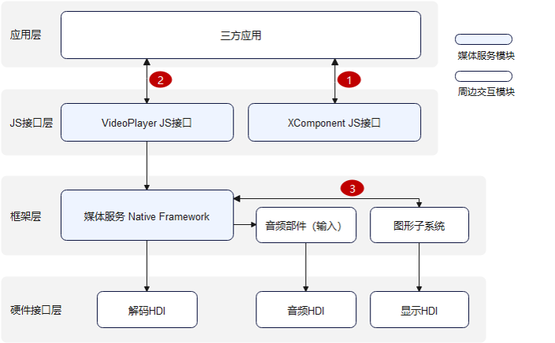

# 视频播放开发指导

## 简介

视频播放的主要工作是将视频数据转码并输出到设备进行播放，同时管理播放任务，包括开始播放、暂停播放、停止播放、资源释放、音量设置、跳转播放位置、设置倍数、获取轨道信息等功能控制。本文将对视频播放全流程、视频切换、视频循环播放等场景开发进行介绍说明。

## 运作机制

该模块提供了视频播放状态变化示意图和视频播放外部模块交互图。

**图1** 视频播放状态变化示意图



**图2** 视频播放外部模块交互图



**说明**：三方应用通过调用JS接口层提供的js接口实现相应功能时，框架层会通过Native Framework的媒体服务，调用音频部件将软件解码后的音频数据，输出至音频HDI，和图形子系统将硬件接口层的解码HDI部件的解码后的图像数据，输出至显示HDI，实现视频播放功能。

*注意：视频播放需要显示、音频、编解码等硬件能力。*

1. 三方应用从Xcomponent组件获取surfaceID。
2. 三方应用把surfaceID传递给VideoPlayer JS。
3. 媒体服务把帧数据flush给surface buffer。

## 兼容性说明

推荐使用视频软件主流的播放格式和主流分辨率，不建议开发者自制非常或者异常码流，以免产生无法播放、卡住、花屏等兼容性问题。若发生此类问题不会影响系统，退出码流播放即可。

主流的播放格式和主流分辨率如下：

| 视频容器规格 |                     规格描述                      |               分辨率               |
| :----------: | :-----------------------------------------------: | :--------------------------------: |
|     mp4      | 视频格式：H264/MPEG2/MPEG4/H263 音频格式：AAC/MP3 | 主流分辨率，如1080P/720P/480P/270P |
|     mkv      | 视频格式：H264/MPEG2/MPEG4/H263 音频格式：AAC/MP3 | 主流分辨率，如1080P/720P/480P/270P |
|      ts      |   视频格式：H264/MPEG2/MPEG4 音频格式：AAC/MP3    | 主流分辨率，如1080P/720P/480P/270P |
|     webm     |          视频格式：VP8 音频格式：VORBIS           | 主流分辨率，如1080P/720P/480P/270P |

## 开发指导

详细API含义可参考：[媒体服务API文档VideoPlayer](../reference/apis/js-apis-media.md#videoplayer8)

### 全流程场景

视频播放的全流程场景包含：创建实例，设置url，设置SurfaceId，准备播放视频，播放视频，暂停播放，获取轨道信息，跳转播放位置，设置音量，设置倍速，结束播放，重置，释放资源等流程。

VideoPlayer支持的url媒体源输入类型可参考：[url属性说明](../reference/apis/js-apis-media.md#videoplayer_属性)

Xcomponent创建方法可参考：[Xcomponent创建方法](../reference/arkui-ts/ts-basic-components-xcomponent.md)

```js
import media from '@ohos.multimedia.media'
import fileIO from '@ohos.fileio'
export class VideoPlayerDemo {
  // 函数调用发生错误时用于上报错误信息
  failureCallback(error) {
    console.info(`error happened,error Name is ${error.name}`);
    console.info(`error happened,error Code is ${error.code}`);
    console.info(`error happened,error Message is ${error.message}`);
  }

  // 当函数调用发生异常时用于上报错误信息
  catchCallback(error) {
    console.info(`catch error happened,error Name is ${error.name}`);
    console.info(`catch error happened,error Code is ${error.code}`);
    console.info(`catch error happened,error Message is ${error.message}`);
  }

  // 用于打印视频轨道信息
  printfDescription(obj) {
    for (let item in obj) {
      let property = obj[item];
      console.info('key is ' + item);
      console.info('value is ' + property);
    }
  }

  async videoPlayerDemo() {
    let videoPlayer = undefined;
    let surfaceID = 'test' // surfaceID用于播放画面显示，具体的值需要通过Xcomponent接口获取，相关文档链接见上面Xcomponent创建方法
    let fdPath = 'fd://'
    // path路径的码流可通过"hdc file send D:\xxx\H264_AAC.mp4 /data/app/el1/bundle/public/ohos.acts.multimedia.video.videoplayer/ohos.acts.multimedia.video.videoplayer/assets/entry/resources/rawfile" 命令，将其推送到设备上
    let path = '/data/app/el1/bundle/public/ohos.acts.multimedia.video.videoplayer/ohos.acts.multimedia.video.videoplayer/assets/entry/resources/rawfile/H264_AAC.mp4';
    await fileIO.open(path).then((fdNumber) => {
      fdPath = fdPath + '' + fdNumber;
      console.info('open fd success fd is' + fdPath);
    }, (err) => {
      console.info('open fd failed err is' + err);
    }).catch((err) => {
      console.info('open fd failed err is' + err);
    });
    // 调用createVideoPlayer接口返回videoPlayer实例对象
    await media.createVideoPlayer().then((video) => {
      if (typeof (video) != 'undefined') {
        console.info('createVideoPlayer success!');
        videoPlayer = video;
      } else {
        console.info('createVideoPlayer fail!');
      }
    }, this.failureCallback).catch(this.catchCallback);
    // 设置播放源
    videoPlayer.url = fdPath;

    // 设置surfaceID用于显示视频画面
    await videoPlayer.setDisplaySurface(surfaceID).then(() => {
      console.info('setDisplaySurface success');
    }, this.failureCallback).catch(this.catchCallback);

    // 调用prepare完成播放前准备工作
    await videoPlayer.prepare().then(() => {
      console.info('prepare success');
    }, this.failureCallback).catch(this.catchCallback);

    // 调用play接口正式开始播放
    await videoPlayer.play().then(() => {
      console.info('play success');
    }, this.failureCallback).catch(this.catchCallback);

    // 暂停播放
    await videoPlayer.pause().then(() => {
      console.info('pause success');
    }, this.failureCallback).catch(this.catchCallback);

    // 通过promise回调方式获取视频轨道信息communication_dsoftbus
    let arrayDescription;
    await videoPlayer.getTrackDescription().then((arrlist) => {
      if (typeof (arrlist) != 'undefined') {
        arrayDescription = arrlist;
      } else {
        console.log('video getTrackDescription fail');
      }
    }, this.failureCallback).catch(this.catchCallback);

    for (let i = 0; i < arrayDescription.length; i++) {
      this.printfDescription(arrayDescription[i]);
    }

    // 跳转播放时间到50s位置，具体入参意义请参考接口文档
    let seekTime = 50000;
    await videoPlayer.seek(seekTime, media.SeekMode.SEEK_NEXT_SYNC).then((seekDoneTime) => {
      console.info('seek success');
    }, this.failureCallback).catch(this.catchCallback);

    // 音量设置接口，具体入参意义请参考接口文档
    let volume = 0.5;
    await videoPlayer.setVolume(volume).then(() => {
      console.info('setVolume success');
    }, this.failureCallback).catch(this.catchCallback);

    // 倍速设置接口，具体入参意义请参考接口文档
    let speed = media.PlaybackSpeed.SPEED_FORWARD_2_00_X;
    await videoPlayer.setSpeed(speed).then(() => {
      console.info('setSpeed success');
    }, this.failureCallback).catch(this.catchCallback);

    // 结束播放
    await videoPlayer.stop().then(() => {
      console.info('stop success');
    }, this.failureCallback).catch(this.catchCallback);

    // 重置播放配置
    await videoPlayer.reset().then(() => {
      console.info('reset success');
    }, this.failureCallback).catch(this.catchCallback);

    // 释放播放资源
    await videoPlayer.release().then(() => {
      console.info('release success');
    }, this.failureCallback).catch(this.catchCallback);

    // 相关对象置undefined
    videoPlayer = undefined;
    surfaceID = undefined;
  }
}
```

### 正常播放场景

```js
import media from '@ohos.multimedia.media'
import fileIO from '@ohos.fileio'
export class VideoPlayerDemo {
  // 函数调用发生错误时用于上报错误信息
  failureCallback(error) {
    console.info(`error happened,error Name is ${error.name}`);
    console.info(`error happened,error Code is ${error.code}`);
    console.info(`error happened,error Message is ${error.message}`);
  }

  // 当函数调用发生异常时用于上报错误信息
  catchCallback(error) {
    console.info(`catch error happened,error Name is ${error.name}`);
    console.info(`catch error happened,error Code is ${error.code}`);
    console.info(`catch error happened,error Message is ${error.message}`);
  }

  // 用于打印视频轨道信息
  printfDescription(obj) {
    for (let item in obj) {
      let property = obj[item];
      console.info('key is ' + item);
      console.info('value is ' + property);
    }
  }

  async videoPlayerDemo() {
    let videoPlayer = undefined;
    let surfaceID = 'test' // surfaceID用于播放画面显示，具体的值需要通过Xcomponent接口获取，相关文档链接：
    let fdPath = 'fd://'
    // path路径的码流可通过"hdc file send D:\xxx\H264_AAC.mp4 /data/app/el1/bundle/public/ohos.acts.multimedia.video.videoplayer/ohos.acts.multimedia.video.videoplayer/assets/entry/resources/rawfile" 命令，将其推送到设备上
    let path = '/data/app/el1/bundle/public/ohos.acts.multimedia.video.videoplayer/ohos.acts.multimedia.video.videoplayer/assets/entry/resources/rawfile/H264_AAC.mp4';
    await fileIO.open(path).then((fdNumber) => {
      fdPath = fdPath + '' + fdNumber;
      console.info('open fd success fd is' + fdPath);
    }, (err) => {
      console.info('open fd failed err is' + err);
    }).catch((err) => {
      console.info('open fd failed err is' + err);
    });
    // 调用createVideoPlayer接口返回videoPlayer实例对象
    await media.createVideoPlayer().then((video) => {
      if (typeof (video) != 'undefined') {
        console.info('createVideoPlayer success!');
        videoPlayer = video;
      } else {
        console.info('createVideoPlayer fail!');
      }
    }, this.failureCallback).catch(this.catchCallback);
    // 设置播放源
    videoPlayer.url = fdPath;

    // 设置surfaceID用于显示视频画面
    await videoPlayer.setDisplaySurface(surfaceID).then(() => {
      console.info('setDisplaySurface success');
    }, this.failureCallback).catch(this.catchCallback);

    // 调用prepare完成播放前准备工作
    await videoPlayer.prepare().then(() => {
      console.info('prepare success');
    }, this.failureCallback).catch(this.catchCallback);

    // 调用play接口正式开始播放
    await videoPlayer.play().then(() => {
      console.info('play success');
    }, this.failureCallback).catch(this.catchCallback);

    // 结束播放
    await videoPlayer.stop().then(() => {
      console.info('stop success');
    }, this.failureCallback).catch(this.catchCallback);

    // 释放播放资源
    await videoPlayer.release().then(() => {
      console.info('release success');
    }, this.failureCallback).catch(this.catchCallback);

    // 相关对象置undefined
    videoPlayer = undefined;
    surfaceID = undefined;
  }
}
```

### 切视频场景

```js
import media from '@ohos.multimedia.media'
import fileIO from '@ohos.fileio'
export class VideoPlayerDemo {
  // 函数调用发生错误时用于上报错误信息
  failureCallback(error) {
    console.info(`error happened,error Name is ${error.name}`);
    console.info(`error happened,error Code is ${error.code}`);
    console.info(`error happened,error Message is ${error.message}`);
  }

  // 当函数调用发生异常时用于上报错误信息
  catchCallback(error) {
    console.info(`catch error happened,error Name is ${error.name}`);
    console.info(`catch error happened,error Code is ${error.code}`);
    console.info(`catch error happened,error Message is ${error.message}`);
  }

  // 用于打印视频轨道信息
  printfDescription(obj) {
    for (let item in obj) {
      let property = obj[item];
      console.info('key is ' + item);
      console.info('value is ' + property);
    }
  }

  async videoPlayerDemo() {
    let videoPlayer = undefined;
    let surfaceID = 'test' // surfaceID用于播放画面显示，具体的值需要通过Xcomponent接口获取，相关文档链接：
    let fdPath = 'fd://'
    // path路径的码流可通过"hdc file send D:\xxx\H264_AAC.mp4 /data/app/el1/bundle/public/ohos.acts.multimedia.video.videoplayer/ohos.acts.multimedia.video.videoplayer/assets/entry/resources/rawfile" 命令，将其推送到设备上
    let path = '/data/app/el1/bundle/public/ohos.acts.multimedia.video.videoplayer/ohos.acts.multimedia.video.videoplayer/assets/entry/resources/rawfile/H264_AAC.mp4';
    let nextPath = '/data/app/el1/bundle/public/ohos.acts.multimedia.video.videoplayer/ohos.acts.multimedia.video.videoplayer/assets/entry/resources/rawfile/MP4_AAC.mp4';
    await fileIO.open(path).then((fdNumber) => {
      fdPath = fdPath + '' + fdNumber;
      console.info('open fd success fd is' + fdPath);
    }, (err) => {
      console.info('open fd failed err is' + err);
    }).catch((err) => {
      console.info('open fd failed err is' + err);
    });
    // 调用createVideoPlayer接口返回videoPlayer实例对象
    await media.createVideoPlayer().then((video) => {
      if (typeof (video) != 'undefined') {
        console.info('createVideoPlayer success!');
        videoPlayer = video;
      } else {
        console.info('createVideoPlayer fail!');
      }
    }, this.failureCallback).catch(this.catchCallback);
    // 设置播放源
    videoPlayer.url = fdPath;

    // 设置surfaceID用于显示视频画面
    await videoPlayer.setDisplaySurface(surfaceID).then(() => {
      console.info('setDisplaySurface success');
    }, this.failureCallback).catch(this.catchCallback);

    // 调用prepare完成播放前准备工作
    await videoPlayer.prepare().then(() => {
      console.info('prepare success');
    }, this.failureCallback).catch(this.catchCallback);

    // 调用play接口正式开始播放
    await videoPlayer.play().then(() => {
      console.info('play success');
    }, this.failureCallback).catch(this.catchCallback);

    // 重置播放配置
    await videoPlayer.reset().then(() => {
      console.info('reset success');
    }, this.failureCallback).catch(this.catchCallback);

    // 获取下一个视频fd地址
    fdPath = 'fd://'
    await fileIO.open(nextPath).then((fdNumber) => {
      fdPath = fdPath + '' + fdNumber;
      console.info('open fd success fd is' + fdPath);
    }, (err) => {
      console.info('open fd failed err is' + err);
    }).catch((err) => {
      console.info('open fd failed err is' + err);
    });
    // 设置第二个视频播放源
    videoPlayer.url = fdPath;

    // 调用prepare完成播放前准备工作
    await videoPlayer.prepare().then(() => {
      console.info('prepare success');
    }, this.failureCallback).catch(this.catchCallback);

    // 调用play接口正式开始播放
    await videoPlayer.play().then(() => {
      console.info('play success');
    }, this.failureCallback).catch(this.catchCallback);

    // 释放播放资源
    await videoPlayer.release().then(() => {
      console.info('release success');
    }, this.failureCallback).catch(this.catchCallback);

    // 相关对象置undefined
    videoPlayer = undefined;
    surfaceID = undefined;
  }
}
```

### 单个视频循环场景

```js
import media from '@ohos.multimedia.media'
import fileIO from '@ohos.fileio'
export class VideoPlayerDemo {
  // 函数调用发生错误时用于上报错误信息
  failureCallback(error) {
    console.info(`error happened,error Name is ${error.name}`);
    console.info(`error happened,error Code is ${error.code}`);
    console.info(`error happened,error Message is ${error.message}`);
  }

  // 当函数调用发生异常时用于上报错误信息
  catchCallback(error) {
    console.info(`catch error happened,error Name is ${error.name}`);
    console.info(`catch error happened,error Code is ${error.code}`);
    console.info(`catch error happened,error Message is ${error.message}`);
  }

  // 用于打印视频轨道信息
  printfDescription(obj) {
    for (let item in obj) {
      let property = obj[item];
      console.info('key is ' + item);
      console.info('value is ' + property);
    }
  }

  async videoPlayerDemo() {
    let videoPlayer = undefined;
    let surfaceID = 'test' // surfaceID用于播放画面显示，具体的值需要通过Xcomponent接口获取，相关文档链接：
    let fdPath = 'fd://'
    // path路径的码流可通过"hdc file send D:\xxx\H264_AAC.mp4 /data/app/el1/bundle/public/ohos.acts.multimedia.video.videoplayer/ohos.acts.multimedia.video.videoplayer/assets/entry/resources/rawfile" 命令，将其推送到设备上
    let path = '/data/app/el1/bundle/public/ohos.acts.multimedia.video.videoplayer/ohos.acts.multimedia.video.videoplayer/assets/entry/resources/rawfile/H264_AAC.mp4';
    await fileIO.open(path).then((fdNumber) => {
      fdPath = fdPath + '' + fdNumber;
      console.info('open fd success fd is' + fdPath);
    }, (err) => {
      console.info('open fd failed err is' + err);
    }).catch((err) => {
      console.info('open fd failed err is' + err);
    });
    // 调用createVideoPlayer接口返回videoPlayer实例对象
    await media.createVideoPlayer().then((video) => {
      if (typeof (video) != 'undefined') {
        console.info('createVideoPlayer success!');
        videoPlayer = video;
      } else {
        console.info('createVideoPlayer fail!');
      }
    }, this.failureCallback).catch(this.catchCallback);
    // 设置播放源
    videoPlayer.url = fdPath;

    // 设置surfaceID用于显示视频画面
    await videoPlayer.setDisplaySurface(surfaceID).then(() => {
      console.info('setDisplaySurface success');
    }, this.failureCallback).catch(this.catchCallback);

    // 调用prepare完成播放前准备工作
    await videoPlayer.prepare().then(() => {
      console.info('prepare success');
    }, this.failureCallback).catch(this.catchCallback);
    // 设置循环播放属性
    videoPlayer.loop = true;
    // 调用play接口正式开始循环播放
    await videoPlayer.play().then(() => {
      console.info('play success， loop value is ' + videoPlayer.loop);
    }, this.failureCallback).catch(this.catchCallback);
  }
}
```

## 相关实例
针对视频播放开发，有以下相关实例可供参考：

- [`VideoPlayer:`视频播放（ArkTS）（API9）（Full SDK）](https://gitee.com/openharmony/applications_app_samples/tree/master/media/VideoPlayer)
- [视频播放器（ArkTS）（API 9）](https://gitee.com/openharmony/codelabs/tree/master/Media/VideoPlayerStage)