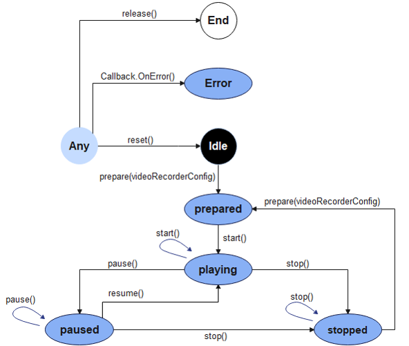
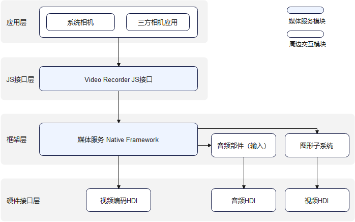

# 视频录制开发指导

## 简介

视频录制的主要工作是捕获音视频信号，完成音视频编码并保存到文件中，帮助开发者轻松实现音视频录制功能，包括开始录制、暂停录制、恢复录制、停止录制、释放资源等功能控制。它允许调用者指定录制的编码格式、封装格式、文件路径等参数。

## 运作机制

该模块提供了视频录制状态变化示意图和视频录制外部模块交互图。

**图1** 视频录制状态变化示意图



**图2** 视频录制外部模块交互图



**说明**：三方相机应用或系统相机通过调用JS接口层提供的js接口实现相应功能时，框架层会通过Native Framework的媒体服务，调用音频部件通过音频HDI捕获的音频数据，再通过软件编码输出编码封装后的音频数据保存至文件中，和图形子系统通过视频HDI捕获的图像数据，再通过视频编码HDI编码，将编码后的图像数据保存至文件中，实现视频录制功能。

## 约束与限制

开发者在进行录制功能开发前，需要先对所开发的应用配置麦克风权限（ohos.permission.MICROPHONE）和相机权限（ohos.permission.CAMERA），权限配置相关内容可参考：[访问控制权限申请指导](../security/accesstoken-guidelines.md)

## 开发指导

详细API含义可参考：[媒体服务API文档VideoRecorder](../reference/apis/js-apis-media.md#videorecorder9)

### 全流程场景

视频录制全流程场景包含：创建实例、设置录制参数、开始录制、暂停录制、恢复录制、停止录制、释放资源等流程。

```js
import media from '@ohos.multimedia.media'
import mediaLibrary from '@ohos.multimedia.mediaLibrary'
export class VideoRecorderDemo {
  private testFdNumber; // 用于保存fd地址
  // pathName是传入的录制文件名，例如：01.mp4，生成后的文件地址：/storage/media/100/local/files/Video/01.mp4
  // 使用mediaLibrary需要添加以下权限, ohos.permission.MEDIA_LOCATION、ohos.permission.WRITE_MEDIA、ohos.permission.READ_MEDIA
  async getFd(pathName) {
    let displayName = pathName;
    const mediaTest = mediaLibrary.getMediaLibrary();
    let fileKeyObj = mediaLibrary.FileKey;
    let mediaType = mediaLibrary.MediaType.VIDEO;
    let publicPath = await mediaTest.getPublicDirectory(mediaLibrary.DirectoryType.DIR_VIDEO);
    let dataUri = await mediaTest.createAsset(mediaType, displayName, publicPath);
    if (dataUri != undefined) {
      let args = dataUri.id.toString();
      let fetchOp = {
        selections : fileKeyObj.ID + "=?",
        selectionArgs : [args],
      }
      let fetchFileResult = await mediaTest.getFileAssets(fetchOp);
      let fileAsset = await fetchFileResult.getAllObject();
      let fdNumber = await fileAsset[0].open('Rw');
      this.testFdNumber = "fd://" + fdNumber.toString();
    }
  }

  // 当发生错误上上报的错误回调接口
  failureCallback(error) {
      console.info('error happened, error name is ' + error.name);
      console.info('error happened, error code is ' + error.code);
      console.info('error happened, error message is ' + error.message);
  }

  // 当发生异常时，系统调用的错误回调接口
  catchCallback(error) {
      console.info('catch error happened, error name is ' + error.name);
      console.info('catch error happened, error code is ' + error.code);
      console.info('catch error happened, error message is ' + error.message);
  }

  async videoRecorderDemo() {
    let videoRecorder = null; // videoRecorder空对象在createVideoRecorder成功后赋值
    let surfaceID = null; // 用于保存getInputSurface返回的surfaceID
    // 获取需要录制的视频的fd地址
    await this.getFd('01.mp4');
    // 录制相关参数配置
    let videoProfile = {
      audioBitrate : 48000,
      audioChannels : 2,
      audioCodec : 'audio/mp4a-latm',
      audioSampleRate : 48000,
      fileFormat : 'mp4',
      videoBitrate : 48000,
      videoCodec : 'video/mp4v-es',
      videoFrameWidth : 640,
      videoFrameHeight : 480,
      videoFrameRate : 30
    }

    let videoConfig = {
      audioSourceType : 1,
      videoSourceType : 0,
      profile : videoProfile,
      url : this.testFdNumber, // testFdNumber由getFd生成
      orientationHint : 0,
      location : { latitude : 30, longitude : 130 }
    }
    // 创建videoRecorder对象
    await media.createVideoRecorder().then((recorder) => {
      console.info('case createVideoRecorder called');
      if (typeof (recorder) != 'undefined') {
        videoRecorder = recorder;
        console.info('createVideoRecorder success');
      } else {
        console.info('createVideoRecorder failed');
      }
    }, this.failureCallback).catch(this.catchCallback);

    // 调用prepare完成视频录制前的准备工作
    await videoRecorder.prepare(videoConfig).then(() => {
      console.info('prepare success');
    }, this.failureCallback).catch(this.catchCallback);

    // 获取surfaceID并保存下来传递给camera相关接口
    await videoRecorder.getInputSurface().then((surface) => {
      console.info('getInputSurface success');
      surfaceID = surface;
    }, this.failureCallback).catch(this.catchCallback);

    // 视频录制依赖相机相关接口，以下需要先调用相机起流接口后才能继续执行，具体的相机接口调用请参考sample用例
    // 视频录制启动接口
    await videoRecorder.start().then(() => {
      console.info('start success');
    }, this.failureCallback).catch(this.catchCallback);

    // 调用pause接口时需要暂停camera出流
    await videoRecorder.pause().then(() => {
      console.info('pause success');
    }, this.failureCallback).catch(this.catchCallback);

    // 调用resume接口时需要恢复camera出流
    await videoRecorder.resume().then(() => {
      console.info('resume success');
    }, this.failureCallback).catch(this.catchCallback);

    // 停止camera出流后，停止视频录制
    await videoRecorder.stop().then(() => {
      console.info('stop success');
    }, this.failureCallback).catch(this.catchCallback);

    // 重置录制相关配置
    await videoRecorder.reset().then(() => {
      console.info('reset success');
    }, this.failureCallback).catch(this.catchCallback);

    // 释放视频录制相关资源并释放camera对象相关资源
    await videoRecorder.release().then(() => {
      console.info('release success');
    }, this.failureCallback).catch(this.catchCallback);

    // 相关对象置null
    videoRecorder = undefined;
    surfaceID = undefined;
  }
}
```