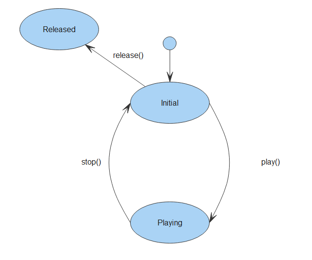

# 音频播放开发指导<a name="ZH-CN_TOPIC_0000001100255784"></a>

-   [场景介绍](#section910413166166)
-   [接口说明](#section1225204317126)

## 场景介绍<a name="section910413166166"></a>

音频播放的主要工作是将音频数据转码为可听见的音频模拟信号并通过输出设备进行播放，同时对播放任务进行管理。

**图 1**  音频播放状态机<a name="fig19537218164010"></a>  


## 接口说明<a name="section1225204317126"></a>

**表 1**  media

<a name="table17619171017258"></a>
<table><thead align="left"><tr id="row9619111017256"><th class="cellrowborder" valign="top" width="42.29%" id="mcps1.2.3.1.1"><p id="p19739153111253"><a name="p19739153111253"></a><a name="p19739153111253"></a>接口名</p>
</th>
<th class="cellrowborder" valign="top" width="57.709999999999994%" id="mcps1.2.3.1.2"><p id="p761918101259"><a name="p761918101259"></a><a name="p761918101259"></a>描述</p>
</th>
</tr>
</thead>
<tbody><tr id="row186191310102518"><td class="cellrowborder" valign="top" width="42.29%" headers="mcps1.2.3.1.1 "><p id="p152227722614"><a name="p152227722614"></a><a name="p152227722614"></a>media.createAudioPlayer()</p>
</td>
<td class="cellrowborder" valign="top" width="57.709999999999994%" headers="mcps1.2.3.1.2 "><p id="p11619510202511"><a name="p11619510202511"></a><a name="p11619510202511"></a>创建AudioPlayer实例。</p>
</td>
</tr>
<tr id="row78247183285"><td class="cellrowborder" valign="top" width="42.29%" headers="mcps1.2.3.1.1 "><p id="p78241186287"><a name="p78241186287"></a><a name="p78241186287"></a><a href="#table3407174718274">AudioPlayer</a></p>
</td>
<td class="cellrowborder" valign="top" width="57.709999999999994%" headers="mcps1.2.3.1.2 "><p id="p1382410184281"><a name="p1382410184281"></a><a name="p1382410184281"></a>提供音频播放相关功能。</p>
</td>
</tr>
</tbody>
</table>

**表 2**  音频播放相关的interface AudioPlayer

<a name="table3407174718274"></a>
<table><thead align="left"><tr id="row640744712719"><th class="cellrowborder" valign="top" width="42.980000000000004%" id="mcps1.2.3.1.1"><p id="p1540794717271"><a name="p1540794717271"></a><a name="p1540794717271"></a>接口名</p>
</th>
<th class="cellrowborder" valign="top" width="57.02%" id="mcps1.2.3.1.2"><p id="p14407204712274"><a name="p14407204712274"></a><a name="p14407204712274"></a>描述</p>
</th>
</tr>
</thead>
<tbody><tr id="row540714712272"><td class="cellrowborder" valign="top" width="42.980000000000004%" headers="mcps1.2.3.1.1 "><p id="p174086470278"><a name="p174086470278"></a><a name="p174086470278"></a>release()</p>
</td>
<td class="cellrowborder" valign="top" width="57.02%" headers="mcps1.2.3.1.2 "><p id="p204082047172719"><a name="p204082047172719"></a><a name="p204082047172719"></a>释放音频资源。</p>
</td>
</tr>
<tr id="row12408104792716"><td class="cellrowborder" valign="top" width="42.980000000000004%" headers="mcps1.2.3.1.1 "><p id="p640874762718"><a name="p640874762718"></a><a name="p640874762718"></a>play()</p>
</td>
<td class="cellrowborder" valign="top" width="57.02%" headers="mcps1.2.3.1.2 "><p id="p1740894712718"><a name="p1740894712718"></a><a name="p1740894712718"></a>开始播放音频源。</p>
</td>
</tr>
<tr id="row84081747182715"><td class="cellrowborder" valign="top" width="42.980000000000004%" headers="mcps1.2.3.1.1 "><p id="p04081947172716"><a name="p04081947172716"></a><a name="p04081947172716"></a>pause()</p>
</td>
<td class="cellrowborder" valign="top" width="57.02%" headers="mcps1.2.3.1.2 "><p id="p164081547132711"><a name="p164081547132711"></a><a name="p164081547132711"></a>暂停播放。</p>
</td>
</tr>
<tr id="row184082047132717"><td class="cellrowborder" valign="top" width="42.980000000000004%" headers="mcps1.2.3.1.1 "><p id="p74086479279"><a name="p74086479279"></a><a name="p74086479279"></a>stop()</p>
</td>
<td class="cellrowborder" valign="top" width="57.02%" headers="mcps1.2.3.1.2 "><p id="p1140814471274"><a name="p1140814471274"></a><a name="p1140814471274"></a>停止播放。</p>
</td>
</tr>
<tr id="row36221450105715"><td class="cellrowborder" valign="top" width="42.980000000000004%" headers="mcps1.2.3.1.1 "><p id="p162210506572"><a name="p162210506572"></a><a name="p162210506572"></a>setVolume(vol: number)</p>
</td>
<td class="cellrowborder" valign="top" width="57.02%" headers="mcps1.2.3.1.2 "><p id="p166221550165720"><a name="p166221550165720"></a><a name="p166221550165720"></a>改变音频播放音量</p>
</td>
</tr>
<tr id="row1240804752711"><td class="cellrowborder" valign="top" width="42.980000000000004%" headers="mcps1.2.3.1.1 "><p id="p8408647172716"><a name="p8408647172716"></a><a name="p8408647172716"></a>seek(timeMs: number)</p>
</td>
<td class="cellrowborder" valign="top" width="57.02%" headers="mcps1.2.3.1.2 "><p id="p440817478271"><a name="p440817478271"></a><a name="p440817478271"></a>改变播放位置。</p>
</td>
</tr>
<tr id="row5408194714279"><td class="cellrowborder" valign="top" width="42.980000000000004%" headers="mcps1.2.3.1.1 "><p id="p144081547102712"><a name="p144081547102712"></a><a name="p144081547102712"></a>src:string</p>
</td>
<td class="cellrowborder" valign="top" width="57.02%" headers="mcps1.2.3.1.2 "><p id="p1040814782716"><a name="p1040814782716"></a><a name="p1040814782716"></a>音频播放的媒体URI。</p>
</td>
</tr>
<tr id="row155026127182"><td class="cellrowborder" valign="top" width="42.980000000000004%" headers="mcps1.2.3.1.1 "><p id="p5503812121819"><a name="p5503812121819"></a><a name="p5503812121819"></a>state:string</p>
</td>
<td class="cellrowborder" valign="top" width="57.02%" headers="mcps1.2.3.1.2 "><p id="p105031612141811"><a name="p105031612141811"></a><a name="p105031612141811"></a>播放的状态属性。</p>
</td>
</tr>
<tr id="row19408114732719"><td class="cellrowborder" valign="top" width="42.980000000000004%" headers="mcps1.2.3.1.1 "><p id="p12209729141817"><a name="p12209729141817"></a><a name="p12209729141817"></a>autoplay:boolean</p>
</td>
<td class="cellrowborder" valign="top" width="57.02%" headers="mcps1.2.3.1.2 "><p id="p19189929171811"><a name="p19189929171811"></a><a name="p19189929171811"></a>音频的自动播放属性。</p>
</td>
</tr>
<tr id="row340854714273"><td class="cellrowborder" valign="top" width="42.980000000000004%" headers="mcps1.2.3.1.1 "><p id="p1840914712277"><a name="p1840914712277"></a><a name="p1840914712277"></a>currenttime:number</p>
</td>
<td class="cellrowborder" valign="top" width="57.02%" headers="mcps1.2.3.1.2 "><p id="p3409174762710"><a name="p3409174762710"></a><a name="p3409174762710"></a>音频的当前播放位置。</p>
</td>
</tr>
<tr id="row6409134710274"><td class="cellrowborder" valign="top" width="42.980000000000004%" headers="mcps1.2.3.1.1 "><p id="p114091047162711"><a name="p114091047162711"></a><a name="p114091047162711"></a>duration:number</p>
</td>
<td class="cellrowborder" valign="top" width="57.02%" headers="mcps1.2.3.1.2 "><p id="p154091247132715"><a name="p154091247132715"></a><a name="p154091247132715"></a>音频播放的时长。</p>
</td>
</tr>
<tr id="row4409134772717"><td class="cellrowborder" valign="top" width="42.980000000000004%" headers="mcps1.2.3.1.1 "><p id="p9681449141811"><a name="p9681449141811"></a><a name="p9681449141811"></a>loop:boolean</p>
</td>
<td class="cellrowborder" valign="top" width="57.02%" headers="mcps1.2.3.1.2 "><p id="p94091847102711"><a name="p94091847102711"></a><a name="p94091847102711"></a>音频的循环播放属性。</p>
</td>
</tr>
<tr id="row19915911171916"><td class="cellrowborder" valign="top" width="42.980000000000004%" headers="mcps1.2.3.1.1 "><p id="p20915111121918"><a name="p20915111121918"></a><a name="p20915111121918"></a>muted:boolean</p>
</td>
<td class="cellrowborder" valign="top" width="57.02%" headers="mcps1.2.3.1.2 "><p id="p12915211131910"><a name="p12915211131910"></a><a name="p12915211131910"></a>音频的静音属性。</p>
</td>
</tr>
<tr id="row44091647192718"><td class="cellrowborder" valign="top" width="42.980000000000004%" headers="mcps1.2.3.1.1 "><p id="p18937155862412"><a name="p18937155862412"></a><a name="p18937155862412"></a>on('play', function callback)</p>
</td>
<td class="cellrowborder" valign="top" width="57.02%" headers="mcps1.2.3.1.2 "><p id="p13409164722717"><a name="p13409164722717"></a><a name="p13409164722717"></a>监听音频播放开始事件。</p>
</td>
</tr>
<tr id="row12409154711272"><td class="cellrowborder" valign="top" width="42.980000000000004%" headers="mcps1.2.3.1.1 "><p id="p124091474279"><a name="p124091474279"></a><a name="p124091474279"></a>on('pause', function callback)</p>
</td>
<td class="cellrowborder" valign="top" width="57.02%" headers="mcps1.2.3.1.2 "><p id="p7409174714274"><a name="p7409174714274"></a><a name="p7409174714274"></a>监听音频播放暂停事件。</p>
</td>
</tr>
<tr id="row040917477273"><td class="cellrowborder" valign="top" width="42.980000000000004%" headers="mcps1.2.3.1.1 "><p id="p18981171411254"><a name="p18981171411254"></a><a name="p18981171411254"></a>on('stop', function callback)</p>
</td>
<td class="cellrowborder" valign="top" width="57.02%" headers="mcps1.2.3.1.2 "><p id="p1409164772714"><a name="p1409164772714"></a><a name="p1409164772714"></a>监听音频播放停止事件。</p>
</td>
</tr>
<tr id="row11409747202711"><td class="cellrowborder" valign="top" width="42.980000000000004%" headers="mcps1.2.3.1.1 "><p id="p189901420102514"><a name="p189901420102514"></a><a name="p189901420102514"></a>on('ended',function callback)</p>
</td>
<td class="cellrowborder" valign="top" width="57.02%" headers="mcps1.2.3.1.2 "><p id="p8410124742713"><a name="p8410124742713"></a><a name="p8410124742713"></a>监听音频播放结束事件。</p>
</td>
</tr>
<tr id="row64105474278"><td class="cellrowborder" valign="top" width="42.980000000000004%" headers="mcps1.2.3.1.1 "><p id="p166588276253"><a name="p166588276253"></a><a name="p166588276253"></a>on('error', function callback)</p>
</td>
<td class="cellrowborder" valign="top" width="57.02%" headers="mcps1.2.3.1.2 "><p id="p54101047102712"><a name="p54101047102712"></a><a name="p54101047102712"></a>监听音频播放错误事件。</p>
</td>
</tr>
<tr id="row1410154715273"><td class="cellrowborder" valign="top" width="42.980000000000004%" headers="mcps1.2.3.1.1 "><p id="p135217361257"><a name="p135217361257"></a><a name="p135217361257"></a>on('loaderdata', function callback)</p>
</td>
<td class="cellrowborder" valign="top" width="57.02%" headers="mcps1.2.3.1.2 "><p id="p1541054719271"><a name="p1541054719271"></a><a name="p1541054719271"></a>监听音频播放加载数据事件。</p>
</td>
</tr>
<tr id="row126521548145814"><td class="cellrowborder" valign="top" width="42.980000000000004%" headers="mcps1.2.3.1.1 "><p id="p2652134812586"><a name="p2652134812586"></a><a name="p2652134812586"></a>on('volumeChange', function callback)</p>
</td>
<td class="cellrowborder" valign="top" width="57.02%" headers="mcps1.2.3.1.2 "><p id="p116527483584"><a name="p116527483584"></a><a name="p116527483584"></a>监听音频播放音量变化事件。</p>
</td>
</tr>
<tr id="row1410124732711"><td class="cellrowborder" valign="top" width="42.980000000000004%" headers="mcps1.2.3.1.1 "><p id="p942310426254"><a name="p942310426254"></a><a name="p942310426254"></a>on('timeupdate', function callback)</p>
</td>
<td class="cellrowborder" valign="top" width="57.02%" headers="mcps1.2.3.1.2 "><p id="p18410144715271"><a name="p18410144715271"></a><a name="p18410144715271"></a>监听音频播放进度改变事件。</p>
</td>
</tr>
</tbody>
</table>

1.  创建音频播放器。

    ```
    var player = media.createAudioPlayer();
    ```

2.  设置消息监听事件。

    ```
    player.on('play', (err, action) => {
        if (err) {
            console.log(`err returned in play() callback`);
            return;
         }
         console.info('Current Song duration: '+duration);
         console.log(`In play callback current time: ${player.currentTime}`);
         console.info('Current Player Status: '+player.state);
         console.info('Pause Mp3');
         player.pause();
    });
    player.on('pause', (err, action) => {
         if (err) {
             console.log(`err returned in pause() callback`);
             return;
          }
          console.log(`pause callback, state: ${player.state}`);
          console.info('Current Player Status: '+player.state);
          var currentTime = player.currenTime;
          console.info('Current Player Time: '+currentTime);
          player.seek(30000); //seek for 30 seconds
    });
    player.on('stop', (err, action) => {
        if (err) {
            console.log(`err returned in stop() callback`);
            return;
        }
        console.log(`stop callback, state: ${player.state}`);
    });
    player.on('dataLoad', (err, action) => {
        if (err) {
            console.log(`err returned in dataLoad() callback`);
            return;
        }
         console.log(`dataLoad callback is called, cuurent time: ${player.currentTime}`);
         console.log(`Duration of the source: ${player.duration}`);
    });
    player.on('finish', (err, action) => {
         if (err) {
            console.log(`err returned in finish() callback`);
            return;
         }
         console.log(`Player finish callback is called`);
    });
    player.on('timeUpdate', (err, action) => {
        if (err) {
            console.log(`err returned in timeUpdate() callback`);
            return;
        }
        console.log(`In timeupdate callback current time: ${player.currentTime}`);
        var newTime = player.currenTime;
        if(newTime = 30000) {
            console.info('Seek success, new time : '+newTime);
        } else {
            console.info('Seek Failed');
         }
            player.stop();
    });
    player.on('durationchange', (err, action) => {
         if (err) {
             console.log(`err returned in durationchange callback`);
             return;
         }
         console.log(`Durationchange callback is called`);
    });
    player.on('error', (err) => {
         console.error(`player error: ${err.message}`);
    });
    
    ```

3.  启动播放。

    ```
    var audioSourceMp3 = 'file://test.mp3';
    player.src = audioSourceMp3;
    player.loop = true;
    player.play();
    ```


