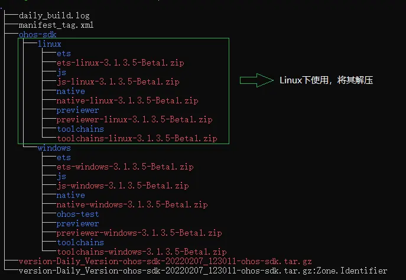
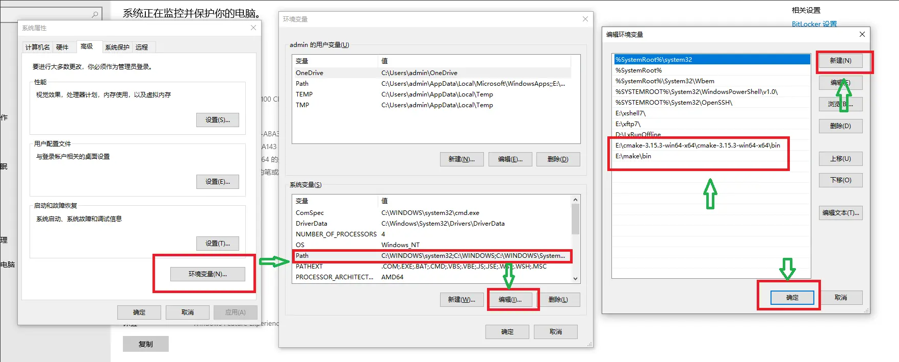
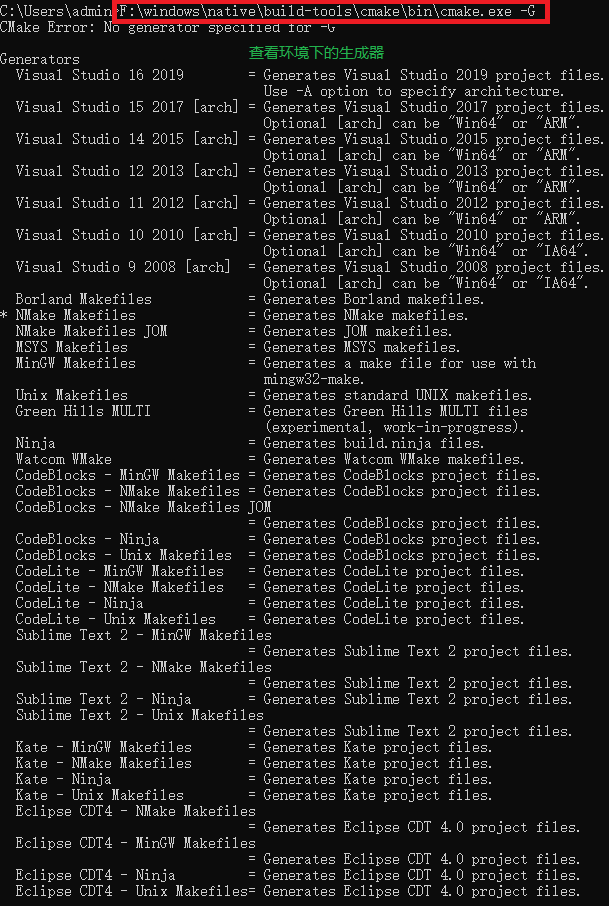
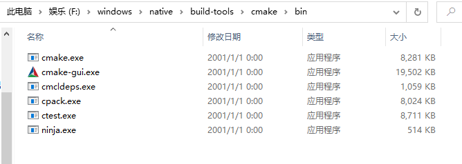
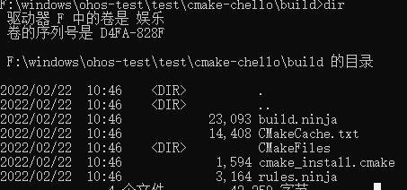
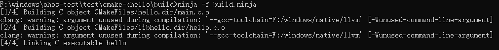

# 使用命令行CMake构建NDK工程


在很多复杂应用工程中，C++代码工程是通过CMake等构建系统以命令行方式来编译构建的，接下来介绍如何把已有的CMake工程切换到OpenHarmony工具链中，从而使用命令行CMake构建该工程。


## 下载NDK开发包
<!--RP1-->
1. 推荐使用OpenHarmony正式发布的SDK包。下载链接请从OpenHarmony正式发布版本的 **版本说明** 中获取。

在Release Notes 对应正式版本的“从镜像站点获取” 章节下载。 

根据系统的操作类型，下载对应的 SDK 包。


2. 从DevEco Studio的OpenHarmony SDK Manager中下载。
<!--RP1End-->

## 解压NDK开发包

下载完成后，将压缩包放入创建好的文件夹下解压。

windows/linux 使用 SDK 包解压完成效果如下图所示：



mac使用 SDK 包解压完成效果如下图所示：


### 配置环境变量
如果只是在DevEco Studio中使用，跳过以下步骤：
1. 将NDK自带的CMake编译工具添加到环境变量中。
+ 配置 linux 系统下环境变量

  ```
  # 打开.bashrc文件
  vim ~/.bashrc
  # 在文件最后添加cmake路径，该路径是自己的放置文件的路径，之后保存退出
  export PATH=${实际SDK路径}/native/build-tools/cmake/bin:$PATH
  # 在命令行执行source ~/.bashrc使环境变量生效
  source ~/.bashrc
  ```

+ 配置 mac 系统下环境变量

  ```
  #在当前用户目录下，打开 .bash_profile 文件，文件如果不存在，创建即可
  vim ~/.bash_profile
  #在文件最后添加 cmake 路径，该路径是自己的放置文件的路径，之后保存退出
  export PATH=${实际SDK路径}/native/build-tools/cmake/bin:$PATH
  #在命令行执行 source ~/.bash_profile 使环境变量生效
  source ~/.bash_profile
  ```

+ 配置 windows 下的环境变量

  右键点击我的电脑，在下拉框中选择我的电脑，点击高级系统设置，点击环境变量，点击Path后点编辑，点击新建，将路径添加进去，之后保存退出，打开cmd（若下一步不能够实现，请重启电脑尝试）。
  
  
  
  打开命令框，输入{cmake实际安装路径}\cmake.exe -version，命令行正确回显cmake的版本号，说明环境变量配置完成。

  


2. 查看CMake默认路径。
   + linux 和 mac 系统环境下
      ```
      #在命令行输入which命令查询当前CMake所在路径
      which cmake
      #结果路径与.bashrc中设置一致
      ~/ohos-sdk/ohos-sdk/linux/native/build-tools/cmake/bin/cmake
      ```
   + windows 系统环境下，cmake 安装路径为自己所配置的环境变量路径
     
     通过 我的电脑->高级系统设置->环境变量->在 Path 对象中查看


## 使用NDK开发包编译Native程序

应用开发者可以通过NDK开发包快速的开发出Native动态库、静态库与可执行文件。NDK开发包提供CMake编译构建工具脚本，下面通过编写一个C/C++ demo工程来演示适配过程。


### demo工程内容

下面是一个CMake的demo工程内容，此工程包含两个目录，include目录包含此库的头文件，src目录包含全部源码；src目录包含两个文件，sum.cpp的算法文件，以及main.cpp的调用算法的主入口文件，目标是编译成一个可执行程序，以及一个算法动态库。

**demo目录图**

```
demo
  ├── CMakeLists.txt
  ├── include
       └── sum.h
  └── src
       ├── CMakeLists.txt
       ├── sum.cpp
       └── hello.cpp
```

**根目录CMakeLists.txt内容**

```
# 指定CMake的最小版本
CMAKE_MINIMUM_REQUIRED(VERSION 3.16)

# 工程名称，这里我们就叫HELLO
PROJECT(HELLO)

#添加一个子目录并构建该子目录。
ADD_SUBDIRECTORY(src)
```

**内部CMakeLists.txt内容**

```
SET(LIBHELLO_SRC hello.cpp)

# 设置编译参数
SET(CMAKE_CXX_FLAGS "${CMAKE_CXX_FLAGS} -O0")   
 
# 设置链接参数，具体参数可以忽略，纯粹为了举例
SET(CMAKE_EXE_LINKER_FLAGS "${CMAKE_EXE_LINKER_FLAGS} -Wl,--emit-relocs --verbose")    

# 添加一个libsum动态库目标，编译成功会生成一个libsum.so
ADD_LIBRARY(sum SHARED sum.cpp)

# 生成可执行程序，添加一个Hello的可执行程序目标，编译成功会生成一个Hello可执行程序
ADD_EXECUTABLE(Hello ${LIBHELLO_SRC})

# 指定Hello目标include目录路径
TARGET_INCLUDE_DIRECTORIES(Hello PUBLIC ../include)

# 指定Hello目标需要链接的库名字
TARGET_LINK_LIBRARIES(Hello PUBLIC sum)
```

**源码内容**

hello.cpp源码

```
#include <iostream>
#include "sum.h"

int main(int argc,const char **argv)
{
    std::cout<< "hello world!" <<std::endl;
    int total = sum(1, 100);
    std::cout<< "Sum 1 + 100=" << total << std::endl;
    return 0;
}
```

sum.h源码

```
int sum(int a, int b);
```

sum.cpp源码

```
#include <iostream>
    
int sum(int a, int b)
{
    return a + b;
}
```


### 编译构建demo工程

#### linux 和 mac 系统环境下
在工程目录下，创建build目录，用来放置CMake构建时产生的中间文件。注意: ohos-sdk是下载下来的SDK的根目录，开发者需要自行替换成实际的下载目录。

1. 采用OHOS_STL=c++_shared动态链接c++库方式构建工程，如不指定，默认采用c++_shared；DOHOS_ARCH参数可根据系统架构来决定具体值。

   ```
    >mkdir build && cd build
    >cmake -DOHOS_STL=c++_shared -DOHOS_ARCH=armeabi-v7a -DOHOS_PLATFORM=OHOS -DCMAKE_TOOLCHAIN_FILE={ohos-sdk}/linux/native/build/cmake/ohos.toolchain.cmake ..
    >cmake --build .
   ```

2. 采用OHOS_STL=c++_static静态链接c++库方式构建工程。

   ```
    >mkdir build && cd build
    >cmake -DOHOS_STL=c++_static -DOHOS_ARCH=armeabi-v7a -DOHOS_PLATFORM=OHOS -DCMAKE_TOOLCHAIN_FILE={ohos-sdk}/linux/native/build/cmake/ohos.toolchain.cmake ..
    >cmake --build .
   ```

   命令中，OHOS_ARCH与OHOS_PLATFORM两个变量最终会生成clang++的--target命令参数，在此例子中就是--target=arm-linux-ohos --march=armv7a两个参数。
   
   CMAKE_TOOLCHAIN_FILE指定了toolchain文件，在此文件中默认给clang++设置了--sysroot={ndk_sysroot目录}，告诉编译器查找系统头文件的根目录。

#### windows系统环境下

在windows下使用cmake进行编译，与linux下不同的是，使用cmake要加入参数 -G 选择使用的生成器，直接回车会列出下面的生成器。



这里使用的是cmake .. -G "Ninja" 引号里面跟的参数就是上图查看的环境所支持的生成器，这里ndk中自带的生成器是Ninja。



Step 1. 同样在工程目录下创建 build 文件夹并执行以下指令：
```
 F:\windows\native\build-tools\cmake\bin\cmake.exe -G "Ninja" -D OHOS_STL=c++_shared -D OHOS_ARCH=armeabi-v7a -D OHOS_PLATFORM=OHOS -D CMAKE_TOOLCHAIN_FILE=F:\windows\native\build\cmake\ohos.toolchain.cmake ..
```
注：如需debug调试，增加参数 -D CMAKE_BUILD_TYPE=normal；cmake路径和编译工具链ohos.toolchain.cmake路径都是下载好的ndk路径。
执行结果如下图：


这里生成的build.ninja文件就是我们需要的 。

Step 2. 让我们用ninja指令来编译生成目标文件，其位置如下图所示：



ninja -f build.ninja 或者用 cmake --build .   执行结果如下：

