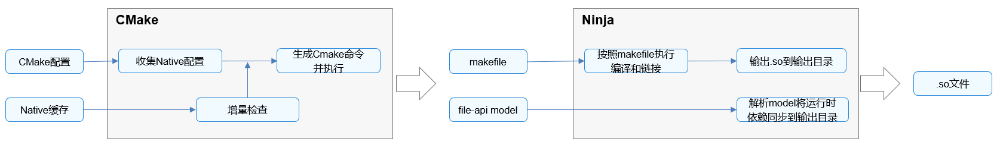

# 使用DevEco Studio模板构建NDK工程


NDK通过CMake和Ninja编译应用的C/C++代码，编译过程如下图所示。





核心编译过程如下：


1. 根据CMake配置脚本以及build-profile.json5中配置的externalNativeOptions构建参数，与缓存中的配置比对后，生成CMake命令并执行CMake。

2. 执行Ninja，按照makefile执行编译和链接，将生成的.so以及运行时依赖的.so同步到输出目录，完成构建过程。


通过DevEco Studio提供的应用模板，可以快速生成CMake构建脚本模板，并在build-profile.json5中指定相关编译构建参数。


## CMakeLists.txt

通过DevEco Studio模板工程创建的NDK工程中，包含默认生成的CMakeLists.txt脚本，如下所示：

```
# the minimum version of CMake.
cmake_minimum_required(VERSION 3.4.1)
project(MyApplication) 

# 定义一个变量，并赋值为当前模块cpp目录
set(NATIVERENDER_ROOT_PATH ${CMAKE_CURRENT_SOURCE_DIR})

# 添加头文件.h目录，包括cpp，cpp/include，告诉cmake去这里找到代码引入的头文件
include_directories(${NATIVERENDER_ROOT_PATH}
                    ${NATIVERENDER_ROOT_PATH}/include)

# 声明一个产物libentry.so，SHARED表示产物为动态库，hello.cpp为产物的源代码
add_library(entry SHARED hello.cpp)

# 声明产物entry链接时需要的三方库libace_napi.z.so
# 这里直接写三方库的名称是因为它是在ndk中，已在链接寻址路径中，无需额外声明
target_link_libraries(entry PUBLIC libace_napi.z.so)
```

默认的CMakeLists.txt脚本中添加了编译所需的源代码、头文件以及三方库，开发者可根据实际工程添加自定义编译参数、函数声明、简单的逻辑控制等。


## externalNativeOptions

模块级build-profile.json5中externalNativeOptions参数是NDK工程C/C++文件编译配置的入口，可以通过path指定CMake脚本路径、arguments配置CMake参数、cppFlags配置C++编译器参数、abiFilters配置编译架构等。
```
"apiType": "stageMode",
"buildOption": {
  "arkOptions": {
   },
  "externalNativeOptions": {
    "path": "./src/main/cpp/CMakeLists.txt",
    "arguments": "",
    "cppFlags": "",
    "abiFilters": [
       "arm64-v8a",
       "x86_64"
    ],
  }
}
```

externalNativeOptions具体参数说明如下表所示。

| 配置项 | 类型 | 说明 | 
| -------- | -------- | -------- |
| path | string | CMake构建脚本地址，即CMakeLists.txt文件地址。 | 
| abiFilters | array | 本机的ABI编译环境，包括：<!--Del--><br/>- armeabi-v7a<!--DelEnd--><br/>- arm64-v8a<br/>- x86_64<br/>如不配置该参数，编译时默认编译出arm64-v8a架构相关so。 | 
| arguments | string | CMake编译参数。 | 
| cppFlags | string | C++编译器参数。 | 

更多关于build-profile.json5中参数的说明，请参考<!--RP1-->[build-profile.json5](https://developer.huawei.com/consumer/cn/doc/harmonyos-guides-V5/ide-hvigor-build-profile-V5)<!--RP1End-->。
