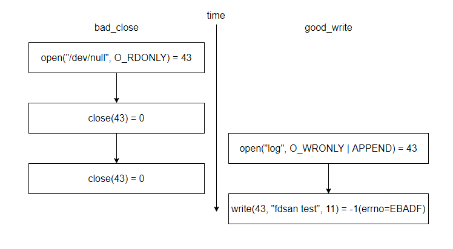

# fdsan使用指导

## 1. 功能介绍

fdsan针对的操作对象是文件描述符，主要用于检测不同使用者对相同文件描述符的错误操作，包括多次关闭（double-close）和关闭后使用（use-after-close)。这些文件描述符可以是操作系统中的文件、目录、网络套接字和其他I/O设备等，在程序中，打开文件或套接字会生成一个文件描述符，如果此文件描述符在使用后出现反复关闭、或者关闭后使用等场景，就会造成内存泄露、文件句柄泄露等安全隐患问题。该类问题非常隐蔽，且难以排查，为了更好地检测此类问题，因此引入了此种针对文件描述符错误操作的检测工具fdsan。

## 2. 实现原理

设计思路：当打开已有文件或创建一个新文件的时候，在得到返回fd后，设置一个关联的tag，来标记fd的属主信息；关闭文件前，检测fd关联的tag，判断是否符合预期(属主信息一致)，符合就继续走正常文件关闭流程；如果不符合就是检测到异常，根据设置，调用对应的异常处理。

tag由两部分组成，最高位的8-bit构成type，后面的56-bit构成value。

type，标识fd通过何种封装形式进行管理，例如 `FDSAN_OWNER_TYPE_FILE`就表示fd通过普通文件进行管理，type类型在 `fdsan_owner_type`进行定义。

value，则用于标识实际的owner tag。

 tag构成图示


## 3. 接口说明

### fdsan_set_error_level

```
enum fdsan_error_level fdsan_set_error_level(enum fdsan_error_level new_level);
```

**描述：** 可以通过`fdsan_set_error_level`设定error_level，error_level用于控制检测到异常后的处理行为。默认error_level为FDSAN_ERROR_LEVEL_WARN_ALWAYS。

**参数：** fdsan_error_level

| 名称                       | 说明                                                         |
| -------------------------- | ------------------------------------------------------------ |
| `FDSAN_ERROR_LEVEL_DISABLED` | disabled，此level代表什么都不处理。                         |
| `FDSAN_ERROR_LEVEL_WARN_ONCE` | warn-once，第一次出现错误时在hilog中发出警告，然后将级别降低为disabled(FDSAN_ERROR_LEVEL_DISABLED)。 |
| `FDSAN_ERROR_LEVEL_WARN_ALWAYS` | warn-always，每次出现错误时都在hilog中发出警告。 |
| `FDSAN_ERROR_LEVEL_FATAL` | fatal，出现错误时调用abort异常退出。 |

**返回值：** 返回旧的error_level。

### fdsan_get_error_level

```
enum fdsan_error_level fdsan_get_error_level();
```

**描述：** 可以通过`fdsan_get_error_level`获取error level。

**返回值：** 当前的error_level。

### fdsan_create_owner_tag
```
uint64_t fdsan_create_owner_tag(enum fdsan_owner_type type, uint64_t tag);
```
**描述：** 通过传入的type和tag字段，拼接成一个有效的文件描述符的关闭tag。

**参数：** fdsan_owner_type

| 名称                       | 说明                                                         |
| -------------------------- | ------------------------------------------------------------ |
| `FDSAN_OWNER_TYPE_GENERIC_00` | 默认未使用fd对应的type值     |
| `FDSAN_OWNER_TYPE_GENERIC_FF` | 默认非法fd对应的type值 |
| `FDSAN_OWNER_TYPE_FILE` | 默认普通文件对应的type值，使用fopen或fdopen打开的文件具有该类型 |
| `FDSAN_OWNER_TYPE_DIRECTORY` | 默认文件夹对应的type值，使用opendir或fdopendir打开的文件具有该类型 |
| `FDSAN_OWNER_TYPE_UNIQUE_FD` | 默认unique_fd对应的type值，保留暂未使用 |
| `FDSAN_OWNER_TYPE_ZIPARCHIVE` | 默认zip压缩文件对应的type值，保留暂未使用 |

**返回值：** 返回创建的tag，可以用于fdsan_exchange_owner_tag函数的输入。

### fdsan_exchange_owner_tag

```
void fdsan_exchange_owner_tag(int fd, uint64_t expected_tag, uint64_t new_tag);
```
**描述：** 修改文件描述符的关闭tag。

通过fd所以找到对应的FdEntry，判断close_tag值与expected_tag是否一致，一致说明符合预期，可以用new_tag值重新设定对应的FdEntry。

如果不符合，则说明检测到了异常，后续则进行对应的异常处理。

**参数：**

| 名称                       | 类型               | 说明                                                         |
| -------------------------- | ------------------------------------------------------------ | ------------------------------------------------------------ |
| `fd` | int | fd句柄，作为FdEntry的索引 |
| `expected_tag` | uint64_t | 期望的ownership tag值     |
| `new_tag` | uint64_t | 设置新的ownership tag值   |


### fdsan_close_with_tag

```
int fdsan_close_with_tag(int fd, uint64_t tag);
```
**描述：** 根据tag描述符关闭文件描述符。

通过fd找到匹配的FdEntry。如果close_tag与tag相同，则符合预期，可以继续执行文件描述符关闭流程，否则意味着检测到异常。

**参数：**

| 名称                       | 类型               | 说明                                                         |
| -------------------------- | ------------------------------------------------------------ | ------------------------------------------------------------ |
| `fd` | int | 待关闭的fd句柄 |
| `tag` | uint64_t | 期望的ownership tag     |

**返回值：** 0或者-1，0表示close成功，-1表示close失败。

### fdsan_get_owner_tag
```
uint64_t fdsan_get_owner_tag(int fd);
```
**描述：** 根据文件描述符获取tag信息。

通过fd找到匹配的FdEntry，并获取其对应的close_tag。

**参数：**

| 名称                       | 类型               | 说明                                                         |
| -------------------------- | ------------------------------------------------------------ | ------------------------------------------------------------ |
| `tag` | uint64_t | ownership tag     |

**返回值：** 返回对应fd的tag。

### fdsan_get_tag_type
```
const char* fdsan_get_tag_type(uint64_t tag);
```
**描述：** 根据tag计算出对应的type类型。

通过获取到的tag信息，通过计算获取对应tag中的type信息。

**参数：**

| 名称                       | 类型               | 说明                                                         |
| -------------------------- | ------------------------------------------------------------ | ------------------------------------------------------------ |
| `tag` | uint64_t | ownership tag     |

**返回值：** 返回对应tag的type。

### fdsan_get_tag_value
```
uint64_t fdsan_get_tag_value(uint64_t tag);
```
**描述：** 根据tag计算出对应的owner value。

通过获取到的tag信息，通过偏移计算获取对应tag中的value信息。

**参数：**

| 名称                       | 类型               | 说明                                                         |
| -------------------------- | ------------------------------------------------------------ | ------------------------------------------------------------ |
| `tag` | uint64_t | ownership tag     |

**返回值：** 返回对应tag的value。

## 4. 使用示例

如何使用fdsan？这是一个简单的double-close问题：

```
void good_write()
{
    sleep(1);
    int fd = open(DEV_NULL_FILE, O_RDONLY);
    sleep(3);
    ssize_t ret = write(fd, "fdsan test\n", 11);
    if (ret == -1) {
        OH_LOG_ERROR(LOG_APP, "good write but failed?!");
    }
    close(fd);
}

void bad_close()
{
    int fd = open(DEV_NULL_FILE, O_RDONLY);
    close(fd);
    sleep(2);
    // This close expected to be detect by fdsan
    close(fd);
}

void functional_test()
{
    std::vector<std::thread> threads;
    for (auto function : { good_write, bad_close }) {
        threads.emplace_back(function);
    }
    for (auto& thread : threads) {
        thread.join();
    }
}

int main()
{
    functional_test();
    return 0;
}
```
上述代码中的`good_write`函数会打开一个文件并写入一些字符串而`bad_close`函数中也会打开一个文件同时包含double-close问题，这两个线程同时运行那么程序的执行情况会是这样的。



由于每次open返回的fd是顺序分配的，在进入主函数后第一个可用的fd是43，`bad_close`函数中第一次open返回的fd是43，在关闭之后，43就变成了可用的fd，在`good_write`函数中open返回了第一个可用的fd，即43，但是由于`bad_close`函数中存在double-close问题，因此错误的关闭了另一个线程中打开的文件，导致写入失败。

在fdsan引入之后，有两种方法可以检测这类问题：使用标准库接口或实现具有fdsan的函数接口。

### 使用标准库接口

标准库接口中fopen，fdopen，opendir，fdopendir都已经集成了fdsan，使用前述接口而非直接使用open可以帮助检测问题。在前述案例中可以使用fopen替代open：

```c
#include <stdio.h>
#include <errno.h>
#define TEMP_FILE "/data/local/tmp/test.txt"

void good_write()
{
    // fopen is protected by fdsan, replace open with fopen
    // int fd = open(TEMP_FILE, O_RDONLY);
    FILE *f = fopen(TEMP_FILE, "w+");
    if (f == NULL) {
        printf("fopen failed errno=%d\n", errno);
        return;
    }
    // ssize_t ret = write(fd, "fdsan test\n", 11);
    int ret = fprintf(f, "fdsan test %d\n", 11);
    if (ret < 0) {
        printf("fprintf failed errno=%d\n", errno);
    }
    // close(fd);
    fclose(f);
}
```
#### 日志信息
使用fopen打开的每个文件描述符都需要有一个与之对应的 `tag` 。`fdsan` 在 `close` 时会检查关闭的 `fd` 是否与 `tag` 匹配，不匹配就会默认提示相关日志信息。下面是上述代码的日志信息：

```
# hilog | grep MUSL-FDSAN
04-30 15:03:41.760 10933  1624 E C03f00/MUSL-FDSAN: attempted to close file descriptor 43,                             expected to be unowned, actually owned by FILE* 0x00000000f7b90aa2
```

从这里的错误信息中可以看出FILE接口体的文件被其他人错误的关闭了，FILE接口体的地址可以协助进一步定位。

此外，可以在代码中使用`fdsan_set_error_level`设置错误等级error_level，设置为Fatal之后如果fdsan检测到错误会提示日志信息同时crash生成堆栈信息用于定位。下面是error_level设置为Fatal之后生成的crash堆栈信息：

```
Reason:Signal:SIGABRT(SI_TKILL)@0x0000076e from:1902:20010043
Fault thread info:
Tid:15312, Name:e.myapplication
#00 pc 000e65bc /system/lib/ld-musl-arm.so.1(raise+176)(3de40c79448a2bbced06997e583ef614)
#01 pc 0009c3bc /system/lib/ld-musl-arm.so.1(abort+16)(3de40c79448a2bbced06997e583ef614)
#02 pc 0009de4c /system/lib/ld-musl-arm.so.1(fdsan_error+116)(3de40c79448a2bbced06997e583ef614)
#03 pc 0009e2e8 /system/lib/ld-musl-arm.so.1(fdsan_close_with_tag+836)(3de40c79448a2bbced06997e583ef614)
#04 pc 0009e56c /system/lib/ld-musl-arm.so.1(close+20)(3de40c79448a2bbced06997e583ef614)
#05 pc 000055d8 /data/storage/el1/bundle/libs/arm/libentry.so(bad_close()+96)(f3339aac824c099f449153e92718e1b56f80b2ba)
#06 pc 00006cf4 /data/storage/el1/bundle/libs/arm/libentry.so(decltype(std::declval<void (*)()>()()) std::__n1::__invoke[abi:v15004]<void (*)()>(void (*&&)())+24)(f3339aac824c099f449153e92718e1b56f80b2ba)
#07 pc 00006c94 /data/storage/el1/bundle/libs/arm/libentry.so(f3339aac824c099f449153e92718e1b56f80b2ba)
#08 pc 000067b8 /data/storage/el1/bundle/libs/arm/libentry.so(void* std::__n1::__thread_proxy[abi:v15004]<std::__n1::tuple<std::__n1::unique_ptr<std::__n1::__thread_struct, std::__n1::default_delete<std::__n1::__thread_struct>>, void (*)()>>(void*)+100)(f3339aac824c099f449153e92718e1b56f80b2ba)
#09 pc 00105a6c /system/lib/ld-musl-arm.so.1(start+248)(3de40c79448a2bbced06997e583ef614)
#10 pc 000700b0 /system/lib/ld-musl-arm.so.1(3de40c79448a2bbced06997e583ef614)
```

此时，从crash信息中可以看到是bad_close中存在问题，同时crash中也包含了所有打开的文件，协助进行定位，提升效率。

```
OpenFiles:
0->/dev/null native object of unknown type 0
1->/dev/null native object of unknown type 0
2->/dev/null native object of unknown type 0
3->socket:[28102] native object of unknown type 0
4->socket:[28103] native object of unknown type 0
5->anon_inode:[eventpoll] native object of unknown type 0
6->/sys/kernel/debug/tracing/trace_marker native object of unknown type 0
7->anon_inode:[eventpoll] native object of unknown type 0
8->anon_inode:[eventpoll] native object of unknown type 0
9->/dev/console native object of unknown type 0
10->pipe:[95598] native object of unknown type 0
11->pipe:[95598] native object of unknown type 0
12->socket:[18542] native object of unknown type 0
13->pipe:[96594] native object of unknown type 0
14->socket:[18545] native object of unknown type 0
15->pipe:[96594] native object of unknown type 0
16->anon_inode:[eventfd] native object of unknown type 0
17->/dev/binder native object of unknown type 0
18->/data/storage/el1/bundle/entry.hap native object of unknown type 0
19->anon_inode:[eventpoll] native object of unknown type 0
20->anon_inode:[signalfd] native object of unknown type 0
21->socket:[29603] native object of unknown type 0
22->anon_inode:[eventfd] native object of unknown type 0
23->anon_inode:[eventpoll] native object of unknown type 0
24->anon_inode:[eventfd] native object of unknown type 0
25->anon_inode:[eventpoll] native object of unknown type 0
26->anon_inode:[eventfd] native object of unknown type 0
27->anon_inode:[eventpoll] native object of unknown type 0
28->anon_inode:[eventfd] native object of unknown type 0
29->anon_inode:[eventpoll] native object of unknown type 0
30->anon_inode:[eventfd] native object of unknown type 0
31->anon_inode:[eventpoll] native object of unknown type 0
32->anon_inode:[eventfd] native object of unknown type 0
33->anon_inode:[eventpoll] native object of unknown type 0
34->anon_inode:[eventfd] native object of unknown type 0
35->socket:[97409] native object of unknown type 0
36->socket:[94716] native object of unknown type 0
38->socket:[94720] native object of unknown type 0
40->/data/storage/el1/bundle/entry_test.hap native object of unknown type 0
41->socket:[95617] native object of unknown type 0
42->/sys/kernel/debug/tracing/trace_marker native object of unknown type 0
43->/dev/null FILE* 4155724704
44->socket:[94737] native object of unknown type 0
45->pipe:[95634] native object of unknown type 0
46->pipe:[95634] native object of unknown type 0
47->pipe:[95635] native object of unknown type 0
49->pipe:[95636] native object of unknown type 0
50->pipe:[95636] native object of unknown type 0
```


### 实现具有fdsan的函数接口

除了直接使用具有fdsan功能的标准库函数之外，还可以实现具有fdsan的函数接口。fdsan机制主要通过两个接口实现：`fdsan_exchange_owner_tag`和`fdsan_close_with_tag`，fdsan_exchange_owner_tag可以设置对应fd的tag，而fdsan_close_with_tag可以在关闭文件时检查对应的tag是否正确。

下面是一个具有fdsan的函数接口实现实例：

```cpp
#include <errno.h>
#include <stdio.h>
#include <fcntl.h>
#include <unistd.h>

#include <utility>

struct fdsan_fd {
    fdsan_fd() = default;

    explicit fdsan_fd(int fd)
    {
        reset(fd);
    }

    fdsan_fd(const fdsan_fd& copy) = delete;
    fdsan_fd(fdsan_fd&& move)
    {
        *this = std::move(move);
    }

    ~fdsan_fd()
    {
        reset();
    }

    fdsan_fd& operator=(const fdsan_fd& copy) = delete;
    fdsan_fd& operator=(fdsan_fd&& move)
    {
        if (this == &move) {
            return *this;
        }
        reset();
        if (move.fd_ != -1) {
            fd_ = move.fd_;
            move.fd_ = -1;
            // Acquire ownership from the moved-from object.
            exchange_tag(fd_, move.tag(), tag());
        }
        return *this;
    }

    int get()
    {
        return fd_;
    }

    void reset(int new_fd = -1)
    {
        if (fd_ != -1) {
            close(fd_, tag());
            fd_ = -1;
        }
        if (new_fd != -1) {
            fd_ = new_fd;
            // Acquire ownership of the presumably unowned fd.
            exchange_tag(fd_, 0, tag());
        }
    }

  private:
    int fd_ = -1;

    // Use the address of object as the file tag
    uint64_t tag()
    {
        return reinterpret_cast<uint64_t>(this);
    }

    static void exchange_tag(int fd, uint64_t old_tag, uint64_t new_tag)
    {
        if (&fdsan_exchange_owner_tag) {
            fdsan_exchange_owner_tag(fd, old_tag, new_tag);
        }
    }

    static int close(int fd, uint64_t tag)
    {
        if (&fdsan_close_with_tag) {
            return fdsan_close_with_tag(fd, tag);
        }
    }
};
```

这里的实现中使用`fdsan_exchange_owner_tag`在开始时将fd与结构体对象地址绑定，然后在关闭文件时使用`fdsan_close_with_tag`进行检测，预期tag是结构体对象地址。

在实现了具有fdsan的函数接口之后，可以使用该接口包装fd：

```cpp
#define TEMP_FILE "/data/local/tmp/test.txt"

void good_write()
{
    // int fd = open(DEV_NULL_FILE, O_RDONLY);
    fdsan_fd fd(open(TEMP_FILE, O_CREAT | O_RDWR));
    if (fd.get() == -1) {
        printf("fopen failed errno=%d\n", errno);
        return;
    }
    ssize_t ret = write(fd.get(), "fdsan test\n", 11);
    if (ret == -1) {
        printf("write failed errno=%d\n", errno);
    }
    fd.reset();
}
```

此时运行该程序可以检测到另一个线程的double-close问题，详细信息可以 <a href="#日志信息">参考日志</a>。同样也可以设置error_level为fatal，这样可以使fdsan在检测到crash之后主动crash以获取更多信息。

