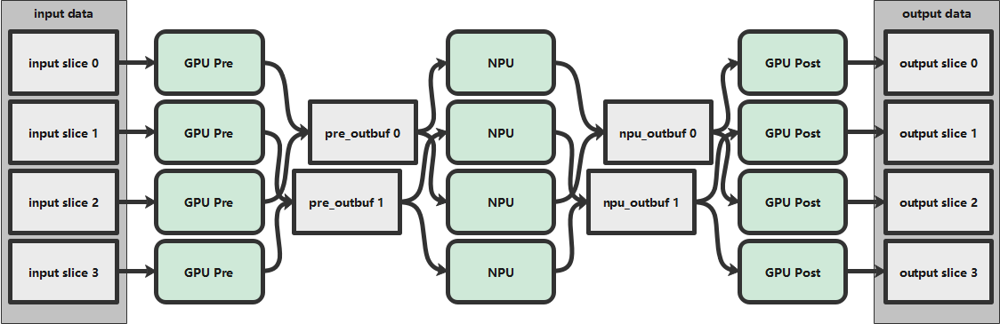
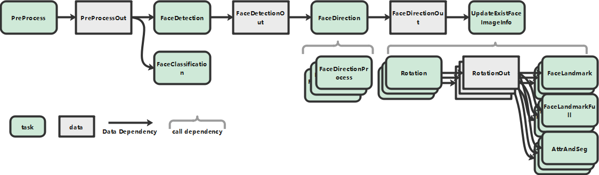
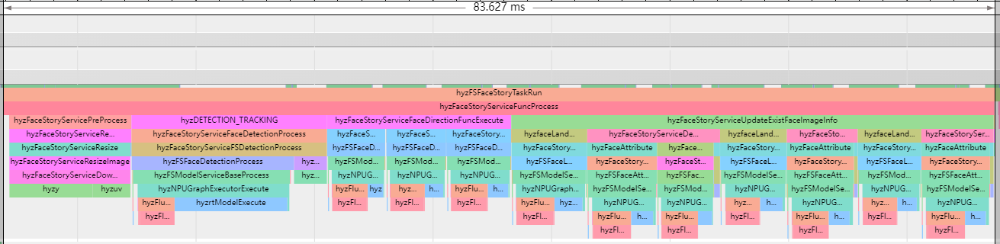
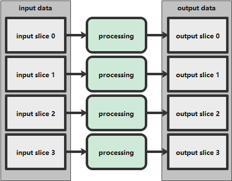
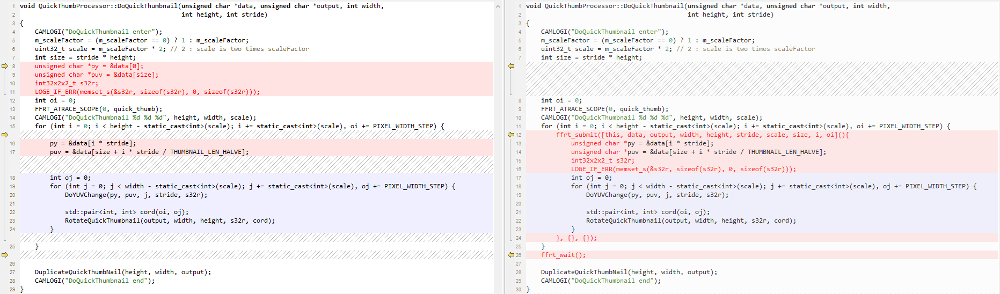
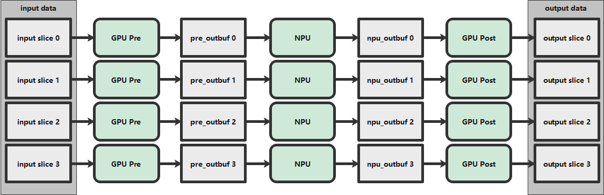
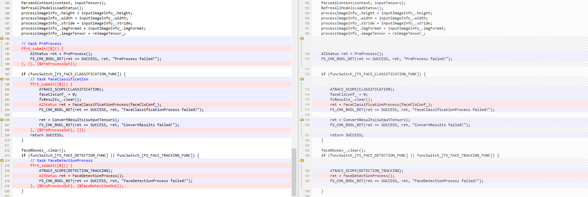
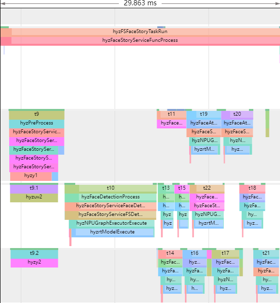

## FFRT 用户编程指南

> Function Flow编程模型是一种基于任务和数据驱动的并发编程模型，允许开发者通过任务及其依赖关系描述的方式进行应用开发。FFRT（Function Flow运行时）是支持Function Flow编程模型的软件运行时库，用于调度执行开发者基于Function Flow编程模型开发的应用。通过Function Flow编程模型和FFRT，开发者可专注于应用功能开发，由FFRT在运行时根据任务依赖状态和可用执行资源自动并发调度和执行任务。
>
> 本文用于指导开发者基于Function Flow编程模型和FFRT实现并行编程。

# 缩写

| 缩略语        | 英文全名                        | 中文解释                                                     |
| ------------- | ------------------------------- | ------------------------------------------------------------ |
| FFRT          | Function Flow Run Time          | 软件实现Function Flow运行时用于任务调度和执行                |
| Function Flow | Function Flow Programming Model | Function Flow编程模型                                        |
| Pure Function | Pure Function                   | 纯函数，注意本文中定义的纯函数指的是通过表达相互间数据依赖即可由调度系统保证正确执行的任务。 |


<br/>
<hr/>
# 编程模型
## 两种编程模型

|                | 线程编程模型                                                 | FFRT任务编程模型                                             |
| -------------- | ------------------------------------------------------------ | ------------------------------------------------------------ |
| 并行度挖掘方式 | 程序员通过创建多线程并把任务分配到每个线程中执行来挖掘运行时的并行度 | 程序员（编译器工具或语言特性配合）静态编程时将应用分解成任务及其数据依赖关系，运行时调度器分配任务到工作线程执行 |
| 谁负责线程创建 | 程序员负责创建线程，线程编程模型无法约束线程的创建，滥用可能造成系统中大量线程 | FFRT运行时负责工作线程池的创建和管理由调度器负责，程序员无法直接创建线程 |
| 负载均衡       | 程序员静态编程时将任务映射到线程，映射不合理或任务执行时间不确定造成线程负载不均 | FFRT运行时根据线程执行状态调度就绪任务到空闲线程执行，减轻了线程负载不均问题 |
| 调度开销       | 线程调度由内核态调度器完成，调度开销大                       | FFRT运行时在用户态以协程方式调度执行，相比内核线程调度机制更为轻量，减小调度的开销，并可通过硬化调度卸载进一步减小调度开销 |
| 依赖表达       | 线程创建时即处于可执行状态，执行时与其他线程同步操作，增加线程切换 | FFRT运行时根据任务创建时显式表达的输入依赖和输出依赖关系判断任务可执行状态，当输入依赖不满足时，任务不被调度执行 |


## Function Flow 任务编程模型

Function Flow编程模型允许开发者通过任务及其依赖关系描述的方式进行应用开发，其主要特性包括`Task-Based` 和 `Data-Driven` 。

### Task-Based 特性

`Task-Based` 指在Function Flow编程模型中开发者以任务方式来组织应用程序表达，运行时以任务粒度执行调度。

任务定义为一种面向开发者的编程线索和面向运行时的执行对象，通常包含一组指令序列及其操作的数据上下文环境。

Function Flow编程模型中的任务包含以下主要特征：

- 任务之间可指定依赖关系，依赖关系通过`Data-Driven`方式表达。
- 任务可支持嵌套，即任务在执行过程中可生成新的任务下发给运行时，形成父子任务关系。
- 多任务支持互同步操作，例如等待，锁，条件变量等。

> 注意
>
> 任务颗粒度影响应用执行性能，颗粒度过小增加调度开销，颗粒度过大降低并行度。Function Flow编程模型中任务的目标颗粒度最小为100us量级，开发者应注意合理控制任务颗粒度。

### Data-Driven 特性

`Data-Driven`指任务之间的依赖关系通过数据依赖表达。

任务执行过程中对其关联的数据对象进行读写操作。在Function Flow编程模型中，数据对象表达抽象为数据签名，每个数据签名唯一对应一个数据对象。

数据依赖抽象为任务所操作的数据对象的数据签名列表，包括输入数据依赖`in_deps`和输出数据依赖`out_deps`。数据对象的签名出现在一个任务的`in_deps`中时，该任务称为数据对象的消费者任务，消费者任务执行不改变其输入数据对象的内容；数据对象的签名出现在任务的`out_deps`中时，该任务称为数据对象的生产者任务，生产者任务执行改变其输出数据对象的内容，从而生成该数据对象的一个新的版本。

一个数据对象可能存在多个版本，每个版本对应一个生产者任务和零个，一个或多个消费者任务，根据生产者任务和消费者任务的下发顺序定义数据对象的多个版本的顺序以及每个版本所对应的生产者和消费者任务。

数据依赖解除的任务进入就绪状态允许被调度执行，依赖解除状态指任务所有输入数据对象版本的生产者任务执行完成，且所有输出数据对象版本的所有消费者任务执行完成的状态。

通过上述`Data-Driven`的数据依赖表达，FFRT在运行时可动态构建任务之间的基于生产者/消费者的数据依赖关系并遵循任务数据依赖状态执行调度，包括：

- Producer-Consumer 依赖

  一个数据对象版本的生产者任务和该数据对象版本的消费者任务之间形成的依赖关系，也称为Read-after-Write依赖。

- Consumer-Producer 依赖

  一个数据对象版本的消费者任务和该数据对象的下一个版本的生产者任务之间形成的依赖关系，也称为Write-after-Read依赖。

- Producer-Producer 依赖

  一个数据对象版本的生产者任务和该数据对象的下一个版本的生产者任务之间形成的依赖关系，也称为Write-after-Write依赖。


例如，如果有这么一些任务，与数据A的关系表述为：
```{.cpp}
task1(OUT A);
task2(IN A);
task3(IN A);
task4(OUT A);
task5(OUT A);
```


> 为表述方便，本文中的数据流图均以圆圈表示 Task，方块表示数据。

可以得出以下结论：
- task1 与task2/task3 构成Producer-Consumer 依赖，即：task2/task3 需要等到task1 写完A之后才能读A
- task2/task3 与task4 构成Consumer-Producer 依赖，即：task4 需要等到task2/task3 读完A之后才能写A
- task4 与task5 构成Producer-Producer 依赖，即：task5 需要等到task4 写完A之后才能写A


# C API


## 任务管理

### ffrt_submit_base

* 该接口为ffrt动态库的导出接口，基于此可以封装出不同的C++ API ffrt::submit和C API ffrt_submit，满足二进制兼容

#### 声明

```{.cpp}
const int ffrt_auto_managed_function_storage_size = 64 + sizeof(ffrt_function_header_t);
typedef enum {
    ffrt_function_kind_general,
    ffrt_function_kind_queue
} ffrt_function_kind_t;

void* ffrt_alloc_auto_managed_function_storage_base(ffrt_function_kind_t kind);

typedef void(*ffrt_function_t)(void*);
typedef struct {
    ffrt_function_t exec;
    ffrt_function_t destroy;
    uint64_t reserve[2];
} ffrt_function_header_t;

void ffrt_submit_base(ffrt_function_header_t* func, const ffrt_deps_t* in_deps, const ffrt_deps_t* out_deps, const ffrt_task_attr_t* attr);
```

#### 参数

`kind`

* function子类型，用于优化内部数据结构，默认使用ffrt_function_kind_general类型

`func`

* CPU Function的指针，该指针执行的数据结构，按照`ffrt_function_header_t`定义的描述了该CPU Task如何执行和销毁的函数指针，FFRT通过这两个函数指针完成Task的执行和销毁

`in_deps`

* 该参数是可选的
* 该参数用于描述该任务的输入依赖，FFRT 通过数据的虚拟地址作为数据的Signature 来建立依赖

`out_deps`

* 该参数是可选的
* 该参数用于描述该任务的输出依赖
* `注意`：该依赖值本质上是一个数值，ffrt没办法区分该值是合理的还是不合理的，会假定输入的值是合理的进行处理；但不建议采用NULL，1, 2 等值来建立依赖关系，建议采用实际的内存地址，因为前者使用不当会建立起不必要的依赖，影响并发

`attr`

* 该参数是可选的
* 该参数用于描述Task 的属性，比如qos 等

#### 返回值

* 不涉及

#### 描述

* ffrt_submit_base不建议用户直接调用，推荐使用基于此封装的C++接口（亦满足二进制兼容）
* **ffrt_submit_base作为底层能力，只有在用户需要自定义task类型时使用，使用时需要满足以下限制：**
  * ffrt_submit_base入参中的func指针只能通过ffrt_alloc_auto_managed_function_storage_base申请，且二者的调用需一一对应
  * ffrt_alloc_auto_managed_function_storage_base申请的内存为ffrt_auto_managed_function_storage_size字节，其生命周期归ffrt管理，在该task结束时，由FFRT自动释放，用户无需释放
* ffrt_function_header_t 中定义了两个函数指针：
  * exec：用于描述该Task如何被执行，当FFRT需要执行该Task时由FFRT调用
  * destroy：用于描述该Task如何被执行，当FFRT需要执行该Task时由FFRT调用

#### 样例

* 通过该接口提供C++11 Lambda表达式的支持（该代码已经在ffrr.h中提供，默认支持）

```{.cpp}
template<class T>
struct function {
    template<class CT>
    function(ffrt_function_header_t h, CT&& c) : header(h), closure(std::forward<CT>(c)) {}
    ffrt_function_header_t header;
    T closure;
};

template<class T>
void exec_function_wrapper(void* t)
{
    auto f = (function<std::decay_t<T>>*)t;
    f->closure();
}

template<class T>
void destroy_function_wrapper(void* t)
{
    auto f = (function<std::decay_t<T>>*)t;
    f->closure = nullptr;
}

template<class T>
inline ffrt_function_header_t* create_function_wrapper(T&& func)
{
    using function_type = function<std::decay_t<T>>;
    static_assert(sizeof(function_type) <= ffrt_auto_managed_function_storage_size,
        "size of function must be less than ffrt_auto_managed_function_storage_size");

    auto p = ffrt_alloc_auto_managed_function_storage_base(ffrt_function_kind_general);
    auto f = new (p) function_type(
        {exec_function_wrapper<T>, destroy_function_wrapper<T>},
        std::forward<T>(func));
    return (ffrt_function_header_t*)f;
}

static inline void submit(std::function<void()>&& func)
{
    return ffrt_submit_base(create_function_wrapper(std::move(func)), NULL, NULL, NULL);
}
```

### ffrt_wait

<hr/>
* 同步等待，与ffrt_submit 配合使用
* 等待指定的数据被生产完成，或等待当前任务的所有子任务完成，在不满足条件之前，当前的执行上下文被suspend，在满足条件后恢复执行

#### 声明

```{.cpp}
void ffrt_wait_deps(ffrt_deps_t* deps);
void ffrt_wait();
```

#### 参数

`deps`

* 需要等待被生产完成的数据的虚拟地址，这些地址可能作为某些任务在submit 时的out_deps，该依赖的生成见ffrt_deps_t章节，空指针表示无依赖

#### 返回值

* 不涉及

#### 描述
* ffrt_wait_deps(deps) 用于等待deps指代的数据被生产完成才能执行后面的代码
* ffrt_wait() 用于等待当前上下文提交的所有子任务（`注意：不包括孙任务和下级子任务`）都完成才能执行后面的代码
* 该接口支持在FFRT task 内部调用，也支持在FFRT task 外部调用
* 在FFRT task 外部调用的wait 是OS 能够感知的等待，相对于FFRT task 内部调用的wait 是更加昂贵的，因此我们希望尽可能让更多的wait 发生在FFRT task 内部 ，而不是FFRT task 外部

#### 样例

**recursive fibonacci**

串行版的fibonacci 可以实现为：

```{.c}
#include <stdio.h>

void fib(int x, int* y) {
    if (x <= 1) {
        *y = x;
    } else {
        int y1, y2;
        fib(x - 1, &y1);
        fib(x - 2, &y2);
        *y = y1 + y2;
    }
}
int main(int narg, char** argv)
{
    int r;
    fib(10, &r);
    printf("fibonacci 10: %d\n", r);
    return 0;
}
```

若要使用 FFRT 实现并行（注，对于单纯的fibonacci，单个 Task 的计算量极小，不具有并行加速的意义，但这种调用pattern 对并行编程模型的灵活性考验是非常高的），其中1种可行的实现为：

```{.c}
#include <stdio.h>
#include "ffrt.h"

typedef struct {
    int x;
    int* y;
} fib_ffrt_s;

typedef struct {
    ffrt_function_header_t header;
    ffrt_function_t func;
    ffrt_function_t after_func;
    void* arg;
} c_function;

static void ffrt_exec_function_wrapper(void* t)
{
    c_function* f = (c_function*)t;
    if (f->func) {
        f->func(f->arg);
    }
}

static void ffrt_destroy_function_wrapper(void* t)
{
    c_function* f = (c_function*)t;
    if (f->after_func) {
        f->after_func(f->arg);
    }
}

#define FFRT_STATIC_ASSERT(cond, msg) int x(int static_assertion_##msg[(cond) ? 1 : -1])
static inline ffrt_function_header_t* ffrt_create_function_wrapper(const ffrt_function_t func,
    const ffrt_function_t after_func, void* arg)
{
    FFRT_STATIC_ASSERT(sizeof(c_function) <= ffrt_auto_managed_function_storage_size,
        size_of_function_must_be_less_than_ffrt_auto_managed_function_storage_size);
    c_function* f = (c_function*)ffrt_alloc_auto_managed_function_storage_base(ffrt_function_kind_general);
    f->header.exec = ffrt_exec_function_wrapper;
    f->header.destroy = ffrt_destroy_function_wrapper;
    f->func = func;
    f->after_func = after_func;
    f->arg = arg;
    return (ffrt_function_header_t*)f;
}

static inline void ffrt_submit_c(ffrt_function_t func, const ffrt_function_t after_func,
    void* arg, const ffrt_deps_t* in_deps, const ffrt_deps_t* out_deps, const ffrt_task_attr_t* attr)
{
    ffrt_submit_base(ffrt_create_function_wrapper(func, after_func, arg), in_deps, out_deps, attr);
}

#define ffrt_deps_define(name, dep1, ...) const void* __v_##name[] = {dep1, ##__VA_ARGS__}; \
    ffrt_deps_t name = {sizeof(__v_##name) / sizeof(void*), __v_##name}

void fib_ffrt(void* arg)
{
    fib_ffrt_s* p = (fib_ffrt_s*)arg;
    int x = p->x;
    int* y = p->y;

    if (x <= 1) {
        *y = x;
    } else {
        int y1, y2;
        fib_ffrt_s s1 = {x - 1, &y1};
        fib_ffrt_s s2 = {x - 2, &y2};
        ffrt_deps_define(dx, &x);
        ffrt_deps_define(dy1, &y1);
        ffrt_deps_define(dy2, &y2);
        ffrt_deps_define(dy12, &y1, &y2);
        ffrt_submit_c(fib_ffrt, NULL, &s1, &dx, &dy1, NULL);
        ffrt_submit_c(fib_ffrt, NULL, &s2, &dx, &dy2, NULL);
        ffrt_wait_deps(&dy12);
        *y = y1 + y2;
    }
}

int main(int narg, char** argv)
{
    int r;
    fib_ffrt_s s = {10, &r};
    ffrt_deps_define(dr, &r);
    ffrt_submit_c(fib_ffrt, NULL, &s, NULL, &dr, NULL);
    ffrt_wait_deps(&dr);
    printf("fibonacci 10: %d\n", r);
    return 0;
}
```

`解析`：

1)   将fibonacci (x-1)和fibonacci (x-2) 作为2个Task 提交给FFRT，在两个Task 完成之后将结果累加；

2)   虽然单个Task 只能拆分成2个SubTask 但是子Task 可以继续拆分，因此，整个计算图的并行度是非常高的，Task 之间在FFRT 内部形成了一颗调用树；


> 以上实现，逻辑上虽与C++ API中的实现类似，但是用户显式管理数据生命周期和函数入参打包两个因素将使代码异常复杂


### ffrt_deps_t

* C API中对依赖数组的抽象，逻辑上等同于C++ API中的`std::vector<void*>`

#### 声明

```{.cpp}
typedef struct {
    uint32_t len;
    const void* const * items;
} ffrt_deps_t;
```

#### 参数

`len`

* 所依赖的Signature的个数，取值大于等于0

`item`

* len个Signature的起始地址指针

#### 返回值

* 不涉及

#### 描述

* item为len个Signature的起始指针，该指针可以指向堆空间，也可以指向栈空间，但是要求分配的空间大于等于len * sizeof(void*)

#### 样例

* item指向栈空间的ffrt_deps_t

```{.c}
#include "ffrt.h"

int main(int narg, char** argv)
{
    int x1 = 1;
    int x2 = 2;
    
    void *t[] = {&x1, &x2};
    ffrt_deps_t deps = {2, (const void* const *)&t};
    // some code use deps
    return 0;
}
```

* item指向栈空间的ffrt_deps_t

```{.c}
#include <stdlib.h>
#include "ffrt.h"

int main(int narg, char** argv)
{
    int x1 = 1;
    int x2 = 2;
    
    void** t = (void**)malloc(sizeof(void*) * 2);
    t[0]= &x1;
    t[1]= &x2;
    ffrt_deps_t deps = {2, t};
    
    // some code use deps
    free(t);
    return 0;
}
```

### ffrt_task_attr_t

<hr/>
* 定义task 的属性的辅助类，与ffrt_submit 配合使用

#### 声明

```{.c}
typedef enum {
    ffrt_qos_inherent = -1,
    ffrt_qos_background,
    ffrt_qos_utility,
    ffrt_qos_default,
    ffrt_qos_user_initiated,
} ffrt_qos_t;

typedef struct {
    char storage[ffrt_task_attr_storage_size];
} ffrt_task_attr_t;
typedef void* ffrt_task_handle_t;

int ffrt_task_attr_init(ffrt_task_attr_t* attr);
void ffrt_task_attr_destroy(ffrt_task_attr_t* attr);
void ffrt_task_attr_set_qos(ffrt_task_attr_t* attr, ffrt_qos_t qos);
ffrt_qos_t ffrt_task_attr_get_qos(const ffrt_task_attr_t* attr);
void ffrt_task_attr_set_name(ffrt_task_attr_t* attr, const char* name);
const char* ffrt_task_attr_get_name(const ffrt_task_attr_t* attr);
```

#### 参数

`attr`

* 创建的tasks属性的句柄

`qos`

* qos 设定的枚举类型
* inherent 是一个qos 设定策略，代表即将ffrt_submit 的task 的qos 继承当前task 的qos

#### 返回值

* 不涉及

#### 描述
* `attr`所传递的内容会在ffrt_submit内部完成取存，ffrt_submit返回后用户即可销毁
* 约定
  * 在submit 时，如果不通过task_attr 设定qos，那么默认该提交的task的qos 为`ffrt_qos_default`
  * 在submit 时，如果通过task_attr 设定qos 为`ffrt_qos_inherent`，表示将该提交的task 的qos 与当前task 的qos 相同，在FFRT task 外部提交的属性为`ffrt_qos_inherent` 的task，其qos 为`ffrt_qos_default`
  * 其他情况下，该提交的task 的qos 被设定为指定的值
* ffrt_task_attr_t对象的置空和销毁由用户完成，对同一个ffrt_task_attr_t仅能调用一次`ffrt_task_attr_destroy`，重复对同一个ffrt_task_attr_t调用`ffrt_task_attr_destroy`，其行为是未定义的
* 在`ffrt_task_attr_destroy`之后再对task_attr进行访问，其行为是未定义的

#### 样例

```{.c}
#include <stdio.h>
#include "ffrt.h"

void my_print(void* arg)
{
    printf("hello ffrt\n");
}

typedef struct {
    ffrt_function_header_t header;
    ffrt_function_t func;
    ffrt_function_t after_func;
    void* arg;
} c_function;

static void ffrt_exec_function_wrapper(void* t)
{
    c_function* f = (c_function*)t;
    if (f->func) {
        f->func(f->arg);
    }
}

static void ffrt_destroy_function_wrapper(void* t)
{
    c_function* f = (c_function*)t;
    if (f->after_func) {
        f->after_func(f->arg);
    }
}

#define FFRT_STATIC_ASSERT(cond, msg) int x(int static_assertion_##msg[(cond) ? 1 : -1])
static inline ffrt_function_header_t* ffrt_create_function_wrapper(const ffrt_function_t func,
    const ffrt_function_t after_func, void* arg)
{
    FFRT_STATIC_ASSERT(sizeof(c_function) <= ffrt_auto_managed_function_storage_size,
        size_of_function_must_be_less_than_ffrt_auto_managed_function_storage_size);
    c_function* f = (c_function*)ffrt_alloc_auto_managed_function_storage_base(ffrt_function_kind_general);
    f->header.exec = ffrt_exec_function_wrapper;
    f->header.destroy = ffrt_destroy_function_wrapper;
    f->func = func;
    f->after_func = after_func;
    f->arg = arg;
    return (ffrt_function_header_t*)f;
}

static inline void ffrt_submit_c(ffrt_function_t func, const ffrt_function_t after_func,
    void* arg, const ffrt_deps_t* in_deps, const ffrt_deps_t* out_deps, const ffrt_task_attr_t* attr)
{
    ffrt_submit_base(ffrt_create_function_wrapper(func, after_func, arg), in_deps, out_deps, attr);
}

int main(int narg, char** argv)
{
    ffrt_task_attr_t attr;
    ffrt_task_attr_init(&attr);
    ffrt_task_attr_set_qos(&attr, ffrt_qos_background);
    ffrt_submit_c(my_print, NULL, NULL, NULL, NULL, &attr);
    ffrt_task_attr_destroy(&attr);
    ffrt_wait();
    return 0;
}
```

* 提交一个qos 级别为background 的任务


### ffrt_submit_h_base

<hr/>

* 向调度器提交一个task，与ffrt_submit 的差别在于返回task 的句柄，该句柄可以用于建立task 之间的依赖，或用于在wait 语句中实现同步

#### 声明

```{.cpp}
typedef void* ffrt_task_handle_t;

ffrt_task_handle_t ffrt_submit_h_base(ffrt_function_t func, void* arg, const ffrt_deps_t* in_deps, const ffrt_deps_t* out_deps, const ffrt_task_attr_t* attr);
void ffrt_task_handle_destroy(ffrt_task_handle_t handle);
```

#### 参数

`func`

* 可被std::function 接收的一切CPU 可执行体，可以为C++ 定义的Lambda 函数闭包，函数指针，甚至是函数对象

`in_deps`

* 该参数是可选的
* 该参数用于描述该任务的输入依赖，FFRT 通过数据的虚拟地址作为数据的Signature 来建立依赖

`out_deps`

* 该参数是可选的
* 该参数用于描述该任务的输出依赖
* `注意`：该依赖值本质上是一个数值，ffrt没办法区分该值是合理的还是不合理的，会假定输入的值是合理的进行处理；但不建议采用NULL，1, 2 等值来建立依赖关系，建议采用实际的内存地址，因为前者使用不当会建立起不必要的依赖，影响并发

`attr`

* 该参数是可选的
* 该参数用于描述Task 的属性，比如qos 等，详见 [ffrt_task_attr_t](#ffrt_task_attr_t)章节

#### 返回值

* task 的句柄，该句柄可以用于建立task 之间的依赖，或用于在wait 语句中实现同步

#### 描述

* **C API中的ffrt_task_handle_t需要用户调用`ffrt_task_handle_destroy`显式销毁**
* C API中的task_handle_t对象的置空和销毁由用户完成，对同一个ffrt_task_handle_t仅能调用一次`ffrt_task_handle_destroy`，重复对同一个ffrt_task_handle_t调用`ffrt_task_handle_destroy`，其行为是未定义的
* 在`ffrt_task_handle_destroy`之后再对ffrt_task_handle_t进行访问，其行为是未定义的

#### 样例

```{.c}
#include <stdio.h>
#include "ffrt.h"

void func0(void* arg)
{
    printf("hello ");
}

void func1(void* arg)
{
    (*(int*)arg)++;
}

void func2(void* arg)
{
    printf("world, x = %d\n", *(int*)arg);
}

void func3(void* arg)
{
    printf("handle wait");
    (*(int*)arg)++;
}

typedef struct {
    ffrt_function_header_t header;
    ffrt_function_t func;
    ffrt_function_t after_func;
    void* arg;
} c_function;

static void ffrt_exec_function_wrapper(void* t)
{
    c_function* f = (c_function*)t;
    if (f->func) {
        f->func(f->arg);
    }
}

static void ffrt_destroy_function_wrapper(void* t)
{
    c_function* f = (c_function*)t;
    if (f->after_func) {
        f->after_func(f->arg);
    }
}

#define FFRT_STATIC_ASSERT(cond, msg) int x(int static_assertion_##msg[(cond) ? 1 : -1])
static inline ffrt_function_header_t* ffrt_create_function_wrapper(const ffrt_function_t func,
    const ffrt_function_t after_func, void* arg)
{
    FFRT_STATIC_ASSERT(sizeof(c_function) <= ffrt_auto_managed_function_storage_size,
        size_of_function_must_be_less_than_ffrt_auto_managed_function_storage_size);
    c_function* f = (c_function*)ffrt_alloc_auto_managed_function_storage_base(ffrt_function_kind_general);
    f->header.exec = ffrt_exec_function_wrapper;
    f->header.destroy = ffrt_destroy_function_wrapper;
    f->func = func;
    f->after_func = after_func;
    f->arg = arg;
    return (ffrt_function_header_t*)f;
}

static inline ffrt_task_handle_t ffrt_submit_h_c(ffrt_function_t func, const ffrt_function_t after_func,
    void* arg, const ffrt_deps_t* in_deps, const ffrt_deps_t* out_deps, const ffrt_task_attr_t* attr)
{
    return ffrt_submit_h_base(ffrt_create_function_wrapper(func, after_func, arg), in_deps, out_deps, attr);
}

static inline void ffrt_submit_c(ffrt_function_t func, const ffrt_function_t after_func,
    void* arg, const ffrt_deps_t* in_deps, const ffrt_deps_t* out_deps, const ffrt_task_attr_t* attr)
{
    ffrt_submit_base(ffrt_create_function_wrapper(func, after_func, arg), in_deps, out_deps, attr);
}

#define ffrt_deps_define(name, dep1, ...) const void* __v_##name[] = {dep1, ##__VA_ARGS__}; \
    ffrt_deps_t name = {sizeof(__v_##name) / sizeof(void*), __v_##name}

int main(int narg, char** argv)
{  
    // handle work with submit
    ffrt_task_handle_t h = ffrt_submit_h_c(func0, NULL, NULL, NULL, NULL, NULL); // not need some data in this task
    int x = 1;
    ffrt_deps_define(d1, &x);
    ffrt_deps_define(d2, &x, h);
    ffrt_submit_c(func1, NULL, &x, NULL, &d1, NULL);
    ffrt_submit_c(func2, NULL, &x, &d2, NULL, NULL); // this task depend x and h
    ffrt_task_handle_destroy(h);
    
    // handle work with wait
    ffrt_task_handle_t h2 = ffrt_submit_h_c(func3, NULL, &x, NULL, NULL, NULL);
    ffrt_deps_define(d3, h2);
    ffrt_wait_deps(&d3);
    ffrt_task_handle_destroy(h2);
    printf("x = %d", x);
    ffrt_wait();
    return 0;
}
```

* 预期的输出为

```
hello world, x = 2
handle wait
x = 3
```


### ffrt_this_task_get_id

<hr/>

* 返回当前task的id标识，更多使用用于维测（原因是task name可能重名）

#### 声明

```{.c}
uint64_t ffrt_this_task_get_id();
```

#### 参数

* 不涉及

#### 返回值

* 当前task的id

#### 描述

* 该接口在task内部调用将返回当前task的id标识，在task外部调用将返回0
* 可以基于该接口在task外部调用返回0的特性来区分函数是运行在FFRT 工作线程上还是非FFRT工作线程上
* task id为从1开始编码，每提交一个task便增加1，被设计成64bit，即便是每秒百万次提交，也需要292471.2年才会发生翻转

#### 样例

* 忽略


### ffrt_this_task_update_qos

<hr/>

* 更新当前正在执行的task的优先级

#### 声明

```{.cpp}
int ffrt_this_task_update_qos(ffrt_qos_t qos);
```

#### 参数

* `qos` 新的优先级

#### 返回值

* 0表示成功，非0表示失败

#### 描述

* 该接口对当前task的qos调整会立即生效
* 如果新设定的qos与当前的qos不一致，则会block当前task的执行，再按照新的qos恢复执行
* 如果新设定的qos与当前的qos一致，则接口会立即返回0，不做任何处理
* **如果在非task内部调用该接口，则返回非0值，用户可以选择忽略或其他处理**

#### 样例

* 忽略

## 串行队列
<hr />
* FFRT提供queue来实现Andorid中类似WorkQueue能力，且在使用得当的情况下将有更好的性能

### ffrt_queue_attr_t

#### 声明
```{.c}
typedef struct {
    uint32_t storage[(ffrt_queue_attr_storage_size + sizeof(uint32_t) - 1) / sizeof(uint32_t)];
} ffrt_queue_attr_t;

int ffrt_queue_attr_init(ffrt_queue_attr_t* attr);
void ffrt_queue_attr_destroy(ffrt_queue_attr_t* attr);
```

#### 参数

`attr`
* 该参数是指向未初始化的ffrt_queue_attr_t

#### 返回值
* 若成功返回0，否则返回-1

#### 描述
* ffrt_queue_attr_t用于创建ffrt_queue_t且不单独使用，因此必须在创建队列前先创建好队列属性
* ffrt_queue_attr_t对象的置空和销毁由用户完成，对同一个ffrt_queue_t仅能调用一次`ffrt_queue_attr_destroy`，重复对同一个ffrt_queue_t调用`ffrt_queue_attr_destroy`，其行为是未定义的
* 在`ffrt_queue_attr_destroy`之后再对ffrt_queue_t进行访问，其行为是未定义的

#### 样例
将ffrt_queue_t章节的样例

### ffrt_queue_t

#### 声明
```{.c}
typedef enum { ffrt_queue_serial, ffrt_queue_max } ffrt_queue_type_t;
typedef void* ffrt_queue_t;

ffrt_queue_t ffrt_queue_create(ffrt_queue_type_t type, const char* name, const ffrt_queue_attr_t* attr)
void ffrt_queue_destroy(ffrt_queue_t queue)
```

#### 参数

`type`
* 该参数用于描述创建的队列类型

`name`
* 该参数用于描述创建队列的名字

`attr`
* 该参数用于描述queue的属性，详见ffrt_queue_attr_t章节

#### 返回值
* 若成功则返回新创建的队列，否则返回空指针

#### 描述
* 提交至该队列的任务将按照顺序执行，如果某个提交的任务中发生阻塞，则无法保证该任务的执行顺序
* ffrt_queue_t对象的置空和销毁由用户完成，对同一个ffrt_queue_t仅能调用一次`ffrt_queue_t`，重复对同一个ffrt_queue_t调用`ffrt_queue_destroy`，其行为是未定义的
* 在`ffrt_queue_destroy`之后再对ffrt_queue_t进行访问，其行为是未定义的

#### 样例
```
#include <stdio.h>
#include "ffrt.h"

using namespace ffrt;
using namespace std;

int main(int narg, char** argv)
{
    ffrt_queue_attr_t queue_attr;
    (void)ffrt_queue_attr_init(&queue_attr);
    ffrt_queue_t queue_handle = ffrt_queue_create(ffrt_queue_serial, "test_queue", &queue_attr);

    ffrt_queue_submit(queue_handle, ffrt::create_function_wrapper([]() {printf("Task done.\n");}, ffrt_function_kind_queue), nullptr);

    ffrt_queue_attr_destroy(&queue_attr);
    ffrt_queue_destroy(queue_handle);
}
```
## 同步原语

### ffrt_mutex_t
<hr/>
* FFRT提供的类似pthread mutex 的性能实现

#### 声明

```{.cpp}
typedef enum {
    ffrt_error = -1,
    ffrt_success = 0,
    ffrt_error_nomem = ENOMEM,
    ffrt_error_timedout = ETIMEDOUT,
    ffrt_error_busy = EBUSY,
    ffrt_error_inval = EINVAL
} ffrt_error_t;

struct ffrt_mutex_t;

int ffrt_mutex_init(ffrt_mutex_t* mutex, const ffrt_mutexattr_t* attr);
int ffrt_mutex_lock(ffrt_mutex_t* mutex);
int ffrt_mutex_unlock(ffrt_mutex_t* mutex);
int ffrt_mutex_trylock(ffrt_mutex_t* mutex);
int ffrt_mutex_destroy(ffrt_mutex_t* mutex);
```

#### 参数

`attr`

* 当前FFRT只支持基础类型的mutex，因此attr必须为空指针

`mutex`

* 指向所操作的互斥锁的指针

#### 返回值

* 若成功则为 ffrt_success ，否则发生错误

#### 描述
* 该接口只能在FFRT task 内部调用，在FFRT task 外部调用存在未定义的行为
* 该功能能够避免pthread传统的pthread_mutex_t 在抢不到锁时陷入内核的问题，在使用得当的条件下将会有更好的性能
* **注意：目前暂不支持递归和定时功能**
* **注意：C API中的ffrt_mutex_t需要用户调用`ffrt_mutex_init`和`ffrt_mutex_destroy`显式创建和销毁，而C++ API无需该操作**
* **注意：C API中的ffrt_mutex_t对象的置空和销毁由用户完成，对同一个ffrt_mutex_t仅能调用一次`ffrt_mutex_destroy`，重复对同一个ffrt_mutex_t调用`ffrt_mutex_destroy`，其行为是未定义的**
* **注意：在`ffrt_mutex_destroy`之后再对ffrt_mutex_t进行访问，其行为是未定义的**

#### 样例

```{.c}
#include <stdio.h>
#include "ffrt.h"

typedef struct {
    int* sum;
    ffrt_mutex_t* mtx;
} tuple;

void func(void* arg)
{
    tuple* t = (tuple*)arg;
    
    int ret = ffrt_mutex_lock(t->mtx);
    if (ret != ffrt_success) {
        printf("error\n");
    }
    (*t->sum)++;
    ret = ffrt_mutex_unlock(t->mtx);
    if (ret != ffrt_success) {
        printf("error\n");
    }
}

typedef struct {
    ffrt_function_header_t header;
    ffrt_function_t func;
    ffrt_function_t after_func;
    void* arg;
} c_function;

static void ffrt_exec_function_wrapper(void* t)
{
    c_function* f = (c_function*)t;
    if (f->func) {
        f->func(f->arg);
    }
}

static void ffrt_destroy_function_wrapper(void* t)
{
    c_function* f = (c_function*)t;
    if (f->after_func) {
        f->after_func(f->arg);
    }
}

#define FFRT_STATIC_ASSERT(cond, msg) int x(int static_assertion_##msg[(cond) ? 1 : -1])
static inline ffrt_function_header_t* ffrt_create_function_wrapper(const ffrt_function_t func,
    const ffrt_function_t after_func, void* arg)
{
    FFRT_STATIC_ASSERT(sizeof(c_function) <= ffrt_auto_managed_function_storage_size,
        size_of_function_must_be_less_than_ffrt_auto_managed_function_storage_size);
    c_function* f = (c_function*)ffrt_alloc_auto_managed_function_storage_base(ffrt_function_kind_general);
    f->header.exec = ffrt_exec_function_wrapper;
    f->header.destroy = ffrt_destroy_function_wrapper;
    f->func = func;
    f->after_func = after_func;
    f->arg = arg;
    return (ffrt_function_header_t*)f;
}

static inline void ffrt_submit_c(ffrt_function_t func, const ffrt_function_t after_func,
    void* arg, const ffrt_deps_t* in_deps, const ffrt_deps_t* out_deps, const ffrt_task_attr_t* attr)
{
    ffrt_submit_base(ffrt_create_function_wrapper(func, after_func, arg), in_deps, out_deps, attr);
}

void ffrt_mutex_task()
{
    int sum = 0;
    ffrt_mutex_t mtx;
    tuple t = {&sum, &mtx};
    int ret = ffrt_mutex_init(&mtx, NULL);
    if (ret != ffrt_success) {
        printf("error\n");
    }
    for (int i = 0; i < 10; i++) {
        ffrt_submit_c(func, NULL, &t, NULL, NULL, NULL);
    }
    ffrt_mutex_destroy(&mtx);
    ffrt_wait();
    printf("sum = %d", sum);
}

int main(int narg, char** argv)
{
    int r;
    ffrt_submit_c(ffrt_mutex_task, NULL, NULL, NULL, NULL, NULL);
    ffrt_wait();
    return 0;
}
```

预期输出为

```
sum=10
```

* 该例子为功能示例，实际中并不鼓励这样使用


### ffrt_cond_t
<hr/>

* FFRT提供的类似pthread 信号量的性能实现

#### 声明

```{.c}
typedef enum {
    ffrt_error = -1,
    ffrt_success = 0,
    ffrt_error_nomem = ENOMEM,
    ffrt_error_timedout = ETIMEDOUT,
    ffrt_error_busy = EBUSY,
    ffrt_error_inval = EINVAL
} ffrt_error_t;

struct ffrt_cond_t;
typedef enum {
    ffrt_clock_realtime = CLOCK_REALTIME,
    ffrt_clock_monotonic = CLOCK_MONOTONIC
} ffrt_clockid_t;

int ffrt_condattr_init(ffrt_condattr_t* attr);
int ffrt_condattr_destroy(ffrt_condattr_t* attr);
int ffrt_condattr_setclock(ffrt_condattr_t* attr, ffrt_clockid_t clock);
int ffrt_condattr_getclock(const ffrt_condattr_t* attr, ffrt_clockid_t* clock);

int ffrt_cond_init(ffrt_cond_t* cond, const ffrt_condattr_t* attr);
int ffrt_cond_signal(ffrt_cond_t* cond);
int ffrt_cond_broadcast(ffrt_cond_t* cond);
int ffrt_cond_wait(ffrt_cond_t*cond, ffrt_mutex_t* mutex);
int ffrt_cond_timedwait(ffrt_cond_t* cond, ffrt_mutex_t* mutex, const struct timespec* time_point);
int ffrt_cond_destroy(ffrt_cond_t* cond);
```

#### 参数

`cond`

* 指向所操作的信号量的指针

`attr`

* 属性设定，空指针表示使用默认属性

`mutex`

* 指向要在阻塞期间解锁的互斥锁的指针

`time_point`

* 指向指定等待时限时间的对象的指针


#### 返回值

* 若成功则为 ffrt_success，若在锁定互斥前抵达时限则为 ffrt_error_timedout

#### 描述
* 该接口只能在FFRT task 内部调用，在FFRT task 外部调用存在未定义的行为
* 该功能能够避免传统的pthread_cond_t在条件不满足时陷入内核的问题，在使用得当的条件下将会有更好的性能
* **注意：C API中的ffrt_cond_t需要用户调用`ffrt_cond_init`和`ffrt_cond_destroy`显式创建和销毁，而C++ API中依赖构造和析构自动完成**
* **注意：C API中的ffrt_cond_t对象的置空和销毁由用户完成，对同一个ffrt_cond_t仅能调用一次`ffrt_cond_destroy`，重复对同一个ffrt_cond_t调用`ffrt_cond_destroy`，其行为是未定义的**
* **注意：在`ffrt_cond_destroy`之后再对ffrt_cond_t进行访问，其行为是未定义的**

#### 样例

```{.c}
#include <stdio.h>
#include "ffrt.h"

typedef struct {
    ffrt_cond_t* cond;
    int* a;
    ffrt_mutex_t* lock_;
} tuple;

void func1(void* arg)
{
    tuple* t = (tuple*)arg;
    int ret = ffrt_mutex_lock(t->lock_);
    if (ret != ffrt_success) {
        printf("error\n");
    }
    while (*t->a != 1) {
        ret = ffrt_cond_wait(t->cond, t->lock_);
        if (ret != ffrt_success) {
            printf("error\n");
        }
    }
    ret = ffrt_mutex_unlock(t->lock_);
    if (ret != ffrt_success) {
        printf("error\n");
    }
    printf("a = %d", *(t->a));
}

void func2(void* arg)
{
    tuple* t = (tuple*)arg;
    int ret = ffrt_mutex_lock(t->lock_);
    if (ret != ffrt_success) {
        printf("error\n");
    }
    *(t->a) = 1;
    ret = ffrt_cond_signal(t->cond);
    if (ret != ffrt_success) {
        printf("error\n");
    }
    ret = ffrt_mutex_unlock(t->lock_);
    if (ret != ffrt_success) {
        printf("error\n");
    }
}

typedef struct {
    ffrt_function_header_t header;
    ffrt_function_t func;
    ffrt_function_t after_func;
    void* arg;
} c_function;

static void ffrt_exec_function_wrapper(void* t)
{
    c_function* f = (c_function*)t;
    if (f->func) {
        f->func(f->arg);
    }
}

static void ffrt_destroy_function_wrapper(void* t)
{
    c_function* f = (c_function*)t;
    if (f->after_func) {
        f->after_func(f->arg);
    }
}

#define FFRT_STATIC_ASSERT(cond, msg) int x(int static_assertion_##msg[(cond) ? 1 : -1])
static inline ffrt_function_header_t* ffrt_create_function_wrapper(const ffrt_function_t func,
    const ffrt_function_t after_func, void* arg)
{
    FFRT_STATIC_ASSERT(sizeof(c_function) <= ffrt_auto_managed_function_storage_size,
        size_of_function_must_be_less_than_ffrt_auto_managed_function_storage_size);
    c_function* f = (c_function*)ffrt_alloc_auto_managed_function_storage_base(ffrt_function_kind_general);
    f->header.exec = ffrt_exec_function_wrapper;
    f->header.destroy = ffrt_destroy_function_wrapper;
    f->func = func;
    f->after_func = after_func;
    f->arg = arg;
    return (ffrt_function_header_t*)f;
}

static inline void ffrt_submit_c(ffrt_function_t func, const ffrt_function_t after_func,
    void* arg, const ffrt_deps_t* in_deps, const ffrt_deps_t* out_deps, const ffrt_task_attr_t* attr)
{
    ffrt_submit_base(ffrt_create_function_wrapper(func, after_func, arg), in_deps, out_deps, attr);
}

void ffrt_cv_task()
{
    ffrt_cond_t cond;
    int ret = ffrt_cond_init(&cond, NULL);
    if (ret != ffrt_success) {
        printf("error\n");
    }
    int a = 0;
    ffrt_mutex_t lock_;
    tuple t = {&cond, &a, &lock_};
    ret = ffrt_mutex_init(&lock_, NULL);
    if (ret != ffrt_success) {
        printf("error\n");
    }
    ffrt_submit_c(func1, NULL, &t, NULL, NULL, NULL);
    ffrt_submit_c(func2, NULL, &t, NULL, NULL, NULL);
    ffrt_wait();
    ffrt_cond_destroy(&cond);
    ffrt_mutex_destroy(&lock_);
}

int main(int narg, char** argv)
{
    ffrt_submit_c(ffrt_cv_task, NULL, NULL, NULL, NULL, NULL);
    ffrt_wait();
    return 0;
}
```

预期输出为：

```
a=1
```

* 该例子为功能示例，实际中并不鼓励这样使用

## 杂项

### ffrt_usleep

<hr/>
* FFRT提供的类似C11 sleep和linux usleep的性能实现

#### 声明

```{.c}
int ffrt_usleep(uint64_t usec);
```

#### 参数

`usec`

* 睡眠的us数

#### 返回值

* 不涉及

#### 描述
* 该接口只能在FFRT task 内部调用，在FFRT task 外部调用存在未定义的行为
* 该功能能够避免传统的sleep 睡眠时陷入内核的问题，在使用得当的条件下将会有更好的性能

#### 样例

```{.c}
#include <time.h>
#include <stdio.h>
#include "ffrt.h"

void func(void* arg)
{
    printf("Time: %s", ctime(&(time_t){time(NULL)}));
    ffrt_usleep(2000000); // 睡眠 2 秒
    printf("Time: %s", ctime(&(time_t){time(NULL)}));
}

typedef struct {
    ffrt_function_header_t header;
    ffrt_function_t func;
    ffrt_function_t after_func;
    void* arg;
} c_function;

static void ffrt_exec_function_wrapper(void* t)
{
    c_function* f = (c_function*)t;
    if (f->func) {
        f->func(f->arg);
    }
}

static void ffrt_destroy_function_wrapper(void* t)
{
    c_function* f = (c_function*)t;
    if (f->after_func) {
        f->after_func(f->arg);
    }
}

#define FFRT_STATIC_ASSERT(cond, msg) int x(int static_assertion_##msg[(cond) ? 1 : -1])
static inline ffrt_function_header_t* ffrt_create_function_wrapper(const ffrt_function_t func,
    const ffrt_function_t after_func, void* arg)
{
    FFRT_STATIC_ASSERT(sizeof(c_function) <= ffrt_auto_managed_function_storage_size,
        size_of_function_must_be_less_than_ffrt_auto_managed_function_storage_size);
    c_function* f = (c_function*)ffrt_alloc_auto_managed_function_storage_base(ffrt_function_kind_general);
    f->header.exec = ffrt_exec_function_wrapper;
    f->header.destroy = ffrt_destroy_function_wrapper;
    f->func = func;
    f->after_func = after_func;
    f->arg = arg;
    return (ffrt_function_header_t*)f;
}

static inline void ffrt_submit_c(ffrt_function_t func, const ffrt_function_t after_func,
    void* arg, const ffrt_deps_t* in_deps, const ffrt_deps_t* out_deps, const ffrt_task_attr_t* attr)
{
    ffrt_submit_base(ffrt_create_function_wrapper(func, after_func, arg), in_deps, out_deps, attr);
}

int main(int narg, char** argv)
{
    ffrt_submit_c(func, NULL, NULL, NULL, NULL, NULL);
    ffrt_wait();
    return 0;
}
```

### ffrt_yield
<hr/>
* 当前task 主动让出CPU 执行资源，让其他可以被执行的task 先执行，如果没有其他可被执行的task，yield 无效

#### 声明

```{.cpp}
void ffrt_yield();
```

#### 参数

* 不涉及

#### 返回值

* 不涉及

#### 描述
* 该接口只能在FFRT task 内部调用，在FFRT task 外部调用存在未定义的行为
* 此函数的确切行为取决于实现，特别是使用中的FFRT 调度程序的机制和系统状态

#### 样例

* 省略


# 部署

## 部署方式


* FFRT的部署依赖FFRT动态库libffrt.so和一组header头文件

* FFRT的头文件为`ffrt.h`，内部包含了C++ API，C API和C base API
  * ffrt.h 定义为：
  ```{.cpp}
  #ifndef FFRT_API_FFRT_H
  #define FFRT_API_FFRT_H
  #ifdef __cplusplus
  #include "cpp/task.h"
  #include "cpp/deadline.h"
  #include "cpp/sys_event.h"
  #include "cpp/mutex.h"
  #include "cpp/condition_variable.h"
  #include "cpp/sleep.h"
  #include "cpp/thread.h"
  #include "cpp/config.h"
  #include "cpp/future.h"
  #else
  #include "c/task.h"
  #include "c/deadline.h"
  #include "c/sys_event.h"
  #include "c/mutex.h"
  #include "c/condition_variable.h"
  #include "c/sleep.h"
  #include "c/thread.h"
  #include "c/config.h"
  #endif
  #endif
  ```
  * C base API定义示例：
  ```{.cpp}
  void ffrt_submit_base(ffrt_function_header_t* func, ...);
  int ffrt_mutex_init(...);
  ```
  * C API定义示例：
  ```{.cpp}
  static inline void ffrt_submit(ffrt_function_t func, void* arg, ...)
  {
      ffrt_submit_base(ffrt_create_function_wrapper(func, arg), ...);
  }
  ```
  * C++ API定义示例：
  ```{.cpp}
  namespace ffrt {
  static inline void submit(std::function& func, ...)
  {
      ffrt_submit_base(ffrt_create_function_wrapper(func), ...);
  }
  struct mutex {
      mutex() {
          ffrt_mutex_init(...);
          ...
      };
  }
  ```
  
* **出于易用性方面的考虑，除非必要，强烈建议你使用C++ API，调用C API将会使你的代码非常臃肿或者更容易产生资源未释放问题**

| 需求列表                                                     |
| ------------------------------------------------------------ |
| 需求1：ABI兼容性，在NDK场景中由于用户的编译环境与FFRT的编译环境不同，使用C++接口可能存在ABI兼容性问题，要有解决方案 |
| 需求2：用户的编译环境为纯C编译环境，不想因为引入FFRT而引入C++元素的场景，要有解决方案 |
| 需求3：易用性，尽可能让接口简单易用，用户少出错              |

* 对于需求1，通过在用户调用的C++接口和FFRT的实现之间增加一个C base API层，并基于头文件方式将API中的C++的元素编译到用户的so，从而解决ABI兼容的问题
* 对于需求2，可以通过C Base API解决
* 对于需求3，建议用户尽可能使用C++ API，以避免C API固有的资源未初始化/释放、参数冗长等问题，对于不得不使用C API的场景，FFRT仍然支持用户使用C API和C base API


<br/>
<br/>

<hr/>
# 实战指南

## 步骤1: 分析应用

使用 FFRT 并行编程的第一步便是您需要了解你的应用。

【建议1】：使用 Task 梳理应用的流程。

使用 Task 梳理应用的流程，并且尽可能使用数据来表达 Task 之间的依赖。当然如果两个 Task 之间如无数据依赖，仅存在控制依赖，您也可以创建一个虚拟的（或者逻辑上的）数据依赖。



<center>AIRAW 的数据流图</center>

基于数据流图，可以很容易判定出哪些 Task 是可以并发的，比如，Slice0 的 NPU Task 和 Slice1 的 GPU Pre Task 是可以并发的，因为它们没有任何依赖。

反过来，如果并发的效果不理想，也可以通过调整数据流图来优化并发。例如，假如上图中GPU Pre Task 执行时间有很大波动，但平均耗时略小于 NPU Task，会出现某些时刻 GPU Pre Task 拖慢整个执行时间。此时，如果将 GPU Pre Task 的输出 Buffer 改成3个（或者更多）的 Buffer ，可以增加 GPU Pre Task 和 NPU Task 的并发机会，将降低波动对总执行时间的影响。

 

【建议2】：这里不用太担心 Task 大或小的问题，因为 FFRT 允许你在 Task 内部继续拆分 SubTask，可以逐步细化。

下图中，第一次画数据流图时，可以不将 FaceDirection 和 UpdateExistFaceImageInfo 两个 Task 展开，可以逐步细化。



<center>某拍照业务的数据流图</center>

【建议3】：上述流程图或者数据流图不要求是静态图（即 Task 数量和 Task 依赖关系是固定的）

FFRT 允许动态提交 Task ，在编程界面上不体现图的概念，FFRT 内部会根据Task 之间的依赖关系动态调整数据流图的节点。


【建议4】：尽可能对应用做热点分析

如果是对存量代码的 FFRT 化改造，那么，使用 System Trace 这类工具能帮助您聚焦在性能热点上，比如下图可以很容易知道当前的性能Bound，在分析数据流图时，可以重点关注这些热点任务。



<center>某业务的System Trace</center>

## 步骤2: 并行化应用

【建议1】：不要直接使用线程，使用 FFRT 提交Task。

如果应用中有明显的数据依赖关系，那么 FFRT 将会非常适合；最差的情况是应用没有数据依赖或难以并行（如果真的存在），您仍然可以把 FFRT 当做一个高效的进程级线程池、或者协程库去使用它，但非常不建议你继续创建线程。

 

【建议2】：Task 最好被建模为纯函数。

纯函数是指其执行没有副作用，例如更新全局数据结构。每个任务都依赖于其输入/输出签名来连接到其他任务。

请注意，即使 Task 不是"纯"的，FFRT 仍然适用。只要任务使用的数据依赖或者锁足以保证正确执行，FFRT 就能正常工作。

 

【建议3】：尽可能尝试通过 inDeps/outDeps 表达依赖，而不是使用 ffrt::wait()。

这是因为 FFRT 跟踪和处理 inDeps/outDeps 比调用显式 ffrt::wait() 函数更自然、更便宜。

 

【建议4】：注意 Task 粒度

以适当的粒度提交任务至关重要：目前每个任务的调度开销约为 10 us。如果 Task 的粒度非常小，那么开销的百分比将会很高。FFRT 会继续基于软硬件的方式优化调度开销。

 

【建议5】：尽可能使用 FFRT 原语

如果需要mutex、sleep、异步 I/O，请使用 FFRT 原语，而不是使用OS 提供的版本。因为这些 FFRT 提供的实现在与 FFRT 配合时开销将会更小。

 

【建议6】：在需要时，使用 ffrt::wait() 确保栈变量的生命周期。

如果子任务使用驻留在父任务栈上的数据，则父任务应避免在子任务执行完成前返回。在父任务的末尾添加 ffrt::wait() 可以解决这个问题。

 

## 步骤3: 优化应用

【建议1】：基于System Trace，分析并行是否符合预期

FFRT 已经内置 SysTrace 支持，默认以txx.xx表示，非常有利于分析 Task 粒度和并发度。未来，在性能分析和维测方面将继续增强。


【建议2】：对于耗时的 Task，尝试提交 SubTask，提升应用的并行度


【建议3】：在合适的场景，使用 Deadline 调度，实现能效和性能的平衡

方案正在验证中，待更新。

 

## 样例: CameraHal QuickThumb

### 步骤1: 分析应用



1)   QuickThumb 是 CameraHal 中实现的对一张图片进行缩小的功能，整体运行时间约30 us；

2)   在实现上分为两层循环，外层的一次循环输出1行，内层的1次循环输出该行的m列；

3)   在划分 Task 时，一种简单的做法是1行的处理就是1个Task。

### 步骤2: 并行化应用


 1)   根据纯函数的定义，该 Task 的输入输出的数据是非常之多的，因此，这个场景下使用更宽泛的纯函数的定义，只需要考虑在 Task 内部会被写，但是却被定义在 Task 外部的变量即可；

2)   按照上面的原则，将 py/puv 的定义移到 Task 内部可避免多个 Task 同时写 py/puv 的问题；

3)   s32r 的处理可以有两种方式，都能得到正确的功能：a. 保持定义在Task 外部，但作为Task 的输出依赖；b. 将s32r定义在Task 内部，作为Task的私有变量。显然，b 方案能够获得更好的性能

 

### 步骤3: 优化应用

通过System Trace，会发现上述改造方案的Task 粒度较小，大约单个Task 耗时在5us左右，因此，扩大Task的粒度为32行处理，得到最终的并行结果，下图为使用4小核和3中核的结果。


## 样例: Camera AIRAW

### 步骤1: 分析应用


AIRAW 的处理包括了3个处理步骤，在数据面上，可以按slice 进行切分，在不考虑pre_outbuf和npu_outbuf 在slice间复用的情况下，数据流图如上图所示。


为了节省运行过程中的内存占用，但不影响整体性能，可以只保留2个pre_outbuf和2个npu_outbuf。

`为此付出的代价是：Buffer 的复用产生了slice3 的GPU Pre Task 依赖slice1 的NPU Task 完成，俗称反压，又称生产者依赖关系。但是，如果您使用 FFRT 来实现，将会是非常自然而高效的`

### 步骤2: 并行化应用

```{.cpp}
constexpr uint32_t SLICE_NUM = 24;
constexpr uint32_t BUFFER_NUM = 2;

int input[SLICE_NUM]; // input is split into SLICE_NUM slices
int pre_outbuf[BUFFER_NUM]; // gpu pre task output buffers
int npu_outbuf[BUFFER_NUM]; // npu output buffers
int output[SLICE_NUM]; // output is split into SLICE_NUM slices

for (uint32_t i = 0; i < SLICE_NUM; i++) {
  uint32_t buf_id = i % BUFFER_NUM;
  ffrt::submit(gpuPreTask, {input + i}, {pre_outbuf + buf_id});
  ffrt::submit(npuTask, {pre_outbuf + buf_id}, {npu_outbuf + buf_id});
  ffrt::submit(gpuPostTask, {npu_outbuf + buf_id}, {output + i});
}

ffrt::wait();
```

### 步骤3: 优化应用


基于以上实现，从上面的Trace中我们看到，NPU 的硬件时间被完全用满，系统端到端性能达到最优，而付出的开发代价将会比GCD 或多线程小的多。

 

## 样例: Camera FaceStory

### 步骤1: 分析应用


 

### 步骤2: 并行化应用



代码改造样例

1)     该场景输出存量代码迁移，只需将原先串行的代码以Task的方式提交即可；

2)     过程中需要考虑Data Race和数据生命周期；

3)     先提交大的Task，根据需要逐步拆分SubTask。

 

### 步骤3: 优化应用


<center>原始System Trace</center>




<center>改造后System Trace</center>

并行化的收益来自于：

1)    多分支或循环并发，实现CPU前后处理和NPU的并发

2)    子任务拆分，进一步提升并行度

3)    基于数据流图优化CPU L2 Cache Flush频次

4)    NPU Worker Thread实时优先级调整，后续FFRT中考虑独立出XPU调度Worker来保证实时性

5)    在未来，模型加载使用FFRT submit，模型加载内部也可以使用submit来继续拆分，能够优化整个业务的启动耗时。

<br/>
<br/>
<hr/>


# 使用建议

## 建议1: 函数化

**基本思想：计算过程函数化**

* 程序过程各步骤以函数封装表达，函数满足类纯函数特性
* 无全局数据访问
* 无内部状态保留
* 通过ffrt::submit()接口以异步任务方式提交函数执行
* 将函数访问的数据对象以及访问方式在ffrt::submit()接口中的in_deps/out_deps参数表达
* 程序员通过inDeps/outDeps参数表达任务间依赖关系以保证程序执行的正确性

> 做到纯函数的好处在于：1. 能够最大化挖掘并行度，2.避免DataRace和锁的问题


**在实际中，可以根据场景放松纯函数的约束，但前提是：**

* 确定添加的in_deps/out_deps可确保程序正确执行
* 通过FFRT提供的锁机制保护对全局变量的访问


## 建议2: 注意任务粒度

* FFRT管理和调度异步任务执行有调度开销，任务粒度（执行时间）需匹配调度开销
* 大量小粒度任务造成FFRT调度开销占比增加，性能下降，解决方法：
  * 将多个小粒度任务聚合为大粒度任务一次发送给FFRT异步执行
  * 同步方式执行小粒度任务，不发送给FFRT异步执行。需注意和异步任务之间的数据同步问题，在需要同步的地方插入ffrt::wait()
  * 下面的例子中，fib_ffrt2会比fib_ffrt1拥有更好的性能

  ```{.cpp}
  #include "ffrt.h"
  void fib_ffrt1(int x, int& y)
  {
      if (x <= 1) {
          y = x;
      } else {
          int y1, y2;
          ffrt::submit([&] {fib_ffrt1(x - 1, y1);}, {&x}, {&y1} );
          ffrt::submit([&] {fib_ffrt1(x - 2, y2);}, {&x}, {&y2} );
          ffrt::submit([&] {y = y1 + y2;}, {&y1, &y2}, {} );
          ffrt::wait();
      }
  }

  void fib_ffrt2(int x, int& y)
  {
      if (x <= 1) {
          y = x;
      } else {
          int y1, y2;
          ffrt::submit([&] {fib_ffrt2(x - 1, y1);}, {&x}, {&y1} );
          ffrt::submit([&] {fib_ffrt2(x - 2, y2);}, {&x}, {&y2} );
          ffrt::wait({&y1, &y2});
          y = y1 + y2;
      }
  }
  ```


## 建议3: 数据生命周期

* FFRT的任务提交和执行是异步的，因此需要确保任务执行时，对任务中涉及的数据的访问是有效的
* 常见问题：子任务使用父任务栈数据，当父任务先于子任务执行完成时释放栈数据，子任务产生数据访问错误
* 解决方法1：父任务中增加ffrt::wait()等待子任务完成

```{.cpp}
#include "ffrt.h"
void fib_ffrt(int x, int& y)
{
    if (x <= 1) {
        y = x;
    } else {
        int y1, y2;
        ffrt::submit([&] {fib_ffrt(x - 1, y1);}, {&x}, {&y1} );
        ffrt::submit([&] {fib_ffrt(x - 2, y2);}, {&x}, {&y2} );
        ffrt::submit([&] {y = y1 + y2;}, {&y1, &y2}, {} );
        ffrt::wait(); // 用于保证y1 y2的生命周期
    }
}
```

* 解决方法2：将数据由栈移到堆，手动管理生命周期

```{.cpp}
#include "ffrt.h"
void fib_ffrt(int x, int* y)
{
    if (x <= 1) {
        *y = x;
    } else {
        int *y1 = (int*)malloc(sizeof(int));
        int *y2 = (int*)malloc(sizeof(int));
		
        ffrt::submit([=] {fib_ffrt(x - 1, y1);}, {}, {y1} );
        ffrt::submit([=] {fib_ffrt(x - 2, y2);}, {}, {y2} );
        ffrt::submit([=] {*y = *y1 + *y2; }, {y1, y2}, {} );
		ffrt::wait();
    }
}
```


## 建议4: 使用FFRT提供的替代API

* 禁止在FFRT任务中使用系统线程库API创建线程，使用submit提交任务
* 使用FFRT提供的锁，条件变量，睡眠，IO等API代替系统线程库API
  * 使用系统线程库API可能造成工作线程阻塞，引起额外性能开销


## 建议5: Deadline机制

* **必须用于具备周期/重复执行特征的处理流程**
* 在有明确时间约束和性能关键的处理流程中使用，避免滥用
* 在相对大颗粒度的处理流程中使用，例如具有16.6ms时间约束的帧处理流程


## 建议6: 从线程模型迁移

* 创建线程替代为创建FFRT任务
  * 线程从逻辑上类似无in_deps的任务
* 识别线程间的依赖关系，并将其表达在任务的依赖关系in_deps/out_deps上
* 线程内计算过程分解为异步任务调用
* 通过任务依赖关系和锁机制避免并发任务数据竞争问题


# 已知限制

## 不支持thread_local变量

* Task内部创建或Task间传递的thread_local变量的行为都是不确定的

* 原因在于FFRT在编程模型中已经没有thread的概念，只有task的概念
* 在C++的语义下，thread_local可以被正常编译，但是使用该thread_local变量的task在哪一个线程上执行时不确定的
* 对于使用了FFRT进程中的non-worker，thread_local的行为不受FFRT影响

> 类似的，与thread绑定的thread_idx/pthread_specific/递归锁/线程优先级/线程亲和性/递归锁具有相似的问题

`建议`

* 避免使用这些特性，如必须使用，使用FFRT的task local来替代


## 以动态库方式部署FFRT

* 只能以动态库方式部署FFRT，静态库部署可能有多实例问题，例如：当多个被同一进程加载的so都以静态库的方式使用FFRT时，FFRT会被实例化成多份，其行为是未知的，这也不是FFRT设计的初衷

## C API中初始化ffrt对象后，对象的置空与销毁由用户负责

* 为保证较高的性能，ffrt的C API中内部不包含对对象的销毁状态的标记，用户需要合理地进行资源的释放，重复调用各个对象的destroy操作，其结果是未定义的
* 错误示例1，重复调用destroy可能造成不可预知的数据损坏

```{.cpp}
#include "ffrt.h"
void abnormal_case_1()
{
    ffrt_task_handle_t h = ffrt_submit_h_base([](){printf("Test task running...\n");}, NULL, NULL, NULL, NULL, NULL);
    ...
    ffrt_task_handle_destroy(h);
    ffrt_task_handle_destroy(h); // double free
}
```

* 错误示例2，未调用destroy会造成内存泄漏

```{.cpp}
#include "ffrt.h"
void abnormal_case_2()
{
    ffrt_task_handle_t h = ffrt_submit_h_base([](){printf("Test task running...\n");}, NULL, NULL, NULL, NULL, NULL);
    ...
    // memory leak
}
```

* 建议示例，仅调用一次destroy，如有必要可进行置空

```{.cpp}
#include "ffrt.h"
void normal_case()
{
    ffrt_task_handle_t h = ffrt_submit_h_base([](){printf("Test task running...\n");}, NULL, NULL, NULL, NULL, NULL);
    ...
    ffrt_task_handle_destroy(h);
    h = nullptr; // if necessary
}
```
