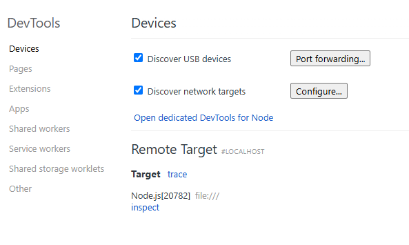

# JSVM-API调试&定位

JSVM，既标准JS引擎，是严格遵守Ecmascript规范的JavaScript代码执行引擎。 详情参考：[JSVM](../reference/common/_j_s_v_m.md)。
基于JSVM的JS代码调试调优能力包括：Debugger、CPU Profiler、Heap Snapshot、Heap Statistics。涉及以下接口：
| 接口名  |  接口功能 |
|---|---|
| OH_JSVM_GetVM  |  将检索给定环境的虚拟机实例。 |
| OH_JSVM_GetHeapStatistics  |  返回一组虚拟机堆的统计数据。 |
| OH_JSVM_StartCpuProfiler  |  创建并启动一个CPU profiler。 |
| OH_JSVM_StopCpuProfiler  |  停止CPU profiler并将结果输出到流。 |
| OH_JSVM_TakeHeapSnapshot  |  获取当前堆快照并将其输出到流。 |
| OH_JSVM_OpenInspector  |  在指定的主机和端口上激活inspector，将用来调试JS代码。 |
| OH_JSVM_OpenInspectorWithName | 基于传入的 pid 和 name 激活 inspector。 |
| OH_JSVM_CloseInspector  |  尝试关闭剩余的所有inspector连接。 |
| OH_JSVM_WaitForDebugger  |  等待主机与inspector建立socket连接，连接建立后程序将继续运行。发送Runtime.runIfWaitingForDebugger命令。 |


本文将介绍调试、CPU Profiler、Heap Snapshot的使用方法。

## 调试能力使用方法

### 使用 OH_JSVM_OpenInspector

1. 在应用工程配置文件module.json中配置网络权限：

```
"requestPermissions": [{
  "name": "ohos.permission.INTERNET",
  "reason": "$string:app_name",
  "usedScene": {
    "abilities": [
      "FromAbility"
    ],
    "when": "inuse"
  }
}]
```

2. 为避免debugger过程中的暂停被误报为无响应异常，可以[开启DevEco Studio的Debug模式](https://developer.huawei.com/consumer/cn/doc/harmonyos-guides-V5/ide-debug-arkts-debug-V5)（无需设置断点），或者可以在非主线程的其他线程中运行JSVM。
3. 在执行JS代码之前，调用OH_JSVM_OpenInspector在指定的主机和端口上激活inspector，创建socket。例如OH_JSVM_OpenInspector(env, "localhost", 9225)，在端侧本机端口9225创建socket。
4. 调用OH_JSVM_WaitForDebugger，等待建立socket连接。
5. 检查端侧端口是否打开成功。hdc shell "netstat -anp | grep 9225"。结果为9225端口状态为“LISTEN"即可。
6. 转发端口。hdc fport tcp:9229 tcp:9225。转发开发者个人计算机侧端口9229到端侧端口9225。结果为"Forwardport result:OK"即可。
7. 在chrome浏览器地址栏输入"localhost:9229/json"，回车。获取端口连接信息。拷贝"devtoolsFrontendUrl"字段url内容到地址栏，回车，进入DevTools源码页，将看到在应用中通过OH_JSVM_RunScript执行的JS源码，此时暂停在第一行JS源码处。(注："devtoolsFrontendUrl"字段url只支持使用Chrome、Edge浏览器打开，不支持使用Firefox、Safari等浏览器打开。)
8. 用户可在源码页打断点，通过按钮发出各种调试命令控制JS代码执行，并查看变量。
9. 调用OH_JSVM_CloseInspector关闭inspector，结束socket连接。

#### 示例代码
JSVM-API接口开发流程参考[使用JSVM-API实现JS与C/C++语言交互开发流程](use-jsvm-process.md)，本文仅对接口对应C++相关代码进行展示。
```cpp
#include "ark_runtime/jsvm.h"

#include <string>

using namespace std;

// 待调试的JS源码
static string srcDebugger = R"JS(
const concat = (...args) => args.reduce((a, b) => a + b);
var dialogue = concat('"What ', 'is ', 'your ', 'name ', '?"');
dialogue = concat(dialogue, ' --', '"My ', 'name ', 'is ', 'Bob ', '."');
)JS";

// 开启debugger
static void EnableInspector(JSVM_Env env) {
    // 在指定的主机和端口上激活inspector，创建socket。
    OH_JSVM_OpenInspector(env, "localhost", 9225);
    // 等待建立socket连接。
    OH_JSVM_WaitForDebugger(env, true);
}

// 关闭debugger
static void CloseInspector(JSVM_Env env) {
    // 关闭inspector，结束socket连接。
    OH_JSVM_CloseInspector(env);
}

static void RunScript(JSVM_Env env) {
    JSVM_HandleScope handleScope;
    OH_JSVM_OpenHandleScope(env, &handleScope);

    JSVM_Value jsSrc;
    OH_JSVM_CreateStringUtf8(env, srcDebugger.c_str(), srcDebugger.size(), &jsSrc);

    JSVM_Script script;
    OH_JSVM_CompileScript(env, jsSrc, nullptr, 0, true, nullptr, &script);

    JSVM_Value result;
    OH_JSVM_RunScript(env, script, &result);

    OH_JSVM_CloseHandleScope(env, handleScope);
}

void TestJSVM() {
    JSVM_InitOptions initOptions{};
    OH_JSVM_Init(&initOptions);

    JSVM_VM vm;
    OH_JSVM_CreateVM(nullptr, &vm);
    JSVM_VMScope vmScope;
    OH_JSVM_OpenVMScope(vm, &vmScope);

    JSVM_Env env;
    OH_JSVM_CreateEnv(vm, 0, nullptr, &env);
    // 执行JS代码之前打开debugger。
    EnableInspector(env);
    JSVM_EnvScope envScope;
    OH_JSVM_OpenEnvScope(env, &envScope);

    // 执行JS代码。
    RunScript(env);

    OH_JSVM_CloseEnvScope(env, envScope);
    // 执行JS代码之后关闭debugger。
    CloseInspector(env);
    OH_JSVM_DestroyEnv(env);
    OH_JSVM_CloseVMScope(vm, vmScope);
    OH_JSVM_DestroyVM(vm);
}

```

### 使用 OH_JSVM_OpenInspectorWithName

1. 在应用工程配置文件module.json中配置网络权限：

```
"requestPermissions": [{
  "name": "ohos.permission.INTERNET",
  "reason": "$string:app_name",
  "usedScene": {
    "abilities": [
      "FromAbility"
    ],
    "when": "inuse"
  }
}]
```

2. 为避免debugger过程中的暂停被误报为无响应异常，可以[开启DevEco Studio的Debug模式](https://developer.huawei.com/consumer/cn/doc/harmonyos-guides-V5/ide-debug-arkts-debug-V5)（无需设置断点），或者可以在非主线程的其他线程中运行JSVM。
3. 打开 inspector 端口，链接 devtools 用于调试，其流程如下:  在执行JS代码之前，调用OH_JSVM_OpenInspector在指定的主机和端口上激活inspector，创建socket。例如OH_JSVM_OpenInspectorWithName(env, 123, “test”)，创建 tcp socket 及其对应的 unixdomain 端口。
4. 调用OH_JSVM_WaitForDebugger，等待建立socket连接。
5. 检查端侧端口是否打开成功。hdc shell "cat /proc/net/unix | grep jsvm"。结果出现可用的 unix 端口即可，如: jsvm_devtools_remote_9229_123，其中 9229 为 tcp 端口号，123 为对应的 pid。
6. 转发端口。hdc fport tcp:9229 tcp:9229。转发开发者个人计算机侧端口9229到端侧端口9229。结果为"Forwardport result:OK"即可。
7. 在 chrome 浏览器地址栏输入 "localhost:9229/json"，回车。获取端口连接信息。打开Chrome开发者工具，拷贝"devtoolsFrontendUrl"字段url内容到地址栏，回车，进入DevTools源码页，将看到在应用中通过OH_JSVM_RunScript执行的JS源码，此时暂停在第一行JS源码处。(注："devtoolsFrontendUrl"字段url只支持使用Chrome、Edge浏览器打开，不支持使用Firefox、Safari等浏览器打开。)
8. 用户可在源码页打断点，通过按钮发出各种调试命令控制JS代码执行，并查看变量。
9. 调用OH_JSVM_CloseInspector关闭inspector，结束socket连接。

#### 代码示例

对应的 enable inspector 替换为下面的即可
```cpp
// 开启debugger
static void EnableInspector(JSVM_Env env) {
    // 在指定的主机和端口上激活inspector，创建socket。
    OH_JSVM_OpenInspectorWithName(env, 123, "test");
    // 等待建立socket连接。
    OH_JSVM_WaitForDebugger(env, true);
}
```

### 使用 Chrome inspect 页面进行调试
除了使用上述打开"devtoolsFrontendUrl"字段url的方法调试代码之外，也可以直接通过Chrome浏览器的 chrome://inspect/#devices 页面进行调试。方法如下：
1. Chrome浏览器中打开 chrome://inspect/#devices，勾选以下内容：
   <div align=left></div>
2. 执行端口转发命令：hdc fport [开发者个人计算机侧端口号] [端侧端口号]  
例如：hdc fport tcp:9227 tcp:9226
1. 点击Port forwarding按钮，左侧输入开发者个人计算机侧端口，右侧输入端侧端口号，点击done。如下图所示：
   <div align=left></div>
2. 点击Configure按钮，输入开发者个人计算机侧的端口号，如localhost:9227。如下图所示：
   <div align=left></div>
3. 稍等片刻，会在target下出现调试的内容，点击inspect即可调试。如下图所示：
   <div align=left></div>

## CPU Profiler及Heap Snapshot使用方法

### CPU Profiler接口使用方法

1. 在执行JS代码之前，调用OH_JSVM_StartCpuProfiler开始采样并返回JSVM_CpuProfiler。
2. 在执行JS代码后，调用OH_JSVM_StopCpuProfiler，传入1中返回的JSVM_CpuProfiler，传入输出流回调及输出流指针。数据将会写入指定的输出流中。
3. 输出数据为JSON字符串。可存入.cpuprofile文件中。该文件类型可导入Chrome浏览器-DevTools-JavaScript Profiler工具中解析成性能分析视图。

### Heap Snapshot接口使用方法

1.为分析某段JS代码的堆对象创建情况。可在执行JS代码前后，分别调用一次OH_JSVM_TakeHeapSnapshot。传入输出流回调及输出流指针。数据将会写入指定的输出流中。
2.输出数据可存入.heapsnapshot文件中。该文件类型可导入Chrome浏览器-DevTools-Memory工具中解析成内存分析视图。

### 示例代码
JSVM-API接口开发流程参考[使用JSVM-API实现JS与C/C++语言交互开发流程](use-jsvm-process.md)，本文仅对接口对应C++相关代码进行展示。

```cpp
#include "ark_runtime/jsvm.h"

#include <fstream>
#include <iostream>

using namespace std;

// 待调优的JS代码。
static string srcProf = R"JS(
function sleep(delay) {
    var start = (new Date()).getTime();
    while ((new Date()).getTime() - start < delay) {
        continue;
    }
}

function work3() {
    sleep(300);
}

function work2() {
    work3();
    sleep(200);
}

function work1() {
    work2();
    sleep(100);
}

work1();
)JS";

// 数据输出流回调，用户自定义，处理返回的调优数据，此处以写入文件为例。
static bool OutputStream(const char *data, int size, void *streamData) {
    auto &os = *reinterpret_cast<ofstream *>(streamData);
    if (data) {
        os.write(data, size);
    } else {
        os.close();
    }
    return true;
}

static JSVM_CpuProfiler ProfilingBegin(JSVM_VM vm) {
    // 文件输出流，保存调优数据，/data/storage/el2/base/files为沙箱路径。以包名为com.example.helloworld为例。
    // 实际文件会保存到/data/app/el2/100/base/com.example.helloworld/files/heap-snapshot-begin.heapsnapshot。
    ofstream heapSnapshot("/data/storage/el2/base/files/heap-snapshot-begin.heapsnapshot",
                          ios::out | ios:: binary | ios::trunc);
    // 执行JS前获取一次Heap Snapshot数据。
    OH_JSVM_TakeHeapSnapshot(vm, OutputStream, &heapSnapshot);
    JSVM_CpuProfiler cpuProfiler;
    // 开启CPU Profiler。
    OH_JSVM_StartCpuProfiler(vm, &cpuProfiler);
    return cpuProfiler;
}

// 关闭调优数据采集工具
static void ProfilingEnd(JSVM_VM vm, JSVM_CpuProfiler cpuProfiler) {
    // 文件输出流，保存调优数据，/data/storage/el2/base/files为沙箱路径。以包名为com.example.helloworld为例。
    // 实际文件会保存到/data/app/el2/100/base/com.example.helloworld/files/cpu-profile.cpuprofile。
    ofstream cpuProfile("/data/storage/el2/base/files/cpu-profile.cpuprofile",
                        ios::out | ios:: binary | ios::trunc);
    // 关闭CPU Profiler，获取数据。
    OH_JSVM_StopCpuProfiler(vm, cpuProfiler, OutputStream, &cpuProfile);
    ofstream heapSnapshot("/data/storage/el2/base/files/heap-snapshot-end.heapsnapshot",
                              ios::out | ios:: binary | ios::trunc);
    // 执行JS后再获取一次Heap Snapshot数据，与执行前数据作对比，以分析内存问题或者进行内存调优。
    OH_JSVM_TakeHeapSnapshot(vm, OutputStream, &heapSnapshot);
}

static JSVM_Value RunScriptWithStatistics(JSVM_Env env, JSVM_CallbackInfo info) {
    JSVM_VM vm;
    OH_JSVM_GetVM(env, &vm);

    // 开始调优。
    auto cpuProfiler = ProfilingBegin(vm);

    JSVM_HandleScope handleScope;
    OH_JSVM_OpenHandleScope(env, &handleScope);

    JSVM_Value jsSrc;
    OH_JSVM_CreateStringUtf8(env, srcProf.c_str(), srcProf.size(), &jsSrc);

    JSVM_Script script;
    OH_JSVM_CompileScript(env, jsSrc, nullptr, 0, true, nullptr, &script);

    JSVM_Value result;
    // 执行JS代码。
    OH_JSVM_RunScript(env, script, &result);

    OH_JSVM_CloseHandleScope(env, handleScope);

    // 结束调优。
    ProfilingEnd(vm, cpuProfiler);
    return nullptr;
}
static JSVM_CallbackStruct param[] = {
    {.data = nullptr, .callback = RunScriptWithStatistics},
};
static JSVM_CallbackStruct *method = param;
// runScriptWithStatistics方法别名，供JS调用
static JSVM_PropertyDescriptor descriptor[] = {
    {"runScriptWithStatistics", nullptr, method++, nullptr, nullptr, nullptr, JSVM_DEFAULT},
};
```


// 样例测试JS
```cpp
const char *srcCallNative = R"JS(runScriptWithStatistics();)JS";
```
