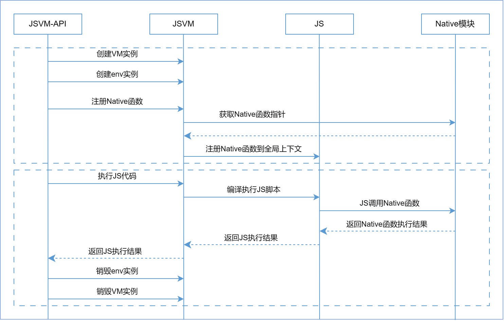

# JSVM-API简介
<!--Kit: NDK Development-->
<!--Subsystem: arkcompiler-->
<!--Owner: @yuanxiaogou; @string_sz-->
<!--SE: @knightaoko-->
<!--TSE: @test_lzz-->

## 场景介绍

OpenHarmony JSVM-API基于标准JS引擎提供了一套稳定的API，支持创建和销毁引擎、执行JS代码、JS与C++的交互等关键功能。

OpenHarmony JSVM-API是C语言接口，遵循C99标准。

通过JSVM-API，可以在应用运行期间直接执行动态加载的JS代码。此外，可以将对性能和底层系统调用有较高要求的核心功能用C/C++实现，并将C++方法注册到JS侧，从而在JS代码中直接调用，提高应用执行效率。

本文中如无特别说明，后续均使用JSVM-API指代OpenHarmony JSVM-API能力。

## JSVM-API的组成架构

**图1** JSVM-API的组成架构
  

- Native Module：开发者使用JSVM-API开发的模块，用于在Native侧使用。

- VM Life Cycle Manager：管理JSVM_VM的生命周期。

- JS Context Manager：管理JSVM_Env的生命周期。

- Context Snapshot：上下文快照，可用以缩短JS Context的创建时间。

- JS Code Execute：执行JS代码。

- JS/C++ Interaction：连接JS层与C++层，用于支撑JS与C++之间的交互。

- Code Cache：编译后的JS代码的缓存，能提升JS代码执行的启动速度。

- Debugger：调试器，用于调试JS代码。

CPU Profiler：该工具可以记录JS代码的执行时间，帮助开发者分析性能瓶颈，为代码优化提供数据支撑。

- Heap Snapshot：JS堆内存分析/调优工具，可以进行内存优化和发现内存泄漏问题。

- Heap Statistics：JS堆统计信息，包括内存大小及上下文数量。

- Memory Adjustment：调整外部内存大小、虚拟机内存压力，以加快触发GC。

- VM Information：JSVM_VM的信息。

- Standard JS Engine：标准JS引擎。

## JSVM-API的关键交互流程

**图2** JSVM-API的关键交互流程

JSVM-API与Native模块之间的交互流程主要分为以下两步：

1. **初始化阶段**：在Native模块上初始化JSVM和JS上下文，并完成Native函数的注册。Native方法将被挂载到JS执行环境的全局上下文即GlobalThis。

2. **调用阶段**：当JS侧调用通过JSVM-API注册到JS全局上下文的方法时，JS引擎会找到并调用对应的C/C++方法。
