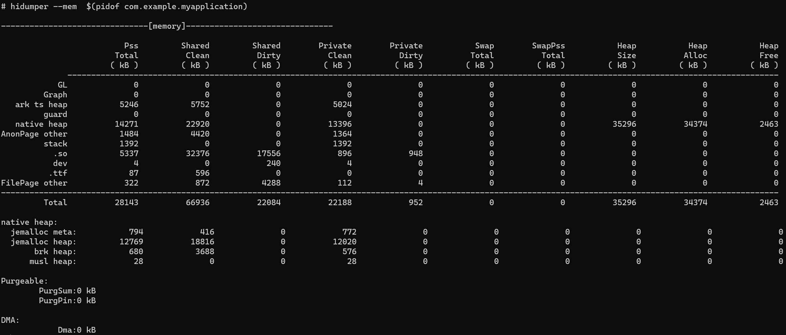
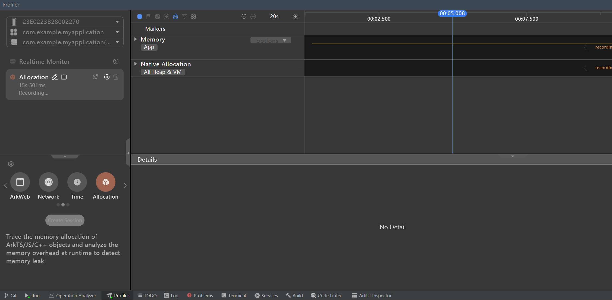
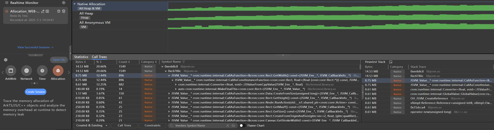

# JSVM-API 内存泄漏问题定位指导

JSVM的内存占用包括Native内存占用(C/C++侧的内存占用)和底层的JS引擎的堆内存占用，JS引擎会维护一个堆来管理其生成的JS对象，其生命周期由JS引擎维护，除此之外的内存我们归为Native内存。用户在使用JSVM时，可能碰到这两种内存异常增长的情况。

本文先介绍如何定性分析，然后分两个部分介绍如何定位Native内存泄漏和JS引擎堆内存泄漏。

## 定性分析

可以通过hdc连接设备，执行如下命令行的方式对目标应用的内存进行采样，比较一段时间内的内存变化情况，从而定性分析是Native内存泄漏还是JS内存。下图中Pss Total列，native heap对应Native内存占用，AnnonPage other对应js堆内存占用。
```
hidumper --mem $(pidof dest_app)
```
<div align=left></div>


## Native内存泄漏定位
### 典型场景
1. OH_JSVM_CreateReference 和 OH_JSVM_DeleteReference 接口没有成对调用，导致Reference没有被释放。
```c++
JSVM_Value obj = nullptr;
OH_JSVM_CreateObject(env, &obj);
// 创建引用
JSVM_Ref reference;
OH_JSVM_CreateReference(env, obj, 1, &reference);

// 使用引用
JSVM_Value result;
OH_JSVM_GetReferenceValue(env, reference, &result);

// 未释放引用
// OH_JSVM_DeleteReference(env, reference);
```

### 定位步骤
Native内存泄漏分析，可以借助DevEco Studio的内存分析模块，参考[DevEco Studio Allocation内存分析](https://developer.huawei.com/consumer/cn/doc/harmonyos-guides/ide-insight-session-allocations-data-filtering )。
1. 使用Profiler的Alloctaion模块记录一段时间内的Native内存信息。
<div align=left></div>  

2. 比较这段时间内"Created & Existing"的内存变化情况，如果存在占比较大且Count较大的未释放内存，则怀疑未内存泄漏，展开进一步查看调用栈。
<div align=left></div> 


## JS引擎堆内存泄漏定位
### 典型场景
1. 全局变量滥用，导致dom元素未释放。
```js
const elements = [];
function createElements() {
  for (let i = 0; i < 1000; i++) {
    const el = document.createElement('div');
    document.body.appendChild(el);
    elements.push(el); // 即使从 DOM 移除，数组仍保留引用
  }
}
```

### 定位步骤
JSVM目前提供了OH_JSVM_OpenInspector开启inspector，参考[使用OH_JSVM_OpenInspector](https://developer.huawei.com/consumer/cn/doc/harmonyos-guides/jsvm-debugger-cpuprofiler-heapsnapshot#%E4%BD%BF%E7%94%A8-oh_jsvm_openinspector),在此基础上可以[使用 Chrome inspect 页面进行调试](https://developer.huawei.com/consumer/cn/doc/harmonyos-guides/jsvm-debugger-cpuprofiler-heapsnapshot#%E4%BD%BF%E7%94%A8-chrome-inspect-%E9%A1%B5%E9%9D%A2%E8%BF%9B%E8%A1%8C%E8%B0%83%E8%AF%95)。
通过使用DevTools工具，对目标场景内的堆内存进行快照（快照前先点击上方的垃圾回收按钮进行垃圾回收），利用快照对比功能，找到未释放的JS对象和其所在源码中的位置，进一步指导定位堆内存未释放的原因。
<div align=left></div> 