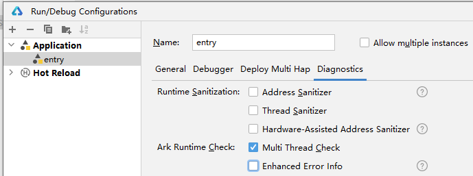

# 稳定性相关问题汇总

## 应用运行过程中出现高概率闪退怎么进行定位解决

- 具体问题：在使用Node-API开发过程中，应用运行过程中出现高概率闪退，出现cppcrash栈，栈顶为系统库libark_jsruntime.so，崩溃栈前几帧也有libace_napi.z.so，怎么进行定位解决？  
复现概率高，每次崩溃栈略有区别，但是共性都是：崩溃栈顶是系统库的libark_jsruntime.so或者libace_napi.z.so    
- 崩溃信息如下：  
```sh
Reason:Signal:SIGSEGV(SEGV_MAPERR)@0x00000136 probably caus
Fault thread info:
Tid:15894, Name:e.myapplication
#00 pc 002b8dd4 /system/lib/platformsdk/libark_jsruntime.so
#01 pc 0024d3e1 /system/lib/platformsdk/libark_jsruntime.so
#02 pc 0024d0d9 /system/lib/platformsdk/libark_jsruntime.so
#03 pc 002eac5d /system/lib/platformsdk/libark_jsruntime.so
#04 pc 00428d0f /system/lib/platformsdk/libark_jsruntime.so
```

- 定位问题：  
使用Node-API时如果出现高概率闪退，崩溃栈顶在系统库libark_jsruntime.so，一般是开发者Node-API接口使用不当导致。   
- 以下定位问题的思路，可作为参考：   
1. 排查是否存在多线程安全问题（概率较大）。   
IDE中提供了相关开关，开启开关后，重新编译打包并运行，看看崩溃栈是不是符合下面这个文档的描述，如果是，那就是在使用Node-API时，存在多线程安全问题。   
[常见多线程安全问题](https://developer.huawei.com/consumer/cn/doc/best-practices/bpta-stability-ark-runtime-detection#section19357830121120)  
IDE开关：   
   
2. 使用Node-API接口时入参非法导致。   
- 这种情况一般是崩溃栈上的so会很浅，so调用了某个具体的Node-API接口，比如调用了napi_call_function之类的接口，然后Node-API又调到了libark_jsruntime的so，然后直接崩溃在libark_jsruntime里面。  
示例栈结构如下。  
```sh
#01 /system/lib/platformsdk/libark_jsruntime.so
#02 /system/lib/platformsdk/libark_jsruntime.so
#03 /system/lib/platformsdk/libace_napi.z.so(napi_set_named_property+170) -- Node-API的so，该位置显示具体调用报错的接口
#04 /data/storage/el1/bundle/libs/arm/libentry.so -- 你的so
```
- 如果是入参问题，一般so在崩溃栈上的位置比较浅（不会跑到#10这种离栈顶很远的位置），不过也可以按照这个思路进行排查。  
- 排查思路参考：  
a. 排查有没有napi_value未初始化，还没赋值成功，直接作为非法入参传递给接口了  
b. 排查有没有在这个易错API列表里面找到相应的篇章。[方舟运行时API](https://developer.huawei.com/consumer/cn/doc/best-practices/bpta-stability-coding-standard-api#section1219614634615)

## 线程池中并发调用ArkTS方法如何处理线程安全问题

- 现有个场景，ArkTS中有个类方法，对这个方法创建了napi_ref引用，现想在C++线程池中并发的调用ArkTS方法，有以下几个问题：  
1. 可以在C++创建的线程池中调用napi_ref缓存的ArkTS类方法吗？  
2. 回调到ArkTS要怎么确保线程安全？  

对于问题一：
只能在C++线程中将ArkTS任务抛回ArkTS线程，这时候并不是同步调用，而是一个抛任务的动作。  
需要注意的是，这个ArkTS方法真正的执行动作只能在ArkTS线程中完成，即，只能方法运行在对应的ArkTS线程上。  

对于问题二：
上面提到，C++线程都是抛任务到ArkTS线程，进而执行ArkTS方法。关于线程安全，可参考[使用Node-API接口进行线程安全开发](use-napi-thread-safety.md)。  
另外，开发过程中也可以打开[方舟多线程检测](https://developer.huawei.com/consumer/cn/doc/best-practices/bpta-stability-ark-runtime-detection#section75786272088)开关，这个开关可以拦截多线程安全问题。  

## napi_value内容产生变化

- 具体描述：在一个程序初始化的时候，保存了env和一个method（napi_value），这个method在刚刚创建的时候有进行check，napi_typeof的结果是napi_function，符合预期。程序运行一段时间后，使用保存的env和method再去调用，发现method check不过了，此时不是一个napi_function了，保存与使用时均处于同一主线程，要如何解决？  

- 排查建议：  
1. 确认是否napi_value出了scope还在使用，导致use-after-scope问题。  
可参考文档：   
[方舟运行时API](https://developer.huawei.com/consumer/cn/doc/best-practices/bpta-stability-coding-standard-api#section1219614634615)  
2. 保存时建议使用napi_ref，而不是直接保存napi_value  

## 是否存在获取最新napi_env的方法

- 具体描述：Native 层在较深的调用层级中需调用 ArkTS 方法，无法逐层传递 napi_env，直接缓存会导致崩溃。  
```sh
#00 /system/lib/platformsdk/libark_jsruntime.so(panda::JSValueRef::IsFunction)
#01 /system/lib/platformsdk/libace_napi.z.so(napi_call_function)
#02 /data/storage/el1/bundle/libs/arm/libentry.so
...
```
- 参考方案：  
1. 关于保存napi_env：  
Node-API没有提供直接获取napi_env的能力，只能通过逐层函数调用传递。一般不推荐保存napi_env，有两个原因：  
其一，napi_env退出时候如果没有被使用方感知到，很容易出现use-after-free问题；  
其二，napi_env和ArkTS线程是强绑定的，如果napi_env放在其它ArkTS线程使用，就会有多线程安全问题。  
可参考文档：  
[napi_env禁止缓存的原因是什么](https://developer.huawei.com/consumer/cn/doc/harmonyos-faqs/faqs-ndk-73)  

2. 该问题的关键在于：  
如果要强行保存env，必须感知env是否退出，可以使用napi_add_env_cleanup_hook的回调进行感知。同时，在开发过程中打开多线程检测开关，避免出现多线程安全问题。
可参考[常见多线程安全问题](https://developer.huawei.com/consumer/cn/doc/best-practices/bpta-stability-ark-runtime-detection#section19357830121120)   

3. 对于崩溃问题本身，该崩溃可能发生在调用napi_call_function时，入参 func 有问题，即非法入参，开发者可排查napi_value是否被缓存。这种情况可能是napi_value被缓存后，napi_value超出napi_handle_scope作用域导致失效。  
如果有类似逻辑，需使用napi_ref进行存储，napi_ref可以延长生命周期。  

- 可参考文档：  
[napi_create_reference、napi_delete_reference](use-napi-life-cycle.md)

[方舟运行时API](https://developer.huawei.com/consumer/cn/doc/best-practices/bpta-stability-coding-standard-api#section1219614634615)    

## napi_add_env_cleanup_hook调用报错该如何处理

- 具体问题：napi_add_env_cleanup_hook/napi_remove_env_cleanup_hook调用报错，该如何处理？  
`napi_add_env_cleanup_hook` 和 `napi_remove_env_cleanup_hook` 调用报错，常见原因和特征日志如下，均为接口使用不当导致。  
1. 在`env`所在的ArkTS线程外使用上述两个接口，导致多线程安全问题。特征报错日志`current napi interface cannot run in multi-thread`。  
2. 调用`napi_add_env_cleanup_hook`时，重复使用同一个`args`注册不同的回调函数，导致后续注册失败问题。该接口第三个入参`args`是作为接口内部`map`的`key`值，当重复注册同一个`args`的回调时，后续注册动作将会失败，仅第一次注册才会成功。注册失败可能导致后续业务功能异常或崩溃。特征报错日志`AddCleanupHook Failed`。  
3. 调用`napi_remove_env_cleanup_hook`时，尝试通过一个不存在（或已被删除）的`args`删除回调函数，该接口调用失败，出现特征报错日志`RemoveCleanupHook Failed`。  

常见错误场景示例如下：

```c++
void AddEnvCleanupHook(napi_env env)
{
    napi_add_env_cleanup_hook(env, [](void* args) -> void {
        // cleanup function回调
    }, env); // env是个通用的数据，即使此处没有重复注册，可能会被其它地方所提前注册，导致该处注册失败。
}

static napi_value Test(napi_env env, napi_callback_info info)
{
    //第一次注册
    AddEnvCleanupHook(env);
    //第二次重复注册
    AddEnvCleanupHook(env);
    return nullptr;
}
```

- 修复建议：
1. 对于多线程安全问题，需确保调用接口的线程在`env`所在的ArkTS线程上。
2. 对于注册失败的问题，需由使用者明确待注册的函数。需要保证`key`值（也就是`napi_add_env_cleanup_hook`的第三个入参）是唯一的即可。
3. 对于删除失败的问题，需要使用者确保`args`已注册过且未被删除。

相关参考资料链接：
[使用Node-API接口注册和使用环境清理钩子](use-napi-about-cleanuphook.md)
[方舟运行时API](https://developer.huawei.com/consumer/cn/doc/best-practices/bpta-stability-coding-standard-api#section1219614634615)
