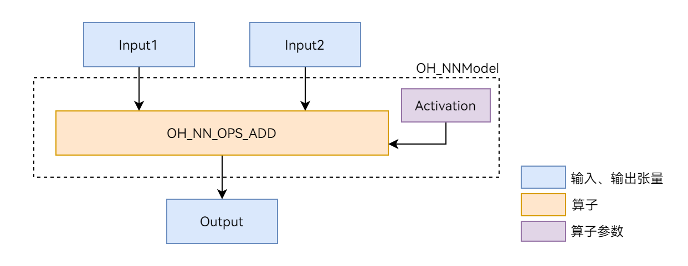

# Neural Network Runtime对接AI推理框架开发指导

## 场景介绍

Neural Network Runtime作为AI推理引擎和加速芯片的桥梁，为AI推理引擎提供精简的Native接口，满足推理引擎通过加速芯片执行端到端推理的需求。

本文以图1展示的`Add`单算子模型为例，介绍Neural Network Runtime的开发流程。`Add`算子包含两个输入、一个参数和一个输出，其中的`activation`参数用于指定`Add`算子中激活函数的类型。

**图1** Add单算子网络示意图


## 环境准备

### 环境要求

Neural Network Runtime部件的环境要求如下：

- 系统版本：OpenHarmony master分支。
- 开发环境：Ubuntu 18.04及以上。
- 接入设备：OpenHarmony定义的标准设备，并且系统中内置的硬件加速器驱动，已通过HDI接口对接Neural Network Runtime。

由于Neural Network Runtime通过OpenHarmony Native API对外开放，需要通过OpenHarmony的Native开发套件编译Neural Network Runtime应用。在社区的[每日构建](http://ci.openharmony.cn/dailys/dailybuilds)下载对应系统版本的ohos-sdk压缩包，从压缩包中提取对应平台的Native开发套件。以Linux为例，Native开发套件的压缩包命名为`native-linux-{版本号}.zip`。

### 环境搭建

1. 打开Ubuntu编译服务器的终端。
2. 把下载好的Native开发套件压缩包拷贝至当前用户根目录下。
3. 执行以下命令解压Native开发套件的压缩包。
```shell
unzip native-linux-{版本号}.zip
```

解压缩后的内容如下（随版本迭代，目录下的内容可能发生变化，请以最新版本的Native API为准）：
```text
native/
├── build // 交叉编译工具链
├── build-tools // 编译构建工具
├── docs
├── llvm
├── nativeapi_syscap_config.json
├── ndk_system_capability.json
├── NOTICE.txt
├── oh-uni-package.json
└── sysroot // Native API头文件和库
```
## 接口说明

这里给出Neural Network Runtime开发流程中通用的接口，具体请见下列表格。

### 结构体

| 结构体名称 | 描述 |
| --------- | ---- |
| typedef struct OH_NNModel OH_NNModel | Neural Network Runtime的模型句柄，用于构造模型。 |
| typedef struct OH_NNCompilation OH_NNCompilation | Neural Network Runtime的编译器句柄，用于编译AI模型。 |
| typedef struct OH_NNExecutor OH_NNExecutor | Neural Network Runtime的执行器句柄，用于在指定设备上执行推理计算。 |

### 模型构造相关接口

| 接口名称 | 描述 |
| ------- | --- |
| OH_NNModel_Construct() | 创建OH_NNModel类型的模型实例。 |
| OH_NN_ReturnCode OH_NNModel_AddTensor(OH_NNModel *model, const OH_NN_Tensor *tensor) | 向模型实例中添加张量。 |
| OH_NN_ReturnCode OH_NNModel_SetTensorData(OH_NNModel *model, uint32_t index, const void *dataBuffer, size_t length) | 设置张量的数值。 |
| OH_NN_ReturnCode OH_NNModel_AddOperation(OH_NNModel *model, OH_NN_OperationType op, const OH_NN_UInt32Array *paramIndices, const OH_NN_UInt32Array *inputIndices, const OH_NN_UInt32Array *outputIndices) | 向模型实例中添加算子。 |
| OH_NN_ReturnCode OH_NNModel_SpecifyInputsAndOutputs(OH_NNModel *model, const OH_NN_UInt32Array *inputIndices, const OH_NN_UInt32Array *outputIndices) | 指定模型的输入输出。 |
| OH_NN_ReturnCode OH_NNModel_Finish(OH_NNModel *model) | 完成模型构图。|
| void OH_NNModel_Destroy(OH_NNModel **model) | 释放模型实例。 |

### 模型编译相关接口

| 接口名称 | 描述 |
| ------- | --- |
| OH_NNCompilation *OH_NNCompilation_Construct(const OH_NNModel *model) | 创建OH_NNCompilation类型的编译实例。 |
| OH_NN_ReturnCode OH_NNCompilation_SetDevice(OH_NNCompilation *compilation, size_t deviceID) | 指定模型编译和计算的硬件。 |
| OH_NN_ReturnCode OH_NNCompilation_SetCache(OH_NNCompilation *compilation, const char *cachePath, uint32_t version) | 设置编译后的模型缓存路径和缓存版本。 |
| OH_NN_ReturnCode OH_NNCompilation_Build(OH_NNCompilation *compilation) | 进行模型编译。 |
| void OH_NNCompilation_Destroy(OH_NNCompilation **compilation) | 释放OH_NNCompilation对象。 |

### 执行推理相关接口

| 接口名称 | 描述 |
| ------- | --- |
| OH_NNExecutor *OH_NNExecutor_Construct(OH_NNCompilation *compilation) | 创建OH_NNExecutor类型的执行器实例。 |
| OH_NN_ReturnCode OH_NNExecutor_SetInput(OH_NNExecutor *executor, uint32_t inputIndex, const OH_NN_Tensor *tensor, const void *dataBuffer, size_t length) | 设置模型单个输入的数据。 |
| OH_NN_ReturnCode OH_NNExecutor_SetOutput(OH_NNExecutor *executor, uint32_t outputIndex, void *dataBuffer, size_t length) | 设置模型单个输出的缓冲区。 |
| OH_NN_ReturnCode OH_NNExecutor_Run(OH_NNExecutor *executor) | 执行推理。 |
| void OH_NNExecutor_Destroy(OH_NNExecutor **executor) | 销毁OH_NNExecutor实例，释放实例占用的内存。 |

### 设备管理相关接口

| 接口名称 | 描述 |
| ------- | --- |
| OH_NN_ReturnCode OH_NNDevice_GetAllDevicesID(const size_t **allDevicesID, uint32_t *deviceCount) | 获取对接到 Neural Network Runtime 的硬件ID。 |


## 开发步骤

Neural Network Runtime的开发流程主要包含**模型构造**、**模型编译**和**推理执行**三个阶段。以下开发步骤以`Add`单算子模型为例，介绍调用Neural Network Runtime接口，开发应用的过程。

1. 创建应用样例文件。

    首先，创建Neural Network Runtime应用样例的源文件。在项目目录下执行以下命令，创建`nnrt_example/`目录，在目录下创建 `nnrt_example.cpp` 源文件。

    ```shell
    mkdir ~/nnrt_example && cd ~/nnrt_example
    touch nnrt_example.cpp
    ```

2. 导入Neural Network Runtime。

    在 `nnrt_example.cpp` 文件的开头添加以下代码，引入Neural Network Runtime模块。

    ```cpp
    #include <cstdint>
    #include <iostream>
    #include <vector>

    #include "neural_network_runtime/neural_network_runtime.h"

    // 常量，用于指定输入、输出数据的字节长度
    const size_t DATA_LENGTH = 4 * 12;
    ```

3. 构造模型。

    使用Neural Network Runtime接口，构造`Add`单算子样例模型。

    ```cpp
    OH_NN_ReturnCode BuildModel(OH_NNModel** pModel)
    {
        // 创建模型实例，进行模型构造
        OH_NNModel* model = OH_NNModel_Construct();
        if (model == nullptr) {
            std::cout << "Create model failed." << std::endl;
            return OH_NN_MEMORY_ERROR;
        }

        // 添加Add算子的第一个输入Tensor，类型为float32，张量形状为[1, 2, 2, 3]
        int32_t inputDims[4] = {1, 2, 2, 3};
        OH_NN_Tensor input1 = {OH_NN_FLOAT32, 4, inputDims, nullptr, OH_NN_TENSOR};
        OH_NN_ReturnCode ret = OH_NNModel_AddTensor(model, &input1);
        if (ret != OH_NN_SUCCESS) {
            std::cout << "BuildModel failed, add Tensor of first input failed." << std::endl;
            return ret;
        }

        // 添加Add算子的第二个输入Tensor，类型为float32，张量形状为[1, 2, 2, 3]
        OH_NN_Tensor input2 = {OH_NN_FLOAT32, 4, inputDims, nullptr, OH_NN_TENSOR};
        ret = OH_NNModel_AddTensor(model, &input2);
        if (ret != OH_NN_SUCCESS) {
            std::cout << "BuildModel failed, add Tensor of second input failed." << std::endl;
            return ret;
        }

        // 添加Add算子的参数Tensor，该参数Tensor用于指定激活函数的类型，Tensor的数据类型为int8。
        int32_t activationDims = 1;
        int8_t activationValue = OH_NN_FUSED_NONE;
        OH_NN_Tensor activation = {OH_NN_INT8, 1, &activationDims, nullptr, OH_NN_ADD_ACTIVATIONTYPE};
        ret = OH_NNModel_AddTensor(model, &activation);
        if (ret != OH_NN_SUCCESS) {
            std::cout << "BuildModel failed, add Tensor of activation failed." << std::endl;
            return ret;
        }

        // 将激活函数类型设置为OH_NN_FUSED_NONE，表示该算子不添加激活函数。
        ret = OH_NNModel_SetTensorData(model, 2, &activationValue, sizeof(int8_t));
        if (ret != OH_NN_SUCCESS) {
            std::cout << "BuildModel failed, set value of activation failed." << std::endl;
            return ret;
        }

        // 设置Add算子的输出，类型为float32，张量形状为[1, 2, 2, 3]
        OH_NN_Tensor output = {OH_NN_FLOAT32, 4, inputDims, nullptr, OH_NN_TENSOR};
        ret = OH_NNModel_AddTensor(model, &output);
        if (ret != OH_NN_SUCCESS) {
            std::cout << "BuildModel failed, add Tensor of output failed." << std::endl;
            return ret;
        }

        // 指定Add算子的输入、参数和输出索引
        uint32_t inputIndicesValues[2] = {0, 1};
        uint32_t paramIndicesValues = 2;
        uint32_t outputIndicesValues = 3;
        OH_NN_UInt32Array paramIndices = {&paramIndicesValues, 1};
        OH_NN_UInt32Array inputIndices = {inputIndicesValues, 2};
        OH_NN_UInt32Array outputIndices = {&outputIndicesValues, 1};

        // 向模型实例添加Add算子
        ret = OH_NNModel_AddOperation(model, OH_NN_OPS_ADD, &paramIndices, &inputIndices, &outputIndices);
        if (ret != OH_NN_SUCCESS) {
            std::cout << "BuildModel failed, add operation failed." << std::endl;
            return ret;
        }

        // 设置模型实例的输入、输出索引
        ret = OH_NNModel_SpecifyInputsAndOutputs(model, &inputIndices, &outputIndices);
        if (ret != OH_NN_SUCCESS) {
            std::cout << "BuildModel failed, specify inputs and outputs failed." << std::endl;
            return ret;
        }

        // 完成模型实例的构建
        ret = OH_NNModel_Finish(model);
        if (ret != OH_NN_SUCCESS) {
            std::cout << "BuildModel failed, error happened when finishing model construction." << std::endl;
            return ret;
        }

        *pModel = model;
        return OH_NN_SUCCESS;
    }
    ```

4. 查询Neural Network Runtime已经对接的加速芯片。

    Neural Network Runtime支持通过HDI接口，对接多种加速芯片。在执行模型编译前，需要查询当前设备下，Neural Network Runtime已经对接的加速芯片。每个加速芯片对应唯一的ID值，在编译阶段需要通过设备ID，指定模型编译的芯片。
    ```cpp
    void GetAvailableDevices(std::vector<size_t>& availableDevice)
    {
        availableDevice.clear();

        // 获取可用的硬件ID
        const size_t* devices = nullptr;
        uint32_t deviceCount = 0;
        OH_NN_ReturnCode ret = OH_NNDevice_GetAllDevicesID(&devices, &deviceCount);
        if (ret != OH_NN_SUCCESS) {
            std::cout << "GetAllDevicesID failed, get no available device." << std::endl;
            return;
        }

        for (uint32_t i = 0; i < deviceCount; i++) {
            availableDevice.emplace_back(devices[i]);
        }
    }
    ```

5. 在指定的设备上编译模型。

    Neural Network Runtime使用抽象的模型表达描述AI模型的拓扑结构，在加速芯片上执行前，需要通过Neural Network Runtime提供的编译模块，将抽象的模型表达下发至芯片驱动层，转换成可以直接推理计算的格式。
    ```cpp
    OH_NN_ReturnCode CreateCompilation(OH_NNModel* model, const std::vector<size_t>& availableDevice, OH_NNCompilation** pCompilation)
    {
        // 创建编译实例，用于将模型传递至底层硬件编译
        OH_NNCompilation* compilation = OH_NNCompilation_Construct(model);
        if (compilation == nullptr) {
            std::cout << "CreateCompilation failed, error happended when creating compilation." << std::endl;
            return OH_NN_MEMORY_ERROR;
        }

        // 设置编译的硬件、缓存路径、性能模式、计算优先级、是否开启float16低精度计算等选项

        // 选择在第一个设备上编译模型
        OH_NN_ReturnCode ret = OH_NNCompilation_SetDevice(compilation, availableDevice[0]);
        if (ret != OH_NN_SUCCESS) {
            std::cout << "CreateCompilation failed, error happened when setting device." << std::endl;
            return ret;
        }

        // 将模型编译结果缓存在/data/local/tmp目录下，版本号指定为1
        ret = OH_NNCompilation_SetCache(compilation, "/data/local/tmp", 1);
        if (ret != OH_NN_SUCCESS) {
            std::cout << "CreateCompilation failed, error happened when setting cache path." << std::endl;
            return ret;
        }

        // 完成编译设置，进行模型编译
        ret = OH_NNCompilation_Build(compilation);
        if (ret != OH_NN_SUCCESS) {
            std::cout << "CreateCompilation failed, error happened when building compilation." << std::endl;
            return ret;
        }

        *pCompilation = compilation;
        return OH_NN_SUCCESS;
    }
    ```

6. 创建执行器。

    完成模型编译后，需要调用Neural Network Runtime的执行模块，创建推理执行器。执行阶段，设置模型输入、获取模型输出和触发推理计算的操作均围绕执行器完成。
    ```cpp
    OH_NNExecutor* CreateExecutor(OH_NNCompilation* compilation)
    {
        // 创建执行实例
        OH_NNExecutor* executor = OH_NNExecutor_Construct(compilation);
        return executor;
    }
    ```

7. 执行推理计算，并打印计算结果。

    通过执行模块提供的接口，将推理计算所需要的输入数据传递给执行器，触发执行器完成一次推理计算，获取模型的推理计算结果。
    ```cpp
    OH_NN_ReturnCode Run(OH_NNExecutor* executor)
    {
        // 构造示例数据
        float input1[12] = {0, 1, 2, 3, 4, 5, 6, 7, 8, 9, 10, 11};
        float input2[12] = {11, 12, 13, 14, 15, 16, 17, 18, 19, 20, 21, 22};

        int32_t inputDims[4] = {1, 2, 2, 3};
        OH_NN_Tensor inputTensor1 = {OH_NN_FLOAT32, 4, inputDims, nullptr, OH_NN_TENSOR};
        OH_NN_Tensor inputTensor2 = {OH_NN_FLOAT32, 4, inputDims, nullptr, OH_NN_TENSOR};

        // 设置执行的输入

        // 设置执行的第一个输入，输入数据由input1指定
        OH_NN_ReturnCode ret = OH_NNExecutor_SetInput(executor, 0, &inputTensor1, input1, DATA_LENGTH);
        if (ret != OH_NN_SUCCESS) {
            std::cout << "Run failed, error happened when setting first input." << std::endl;
            return ret;
        }

        // 设置执行的第二个输入，输入数据由input2指定
        ret = OH_NNExecutor_SetInput(executor, 1, &inputTensor2, input2, DATA_LENGTH);
        if (ret != OH_NN_SUCCESS) {
            std::cout << "Run failed, error happened when setting second input." << std::endl;
            return ret;
        }

        // 设置输出的数据缓冲区，OH_NNExecutor_Run执行计算后，输出结果将保留在output中
        float output[12];
        ret = OH_NNExecutor_SetOutput(executor, 0, output, DATA_LENGTH);
        if (ret != OH_NN_SUCCESS) {
            std::cout << "Run failed, error happened when setting output buffer." << std::endl;
            return ret;
        }

        // 执行计算
        ret = OH_NNExecutor_Run(executor);
        if (ret != OH_NN_SUCCESS) {
            std::cout << "Run failed, error doing execution." << std::endl;
            return ret;
        }

        // 打印输出结果
        for (uint32_t i = 0; i < 12; i++) {
            std::cout << "Output index: " << i << ", value is: " << output[i] << "." << std::endl;
        }

        return OH_NN_SUCCESS;
    }
    ```

8. 构建端到端模型构造-编译-执行流程。

    步骤3-步骤7实现了模型的模型构造、编译和执行流程，并封装成4个函数，便于模块化开发。以下示例代码将4个函数串联成完整的Neural Network Runtime开发流程。
    ```cpp
    int main()
    {
        OH_NNModel* model = nullptr;
        OH_NNCompilation* compilation = nullptr;
        OH_NNExecutor* executor = nullptr;
        std::vector<size_t> availableDevices;

        // 模型构造阶段
        OH_NN_ReturnCode ret = BuildModel(&model);
        if (ret != OH_NN_SUCCESS) {
            std::cout << "BuildModel failed." << std::endl;
            OH_NNModel_Destroy(&model);
            return -1;
        }

        // 获取可执行的设备
        GetAvailableDevices(availableDevices);
        if (availableDevices.empty()) {
            std::cout << "No available device." << std::endl;
            OH_NNModel_Destroy(&model);
            return -1;
        }

        // 模型编译阶段
        ret = CreateCompilation(model, availableDevices, &compilation);
        if (ret != OH_NN_SUCCESS) {
            std::cout << "CreateCompilation failed." << std::endl;
            OH_NNModel_Destroy(&model);
            OH_NNCompilation_Destroy(&compilation);
            return -1;
        }

        // 创建模型的推理执行器
        executor = CreateExecutor(compilation);
        if (executor == nullptr) {
            std::cout << "CreateExecutor failed, no executor is created." << std::endl;
            OH_NNModel_Destroy(&model);
            OH_NNCompilation_Destroy(&compilation);
            return -1;
        }

        // 使用上一步创建的执行器，执行单步推理计算
        ret = Run(executor);
        if (ret != OH_NN_SUCCESS) {
            std::cout << "Run failed." << std::endl;
            OH_NNModel_Destroy(&model);
            OH_NNCompilation_Destroy(&compilation);
            OH_NNExecutor_Destroy(&executor);
            return -1;
        }

        // 释放申请的资源
        OH_NNModel_Destroy(&model);
        OH_NNCompilation_Destroy(&compilation);
        OH_NNExecutor_Destroy(&executor);

        return 0;
    }
    ```

## 调测验证

1. 准备应用样例的编译配置文件。

    新建一个 `CMakeLists.txt` 文件，为开发步骤中的应用样例文件 `nnrt_example.cpp` 添加编译配置。以下提供简单的 `CMakeLists.txt` 示例：
    ```text
    cmake_minimum_required(VERSION 3.16)
    project(nnrt_example C CXX)

    add_executable(nnrt_example
        ./nnrt_example.cpp
    )

    target_link_libraries(nnrt_example
        neural_network_runtime.z
    )
    ```

2. 编译应用样例。

    执行以下命令，在当前目录下新建build/目录，在build/目录下编译 `nnrt_example.cpp`，得到二进制文件 `nnrt_example`。
    ```shell
    mkdir build && cd build
    cmake -DCMAKE_TOOLCHAIN_FILE={交叉编译工具链的路径}/build/cmake/ohos.toolchain.cmake -DOHOS_ARCH=arm64-v8a -DOHOS_PLATFORM=OHOS -DOHOS_STL=c++_static ..
    make
    ```

3. 执行以下代码，将样例推送到设备上执行。
    ```shell
    # 将编译得到的 `nnrt_example` 推送到设备上，执行样例。
    hdc_std file send ./nnrt_example /data/local/tmp/.

    # 给测试用例可执行文件加上权限。
    hdc_std shell "chmod +x /data/local/tmp/nnrt_example"

    # 执行测试用例
    hdc_std shell "/data/local/tmp/nnrt_example"
    ```

    如果样例执行正常，应该得到以下输出。
    ```text
    Output index: 0, value is: 11.000000.
    Output index: 1, value is: 13.000000.
    Output index: 2, value is: 15.000000.
    Output index: 3, value is: 17.000000.
    Output index: 4, value is: 19.000000.
    Output index: 5, value is: 21.000000.
    Output index: 6, value is: 23.000000.
    Output index: 7, value is: 25.000000.
    Output index: 8, value is: 27.000000.
    Output index: 9, value is: 29.000000.
    Output index: 10, value is: 31.000000.
    Output index: 11, value is: 33.000000.
    ```

4. 检查模型缓存（可选）。

    如果在调测环境下，Neural Network Runtime对接的HDI服务支持模型缓存功能，执行完 `nnrt_example`, 可以在 `/data/local/tmp` 目录下找到生成的缓存文件。

    > **说明：** 
    >
    > 模型的IR需要传递到硬件驱动层，由HDI服务将统一的IR图，编译成硬件专用的计算图，编译的过程非常耗时。Neural Network Runtime支持计算图缓存的特性，可以将HDI服务编译生成的计算图，缓存到设备存储中。当下一次在同一个加速芯片上编译同一个模型时，通过指定缓存的路径，Neural Network Runtime可以直接加载缓存文件中的计算图，减少编译消耗的时间。

    检查缓存目录下的缓存文件：
    ```shell
    ls /data/local/tmp
    ```

    以下为打印结果：
    ```text
    # 0.nncache  cache_info.nncache
    ```

    如果缓存不再使用，需要手动删除缓存，可以参考以下命令，删除缓存文件。
    ```shell
    rm /data/local/tmp/*nncache
    ```

## 相关实例

第三方AI推理框架对接Neural Network Runtime的流程，可以参考以下相关实例：
- [Tensorflow Lite接入NNRt Delegate开发指南](https://gitee.com/openharmony/neural_network_runtime/tree/master/example/deep_learning_framework)
<!--no_check-->
