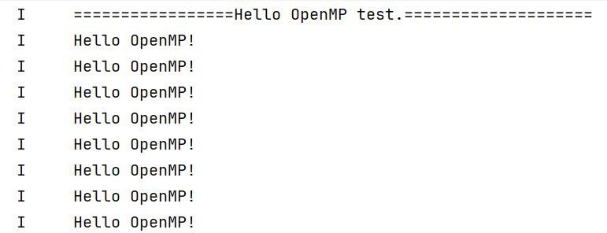

# OpenMP应用构建和运行指南

Harmony OS NDK中提供了OpenMP的动态库和静态库文件，支持开发者在Native应用中使用OpenMP。本文用于指导开发者在[DevEco Studio](https://developer.huawei.com/consumer/cn/deveco-studio/)中调用库文件使用OpenMP的并行化能力，更详细的使用示例和API标准请查看官方文档[clang-OpenMPSupport](https://clang.llvm.org/docs/OpenMPSupport.html)。

## 开发步骤

### 1. 创建Native C++工程
[创建Ndk工程](./create-with-ndk.md)

### 2. 添加依赖

OpenMP库的引入有静态链接和动态链接两种方式。

#### 静态链接

（1）打开entry/src/main/cpp/CMakeLists.txt，在target\_link\_libraries依赖中添加静态库libomp.a以及日志依赖libhilog\_ndk.z.so。

```makelists
target_link_libraries(entry PUBLIC libomp.a libace_napi.z.so libhilog_ndk.z.so)
```

（2）打开entry/build-profile.json5，在buildOption->externalNativeOptions->cppFlags下添加编译参数"-static-openmp -fopenmp"。

```
"buildOption": {
    "externalNativeOptions": {
      "path": "./src/main/cpp/CMakeLists.txt",
      "arguments": "",
      "cppFlags": "-static-openmp -fopenmp",
    }
  }
```

#### 动态链接

（1）打开entry/src/main/cpp/CMakeLists.txt，在target\_link\_libraries依赖中添加动态库libomp.so以及日志依赖libhilog\_ndk.z.so。

```makelists
target_link_libraries(entry PUBLIC libomp.so libace_napi.z.so libhilog_ndk.z.so)
```

（2）打开entry/build-profile.json5，在buildOption->externalNativeOptions->cppFlags下添加编译参数"-fopenmp"。

```
"buildOption": {
    "externalNativeOptions": {
      "path": "./src/main/cpp/CMakeLists.txt",
      "arguments": "",
      "cppFlags": "-fopenmp",
    }
  }
```

（3）打开Sdk安装目录，在“{Sdk安装目录}\{版本号}\openharmony\native\llvm\lib\aarch64-linux-ohos”目录下找到libomp.so动态库文件，并将其拷贝到工程目录entry/libs/arm64-v8a文件夹。

### 3. 修改源文件

（1）修改entry/src/main/cpp/napi_init.cpp，引入omp.h头文件，并添加OmpTest函数。

```cpp
#include "napi/native_api.h"
#include "omp.h"
#include "hilog/log.h" 

#undef LOG_DOMAIN 
#undef LOG_TAG 
#define LOG_DOMAIN 0x3200 // 全局domain宏，标识业务领域 
#define LOG_TAG "MY_TAG"  // 全局tag宏，标识模块日志tag

static napi_value OmpTest(napi_env env, napi_callback_info info)
{

    OH_LOG_INFO(LOG_APP, "=================Hello OpenMP test.====================");
    #pragma omp parallel
    {
        OH_LOG_INFO(LOG_APP, "Hello OpenMP!");
    }
    return nullptr;
}

EXTERN_C_START
static napi_value Init(napi_env env, napi_value exports)
{
    napi_property_descriptor desc[] = {
        { "ompTest", nullptr, OmpTest, nullptr, nullptr, nullptr, napi_default, nullptr }
    };
    napi_define_properties(env, exports, sizeof(desc) / sizeof(desc[0]), desc);
    return exports;
}
EXTERN_C_END

static napi_module demoModule = {
    .nm_version = 1,
    .nm_flags = 0,
    .nm_filename = nullptr,
    .nm_register_func = Init,
    .nm_modname = "entry",
    .nm_priv = ((void*)0),
    .reserved = { 0 },
};

extern "C" __attribute__((constructor)) void RegisterEntryModule(void)
{
    napi_module_register(&demoModule);
}

```

（2）修改entry/src/main/cpp/types/libentry/Index.d.ts，导出ompTest函数。

```TS
export const ompTest: () => null;
```

（3）Ts侧调用，修改entry/src/main/ets/pages/Index.ets，调用ompTest函数。

```TS
import testNapi from 'libentry.so';

@Entry
@Component
struct Index {
  @State message: string = 'Hello OpenMP';

  build() {
    Row() {
      Column() {
        Text(this.message)
          .fontSize(50)
          .fontWeight(FontWeight.Bold)
          .onClick(() => {
            testNapi.ompTest();
          })
      }
      .width('100%')
    }
    .height('100%')
  }
}
```

### 4. 运行并校验结果

运行前请检查设备连接并配置好[Signature](https://developer.huawei.com/consumer/cn/doc/harmonyos-guides-V5/ide-signing-V5)信息。直接点击右上角运行按钮，应用启动后设备进入“Hello OpenMP”界面，点击“Hello OpenMP”标签，打开Dev Eco下方“Log”查看页面，即可看到并行打印的“Hello OpenMP！”消息。



> **注意：**
> 
> OpenMP程序运行时，Hilog中会输出“dlopen_impl load library header failed for libarcher.so”的报错信息（如下图）。该报错信息中提到的libarcher.so，在OpenMP程序开启Tsan检测时才需要使用。目前Harmony OS未支持OpenMP程序的Tsan检测能力，因此该错误信息可忽略，不影响程序正常运行。
>
> 
