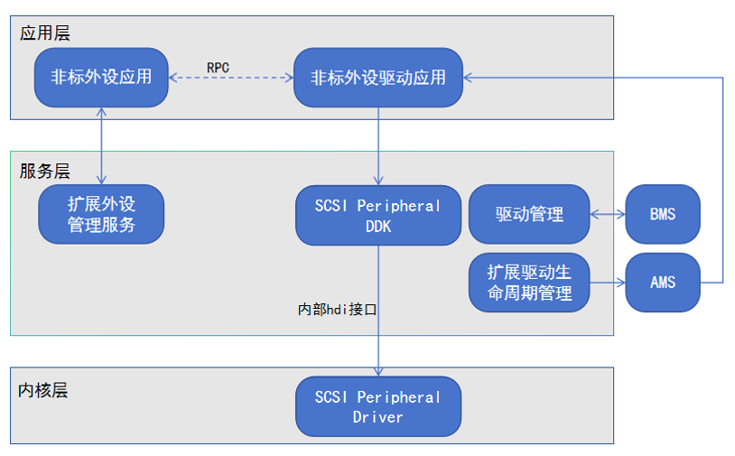

# SCSI Peripheral DDK开发指南

## 简介

在企业级存储解决方案和工业应用场景中，对SCSI（Small Computer System Interface，小型计算机系统接口）设备的使用需求广泛存在，例如：磁盘阵列、磁带库以及特定类型的存储服务器等。当操作系统中缺乏针对这些设备的适配驱动时，会导致设备连接后无法被识别或正常使用。SCSI Peripheral DDK（SCSI Peripheral Driver Development Kit）是为开发者提供的专门用于开发SCSI设备驱动程序的套件，支持开发者基于用户态，在应用层进行SCSI设备驱动的开发。

SCSI Peripheral DDK支持SPC（SCSI Primary Commands）、SBC（SCSI Block Commands）和MMC（MultiMedia Commands）三个命令集中的七个常用命令（INQUIRY、READ CAPACITY、TEST UNIT READY、REQUEST SENSE、READ、WRITE和VERIFY），使得开发者可以使用相对熟悉的命令进行设备驱动开发。

### 基本概念

在进行SCSI Peripheral DDK开发前，开发者应了解以下基本概念：

- **SCSI**

    SCSI是一种用于计算机和外围设备如硬盘驱动器、磁带驱动器、光盘驱动器、扫描仪等之间通信的标准化协议集。

- **AMS**

    AMS（Ability Manager Service）是用于协调各Ability运行关系，以及对生命周期进行调度的系统服务。

- **BMS**

    BMS（Bundle Manager Service）在OpenHarmony上主要负责应用的安装、卸载和数据管理。

- **DDK**

    DDK（Driver Development Kit）是OpenHarmony基于扩展外设框架，为开发者提供的驱动应用开发的工具包，可针对SCSI非标外设，开发对应的驱动。

- **非标外设**

    非标外设（也称为自定义外设或专有外设）是指不遵循通用标准或专门为特定应用场景定制设计的外围设备。这类设备往往需要专门的软件支持或者特殊的接口来实现与主机系统的通信。

- **标准外设**

    标准外设指的是遵循行业广泛接受的标准规范设计的外围设备（USB键盘、鼠标）。此类设备通常具有统一的接口协议、物理尺寸和电气特性，使得其可以在不同的系统之间互换使用。

- **逻辑块**

    逻辑块（Logical Block）是一个基本的数据存储单位。它代表设备上的一块固定大小的数据区域，通常用于数据读写操作。逻辑块的大小可以是512字节、1024字节、2048字节等，具体大小取决于设备的配置和文件系统的设计。

- **CDB**

    CDB（Command Descriptor Block）即命令描述块，是 SCSI协议中用于发送命令的标准数据结构。CDB是一个固定长度的字节数组，包含了SCSI命令的操作码（Opcode）以及相关的参数，用于告诉设备执行什么操作（如读取、写入、查询等）。

### 实现原理

非标外设应用通过扩展外设管理服务获取SCSI设备的ID，通过RPC将ID和要操作的动作下发给SCSI驱动应用，SCSI驱动应用通过调用SCSI Peripheral DDK接口可获取SCSI设备基本信息，读写数据，DDK接口使用hdi服务将指令下发至内核驱动，内核驱动使用指令与设备通信。

**图1** SCSI Peripheral DDK调用原理



### 约束与限制

- SCSI Peripheral DDK开放API支持标准SCSI类外设扩展驱动开发场景。

- SCSI Peripheral DDK开放API仅允许在DriverExtensionAbility生命周期内使用。

- 使用SCSI Peripheral DDK开放API需要在module.json5中声明对应的ACL权限：ohos.permission.ACCESS_DDK_SCSI_PERIPHERAL。

## 环境准备

### 环境要求

- 开发工具及配置：

  DevEco Studio作为驱动开发工具，是进行驱动开发的必备条件之一，我们可以使用该工具进行开发、调试、打包等操作。请[下载安装](https://developer.huawei.com/consumer/cn/download/)该工具，并参考[DevEco Studio使用指南](https://developer.huawei.com/consumer/cn/doc/harmonyos-guides-V13/ide-tools-overview-V13)中的[创建工程及运行](https://developer.huawei.com/consumer/cn/doc/harmonyos-guides-V13/ide-create-new-project-V13)进行基本的操作验证，保证DevEco Studio可正常运行。

- SDK版本配置：

  扩展外设管理提供的ArkTs接口，需要SDK版本为API version 16及以上方可使用。

- HDC配置：

  HDC（HarmonyOS Device Connector）是为开发人员提供的用于调试的命令行工具，通过该工具可以在Windows/Linux/Mac系统上与真实设备或者模拟器进行交互，详细参考[HDC配置](https://developer.huawei.com/consumer/cn/doc/harmonyos-guides-V5/hdc-V5)。

### 搭建环境

1. 在PC上安装[DevEco Studio](https://developer.huawei.com/consumer/cn/download/deveco-studio)，要求版本在4.1及以上。
2. 将public-SDK更新到API version 16或以上，更新SDK的具体操作可参见[更新指南](../faqs/full-sdk-switch-guide.md)。
3. PC安装HDC工具（HarmonyOS Device Connector），通过该工具可以在Windows/Linux/Mac系统上与真实设备或者模拟器进行交互，详细参考[HDC配置](https://developer.huawei.com/consumer/cn/doc/harmonyos-guides-V5/hdc-V5)。
3. 用USB线缆将搭载OpenHarmony的设备连接到PC。
4. 将SCSI设备接入OpenHarmony设备的USB口。

### 检验环境是否搭建成功

检查DevEco Studio是否已连接上OpenHarmony设备。


## 开发指导

### 接口说明

| 名称 | 描述 |
| -------- | -------- |
| int32_t OH_ScsiPeripheral_Init(void) | 初始化SCSI Peripheral DDK。 |
| int32_t OH_ScsiPeripheral_Release(void) | 释放SCSI Peripheral DDK。 |
| int32_t OH_ScsiPeripheral_Open(uint64_t deviceId, uint8_t interfaceIndex, ScsiPeripheral_Device **dev) | 打开deviceId和interfaceIndex指定的SCSI设备。 |
| int32_t OH_ScsiPeripheral_Close(ScsiPeripheral_Device **dev) | 关闭SCSI设备。 |
| int32_t OH_ScsiPeripheral_TestUnitReady(ScsiPeripheral_Device *dev, ScsiPeripheral_TestUnitReadyRequest *request, ScsiPeripheral_Response *response) | 检查逻辑单元是否已经准备好。 |
| int32_t OH_ScsiPeripheral_Inquiry(ScsiPeripheral_Device *dev, ScsiPeripheral_InquiryRequest *request, ScsiPeripheral_InquiryInfo *inquiryInfo, ScsiPeripheral_Response *response) | 查询SCSI设备的基本信息。 |
| int32_t OH_ScsiPeripheral_ReadCapacity10(ScsiPeripheral_Device *dev, ScsiPeripheral_ReadCapacityRequest *request, ScsiPeripheral_CapacityInfo *capacityInfo, ScsiPeripheral_Response *response) | 获取SCSI设备的容量信息。 |
| int32_t OH_ScsiPeripheral_RequestSense(ScsiPeripheral_Device *dev, ScsiPeripheral_RequestSenseRequest *request, ScsiPeripheral_Response *response) | 获取sense data（SCSI设备返回给主机的信息，用于报告设备的状态、错误信息以及诊断信息）。 |
| int32_t OH_ScsiPeripheral_Read10(ScsiPeripheral_Device *dev, ScsiPeripheral_IORequest *request, ScsiPeripheral_Response *response) | 从指定逻辑块读取数据。 |
| int32_t OH_ScsiPeripheral_Write10(ScsiPeripheral_Device *dev, ScsiPeripheral_IORequest *request, ScsiPeripheral_Response *response) | 写数据到设备的指定逻辑块。 |
| int32_t OH_ScsiPeripheral_Verify10(ScsiPeripheral_Device *dev, ScsiPeripheral_VerifyRequest *request, ScsiPeripheral_Response *response) | 校验指定逻辑块。 |
| int32_t OH_ScsiPeripheral_SendRequestByCdb(ScsiPeripheral_Device *dev, ScsiPeripheral_Request *request, ScsiPeripheral_Response *response) | 以CDB方式发送SCSI命令。 |
| int32_t OH_ScsiPeripheral_CreateDeviceMemMap(ScsiPeripheral_Device *dev, size_t size, ScsiPeripheral_DeviceMemMap **devMmap) | 创建缓冲区。 |
| int32_t OH_ScsiPeripheral_DestroyDeviceMemMap(ScsiPeripheral_DeviceMemMap *devMmap) | 销毁缓冲区。|
| int32_t OH_ScsiPeripheral_ParseBasicSenseInfo(uint8_t *senseData, uint8_t senseDataLen, ScsiPeripheral_BasicSenseInfo *senseInfo) | 解析基本的sense data，包括Information、Command specific information、Sense key specific字段。 |

详细的接口说明请参考[SCSI Peripheral DDK](../reference/apis-driverdevelopment-kit/_s_c_s_i.md)。

### 开发步骤

以下步骤描述了如何使用SCSI Peripheral DDK开发非标SCSI外设的驱动：

**添加动态链接库**

CMakeLists.txt中添加以下lib。
```txt
libscsi.z.so
```

**头文件**
```c++
#include <scsi_peripheral/scsi_peripheral_api.h>
#include <scsi_peripheral/scsi_peripheral_types.h>
```

1. 初始化DDK。

    使用 **scsi_peripheral_api.h** 的 **OH_ScsiPeripheral_Init** 初始化SCSI Peripheral DDK。

    ```c++
    // 初始化SCSI Peripheral DDK
    int32_t ret = OH_ScsiPeripheral_Init();
    ```

2. 打开设备。

    初始化SCSI Peripheral DDK后，使用 **scsi_peripheral_api.h** 的 **OH_ScsiPeripheral_Open** 打开SCSI设备。

    ```c++
    uint64_t deviceId = 0x100000003;
    uint8_t interfaceIndex = 0;
    ScsiPeripheral_Device *dev = NULL;
    // 打开deviceId和interfaceIndex1指定的SCSI设备
    ret = OH_ScsiPeripheral_Open(deviceId, interfaceIndex, &dev);
    ```

3. 创建缓冲区。

    使用 **scsi_peripheral_api.h** 的 **OH_ScsiPeripheral_CreateDeviceMemMap** 创建内存缓冲区devMmap。

    ```c++
    constexpr size_t DEVICE_MEM_MAP_SIZE = 1024;
    ScsiPeripheral_DeviceMemMap *g_scsiDeviceMemMap = nullptr;
    ret = OH_ScsiPeripheral_CreateDeviceMemMap(dev, DEVICE_MEM_MAP_SIZE, &g_scsiDeviceMemMap);
    ```

4. 检查逻辑单元是否已经准备好。

    使用 **scsi_peripheral_api.h** 的 **OH_ScsiPeripheral_TestUnitReady** 检查逻辑单元是否已经准备好。

    ```c++
    ScsiPeripheral_TestUnitReadyRequest testUnitReadyRequest = {0};
    testUnitReadyRequest.timeout = 5000;
    ScsiPeripheral_Response testUnitReadyResponse = {0};
    ret = OH_ScsiPeripheral_TestUnitReady(dev, &testUnitReadyRequest, &testUnitReadyResponse);
    ```

5. 查询SCSI设备的基本信息。

    使用 **scsi_peripheral_api.h** 的 **OH_ScsiPeripheral_Inquiry** 获取SCSI设备的基本信息。

    ```c++
    ScsiPeripheral_InquiryRequest inquiryRequest = {0};
    inquiryRequest.allocationLength = 512;
    inquiryRequest.timeout = 5000;
    ScsiPeripheral_InquiryInfo inquiryInfo = {0};
    inquiryInfo.data = g_scsiDeviceMemMap;
    ScsiPeripheral_Response inquiryResponse = {0};
    ret = OH_ScsiPeripheral_Inquiry(dev, &inquiryRequest, &inquiryInfo, &inquiryResponse);
    ```

6. 获取SCSI设备的容量信息。

    使用 **scsi_peripheral_api.h** 的 **OH_ScsiPeripheral_ReadCapacity10** 获取SCSI设备容量信息。

    ```c++
    ScsiPeripheral_ReadCapacityRequest readCapacityRequest = {0};
    readCapacityRequest.lbAddress = 0;
    readCapacityRequest.control = 0;
    readCapacityRequest.byte8 = 0;
    readCapacityRequest.timeout = 5000;
    ScsiPeripheral_CapacityInfo capacityInfo = {0};
    ScsiPeripheral_Response readCapacityResponse = {0};
    ret = OH_ScsiPeripheral_ReadCapacity10(dev, &readCapacityRequest, &capacityInfo, &readCapacityResponse);
    ```

7. 获取sense data。

    使用 **scsi_peripheral_api.h** 的 **OH_ScsiPeripheral_RequestSense** 获取sense data。

    ```c++
    ScsiPeripheral_RequestSenseRequest senseRequest = {0};
    senseRequest.allocationLength = SCSIPERIPHERAL_MAX_SENSE_DATA_LEN + 1;
    senseRequest.control = 0;
    senseRequest.byte1 = 0;
    senseRequest.timeout = 5000;
    ScsiPeripheral_Response senseResponse = {0};
    // SCSI设备返回给主机的信息，用于报告设备的状态、错误信息以及诊断信息
    ret = OH_ScsiPeripheral_RequestSense(dev, &senseRequest, &senseResponse);
    ```

8. 解析sense data。

    使用 **scsi_peripheral_api.h** 的 **OH_ScsiPeripheral_ParseBasicSenseInfo** 解析基本的sense data，包括Information、Command specific information、Sense key specific字段。

    ```c++
    ScsiPeripheral_BasicSenseInfo senseInfo = {0};
    ret = OH_ScsiPeripheral_ParseBasicSenseInfo(senseResponse.senseData, SCSIPERIPHERAL_MAX_SENSE_DATA_LEN, &senseInfo); 
    ```

9. 读取数据。

    使用 **scsi_peripheral_api.h** 的 **OH_ScsiPeripheral_Read10** 读取指定逻辑块的数据。

    ```c++
    ScsiPeripheral_IORequest readRequest = {0};
    readRequest.lbAddress = 1;
    readRequest.transferLength = 1;
    readRequest.control = 0;
    readRequest.byte1 = 0;
    readRequest.byte6 = 0;
    readRequest.timeout = 20000;
    readRequest.data = g_scsiDeviceMemMap;
    ScsiPeripheral_Response readResponse = {0};
    ret = OH_ScsiPeripheral_Read10(dev, &readRequest, &readResponse);
    ```

10. 写入数据。

    使用 **scsi_peripheral_api.h** 的 **OH_ScsiPeripheral_Write10** 写数据到设备指定逻辑块。

    ```c++
    ScsiPeripheral_IORequest writeRequest = {0};
    writeRequest.lbAddress = 1;
    writeRequest.transferLength = 1;
    writeRequest.control = 0;
    writeRequest.byte1 = 0;
    writeRequest.byte6 = 0;
    writeRequest.timeout = 5000;
    writeRequest.data = g_scsiDeviceMemMap;
    ScsiPeripheral_Response writeResponse = {0};
    ret = OH_ScsiPeripheral_Write10(dev, &writeRequest, &writeResponse);
    ```

11. 校验指定逻辑块。

    使用 **scsi_peripheral_api.h** 的 **OH_ScsiPeripheral_Verify10** 校验指定逻辑块。

    ```c++
    ScsiPeripheral_VerifyRequest verifyRequest = {0};
    verifyRequest.lbAddress = 1;
    verifyRequest.verificationLength = 1;
    verifyRequest.timeout = 5000;
    ScsiPeripheral_Response verifyResponse = {0};
    ret = OH_ScsiPeripheral_Verify10(dev, &verifyRequest, &verifyResponse);
    ```

12. 以CDB方式发送SCSI命令。

    使用 **scsi_peripheral_api.h** 的 **OH_SCSIPeripheral_SendRequestByCdb** 发送SCSI命令。

    ```c++
    ScsiPeripheral_Request sendRequest = {0};
    uint8_t cdbData[SCSIPERIPHERAL_MAX_CMD_DESC_BLOCK_LEN] = {0x28, 0x00, 0x00, 0x00, 0x00, 0x01, 0x00, 0x00, 0x14, 0x00, 0x00, 0x00, 0x00, 0x00, 0x00, 0x00};
    memcpy(sendRequest.commandDescriptorBlock, cdbData, SCSIPERIPHERAL_MAX_CMD_DESC_BLOCK_LEN);
    sendRequest.cdbLength = 10;
    sendRequest.dataTransferDirection = -3;
    sendRequest.timeout = 5000;
    sendRequest.data = g_scsiDeviceMemMap;
    ScsiPeripheral_Response sendResponse = {0};
    ret = OH_ScsiPeripheral_SendRequestByCdb(dev, &sendRequest, &sendResponse);
    ```

13. 销毁缓冲区。

    在所有请求处理完毕，程序退出前，使用 **scsi_peripheral_api.h** 的 **OH_ScsiPeripheral_DestroyDeviceMemMap** 销毁缓冲区。

    ```c++
    ret = OH_ScsiPeripheral_DestroyDeviceMemMap(g_scsiDeviceMemMap);
    ```

14. 关闭设备。

    在销毁缓冲区后，使用 **scsi_peripheral_api.h** 的 **OH_ScsiPeripheral_Close** 关闭设备。

    ```c++
    // 关闭SCSI设备
    ret = OH_ScsiPeripheral_Close(&dev);
    ```

15. 释放DDK。

    在关闭SCSI设备后，使用 **scsi_peripheral_api.h** 的 **OH_ScsiPeripheral_Release** 释放SCSI Peripheral DDK。

    ```c++
    // 释放SCSI Peripheral DDK
    ret = OH_ScsiPeripheral_Release();
    ```

### 调测验证

驱动应用侧开发完成后，可在OpenHarmony设备上安装应用，测试步骤如下：

1. 在设备上点击驱动应用，应用在设备上被拉起。
2. 应用可以读取到SCSI设备的基础信息。
3. 选择对应的SCSI命令，输入参数，点击发送按钮，可以执行对应的SCSI命令。
4. 也可以通过输入方向、CDB数据及CDB长度，点击发送按钮，执行对应的SCSI命令。
