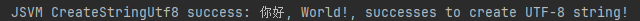
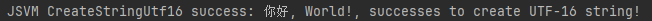

# 使用JSVM-API接口创建和获取string值

## 简介

使用JSVM-API的六个字符串接口，可以实现JSVM模块与JavaScript字符串的交互。

## 基本概念

string是编程中常用的数据类型。它可以存储和操作文本数据，用于表示和处理字符序列。它还可以用于构建用户界面元素，如标签、按钮和文本框，处理用户输入，验证和格式化数据。不同的编码方案支持不同的字符集和语言，以下是一些主要的编码方案及其区别：

- **ASCII**：ASCII是最早的字符编码方案之一，使用7位编码，只能表示英文字母、数字和一些基本符号。它是许多其他编码方案的基础。
- **UTF-8**：UTF-8是一种变长编码方案，可以表示全球范围的字符集。它使用8位编码，根据字符的不同范围使用不同长度的字节序列。UTF-8是互联网上广泛使用的编码方案。
- **UTF-16**：UTF-16是一种定长或变长编码方案，使用16位编码。它可以表示全球范围的字符集，并且适用于较大的字符集。
- **ISO-8859-1（Latin-1）**：ISO-8859-1是一种单字节编码方案，使用8位编码。它主要用于表示拉丁字母字符集，包括欧洲大部分语言。

## 接口说明

| 接口                       | 功能说明                       |
|----------------------------|--------------------------------|
| OH_JSVM_GetValueStringUtf8       | 获取给定JavaScript string对象的Utf8编码字符串。|
| OH_JSVM_CreateStringUtf8          | 根据Utf8编码的字符串创建一个JavaScript string对象。|
| OH_JSVM_GetValueStringUtf16      | 获取给定JavaScript string对象的Utf16编码字符串。|
| OH_JSVM_CreateStringUtf16         | 根据Utf16编码的字符串数据创建JavaScript string对象。|
| OH_JSVM_GetValueStringLatin1     | 获取给定JavaScript string对象的Latin1编码字符串。|
| OH_JSVM_CreateStringLatin1        | 根据Latin-1编码的字符串创建一个JavaScript string对象。|

## 使用示例

JSVM-API接口开发流程参考[使用JSVM-API实现JS与C/C++语言交互开发流程](use-jsvm-process.md)，本文仅对接口对应C++相关代码进行展示。

### OH_JSVM_GetValueStringUtf8

OH_JSVM_GetValueStringUtf8接口可以将JavaScript的字符类型的数据转换为utf8编码的字符。

cpp部分代码：

```cpp
// hello.cpp
#include "napi/native_api.h"
#include "ark_runtime/jsvm.h"
#include <hilog/log.h>
#include <cstdlib>
// OH_JSVM_GetValueStringUtf8的样例方法
static JSVM_Value GetValueStringUtf8(JSVM_Env env, JSVM_CallbackInfo info)
{
    size_t argc = 1;
    JSVM_Value args[1] = {nullptr};
    OH_JSVM_GetCbInfo(env, info, &argc, args, nullptr, nullptr);
    size_t length = 0;
    JSVM_Status status = OH_JSVM_GetValueStringUtf8(env, args[0], nullptr, 0, &length);
    char *buf = (char *)malloc(length + 1);
    status = OH_JSVM_GetValueStringUtf8(env, args[0], buf, length + 1, &length);
    if (status != JSVM_OK) {
        OH_LOG_ERROR(LOG_APP, "JSVM GetValueStringUtf8 fail");
        free(buf);
        return nullptr;
    } else {
        OH_LOG_INFO(LOG_APP, "JSVM GetValueStringUtf8 success: %{public}s", buf);
    }
    JSVM_Value result = nullptr;
    OH_JSVM_CreateStringUtf8(env, buf, length, &result);
    free(buf);
    return result;
}
// GetValueStringUtf8注册回调
static JSVM_CallbackStruct param[] = {
    {.data = nullptr, .callback = GetValueStringUtf8},
};
static JSVM_CallbackStruct *method = param;
// GetValueStringUtf8方法别名，供JS调用
static JSVM_PropertyDescriptor descriptor[] = {
    {"getValueStringUtf8", nullptr, method++, nullptr, nullptr, nullptr, JSVM_DEFAULT},
};

// 样例测试js
const char *srcCallNative = R"JS(
    let data = "aaBC+-$%^你好123";
    let script = getValueStringUtf8(data);
)JS";
```
<!-- @[oh_jsvm_get_value_string_utf8](https://gitee.com/openharmony/applications_app_samples/blob/master/code/DocsSample/ArkTS/JSVMAPI/JsvmUsageGuide/JsvmAboutString/getvaluestringutf8/src/main/cpp/hello.cpp) -->

预期输出结果：
```cpp

```
**注意事项**：`getValueStringUtf8(arg)`入参`arg`非字符串型数据时接口会调用失败。

### OH_JSVM_CreateStringUtf8

用于创建一个UTF-8编码的JavaScript字符串。

cpp部分代码：

```cpp
// hello.cpp
#include "napi/native_api.h"
#include "ark_runtime/jsvm.h"
#include <hilog/log.h>
#include <string>
// OH_JSVM_CreateStringUtf8的样例方法
static JSVM_Value CreateStringUtf8(JSVM_Env env, JSVM_CallbackInfo info)
{
    const char *str = u8"你好, World!, successes to create UTF-8 string!";
    size_t length = strlen(str);
    JSVM_Value result = nullptr;
    JSVM_Status status = OH_JSVM_CreateStringUtf8(env, str, length, &result);
    if (status != JSVM_OK) {
        OH_JSVM_ThrowError(env, nullptr, "Failed to create UTF-8 string");
        return nullptr;
    } else {
        OH_LOG_INFO(LOG_APP, "JSVM CreateStringUtf8 success: %{public}s", str);
    }
    return result;
}
// CreateStringUtf8注册回调
static JSVM_CallbackStruct param[] = {
    {.data = nullptr, .callback = CreateStringUtf8},
};
static JSVM_CallbackStruct *method = param;
// CreateStringUtf8方法别名，供JS调用
static JSVM_PropertyDescriptor descriptor[] = {
    {"createStringUtf8", nullptr, method++, nullptr, nullptr, nullptr, JSVM_DEFAULT},
};

// 样例测试js
const char *srcCallNative = R"JS(
    let script = createStringUtf8();
)JS";
```
<!-- @[oh_jsvm_create_string_utf8](https://gitee.com/openharmony/applications_app_samples/blob/master/code/DocsSample/ArkTS/JSVMAPI/JsvmUsageGuide/JsvmAboutString/createstringutf8/src/main/cpp/hello.cpp) -->

预期输出结果：
```cpp

```
### OH_JSVM_GetValueStringUtf16

OH_JSVM_GetValueStringUtf16，将JavaScript的字符类型的数据转换为utf16编码的字符。

cpp部分代码：

```cpp
// hello.cpp
#include "napi/native_api.h"
#include "ark_runtime/jsvm.h"
#include <hilog/log.h>
#include <codecvt>
#include <locale>
#include <cstdlib>

// OH_JSVM_GetValueStringUtf16的样例方法
// 定义字符串缓冲区的最大长度
static const int MAX_BUFFER_SIZE = 128;
static JSVM_Value GetValueStringUtf16(JSVM_Env env, JSVM_CallbackInfo info) {
    size_t argc = 1;
    JSVM_Value args[1] = {nullptr};
    OH_JSVM_GetCbInfo(env, info, &argc, args, nullptr, nullptr);
    JSVM_Value result = nullptr;
    size_t length = 0;
    char16_t buffer[MAX_BUFFER_SIZE] = {0};
    // 字符串的缓冲区大小
    size_t bufferSize = MAX_BUFFER_SIZE;
    JSVM_Status status = OH_JSVM_GetValueStringUtf16(env, args[0], buffer, bufferSize, &length);
    // 将 char16_t 转换为 std::u16string
    std::u16string u16str = {buffer};
    // 将 std::u16string 转换为 std::string
    std::wstring_convert<std::codecvt_utf8_utf16<char16_t>, char16_t> converter;
    std::string str = converter.to_bytes(u16str);
    // 获取字符串返回结果
    if (status != JSVM_OK) {
        OH_LOG_ERROR(LOG_APP, "JSVM GetValueStringUtf16 fail");
        return nullptr;
    } else {
        OH_LOG_INFO(LOG_APP, "JSVM GetValueStringUtf16 success: %{public}s", str.c_str());
    }
    return result;
}
// GetValueStringUtf16注册回调
static JSVM_CallbackStruct param[] = {
    {.data = nullptr, .callback = GetValueStringUtf16},
};
static JSVM_CallbackStruct *method = param;
// GetValueStringUtf16方法别名，供JS调用
static JSVM_PropertyDescriptor descriptor[] = {
    {"getValueStringUtf16", nullptr, method++, nullptr, nullptr, nullptr, JSVM_DEFAULT},
};

// 样例测试js
const char *srcCallNative = R"JS(
    let data = "ahello。";
    let script = getValueStringUtf16(data);
)JS";
```
<!-- @[oh_jsvm_get_value_string_utf16](https://gitee.com/openharmony/applications_app_samples/blob/master/code/DocsSample/ArkTS/JSVMAPI/JsvmUsageGuide/JsvmAboutString/getvaluestringutf16/src/main/cpp/hello.cpp) -->

预期输出结果：
```cpp

```
**注意事项**：`getValueStringUtf16(arg)`入参`arg`非字符串型数据时接口会调用失败。

### OH_JSVM_CreateStringUtf16

用于创建一个UTF-16编码的JavaScript字符串。

cpp部分代码：

```cpp
// hello.cpp
#include "napi/native_api.h"
#include "ark_runtime/jsvm.h"
#include <hilog/log.h>
#include <codecvt>
#include <locale>
#include <cstring>

// OH_JSVM_CreateStringUtf16的样例方法
static JSVM_Value CreateStringUtf16(JSVM_Env env, JSVM_CallbackInfo info)
{
    const char16_t *str = u"你好, World!, successes to create UTF-16 string!";
    std::u16string ustr(str);
    size_t length = ustr.length();
    JSVM_Value result = nullptr;
    JSVM_Status status = OH_JSVM_CreateStringUtf16(env, str, length, &result);
    std::u16string u16str = {str};
    // 将 std::u16string 转换为 std::string
    std::wstring_convert<std::codecvt_utf8_utf16<char16_t>, char16_t> converter;
    std::string strResult = converter.to_bytes(u16str);
    if (status != JSVM_OK) {
        OH_LOG_ERROR(LOG_APP, "JSVM CreateStringUtf16 fail");
    }else {
        OH_LOG_INFO(LOG_APP, "JSVM CreateStringUtf16 success: %{public}s", strResult.c_str());
    }
    return result;
}
// CreateStringUtf16注册回调
static JSVM_CallbackStruct param[] = {
    {.data = nullptr, .callback = CreateStringUtf16},
};
static JSVM_CallbackStruct *method = param;
// CreateStringUtf16方法别名，供JS调用
static JSVM_PropertyDescriptor descriptor[] = {
    {"createStringUtf16", nullptr, method++, nullptr, nullptr, nullptr, JSVM_DEFAULT},
};

// 样例测试js
const char *srcCallNative = R"JS(
    let script = createStringUtf16();
)JS";
```
<!-- @[oh_jsvm_create_string_utf16](https://gitee.com/openharmony/applications_app_samples/blob/master/code/DocsSample/ArkTS/JSVMAPI/JsvmUsageGuide/JsvmAboutString/createstringutf16/src/main/cpp/hello.cpp) -->

预期输出结果：
```cpp

```
### OH_JSVM_GetValueStringLatin1

OH_JSVM_GetValueStringLatin1接口可以将JavaScript的字符类型的数据转换为ISO-8859-1编码的字符。

cpp部分代码：

```cpp
// hello.cpp
#include "napi/native_api.h"
#include "ark_runtime/jsvm.h"
#include <hilog/log.h>
#include <cstdlib>
// OH_JSVM_GetValueStringLatin1的样例方法
// 定义字符串缓冲区的最大长度
static const int MAX_BUFFER_SIZE = 128;
static JSVM_Value GetValueStringLatin1(JSVM_Env env, JSVM_CallbackInfo info)
{
    size_t argc = 1;
    JSVM_Value args[1] = {nullptr};
    OH_JSVM_GetCbInfo(env, info, &argc, args, nullptr, nullptr);
    char buf[MAX_BUFFER_SIZE];
    size_t length = 0;
    JSVM_Value jsvmRes = nullptr;
    JSVM_Status status = OH_JSVM_GetValueStringLatin1(env, args[0], buf, MAX_BUFFER_SIZE, &length);
    if (status != JSVM_OK) {
        OH_LOG_ERROR(LOG_APP, "JSVM GetValueStringLatin1 fail");
    } else {
        OH_LOG_INFO(LOG_APP, "JSVM GetValueStringLatin1 success: %{public}s", buf);
    }
    OH_JSVM_CreateStringLatin1(env, buf, length, &jsvmRes);
    return jsvmRes;
}
// GetValueStringLatin1注册回调
static JSVM_CallbackStruct param[] = {
    {.data = nullptr, .callback = GetValueStringLatin1},
};
static JSVM_CallbackStruct *method = param;
// GetValueStringLatin1方法别名，供JS调用
static JSVM_PropertyDescriptor descriptor[] = {
    {"getValueStringLatin1", nullptr, method++, nullptr, nullptr, nullptr, JSVM_DEFAULT},
};

// 样例测试js
const char *srcCallNative = R"JS(
    let data = "中文";
    let script = getValueStringLatin1(data);
)JS";
```
<!-- @[oh_jsvm_get_value_string_latin1](https://gitee.com/openharmony/applications_app_samples/blob/master/code/DocsSample/ArkTS/JSVMAPI/JsvmUsageGuide/JsvmAboutString/getvaluestringlatin1/src/main/cpp/hello.cpp) -->

预期输出结果：
```cpp
*ISO-8859-1编码不支持中文，传入中文字符会导致乱码*

```
**注意事项**：`getValueStringLatin1(arg)`入参`arg`必须为字符串类型，否则将导致调用失败。

### OH_JSVM_CreateStringLatin1

用于创建一个Latin1编码的JavaScript字符串。

cpp部分代码：

```cpp
// hello.cpp
#include "napi/native_api.h"
#include "ark_runtime/jsvm.h"
#include <hilog/log.h>
#include <cstring>
// CreateStringLatin1注册回调
// 定义字符串缓冲区的最大长度
static const int MAX_BUFFER_SIZE = 128;
// OH_JSVM_CreateStringLatin1的样例方法
static JSVM_Value CreateStringLatin1(JSVM_Env env, JSVM_CallbackInfo info)
{
    const char *str = "Hello, World! éçñ, successes to create Latin1 string!";
    size_t length = JSVM_AUTO_LENGTH;
    JSVM_Value result = nullptr;
    JSVM_Status status = OH_JSVM_CreateStringLatin1(env, str, length, &result);
    if (status != JSVM_OK) {
        OH_LOG_ERROR(LOG_APP, "JSVM CreateStringLatin1 fail");
    } else {
        char buf[MAX_BUFFER_SIZE];
        size_t length = 0;
        OH_JSVM_GetValueStringLatin1(env, result, buf, MAX_BUFFER_SIZE, &length);
        OH_LOG_INFO(LOG_APP, "JSVM CreateStringLatin1 success: %{public}s", buf);
    }
    return result;
}
static JSVM_CallbackStruct param[] = {
    {.data = nullptr, .callback = CreateStringLatin1},
};
static JSVM_CallbackStruct *method = param;
// CreateStringLatin1方法别名，供JS调用
static JSVM_PropertyDescriptor descriptor[] = {
    {"createStringLatin1", nullptr, method++, nullptr, nullptr, nullptr, JSVM_DEFAULT},
};

// 样例测试js
const char *srcCallNative = R"JS(
    let script = createStringLatin1();
)JS";
```
<!-- @[oh_jsvm_create_string_latin1](https://gitee.com/openharmony/applications_app_samples/blob/master/code/DocsSample/ArkTS/JSVMAPI/JsvmUsageGuide/JsvmAboutString/createstringlatin1/src/main/cpp/hello.cpp) -->

预期输出结果：
```cpp

```