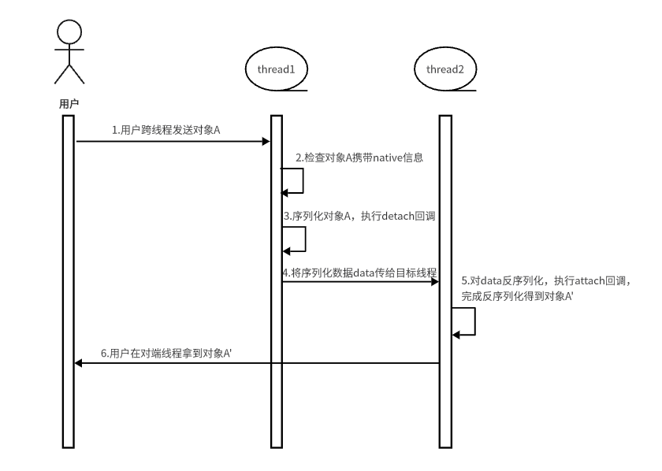

# Node-API 扩展能力接口

## 简介

扩展能力接口进一步扩展了Node-API的功能，提供了一些额外的接口，用于在Node-API模块中与JavaScript进行更灵活的交互和定制。这些接口可以用于创建自定义JavaScript对象等场景。

## 基本概念

在理解Node-API扩展能力接口之前，需要了解一些基本概念：

- **模块:** 一个模块是一个可重用的、独立的代码单元。它封装了相关功能，并可以被其他模块引用和使用。
- **命名空间:** 命名空间是一种用于组织代码的机制，可以将相关的函数、变量和类型放置在一个命名空间下，防止命名冲突。

## 场景和功能介绍

以下Node-API接口主要在已有接口进行扩展。使用场景如下：
| 接口 | 描述 |
| -------- | -------- |
| napi_load_module | 用于在Node-API模块中将abc文件作为模块加载，返回模块的命名空间，适用于需要在运行时动态加载模块或资源的应用程序，从而实现灵活的扩展和定制。 |
| napi_create_object_with_properties | 用于在Node-API模块中使用给定的napi_property_descriptor创建js Object。descriptor的键名必须为string，且不可转为number。 |
| napi_create_object_with_named_properties | 用于在Node-API模块中使用给定的napi_value和键名创建js Object。键名必须为string，且不可转为number。 |
| napi_run_script_path | 用于在Node-API模块中运行指定abc文件。 |
| napi_queue_async_work_with_qos | 用于将异步工作对象加入队列，让开发者能够根据QoS优先级来管理和调度异步工作的执行，从而更好地满足程序的性能和响应需求。 |
| napi_coerce_to_native_binding_object | 用于给JavaScript对象绑定回调和回调所需的参数，其作用是为了给JavaScript对象携带Native信息。 |
| napi_serialize | 将ArkTS对象转换为native数据。第一个参数env是接口执行的ArkTS环境；第二个参数object是待序列化的ArkTS对象；第三个参数transfer_list是存放需要以transfer传递的arrayBuffer的array，如不涉及可传undefined；第四个参数clone_list是存放需要克隆传递的Sendable对象的array，如不涉及可传undefined；第五个参数result是序列化结果。 |
| napi_deserialize | 将native数据转为ArkTS对象。第一个参数env是接口执行的ArkTS环境；第二个参数buffer是序列化数据；第三个参数object是反序列化得到的结果。 |
| napi_delete_serialization_data | 删除序列化数据。 |

## 使用示例

### napi_load_module

[napi_load_module](use-napi-load-module.md)

### napi_create_object_with_properties

用于使用给定的napi_property_descriptor作为属性去创建一个JavaScript对象，并且descriptor的键名必须为string，且不可转为number。

cpp部分代码

```cpp
static napi_value CreateObjectWithProperties(napi_env env, napi_callback_info info) {
    size_t argc = 1;
    napi_value argv[1] = nullptr;
    // 获取解析传递的参数
    napi_get_cb_info(env, info, &argc, argv, nullptr, nullptr);
    // 声明了一个napi_property_descriptor数组desc，其中包含了一个名为"name"的属性，其值为传入的第一个参数argv[0]。
    napi_property_descriptor desc[] = {
        {"name", nullptr, nullptr, nullptr, nullptr, argv[0], napi_default_jsproperty, nullptr}};
    napi_value object = nullptr;
    // 调用napi_create_object_with_properties来创建一个新的JavaScript对象，并将属性值添加到该对象中。
    napi_create_object_with_properties(env, &object, sizeof(desc) / sizeof(desc[0]), desc);
    napi_valuetype valueType;
    napi_typeof(env, object, &valueType);
    if (valueType == napi_object) {
        return object;
    }
}
```

接口声明

```ts
// index.d.ts
export const createObjectWithProperties: (data: string) => Object;
```

ArkTS侧示例代码

```ts
import testNapi from 'libentry.so';

let value = testNapi.createObjectWithProperties('createObject');
hilog.info(0x0000, 'testTag', 'NAPI napi_create_object_with_properties:%{public}s', JSON.stringify(value));
```

### napi_create_object_with_named_properties

用于使用给定的napi_value和键名创建一个js对象，并且给定的键名必须为string，且不可转为number。

cpp部分代码

```cpp
static napi_value CreateObjectWithNameProperties(napi_env env, napi_callback_info info) {
    size_t argc = 1;
    napi_value argv[1] = nullptr;
    // 获取解析传递的参数
    napi_get_cb_info(env, info, &argc, argv, nullptr, nullptr);
    napi_value obj = nullptr;
    const char *key[] = {
        "name",
    };
    const napi_value values[] = {
        argv[0],
    };
    napi_property_descriptor desc[] = {{"name", nullptr, nullptr,
                                        nullptr, nullptr, nullptr, napi_default, nullptr}};
    napi_status status;
    status = napi_create_object_with_named_properties(env, &obj, sizeof(desc) / sizeof(desc[0]), key, values);
    if (status != napi_ok) {
        return argv[0];
    }
    return obj;
}
```

接口声明

```ts
// index.d.ts
export const createObjectWithNameProperties: (data: string) => string | { name: string };
```

ArkTS侧示例代码

```ts
import testNapi from 'libentry.so';

let value = testNapi.createObjectWithNameProperties('ls');
hilog.info(0x0000, 'testTag', 'NAPI napi_create_object_with_named_properties:%{public}s', JSON.stringify(value));
```

### napi_run_script_path

在Node-API模块中运行abc文件。

cpp部分代码

```cpp
static napi_value RunScriptPath(napi_env env, napi_callback_info info)
{
    napi_value value = nullptr;
    // 注意：记得在应用rawfile目录下放置.abc文件
    const char *scriptPath = "/entry/resources/rawfile/test.abc";
    // 使用napi_run_script_path函数执行指定路径中的文件
    napi_status status = napi_run_script_path(env, scriptPath, &value);
    // 检查是否执行成功，如果失败，返回false
    napi_value returnValue = nullptr;
    if (value == nullptr || status != napi_ok) {
        napi_get_boolean(env, false, &returnValue);
    }
    napi_get_boolean(env, true, &returnValue);
    return returnValue;
}
```

接口声明

```ts
// index.d.ts
export const runScriptPath: () => boolean;
```

ArkTS侧示例代码

```ts
import testNapi from 'libentry.so';

try {
  // 在此处执行错误返回false，成功就返回true
  hilog.info(0x0000, 'testTag', 'Test NAPI napi_run_script_path: %{public}s', testNapi.runScriptPath());
} catch (error) {
  hilog.error(0x0000, 'testTag', 'Test NAPI napi_run_script_path errorMessage: %{public}s', error.message);
}
```

test.js代码，将js代码编成.abc文件，步骤如下:

1. 在sdK的ets/build-tools/ets-loader/bin/ark/build-win/bin目录下放置test.js文件
2. 执行命令如es2abc.exe test.js  --output test.abc后便可生成test.abc文件

放入指定路径中：/entry/resources/rawfile

```js
function add(a, b) {
  return a+b;
}
add(1, 2);
```

### napi_queue_async_work_with_qos

将异步工作对象加到队列，由底层根据传入的qos优先级去调度执行。

<!--Del-->
[指定异步任务调度优先级](../performance/develop-Native-modules-using-NAPI-safely-and-efficiently.md#指定异步任务调度优先级)
<!--DelEnd-->

### napi_coerce_to_native_binding_object

用于给JS Object绑定回调和回调所需的参数，给JS Object携带Native信息。

cpp部分代码

```cpp
#include <bits/alltypes.h>
#include <mutex>
#include <unordered_set>
#include <uv.h>
#include "napi/native_api.h"

class Object {
public:
    Object() = default;
    ~Object() = default;

    static Object* GetInstance()
    {
        Object* instance = new Object();
        return instance;
    }

    static napi_value GetAddress(napi_env env, napi_callback_info info)
    {
        napi_value thisVar = nullptr;
        napi_get_cb_info(env, info, nullptr, nullptr, &thisVar, nullptr);
        if (thisVar == nullptr) {
            return nullptr;
        }
        void* object = nullptr;
        napi_unwrap(env, thisVar, &object);
        if (object == nullptr) {
            return nullptr;
        }
        uint64_t addressVal = reinterpret_cast<uint64_t>(object);
        napi_value address = nullptr;
        napi_create_bigint_uint64(env, addressVal, &address);
        return address;
    }

    // 获取数组大小
    static napi_value GetSetSize(napi_env env, napi_callback_info info)
    {
        napi_value thisVar = nullptr;
        napi_get_cb_info(env, info, nullptr, nullptr, &thisVar, nullptr);
        if (thisVar == nullptr) {
            return nullptr;
        }
        void* object = nullptr;
        napi_unwrap(env, thisVar, &object);
        if (object == nullptr) {
            return nullptr;
        }
        std::lock_guard<std::mutex> lock(reinterpret_cast<Object*>(object)->numberSetMutex_);
        uint32_t setSize = reinterpret_cast<Object*>(object)->numberSet_.size();
        napi_value napiSize = nullptr;
        napi_create_uint32(env, setSize, &napiSize);
        return napiSize;
    }

    // 往数组里插入元素
    static napi_value Store(napi_env env, napi_callback_info info)
    {
        size_t argc = 1;
        napi_value args[1] = {nullptr};
        napi_value thisVar = nullptr;
        napi_get_cb_info(env, info, &argc, args, &thisVar, nullptr);
        if (argc != 1) {
            napi_throw_error(env, nullptr, "Store args number must be one.");
            return nullptr;
        }
        napi_valuetype type = napi_undefined;
        napi_typeof(env, args[0], &type);
        if (type != napi_number) {
            napi_throw_error(env, nullptr, "Store args is not number.");
            return nullptr;
        }
        if (thisVar == nullptr) {
            return nullptr;
        }
        uint32_t value = 0;
        napi_get_value_uint32(env, args[0], &value);
        void* object = nullptr;
        napi_unwrap(env, thisVar, &object);
        if (object == nullptr) {
            return nullptr;
        }
        std::lock_guard<std::mutex> lock(reinterpret_cast<Object*>(object)->numberSetMutex_);
        reinterpret_cast<Object *>(object)-> numberSet_.insert(value);
        return nullptr;
    }

    // 删除数组元素
    static napi_value Erase(napi_env env, napi_callback_info info)
    {
        size_t argc = 1;
        napi_value args[1] = {nullptr};
        napi_value thisVar = nullptr;
        napi_get_cb_info(env, info, &argc, args, &thisVar, nullptr);
        if (argc != 1) {
            napi_throw_error(env, nullptr, "Erase args number must be one.");
            return nullptr;
        }
        napi_valuetype type = napi_undefined;
        napi_typeof(env, args[0], &type);
        if (type != napi_number) {
            napi_throw_error(env, nullptr, "Erase args is not number.");
            return nullptr;
        }
        if (thisVar == nullptr) {
            return nullptr;
        }
        uint32_t value = 0;
        napi_get_value_uint32(env, args[0], &value);
        void* object = nullptr;
        napi_unwrap(env, thisVar, &object);
        if (object == nullptr) {
            return nullptr;
        }
        std::lock_guard<std::mutex> lock(reinterpret_cast<Object*>(object)->numberSetMutex_);
        reinterpret_cast<Object *>(object)->numberSet_.erase(value);
        return nullptr;
    }

    // 清空数组
    static napi_value Clear(napi_env env, napi_callback_info info)
    {
        napi_value thisVar = nullptr;
        napi_get_cb_info(env, info, nullptr, nullptr, &thisVar, nullptr);
        if (thisVar == nullptr) {
            return nullptr;
        }
        void* object = nullptr;
        napi_unwrap(env, thisVar, &object);
        if (object == nullptr) {
            return nullptr;
        }
        std::lock_guard<std::mutex> lock(reinterpret_cast<Object*>(object)->numberSetMutex_);
        reinterpret_cast<Object *>(object)->numberSet_.clear();
        return nullptr;
    }

private:
    Object(const Object &) = delete;
    Object &operator=(const Object &) = delete;

    std::unordered_set<uint32_t> numberSet_{};
    std::mutex numberSetMutex_{};
};

void FinializeCallback(napi_env env, void *data, void *hint)
{
    return;
}

// 解绑回调，在序列化时调用，可在对象解绑时执行一些清理操作
void* DetachCallback(napi_env env, void *value, void *hint)
{
    return value;
}

// 绑定回调，在反序列化时调用
napi_value AttachCallback(napi_env env, void* value, void* hint)
{
    napi_value object = nullptr;
    napi_create_object(env, &object);
    napi_property_descriptor desc[] = {
        {"getAddress", nullptr, Object::GetAddress, nullptr, nullptr, nullptr, napi_default, nullptr},
        {"getSetSize", nullptr, Object::GetSetSize, nullptr, nullptr, nullptr, napi_default, nullptr},
        {"store", nullptr, Object::Store, nullptr, nullptr, nullptr, napi_default, nullptr},
        {"erase", nullptr, Object::Erase, nullptr, nullptr, nullptr, napi_default, nullptr},
        {"clear", nullptr, Object::Clear, nullptr, nullptr, nullptr, napi_default, nullptr}};
    napi_define_properties(env, object, sizeof(desc) / sizeof(desc[0]), desc);
    // 将JS对象object和native对象value生命周期进行绑定
    napi_wrap(env, object, value, FinializeCallback, nullptr, nullptr);
    // JS对象携带native信息
    napi_coerce_to_native_binding_object(env, object, DetachCallback, AttachCallback, value, hint);
    return object;
}

EXTERN_C_START
static napi_value Init(napi_env env, napi_value exports)
{
    napi_property_descriptor desc[] = {
        {"getAddress", nullptr, Object::GetAddress, nullptr, nullptr, nullptr, napi_default, nullptr},
        {"getSetSize", nullptr, Object::GetSetSize, nullptr, nullptr, nullptr, napi_default, nullptr},
        {"store", nullptr, Object::Store, nullptr, nullptr, nullptr, napi_default, nullptr},
        {"erase", nullptr, Object::Erase, nullptr, nullptr, nullptr, napi_default, nullptr},
        {"clear", nullptr, Object::Clear, nullptr, nullptr, nullptr, napi_default, nullptr}};
    napi_define_properties(env, exports, sizeof(desc) / sizeof(desc[0]), desc);
    auto object = Object::GetInstance();
    napi_wrap(env, exports, reinterpret_cast<void*>(object), FinializeCallback, nullptr, nullptr);
    napi_coerce_to_native_binding_object(env, exports, DetachCallback, AttachCallback, reinterpret_cast<void*>(object),
                                         nullptr);
    return exports;
}
EXTERN_C_END

static napi_module demoModule = {
    .nm_version = 1,
    .nm_flags = 0,
    .nm_filename = nullptr,
    .nm_register_func = Init,
    .nm_modname = "entry",
    .nm_priv = ((void*)0),
    .reserved = { 0 },
};

extern "C" __attribute__((constructor)) void RegisterEntryModule(void)
{
    napi_module_register(&demoModule);
}
```

接口声明

```ts
// index.d.ts
export const getAddress: () => number;
export const getSetSize: () => number;
export const store: (a: number) => void;
export const erase: (a: number) => void;
export const clear: () => void;
```

ArkTS侧示例代码

```ts
// index.ets
import testNapi from 'libentry.so';
import taskpool from '@ohos.taskpool';

@Concurrent
function getAddress() {
  let address: number = testNapi.getAddress();
  console.info("taskpool:: address is " + address);
}

@Concurrent
function store(a:number, b:number, c:number) {
  let size:number = testNapi.getSetSize();
  console.info("set size is " + size + " before store");
  testNapi.store(a);
  testNapi.store(b);
  testNapi.store(c);
  size = testNapi.getSetSize();
  console.info("set size is " + size + " after store");
}

@Concurrent
function erase(a:number) {
  let size:number = testNapi.getSetSize();
  console.info("set size is " + size + " before erase");
  testNapi.erase(a);
  size = testNapi.getSetSize();
  console.info("set size is " + size + " after erase");
}

@Concurrent
function clear() {
  let size:number = testNapi.getSetSize();
  console.info("set size is " + size + " before clear");
  testNapi.clear();
  size = testNapi.getSetSize();
  console.info("set size is " + size + " after clear");
}

let address:number = testNapi.getAddress();
console.info("host thread address is " + address);

let task1 = new taskpool.Task(getAddress);
await taskpool.execute(task1);

let task2 = new taskpool.Task(store, 1, 2, 3);
await taskpool.execute(task2);

let task3 = new taskpool.Task(store, 4, 5, 6);
await taskpool.execute(task3);

let task4 = new taskpool.Task(erase, 3);
await taskpool.execute(task4);

let task5 = new taskpool.Task(erase, 5);
await taskpool.execute(task5);

let task6 = new taskpool.Task(clear);
await taskpool.execute(task6);
```

**注意事项**

对ArkTs对象A调用`napi_coerce_to_native_binding_object`将开发者实现的detach/attach回调和native对象信息加到A上，再将A跨线程传递。跨线程传递需要对A进行序列化和反序列化，在当前线程thread1序列化A得到数据data，序列化阶段执行detach回调。然后将data传给目标线程thread2，在thread2中反序列化data，执行attach回调，最终得到ArkTS对象A'。


### napi_serialize、napi_deserialize、napi_delete_serialization_data

用于将ArkTS对象转换为native数据、将native数据转为ArkTS对象、删除序列化数据等操作。

cpp部分代码

```cpp
#include "napi/native_api.h"

static napi_value AboutSerialize(napi_env env, napi_callback_info info)
{
    // 获取传入的ts的一个对象作为参数
    size_t argc = 1;
    napi_value args[1] = {nullptr};
    napi_get_cb_info(env, info, &argc, args, nullptr, nullptr);
    napi_value undefined = nullptr;
    // 构造napi_serialize方法所需参数
    napi_get_undefined(env, &undefined);
    void *data = nullptr;
    // 调用napi_serialize方法将ts对象转化为native数据
    napi_status status = napi_serialize(env, args[0], undefined, undefined, &data);
    if (status != napi_ok ||data == nullptr) {
        napi_throw_error(env, nullptr, "Node-API napi_serialize fail");
        return nullptr;
    }
    // 构造napi_value类型的数据，用于接收将native数据转化为ts对象后的数据
    napi_value result = nullptr;
    napi_deserialize(env, data, &result);
    napi_value number = nullptr;
    // 获取native数据转化为ts对象后的数据中的numKey属性的值
    napi_get_named_property(env, result, "numKey", &number);
    // 判断获取到的属性值是否为number类型
    napi_valuetype valuetype;
    napi_typeof(env, number, &valuetype);
    if (valuetype != napi_number) {
        napi_throw_error(env, nullptr, "Node-API Wrong type of argment. Expects a number.");
        return nullptr;
    }
    // 调用napi_delete_serialization_data方法删除序列化数据
    napi_delete_serialization_data(env, data);
    // 返回获取到的属性值
    return number;
}
```

接口声明

```ts
// index.d.ts
export const aboutSerialize: (obj: Object) => number;
```

ArkTS侧示例代码

```ts
import hilog from '@ohos.hilog'
import testNapi from 'libentry.so'
class Obj {
  numKey:number = 0;
}
let obj: Obj = { numKey: 500 };
hilog.info(0x0000, 'testTag', ' Node-API aboutSerialize: %{public}d', testNapi.aboutSerialize(obj));
```

## Sendable相关

### 接口描述

| 接口                       | 描述                               |
| -------------------------- | ---------------------------------- |
| napi_is_sendable           | 判断给定JS value是否是Sendable的。 |
| napi_define_sendable_class | 创建一个sendable类。               |

### 使用示例

#### napi_is_sendable

判断给定JS value是否是Sendable的。

cpp部分代码

```cpp
static napi_value IsSendable(napi_env env, napi_callback_info info) {
    size_t argc = 1;
    napi_value args[1] = {nullptr};
    napi_get_cb_info(env, info, &argc, args, nullptr, nullptr);

    bool isSendable = false;
    napi_is_sendable(env, args[0], &isSendable);

    napi_value result;
    napi_get_boolean(env, isSendable, &result);
    return result;
}
```

接口声明

```ts
// index.d.ts
export const isSendable: <T>(a: T) => boolean;
```

ArkTS侧示例代码

```ts
import testNapi from 'libentry.so';

let value = testNapi.isSendable('createObject');
hilog.info(0x0000, 'testTag', 'NAPI napi_is_sendable: %{public}s', JSON.stringify(value));
```

#### napi_define_sendable_class

创建一个sendable类。

cpp部分代码

```cpp
static napi_value func(napi_env env, napi_callback_info info) {
    napi_value val;
    napi_create_string_utf8(env, "func result", NAPI_AUTO_LENGTH, &val);
    return val;
}

static napi_value DefineSendableClass(napi_env env) {
    napi_value str;
    napi_create_string_utf8(env, "str", NAPI_AUTO_LENGTH, &str);

    napi_property_descriptor props[] = {
        {"staticStr", nullptr, nullptr, nullptr, nullptr, str,
         static_cast<napi_property_attributes>(napi_static | napi_writable), nullptr},
        {"staticFunc", nullptr, func, nullptr, nullptr, nullptr, napi_static, nullptr},
        {"str", nullptr, nullptr, nullptr, nullptr, str, static_cast<napi_property_attributes>(1 << 9 | napi_writable),
         nullptr},
        {"func", nullptr, nullptr, nullptr, nullptr, nullptr,
         static_cast<napi_property_attributes>(1 << 11 | napi_writable), nullptr},
    };

    napi_value sendableClass = nullptr;
    napi_define_sendable_class(
        env, "SendableClass", NAPI_AUTO_LENGTH,
        [](napi_env env, napi_callback_info info) -> napi_value {
            napi_value thisVar = nullptr;
            napi_get_cb_info(env, info, nullptr, nullptr, &thisVar, nullptr);

            napi_value str;
            napi_create_string_utf8(env, "instance str", NAPI_AUTO_LENGTH, &str);

            napi_property_descriptor props[] = {
                {"str", nullptr, nullptr, nullptr, nullptr, str, napi_default, nullptr},
                {"func", nullptr, func, nullptr, nullptr, nullptr, napi_default, nullptr},
            };

            napi_define_properties(env, thisVar, sizeof(props) / sizeof(props[0]), props);

            return thisVar;
        },
        nullptr, sizeof(props) / sizeof(props[0]), props, nullptr, &sendableClass);

    return sendableClass;
}
```

接口声明

```ts
// index.d.ts
@Sendable
export class SendableClass {
  static staticStr: string;
  static staticFunc(): string;
  str: string;
  func(): string;
}
```

ArkTS侧示例代码

```ts
import testNapi from 'libentry.so';

let value = new testNapi.SendableClass();
hilog.info(0x0000, 'testTag', 'NAPI napi_define_sendable_class: %{public}s', value.str);
```

### 编译配置、模块注册

- 编译配置

```text
// CMakeLists.txt
# the minimum version of CMake.
cmake_minimum_required(VERSION 3.4.1)
project(AboutExtension)

set(NATIVERENDER_ROOT_PATH ${CMAKE_CURRENT_SOURCE_DIR})

include_directories(${NATIVERENDER_ROOT_PATH}
                    ${NATIVERENDER_ROOT_PATH}/include)

add_library(entry SHARED extension.cpp)
target_link_libraries(entry PUBLIC libace_napi.z.so libhilog_ndk.z.so)
```

- 模块注册

```cpp
// extension.cpp
EXTERN_C_START
static napi_value Init(napi_env env, napi_value exports)
{
    napi_property_descriptor desc[] = {
        {"createObjectWithProperties", nullptr, CreateObjectWithProperties, nullptr, nullptr, nullptr, napi_default, nullptr},
        {"createObjectWithNameProperties", nullptr, CreateObjectWithNameProperties, nullptr, nullptr, nullptr, napi_default, nullptr},
        {"runScriptPath", nullptr, RunScriptPath, nullptr, nullptr, nullptr, napi_default, nullptr}，
        {"queueAsyncWorkWithQos", nullptr, QueueAsyncWorkWithQos, nullptr, nullptr, nullptr, napi_default, nullptr},
        {"coerceToNativeBindingObject", nullptr, CoerceToNativeBindingObject, nullptr, nullptr, nullptr, napi_default, nullptr},
        {"isSendable", nullptr, IsSendable, nullptr, nullptr, nullptr, napi_default, nullptr},
        {"SendableClass", nullptr, nullptr, nullptr, nullptr, SendableClass, napi_default, nullptr},
    };
    napi_define_properties(env, exports, sizeof(desc) / sizeof(desc[0]), desc);
    return exports;
}
EXTERN_C_END
```
