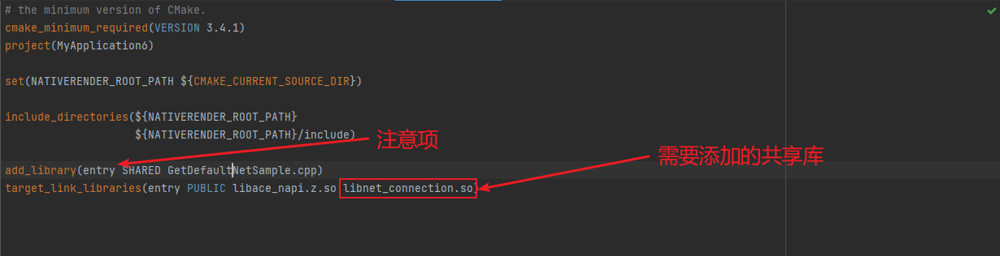

# NetConnection开发指导

## 场景介绍

NetConnection模块提供了常用网络信息查询的能力。

## 接口说明

NetConnection常用接口如下表所示，详细的接口说明请参考[NetConnection](../reference/apis-network-kit/_net_connection.md)


| 接口名 | 描述 |
| -------- | -------- |
| OH_NetConn_HasDefaultNet(int32_t \*hasDefaultNet) | 检查默认数据网络是否被激活，判断设备是否有网络连接，以便在应用程序中采取相应的措施。 |
| OH_NetConn_GetDefaultNet(NetConn_NetHandle \*netHandle) | 获得默认激活的数据网络。 |
| OH_NetConn_IsDefaultNetMetered(int32_t \*isMetered) | 检查当前网络上的数据流量使用是否被计量 |
| OH_NetConn_GetConnectionProperties(NetConn_NetHandle \*netHandle, NetConn_ConnectionProperties *prop) | 获取netHandle对应的网络的连接信息。 |
| OH_NetConn_GetNetCapabilities (NetConn_NetHandle \*netHandle, NetConn_NetCapabilities \*netCapacities) | 获取netHandle对应的网络的能力信息。 |
| OH_NetConn_GetDefaultHttpProxy (NetConn_HttpProxy \*httpProxy) | 获取网络默认的代理配置信息。 如果设置了全局代理，则会返回全局代理配置信息。如果进程已经绑定到指定netHandle对应的网络，则返回网络句柄对应网络的代理配置信息。在其它情况下，将返回默认网络的代理配置信息。 |
| OH_NetConn_GetAddrInfo (char \*host, char \*serv, struct addrinfo \*hint, struct addrinfo \*\*res, int32_t netId) | 通过netId获取DNS结果。 |
| OH_NetConn_FreeDnsResult(struct addrinfo \*res) | 释放DNS结果内存。 |
| OH_NetConn_GetAllNets(NetConn_NetHandleList \*netHandleList) | 获取所有处于连接状态的网络列表。 |
| OHOS_NetConn_RegisterDnsResolver(OH_NetConn_CustomDnsResolver resolver) | 注册自定义dns解析器。<br/>**弃用：** 从API version 13开始废弃。<br/>**替代：** 推荐使用OH_NetConn_RegisterDnsResolver。|
| OHOS_NetConn_UnregisterDnsResolver(void) | 去注册自定义dns解析器。<br/>**弃用：** 从API version 13开始废弃。<br/>**替代：** 推荐使用OH_NetConn_UnregisterDnsResolver。|
| OH_NetConn_RegisterDnsResolver(OH_NetConn_CustomDnsResolver resolver) | 注册自定义dns解析器。 |
| OH_NetConn_UnregisterDnsResolver(void) | 去注册自定义dns解析器。|

## 网络管理接口开发示例

### 开发步骤

使用本文档涉及接口获取网络相关信息时，需先创建Native C++工程，在源文件中将相关接口封装，再在ArkTs层对封装的接口进行调用，使用hilog或者console.log等手段选择打印在控制台或者生成设备日志。

本文以实现获取默认激活的数据网络为例，给出具体的开发指导。

### 添加开发依赖

**添加动态链接库**

CMakeLists.txt中添加以下lib:

```txt
libace_napi.z.so
libnet_connection.so
```

**头文件**

```c
#include "napi/native_api.h"
#include "network/netmanager/net_connection.h"
#include "network/netmanager/net_connection_type.h"
```

### 构建工程

1、在源文件中编写调用该API的代码，并将结果封装成一个`napi_value`类型的值返回给 Node.js 环境。

```C
// Get the execution results of the default network connection.
static napi_value GetDefaultNet(napi_env env, napi_callback_info info)
{
    size_t argc = 1;
    napi_value args[1] = {nullptr};
    napi_get_cb_info(env, info, &argc, args, nullptr, nullptr);
    int32_t param;
    napi_get_value_int32(env, args[0], &param);

    NetConn_NetHandle netHandle;
    if (param== 0) {
        param= OH_NetConn_GetDefaultNet(NULL);
    } else {
        param= OH_NetConn_GetDefaultNet(&netHandle);
    }
    
    napi_value result;
    napi_create_int32(env, param, &result);
    return result;
}

// Get the ID of the default network connection.
static napi_value NetId(napi_env env, napi_callback_info info) {
    int32_t defaultNetId;

    NetConn_NetHandle netHandle;
    OH_NetConn_GetDefaultNet(&netHandle);
    defaultNetId = netHandle.netId; // Get the default netId

    napi_value result;
    napi_create_int32(env, defaultNetId, &result);

    return result;
}
```

简要说明：这两个函数是用于获取系统默认网络连接的相关信息的。其中，GetDefaultNet是接收ArkTs端传入的测试参数，返回调用接口后对应的返回值，param可以自行调整；如果返回值为0，代表获取成功，401代表参数错误，201代表没有权限；而NetId函数则用于获取默认网络连接的ID。这些信息可以用于进一步的网络操作。


2、将通过napi封装好的`napi_value`类型对象初始化导出，通过外部函数接口，将以上两个函数暴露给JavaScript使用。

```C
EXTERN_C_START
static napi_value Init(napi_env env, napi_value exports)
{
    // Information used to describe an exported attribute. Two properties are defined here: `GetDefaultNet` and `NetId`.
    napi_property_descriptor desc[] = {
        {"GetDefaultNet", nullptr, GetDefaultNet, nullptr, nullptr, nullptr, napi_default, nullptr},
        {"NetId", nullptr, NetId, nullptr, nullptr, nullptr, napi_default, nullptr}};
    napi_define_properties(env, exports, sizeof(desc) / sizeof(desc[0]), desc);
    return exports;
}
EXTERN_C_END
```

3、将上一步中初始化成功的对象通过`RegisterEntryModule`函数，使用`napi_module_register`函数将模块注册到 Node.js 中。

```C
static napi_module demoModule = {
    .nm_version = 1,
    .nm_flags = 0,
    .nm_filename = nullptr,
    .nm_register_func = Init,
    .nm_modname = "entry",
    .nm_priv = ((void*)0),
    .reserved = { 0 },
};

extern "C" __attribute__((constructor)) void RegisterEntryModule(void)
{
    napi_module_register(&demoModule);
}
```

4、在工程的index.d.ts文件中定义两个函数的类型。

- GetDefaultNet 函数接受一个数字参数 code，返回一个数字类型的值。
- NetId 函数不接受参数，返回一个数字类型的值。

```ts
export const GetDefaultNet: (code: number) => number;
export const NetId: () => number;
```

5、在index.ets文件中对上述封装好的接口进行调用

```ts
import testNetManager from 'libentry.so';

@Entry
@Component
struct Index {
  @State message: string = '';

  build() {
    Row() {
      Column() {
        Text(this.message)
          .fontSize(50)
          .fontWeight(FontWeight.Bold)
        Button('GetDefaultNet').onClick(event => {
          this.GetDefaultNet();
        })
        Button('CodeNumber').onClick(event =>{
          this.CodeNumber();
        })
      }
      .width('100%')
    }
    .height('100%')
  }

  GetDefaultNet() {
    let netid = testNetManager.NetId();
    console.log("The defaultNetId is [" + netid + "]");
  }

  CodeNumber() {
    let testParam = 0;
    let codeNumber = testNetManager.GetDefaultNet(testParam);
    if (codeNumber === 0) {
      console.log("Test success. [" + codeNumber + "]");
    } else if (codeNumber === 201) {
      console.log("Missing permissions. [" + codeNumber + "]");
    } else if (codeNumber === 401) {
      console.log("Parameter error. [" + codeNumber + "]");
    }
  }
}

```

6、配置`CMakeLists.txt`，本模块需要用到的共享库是`libnet_connection.so`，在工程自动生成的`CMakeLists.txt`中的`target_link_libraries`中添加此共享库。

注意：如图所示，在`add_library`中的`entry`是工程自动生成的`modename`，若要做修改，需和步骤3中`.nm_modname`保持一致；



经过以上步骤，整个工程的搭建已经完成，接下来就可以连接设备运行工程进行日志查看了。

## 测试步骤

1、连接设备，使用DevEco Studio打开搭建好的工程

2、运行工程，设备上会弹出以下所示图片：

简要说明：

- 在点击 `GetDefaultNet` 时，获取的是默认网络ID。
- 在点击 `codeNumber` 时，获取的是接口返回的响应状态码。


3、点击 `GetDefaultNet` 按钮，控制台会打印日志：


4、点击 `codeNumber` 按钮，控制台会打印相应的响应状态码：

