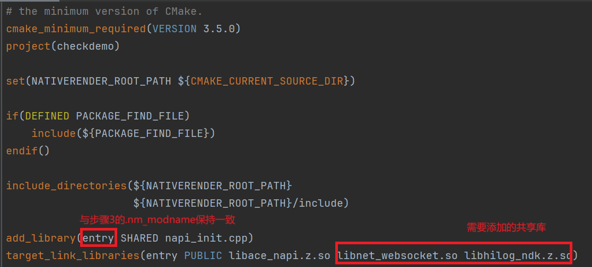

# 使用WebSocket访问网络(C/C++)
<!--Kit: Network Kit-->
<!--Subsystem: Communication-->
<!--Owner: @wmyao_mm-->
<!--Designer: @guo-min_net-->
<!--Tester: @tongxilin-->
<!--Adviser: @zhang_yixin13-->

## 场景介绍

通过WebSocket模块可以建立服务器与客户端的双向连接。

## 接口说明

WebSocket常用接口如下表所示，详细的接口说明请参考[net_websocket.h](../reference/apis-network-kit/capi-net-websocket-h.md)。


| 接口名 | 描述 |
| -------- | -------- |
| OH_WebSocketClient_Constructor(WebSocket_OnOpenCallback onOpen, WebSocket_OnMessageCallback onMessage, WebSocket_OnErrorCallback onError, WebSocket_OnCloseCallback onclose) | WebSocket客户端的构造函数。  |
| OH_WebSocketClient_AddHeader(struct WebSocket \*client, struct WebSocket_Header header) | 将header头信息添加到client客户端request中。  |
| OH_WebSocketClient_Connect(struct WebSocket \*client, const char \*url, struct WebSocket_RequestOptions options) | 客户端连接服务端。  |
| OH_WebSocketClient_Send(struct WebSocket \*client, char \*data, size_t length) | 客户端向服务端发送数据。  |
| OH_WebSocketClient_Close(struct WebSocket \*client, struct WebSocket_CloseOption options) | 客户端主动关闭websocket连接。  |
| OH_WebSocketClient_Destroy(struct WebSocket \*client) | 释放websocket连接上下文和资源。  |

## WebSocket接口开发示例

### 开发步骤

使用本文档涉及接口创建并连接到WebSocket服务器时，需先创建Native C++工程，在源文件中封装相关接口，然后在ArkTS层调用封装好的接口，使用hilog或console.info等方法将日志打印到控制台或生成设备日志。

本文以建立与WebSocket服务器的连接、向WebSocket服务器发送消息、关闭WebSocket连接为例，提供具体的开发指导。

### 添加开发依赖

**添加动态链接库**

CMakeLists.txt中添加以下lib:

```txt
libace_napi.z.so
libnet_websocket.so
```

**头文件**

```c
#include "napi/native_api.h"
#include "network/netstack/net_websocket.h"
#include "network/netstack/net_websocket_type.h"
```

### 构建工程

1、在源文件中编写调用该API的代码，接受ArkTS传递过来的url字符串参数，创建WebSocket对象指针后，检查连接到服务器是否成功。

```cpp
#include "napi/native_api.h"
#include "network/netstack/net_websocket.h"
#include "network/netstack/net_websocket_type.h"
#include "hilog/log.h"

#include <cstring>

#undef LOG_DOMAIN
#undef LOG_TAG
#define LOG_DOMAIN 0x3200  // 全局domain宏，标识业务领域
#define LOG_TAG "WSDEMO"   // 全局tag宏，标识模块日志tag

// WebSocket客户端全局变量
static struct WebSocket *client = nullptr;

static void onOpen(struct WebSocket *client, WebSocket_OpenResult openResult)
{
    (void)client;
    OH_LOG_INFO(LOG_APP, "onOpen: code: %{public}u, reason: %{public}s",
        openResult.code, openResult.reason);
}

static void onMessage(struct WebSocket *client, char *data, uint32_t length)
{
    (void)client;
    char *tmp = new char[length + 1];
    for (uint32_t i = 0; i < length; i++) {
        tmp[i] = data[i];
    }
    tmp[length] = '\0';
    OH_LOG_INFO(LOG_APP, "onMessage: len: %{public}u, data: %{public}s",
        length, tmp);
}

static void onError(struct WebSocket *client, WebSocket_ErrorResult errorResult)
{
    (void)client;
    OH_LOG_INFO(LOG_APP, "onError: code: %{public}u, message: %{public}s",
        errorResult.errorCode, errorResult.errorMessage);
}

static void onClose(struct WebSocket *client, WebSocket_CloseResult closeResult)
{
    (void)client;
    OH_LOG_INFO(LOG_APP, "onClose: code: %{public}u, reason: %{public}s",
        closeResult.code, closeResult.reason);
}

static napi_value ConnectWebsocket(napi_env env, napi_callback_info info)
{
    size_t argc = 2;
    napi_value args[2] = {nullptr};
    napi_value result;
    
    napi_get_cb_info(env, info, &argc, args , nullptr, nullptr);
    
    size_t length = 0;
    napi_status status = napi_get_value_string_utf8(env, args[0], nullptr, 0, &length);
    if (status != napi_ok) {
        napi_get_boolean(env, false, &result);
        return result;
    }
    
    if (client != nullptr) {
        OH_LOG_INFO(LOG_APP, "there is already one websocket client running.");
        napi_get_boolean(env, false, &result);
        return result;
    }
    char *buf = new char[length + 1];
    std::memset(buf, 0, length + 1);
    napi_get_value_string_utf8(env, args[0], buf, length + 1, &length);
	// 创建WebSocket Client对象指针
    client = OH_WebSocketClient_Constructor(onOpen, onMessage, onError, onClose);
    if (client == nullptr) {
        delete[] buf;
        napi_get_boolean(env, false, &result);
        return result;
    }
	// 连接buf存放的URL对应的WebSocket服务器
    int connectRet = OH_WebSocketClient_Connect(client, buf, {});
    
    delete[] buf;
    napi_get_boolean(env, connectRet == 0, &result);
    return result;
}

static napi_value SendMessage(napi_env env, napi_callback_info info)
{
    size_t argc = 1;
    napi_value args[1] = {nullptr};
    napi_value result;
    
    napi_get_cb_info(env, info, &argc, args , nullptr, nullptr);
    
    size_t length = 0;
    napi_status status = napi_get_value_string_utf8(env, args[0], nullptr, 0, &length);
    if (status != napi_ok) {
        napi_create_int32(env, -1, &result);
        return result;
    }
    
    if (client == nullptr) {
        OH_LOG_INFO(LOG_APP, "websocket client not connected.");
        napi_create_int32(env, WebSocket_ErrCode::WEBSOCKET_CLIENT_NULL, &result);
        return result;
    }
    char *buf = new char[length + 1];
    std::memset(buf, 0, length + 1);
    napi_get_value_string_utf8(env, args[0], buf, length + 1, &length);
	// 发送buf中的消息给服务器
    int ret = OH_WebSocketClient_Send(client, buf, length);
    
    delete[] buf;
    napi_create_int32(env, ret, &result);
    return result;
}

static napi_value CloseWebsocket(napi_env env, napi_callback_info info)
{
    napi_value result;
    if (client == nullptr) {
        OH_LOG_INFO(LOG_APP, "websocket client not connected.");
        napi_create_int32(env, -1, &result);
        return result;
    }
	// 关闭WebSocket连接
    int ret = OH_WebSocketClient_Close(client, {
        .code = 0,
        .reason = "Actively Close",
    });
	// 释放WebSocket资源并置空
    OH_WebSocketClient_Destroy(client);
    client = nullptr;
    napi_create_int32(env, ret, &result);
    return result;
}

```

ConnectWebsocket函数接收一个WebSocket URL并尝试连接，连接成功返回true，否则返回false。在创建代表WebSocket客户端的WebSocket结构体指针前，需要定义以下回调函数：连接开启时的onOpen回调、接收普通消息的onMessage回调、接收错误消息的onError回调、接收关闭消息的onClose回调。在示例代码中，还调用了`OH_WebSocketClient_Send`、`OH_WebSocketClient_Close`等函数向服务器发送消息，主动关闭WebSocket连接。


2、将通过napi封装好的`napi_value`类型对象初始化导出，通过外部函数接口，将函数暴露给JavaScript使用。示例代码中，ConnectWebsocket函数就会作为外部函数Connect暴露出去；SendMessage函数作为外部函数Send暴露出去；CloseWebsocket函数作为外部函数Close暴露出去。

```C
EXTERN_C_START
static napi_value Init(napi_env env, napi_value exports) {
    napi_property_descriptor desc[] = {
        {"Connect", nullptr, ConnectWebsocket, nullptr, nullptr, nullptr, napi_default, nullptr },
        {"Send", nullptr, SendMessage, nullptr, nullptr, nullptr, napi_default, nullptr },
        {"Close", nullptr, CloseWebsocket, nullptr, nullptr, nullptr, napi_default, nullptr},
    };
    napi_define_properties(env, exports, sizeof(desc) / sizeof(desc[0]), desc);
    return exports;
}
EXTERN_C_END
```

3、将上一步中初始化成功的对象通过`RegisterEntryModule`函数，使用`napi_module_register`函数将模块注册到 Node.js 中。

```C
static napi_module demoModule = {
    .nm_version = 1,
    .nm_flags = 0,
    .nm_filename = nullptr,
    .nm_register_func = Init,
    .nm_modname = "entry",
    .nm_priv = ((void*)0),
    .reserved = { 0 },
};

extern "C" __attribute__((constructor)) void RegisterEntryModule(void)
{
    napi_module_register(&demoModule);
}
```

4、在工程的index.d.ts文件中定义函数的类型。比如，Connect函数接受一个string参数作为入参，并返回boolean值指示WebSocket连接是否能成功建立。

```ts
export const Connect: (url: string) => boolean;
export const Send: (data: string) => number;
export const Close: () => number;
```

5、在index.ets文件中对上述封装好的接口进行调用。

```ts
import testWebsocket from 'libentry.so'

@Entry
@Component
struct Index {
  @State wsUrl: string = ''
  @State content: string = ''
  @State connecting: boolean = false

  build() {
    Navigation() {
      Column() {
        Column() {
          Text("WebSocket address: ")
            .fontColor(Color.Gray)
            .textAlign(TextAlign.Start)
            .width('100%')
          TextInput()
            .width('100%')
            .onChange((value) => {
              this.wsUrl = value
            })
        }
        .margin({
          bottom: 16
        })
        .padding({
          left: 16,
          right: 16
        })

        Column() {
          Text("Content: ")
            .fontColor(Color.Gray)
            .textAlign(TextAlign.Start)
            .width('100%')
          TextInput()
            .width('100%')
            .enabled(this.connecting)
            .onChange((value) => {
              this.content = value
            })
        }
        .margin({
          bottom: 16
        })
        .padding({
          left: 16,
          right: 16
        })

        Blank()

        Column({ space: 12 }) {
          Button('Connect')
            .enabled(!this.connecting)
            .onClick(() => {
              let connRet = testWebsocket.Connect(this.wsUrl)
              if (connRet) {
                this.connecting = true;
              }
            })
          Button('Send')
            .enabled(this.connecting)
            .onClick(() => {
              testWebsocket.Send(this.content)
            })
          Button('Close')
            .enabled(this.connecting)
            .onClick(() => {
              let closeResult = testWebsocket.Close()
              if (closeResult != -1) {
                this.connecting = false
              }
            })
        }
      }
    }
  }
}
```

6、配置`CMakeLists.txt`，本模块需要用到的共享库是`libnet_websocket.so`，在工程自动生成的`CMakeLists.txt`中的`target_link_libraries`中添加此共享库。

注意：如图所示，在`add_library`中的`entry`是工程自动生成的`modename`，若要做修改，需和步骤3中`.nm_modname`保持一致。



7、调用WebSocket C API接口要求应用拥有`ohos.permission.INTERNET`权限，在`module.json5`中的`requestPermissions`项添加该权限。

经过以上步骤，整个工程的搭建已经完成，接下来就可以连接设备运行工程进行日志查看了。

## 测试步骤

1、连接设备，使用DevEco Studio打开搭建好的工程。

2、运行工程，设备上会弹出以下图片所示界面：


简要说明：

- 在第一行的输入框中，输入`ws://`或`wss://`开头的WebSocket URL。

- 在输入完WebSocket URL，点击`Connect`按钮后，如果访问成功，会触发onOpen的回调，打印日志。

- 在Content输入框里输入要发送给服务器的内容，点击`Send`按钮发送。如果服务器返回消息，会触发onMessage回调，打印日志。

- 点击`Close`按钮，WebSocket连接释放，可以重新输入新的WebSocket URL。


## 相关实例

针对WebSocket连接的开发，有以下相关实例可供参考：

- [WebSocket连接（C/C++）](https://gitcode.com/openharmony/applications_app_samples/tree/master/code/DocsSample/NetWork_Kit/NetWorkKit_Datatransmission/WebSocket_C)
