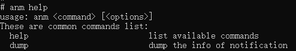

# 调试助手使用指导

​        公共事件与通知提供了供开发者查看公共事件信息及通知信息、发布公共事件等一些调试功能的工具。这些工具已经随系统集成，开发者进入shell环境，可以直接调用相关命令。

## cem调试助手

### publish

* 介绍

  发布公共事件。

* 用法

  `cem publish [<options>]` 

  参数如下表所示

  | 参数         | 参数说明                                   |
  | ------------ | ------------------------------------------ |
  | -e/--event   | 必选参数，发布事件名称                     |
  | -s/--sticky  | 可选参数，发布粘性事件，默认发布非粘性事件 |
  | -o/--ordered | 可选参数，发布有序事件，默认发布无序事件   |
  | -c/--code    | 可选参数，公共事件结果码                   |
  | -d/--data    | 可选参数，公共事件携带数据                 |
  | -h/--help    | 帮助信息                                   |

* 示例

  `cem publish --event "testevent"`

  发布名称为testevent的公共事件

   

  

  `cem publish -e "testevent" -s -o -c 100 -d "this is data" `

  发布名称为testevent的粘性有序公共事件，该事件的结果码为100，携带数据内容为“this is data”

   

### dump

* 介绍

  打印公共事件相关信息。

* 用法

  `cem dump [<options>]`

  参数如下表所示

  | 参数       | 参数说明                                     |
  | ---------- | -------------------------------------------- |
  | -a/--all   | 打印开机以来所有已发送的公共事件及其具体信息 |
  | -e/--event | 查询特定名称事件的具体信息                   |
  | -h/--help  | 帮助信息                                     |

* 示例

​        `cem dump -e "testevent"`

​        打印公共事件名称为testevent的具体信息。

​        

### help

* 介绍

  打印帮助信息。

* 用法

  `cem help`

* 示例

    

## anm调试助手

### dump

* 介绍

  打印通知相关信息。

* 用法

  `anm dump [<options>]`

  参数如下表所示

  | 参数             | 参数说明                                 |
  | ---------------- | ---------------------------------------- |
  | -A/--active      | 打印所有活跃的通知信息                   |
  | -R/--recent      | 打印最近的通知信息                       |
  | -D/--distributed | 打印来自其他设备的分布式通知信息         |
  | --setRecentCount | 可选参数，设置打印最近的通知消息缓存个数 |
  | -h/--help        | 帮助信息                                 |

* 示例

  `anm dump -A`

  打印活跃的通知信息

   

  

  `anm dump --setRecentCount  10`

  设置打印最近通知消息缓存数量为10

### help

* 介绍

  打印帮助信息。

* 用法

  `anm help`

* 示例

 