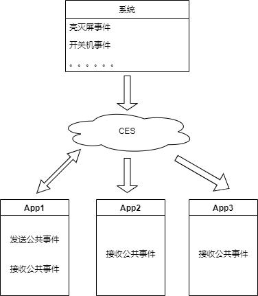
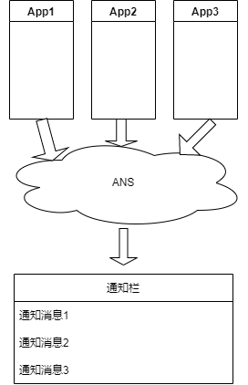

# 公共事件与通知开发概述

公共事件与通知提供了应用程序向系统其他应用程序发布消息、接收来自系统或其他应用特定消息的能力，这些消息可以是新闻推送、广告通知或者预警信息等。

CES（Common Event Service, 即公共事件服务）为应用程序提供发布、订阅及退订公共事件的能力。公共事件根据事件发送方不同可分为系统公共事件和自定义公共事件。

- 系统公共事件：系统将收集到的事件信息，根据系统策略发送给订阅该事件的用户程序。 公共事件包括：终端设备用户可感知的亮灭屏事件，以及系统关键服务发布的系统事件（例如：USB插拔，网络连接，系统升级）等。
- 自定义公共事件：由应用自身定义的期望特定订阅者可以接收到的公共事件，这些公共事件往往与应用自身的业务逻辑相关。

ANS（Advanced Notification Service，即通知系统服务）为应用程序提供发布通知的能力。这些通知常见的使用场景如下：

- 显示接收到的短消息、即时通讯消息等；
- 显示应用的推送消息，如广告、版本更新、新闻通知等；
- 显示当前正在进行的事件，如播放音乐、导航信息、下载进度等。

通知消息将显示在系统下拉菜单栏，用户可对通知消息进行删除操作，或点击通知触发进一步的操作。

