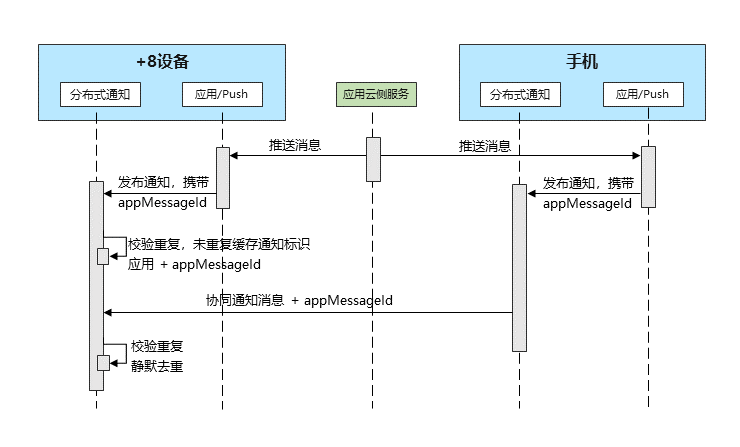

# 清除跨设备场景下的重复通知

<!--Kit: Notification Kit-->
<!--Subsystem: Notification-->
<!--Owner: @peixu-->
<!--Designer: @dongqingran; @wulong158-->
<!--Tester: @wanghong1997-->
<!--Adviser: @fang-jinxu-->

从API version 20开始，为了避免不同渠道发布的通知重复打扰用户（例如，手机协同到当前设备的通知与Push推送服务发布的通知重复），可以使用通知去重功能，清除跨设备场景下的重复通知。

## 实现原理

应用发送通知时携带唯一标识字段[appMessageId](../../application-dev/reference/apis-notification-kit/js-apis-inner-notification-notificationRequest.md#notificationrequest-1)，分布式通知接收到多渠道发布的通知后，会根据该字段进行判断，从而实现通知去重。

设备只会展示第一条通知，后续收到的重复通知会被静默去重，不展示、不提醒。

**图1** 全场景通知去重流程图



## 约束条件

- [appMessageId](../../application-dev/reference/apis-notification-kit/js-apis-inner-notification-notificationRequest.md#notificationrequest-1)字段的唯一性需由开发者保证，同一条通知在各个设备形态上需保证字段相同。
- [appMessageId](../../application-dev/reference/apis-notification-kit/js-apis-inner-notification-notificationRequest.md#notificationrequest-1)字段仅在发布通知的24小时内有效，超过24小时或者设备重启时该字段会失效。

## 接口说明

| **接口名**  | **描述** |**说明**|
| -------- | -------- | -------- |
| [publish](../reference/apis-notification-kit/js-apis-notificationManager.md#notificationmanagerpublish-1)(request: NotificationRequest): Promise\<void\>       | 发布通知。  |使用方法见对象[NotificationRequest](../reference/apis-notification-kit/js-apis-inner-notification-notificationRequest.md)中**appMessageId**字段说明。|

## 开发步骤

1. 导入模块。

    ```typescript
    import { notificationManager } from '@kit.NotificationKit';
    import { BusinessError } from '@kit.BasicServicesKit';
    ```

2. 发布通知消息，通知消息中包含`appMessageId`字段。

    ```typescript
    // publish回调
    let publishCallback = (err: BusinessError): void => {
        if (err) {
            console.error(`Failed to publish notification. Code is ${err.code}, message is ${err.message}`);
        } else {
            console.info(`Succeeded in publishing notification.`);
        }
    }
    // 通知Request对象
    let notificationRequest: notificationManager.NotificationRequest = {
        id: 1,
        content: {
            notificationContentType: notificationManager.ContentType.NOTIFICATION_CONTENT_BASIC_TEXT,
            normal: {
            title: 'test_title',
            text: 'test_text',
            additionalText: 'test_additionalText'
            }
        },
        appMessageId: 'test_appMessageId_1'
    };
    notificationManager.publish(notificationRequest, publishCallback);
    ```
