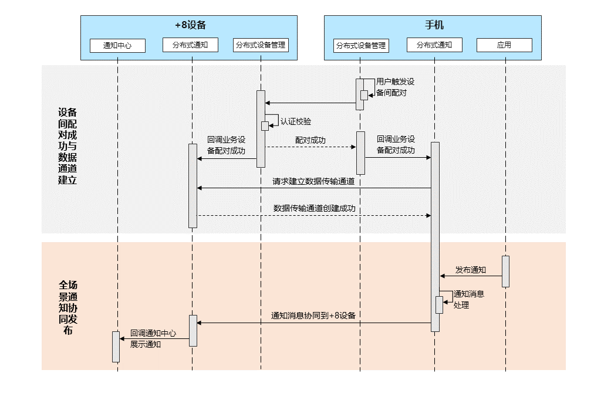

# 跨设备协同通知概述

<!--Kit: Notification Kit-->
<!--Subsystem: Notification-->
<!--Owner: @peixu-->
<!--Designer: @dongqingran; @wulong158-->
<!--Tester: @wanghong1997-->
<!--Adviser: @fang-jinxu-->

跨设备协同通知旨在以手机为中心，实现与手表等其他设备的通知消息协同交互。典型场景如下：

<!--Del-->
  - [通知消息跨设备协同管理](./notification-distributed-notdistributed.md)：系统应用可配置通知消息的跨设备协同功能，支持按需启用该功能（仅对系统应用开放）。
<!--DelEnd-->
  - [为跨设备协同通知添加快捷回复](./notification-quickreply.md)：应用为社交通信通知消息添加跨设备快捷回复功能，便于用户跨设备快速回复消息。
  - [清除跨设备场景下的重复通知](./notification-distributed-messageid.md)：清除跨设备协同消息和本地设备发布的重复消息，避免多源通知重复打扰用户。

## 约束条件
  - 跨设备协同支持的设备：从API Version 18开始，支持手机与手表之间通知消息的协同；从API Version 20开始，支持手机与平板、2in1设备之间通知消息的协同。
  - 跨设备协同支持的[通知渠道](../../application-dev/reference/apis-notification-kit/js-apis-notificationManager.md#slottype)：
    - 手表：带快捷回复的社交通信类通知（社交通信）、实况窗。
    - 平板：社交通信、服务提醒、实况窗、客服消息。
    - 2in1：社交通信、服务提醒、客服消息。

## 运作机制

