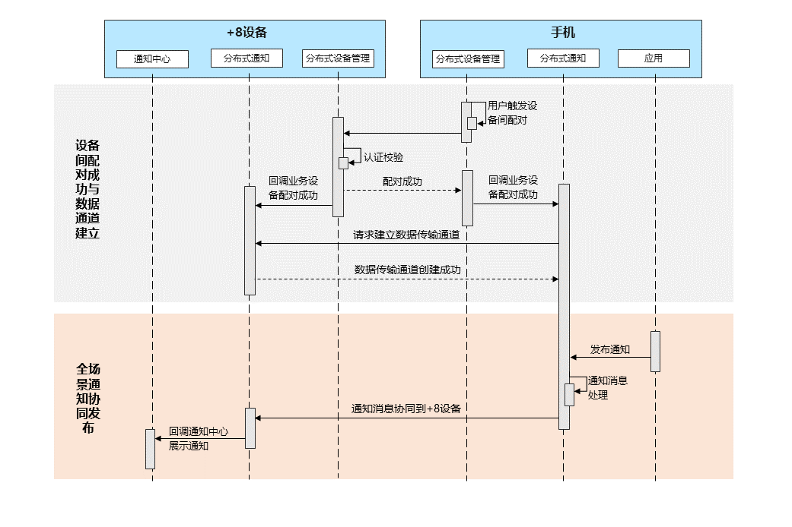

# 跨设备协同通知概述
<!--Kit: Notification Kit-->
<!--Subsystem: Notification-->
<!--Owner: @HuYueRong-->
<!--Designer: @dongqingran-->
<!--Tester: @wanghong1997-->
<!--Adviser: @fang-jinxu-->

[跨设备协同](notification-glossary.md#cross-device-collaboration跨设备协同)通知旨在以手机为中心，实现与手表等其他设备的通知消息协同交互。典型场景如下：

<!--Del-->
  - [通知消息跨设备协同管理](./notification-distributed-notdistributed-sys.md)：系统应用可配置通知消息的跨设备协同功能，支持按需启用该功能（仅对系统应用开放）。
<!--DelEnd-->
  - [清除跨设备场景下的重复通知](./notification-distributed-messageid.md)：清除跨设备协同消息和本地设备发布的重复消息，避免多源通知重复打扰用户。

## 约束条件
  - [跨设备协同](notification-glossary.md#cross-device-collaboration跨设备协同)支持的设备：从API version 18开始，支持Phone与Wearable之间通知消息的协同；从API version 20开始，支持Phone与Tablet、PC/2in1设备之间通知消息的协同。
  - 跨设备协同支持的[通知渠道](../../application-dev/reference/apis-notification-kit/js-apis-notificationManager.md#slottype)：
    - Wearable：带快捷回复的社交通讯类通知（社交通讯）、实况窗。
    - Tablet：社交通讯、服务提醒、实况窗、客服消息。
    - PC/2in1：社交通讯、服务提醒、客服消息。

## 运作机制

