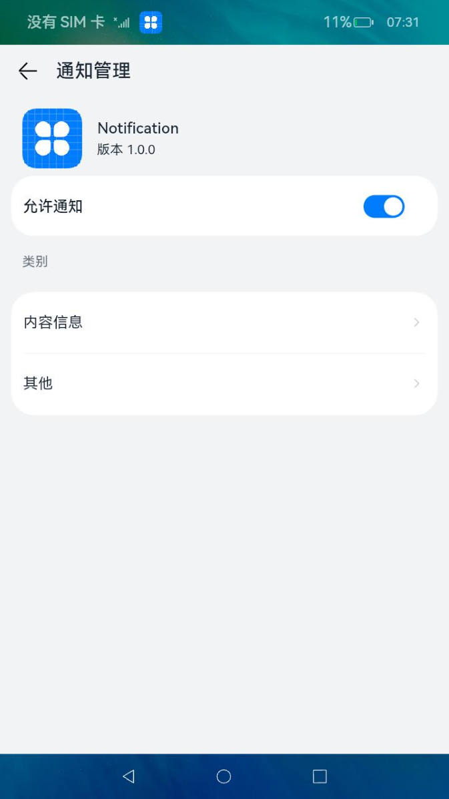

# 使能通知开关


应用需要开启通知开关才能发送通知。开发者可以在通知发布前调用[requestEnableNotification()](../reference/apis/js-apis-notification.md#notificationrequestenablenotification8)方法，弹窗让用户选择是否开启使能开关，仅弹窗一次，后续调用该接口不再弹窗。

  **图1** 使能通知开关示意图  


- 点击“允许”后，则表示允许应用发送通知。

- 点击“取消”后，再次调用[requestEnableNotification()](../reference/apis/js-apis-notification.md#notificationrequestenablenotification8)方法，则不再弹窗。此时如需要手动使能通知开关，操作步骤如下所示。
  1. 从设备左上方下拉，进入通知界面。
      
  2. 点击右上角“设置”图标，进入通知界面，找到需要打开通知开关的应用。
      
  3. 打开“允许通知”开关。
      


## 接口说明

详细接口见[接口文档](../reference/apis/js-apis-notification.md#notificationrequestenablenotification8)。

**表1** 通知开关接口功能介绍

| **接口名** | **描述** |
| -------- | -------- |
| isNotificationEnabled(bundle:&nbsp;BundleOption,&nbsp;callback:&nbsp;AsyncCallback&lt;boolean&gt;):&nbsp;void | 查询通知开关。<br/>**说明：**<br/>仅支持系统应用调用。       |
| enableNotification(bundle:&nbsp;BundleOption,&nbsp;enable:&nbsp;boolean,&nbsp;callback:&nbsp;AsyncCallback&lt;void&gt;):&nbsp;void | 设置通知开关。例如在“设置&nbsp;&gt;&nbsp;应用和服务&nbsp;&gt;&nbsp;应用管理”，进入对应应用信息的“通知管理”中设置通知开关状态。<br/>**说明：**<br/>仅支持系统应用调用。 |
| requestEnableNotification(callback:&nbsp;AsyncCallback&lt;void&gt;):&nbsp;void | 请求发送通知的许可，第一次调用弹窗供用户选择允许或禁止。     |


## 开发步骤

1. 导入NotificationManager模块。

   ```ts
   import NotificationManager from '@ohos.notificationManager';
   ```

2. 请求发送通知的许可。

   ```ts
   NotificationManager.requestEnableNotification().then(() => {
       console.info(`[ANS] requestEnableNotification success`);
   }).catch((err) => {
       console.error(`[ANS] requestEnableNotification failed, errCode[${err}]`);
   });
   ```
