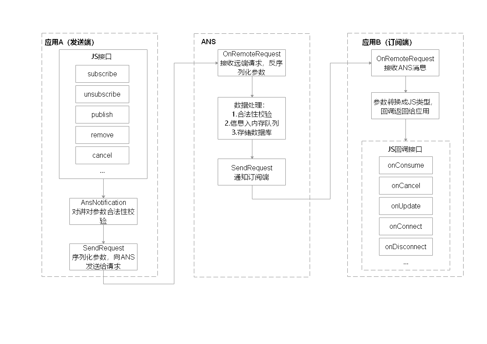

# Notification开发指导

## 场景简介

OpenHarmony通过ANS（Advanced Notification Service，通知系统服务）对通知类型的消息进行管理，支持多种通知类型，包括文本，长文本，多文本，图片，社交，媒体等。所有系统服务以及应用都可以通过通知接口发送通知消息，用户可以通过SystemUI查看所有通知消息。

通知常见的使用场景：

- 显示接收到短消息、即时消息等。
- 显示应用的推送消息，如广告、版本更新等。
- 显示当前正在进行的事件，如导航、下载等。


## 通知流程

通知业务流程由ANS通知子系统、通知发送端、通知订阅端组成。

一条通知从通知发送端产生，通过IPC通信发送到ANS，ANS再分发给通知订阅端。

系统应用还支持通知相关配置，如使能开关、配置参数由系统配置发起请求，发送到ANS存储到内存和数据库。




## 接口说明

部分接口仅系统应用才可以调用，且需要具备权限：SystemCapability.Notification.Notification ，接口返回值有两种返回形式：callback和promise，下表中为callback形式接口，promise和callback只是返回值方式不一样，功能相同，具体API说明详见[接口文档](https://gitee.com/openharmony/docs/blob/master/zh-cn/application-dev/reference/apis/js-apis-notification.md)。

**表1** 通知使能开关接口功能介绍 

| 接口名                                                       | 描述             |
| ------------------------------------------------------------ | ---------------- |
| isNotificationEnabled(bundle: BundleOption, callback: AsyncCallback\<boolean>): void | 查询通知使能开关 |
| enableNotification(bundle: BundleOption, enable: boolean, callback: AsyncCallback\<void>): void | 设置使能开关     |

用于查询和设置通知使能开关，若某个应用的通知使能关闭状态，则无法发送通知。


**表2** 通知订阅接口功能介绍

| 接口名                                                       | 描述             |
| ------------------------------------------------------------ | ---------------- |
| subscribe(subscriber: NotificationSubscriber, info: NotificationSubscribeInfo, callback: AsyncCallback\<void>): void | 订阅指定应用通知 |
| subscribe(subscriber: NotificationSubscriber, callback: AsyncCallback\<void>): void | 订阅所有通知     |
| unsubscribe(subscriber: NotificationSubscriber, callback: AsyncCallback\<void>): void | 取消订阅通知     |

订阅接口有支持订阅所有通知、或订阅某些应用的通知。


**表3** 通知订阅回调接口功能介绍

| 接口名                                           | 描述             |
| ------------------------------------------------ | ---------------- |
| onConsume?:(data: SubscribeCallbackData) => void | 通知回调         |
| onCancel?:(data: SubscribeCallbackData) => void  | 通知取消回调     |
| onUpdate?:(data: NotificationSortingMap) => void | 通知排序更新回调 |
| onConnect?:() => void;                           | 订阅成功回调     |
| onDisconnect?:() => void;                        | 取消订阅回调     |


**表4** 发送通知接口功能介绍

| 接口名                                                       | 描述                     |
| ------------------------------------------------------------ | ------------------------ |
| publish(request: NotificationRequest, callback: AsyncCallback\<void>): void | 发布通知                 |
| publish(request: NotificationRequest, userId: number, callback: AsyncCallback\<void>): void | 指定用户发布通知         |
| cancel(id: number, label: string, callback: AsyncCallback\<void>): void | 取消指定的通知           |
| cancelAll(callback: AsyncCallback\<void>): void;              | 取消所有该应用发布的通知 |

携带userId的publish接口，可以指定向该用户下订阅者发布通知。


## 开发指导

通知的开发步骤一般是订阅通知、开启通知使能、发布通知。

### 导入模块

```js
import Notification from '@ohos.notification';
```


### 通知订阅

通知接受端首选需要向通知子系统发起通知订阅。

```js
var subscriber = {
    onConsume: function (data) {
      let req = data.request;
      console.info('===>onConsume callback req.id: ' + req.id);
    },
    onCancel: function (data) {
      let req = data.request;
      console.info('===>onCancel callback req.id: : ' + req.id);
    },
    onUpdate: function (data) {
      console.info('===>onUpdate in test===>');
    },
    onConnect: function () {
      console.info('===>onConnect in test===>');
    },
    onDisconnect: function () {
      console.info('===>onDisConnect in test===>');
    },
    onDestroy: function () {
      console.info('===>onDestroy in test===>');
    },
  };

  Notification.subscribe(subscriber, (err) => { // callback形式调用异步接口
    if (err.code) {
      console.error('===>failed to subscribe because ' + JSON.stringify(err));
      return;
    }
    console.info('===>subscribeTest success : ' + JSON.stringify(data));
  });
```


### 通知发送

通知发布前，先要确认通知发送使能是否开启，新安装的应用使能默认是关闭状态，需要到通知设置里开启。

##### 通知发布

发布通知，先要构造NotificationRequest对象，设置通知类型、标题、内容等一系列属性。下面以发布普通文本和携带wantAgent通知为例。

普通文本通知实例

```js
//构造NotificationRequest对象
var notificationRequest = {
  	id: 1,
  	content: {
  		contentType: Notification.ContentType.NOTIFICATION_CONTENT_BASIC_TEXT,
  		normal: {
  			title: "test_title",
  			text: "test_text",
  			additionalText: "test_additionalText"
  		}
  	}
}

//通知发送
Notification.publish(notificationRequest) .then(() => {
	console.info('===>publish promise success req.id : ' + notificationRequest.id);
}).catch((err) => {
	console.error('===>publish promise failed because ' + JSON.stringify(err));
});
```


携带wantAgent通知实例

wantAgent使用详见[wantAgent开发文档](https://gitee.com/openharmony/docs/blob/master/zh-cn/application-dev/ability/wantagent.md)。

- 创建wantAgent对象

```js
import wantAgent from '@ohos.wantAgent';

//WantAgentInfo对象
var wantAgentInfo = {
  wants: [
    {
      bundleName: 'ohos.samples.eTSNotification',
      abilityName: 'ohos.samples.eTSNotification.MainAbility',
    }
  ],
  operationType: wantAgent.OperationType.START_ABILITY,
  requestCode: 0,
  wantAgentFlags:[wantAgent.WantAgentFlags.UPDATE_PRESENT_FLAG]
}

//wantAgent对象
var WantAgent;

//getWantAgent回调
function getWantAgentCallback(err, data) {
    console.info("===>getWantAgentCallback===>");
    if (err.code == 0) {
    	WantAgent = data;
    } else {
        console.info('----getWantAgent failed!----');
    }
}

// 获取wantAgent对象
wantAgent.getWantAgent(wantAgentInfo, getWantAgentCallback)
```

- 发布通知

```js
//构造NotificationRequest对象
var notificationRequest = {
  content: {
    contentType: Notification.ContentType.NOTIFICATION_CONTENT_BASIC_TEXT,
    normal: {
      title: "AceApplication_Title",
      text: "AceApplication_Text",
      additionalText: "AceApplication_AdditionalText"
    },
  },
  id: 1,
  label: 'TEST',
  wantAgent: WantAgent,
  slotType: Notification.SlotType.OTHER_TYPES,
  deliveryTime: new Date().getTime()
}

//通知发送
Notification.publish(notificationRequest) .then(() => {
	console.info('===>publish promise success req.id : ' + notificationRequest.id);
}).catch((err) => {
	console.error('===>publish promise failed because ' + JSON.stringify(err));
});
```


- 取消通知

取消通知可以分成取消指定的单条通知和取消所有通知，应用只能取消自己发布的通知。

```js
//cancel回调
function cancelCallback(err) {
	console.info("===>cancelCallback===>");
}

Notification.cancel(1, "label", cancelCallback)
```
