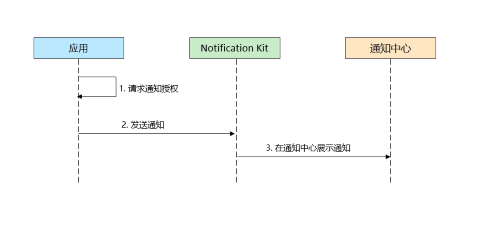
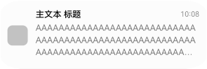
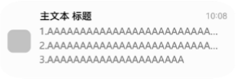

# Notification Kit简介

Notification Kit（用户通知服务）为开发者提供本地通知发布通道，开发者可借助Notification Kit将应用产生的通知直接在客户端本地推送给用户，本地通知根据通知类型及发布场景会产生对应的铃声、震动、横幅、锁屏、息屏、通知栏提醒和显示。

## 使用场景
当应用处于前台运行时，开发者可以使用Notification Kit向用户发布通知。<!--RP1--><!--RP1End-->
开发者可以在多种场景中运用本地通知能力。如同步用户的上传下载进度、发布即时的客服支付通知、更新运动步数等。

## 能力范围
Notification Kit支持的能力主要包括:
 - 发布文本、进度条等类型通知。
 - 携带或更新应用通知数字角标。
 - 取消曾经发布的某条或全部通知。
 - 查询已发布的通知列表。
 - 查询应用自身通知开关状态。
 - 应用通知用户的能力默认关闭，开发者可拉起授权框，请求用户授权发布通知。

  

## 业务流程
  

使用Noification Kit的主要业务流程如下：

1.请求通知授权。

2.应用发布通知到通知服务。

3.将通知展示到通知中心。

## 通知样式

> **说明：**
>
> 实际显示效果依赖设备能力和通知中心UI设计样式。

Notification Kit中常用的通知样式如下：
| 类型 | 通知样式 | 规格描述 |
| ---- | --------| ------- |
| [文本](./text-notification.md)           |    | 通知文本内容最多显示三行，超长后以“...”截断。 |
| [多行文本](./text-notification.md)       |    | 最多可显示三行内容，每行内容超长后以“...”截断。 |
| [通知角标](./notification-badge.md)      |    | 以数字的形式展示在右上角。 |
| [进度条](./progress-bar-notification.md) |     | 进度类通知。 |

## 约束限制
- 单个应用已发布的通知在通知中心等系统入口的留存数量有限（当前规格最多24条）。
- 通知的长度不能超过200KB（跨进程序列化大小限制）。
- 系统所有应用发布新通知的频次累计不能超过每秒10条，更新通知的频次累计不能超过每秒20条。

## 与相关Kit的关系
- Notification Kit创建的通知会即时显示在通知中心等系统入口，如果开发者希望在应用退到后台或进程终止后仍然有一些提醒用户的定时类通知，例如购物类应用抢购提醒等，可通过[`BackGroundTask Kit`](../reference/apis-backgroundtasks-kit/js-apis-backgroundTaskManager.md)创建，目前支持基于倒计时、日历、闹钟等类型的通知提醒功能。
- 开发者可通过[`Ability Kit`](../reference/apis-ability-kit/js-apis-app-ability-wantAgent.md#wantagentgetwantagent)设置用户点击通知后的行为意图。<!--RP2-->
<!--RP2End-->
