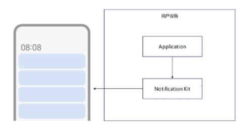
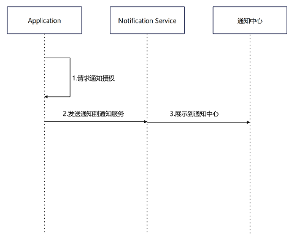
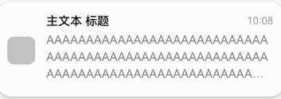
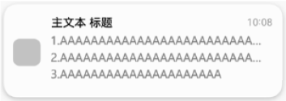
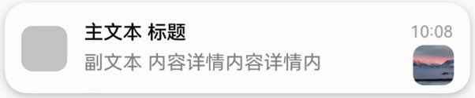

# Notification Kit简介

Notification Kit 为开发者提供本地消息发放通道，开发者可借助`Notification Kit`将应用产生的消息直接在客户端本地推送给用户，本地消息根据消息类型及发放场景会产生对应的铃声、震动、横幅、锁屏、息屏、通知栏提醒和显示。

(当开发者的应用处于前台运行时，开发者可根据需要向用户发送消息。当应用转为后台时，本地消息发放通道关闭，开发者需要接入`Push Kit`进行云侧离线消息的发放。)
开发者可以在多种场景中运用本地通知能力。如同步用户的上传下载进度、发放即时的客服支付等通知、更新运动步数等。

在`Notification`的框架下，开发者可以:
 - 发送文本、多行文本、通知大图标等类型消息。
 - 携带或更新应用消息数字角标。
 - 取消曾经发布的某条或全部消息。
 - 查询已发布的消息列表。
 - 查询应用自身通知开关状态。
 - 应用通知用户的能力默认关闭，开发者可拉起授权框请求用户授权发送消息。

  

## 业务流程
  

使用Noification Kit的主要业务流程如下：

    1.请求通知授权。

    2.应用发送通知到通知服务。

    3.将通知展示到通知中心。

## 通知样式
Notification Kit支持的通知样式：
| 类型 | 通知样式 | 规格描述 |
| ---- | --------| ------- |
| [文本](./text-notification.md)           |    | 通知文本内容最多显示三行，超长后以“...”截断。 |
| [多行文本](./text-notification.md)       |    | 适合于文本内容较长的通知，最多可显示三行内容，每行内容超长后以“...”截断。 |
| [通知大图标](../reference/apis/js-apis-inner-notification-notificationRequest.md)|  | 适合于有图片预览的通知。 |
| [通知角标](./notification-badge.md)      |    | 以数字的形式展示在右上角。 |
| [进度条](./progress-bar-notification.md) |     | 适合进度类通知。 |

## 约束限制
- 单个应用已发布的通知在通知中心等系统入口的留存数量有限（当前规格最多24条）。
- 通知的长度不能超过200KB（跨进程序列化大小限制）。
- 系统所有应用发布新通知的频次累计不能超过每秒10条。

## 与相关Kit的关系
- Notification Kit创建的通知会即时显示在通知中心等系统入口，如果开发者希望在应用退到后台或进程终止后仍然有一些提醒用户的定时类通知，例如购物类应用抢购提醒等，可通过[`BackGroundTask Kit`](../kit-readme/Readme-BackgroundTasks-Kit.md)创建，目前支持基于倒计时、日历、闹钟等类型的通知提醒功能。
- 开发者可通过`Push Kit`远程推送用户通知到本地。
- 开发者可通过[`Ability Kit`](../kit-readme/Readme-Ability-Kit.md)设置用户点击通知后的行为意图。
